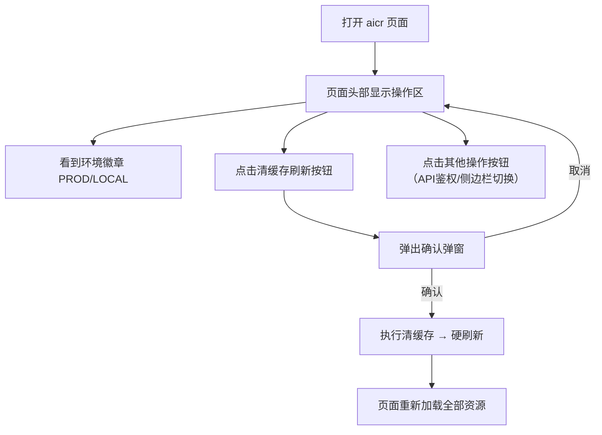
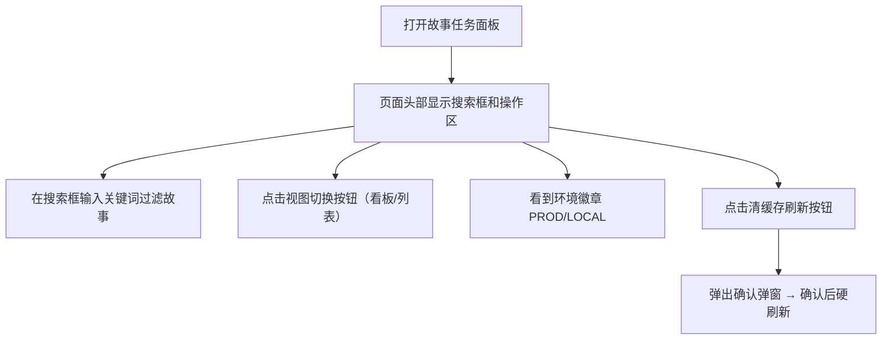

# YiWeb-02-用户使用场景

> | v1.0 | 2026-05-19 | deepseek-v4-pro | 🌿 feat/header-actions | 📎 [../YiWeb-01-故事任务.md](./YiWeb-01-故事任务.md) |

> **来源引用**: 上游 01-故事任务 §1–§5 的需求拆解。证据等级 A。

---

## §1 用户角色

| 角色 | 描述 | 典型行为 |
|------|------|---------|
| 普通用户 | 使用 YiWeb 的终端用户 | 页面异常时点击清缓存刷新恢复；关注当前环境标识 |
| 开发者 | 构建 YiWeb 页面的前端开发者 | 新建页面时引入 HeaderActions 组件，注入自定义操作按钮 |

---

## §2 使用场景

### SCENARIO-1: 用户在 aicr 页面操作

**前置条件**: 用户正在使用 YiWeb 代码审查页面。

**操作流程**:

**预期结果**: 所有操作按钮风格统一，清缓存刷新行为一致，环境徽章实时反映当前部署环境。

---

### SCENARIO-2: 用户在故事任务面板操作

**前置条件**: 用户正在使用故事任务面板查看项目进度。

**操作流程**:

**预期结果**: 清缓存按钮样式和交互与 aicr 页面完全一致，页面特定操作（搜索、视图切换）与通用操作自然融合。

---

### SCENARIO-3: 开发者新建页面

**前置条件**: 开发者需要为 YiWeb 新增一个页面，需要头部操作按钮。

**操作流程**:

1. 在页面模板的 header 区域添加 `<header-actions>` 标签
2. 在插槽中放入页面特定的操作按钮
3. 在视图入口注册 HeaderActions 组件
4. 页面自动获得清缓存刷新按钮和环境徽章

**预期结果**: 零重复代码，新页面立刻拥有与其他页面一致的操作按钮。

---

## §3 交互状态覆盖

| 状态 | SCENARIO-1 | SCENARIO-2 | SCENARIO-3 |
|------|:----------:|:----------:|:----------:|
| 默认态（按钮可见可点击） | ✓ | ✓ | ✓ |
| 悬停态（tooltip 展示） | ✓ | ✓ | ✓ |
| 确认态（弹窗展示） | ✓ | ✓ | — |
| 执行态（清理 + 硬刷新中） | ✓ | ✓ | — |
| 空态（无自定义按钮，仅清缓存+徽章） | — | — | ✓ |
| 错误态（Vue 未加载时静默降级） | ✓ | ✓ | ✓ |

---

## §4 非功能性要求

| 维度 | 要求 |
|------|------|
| 响应时间 | 按钮点击到弹窗展示在 100ms 内 |
| 一致性 | 清缓存按钮和环境徽章在所有页面中的样式和行为完全一致 |
| 可访问性 | 按钮有明确的 title 和 aria-label 属性 |
| 可扩展性 | 新页面接入组件不超过 5 行代码（模板 + 注册） |
