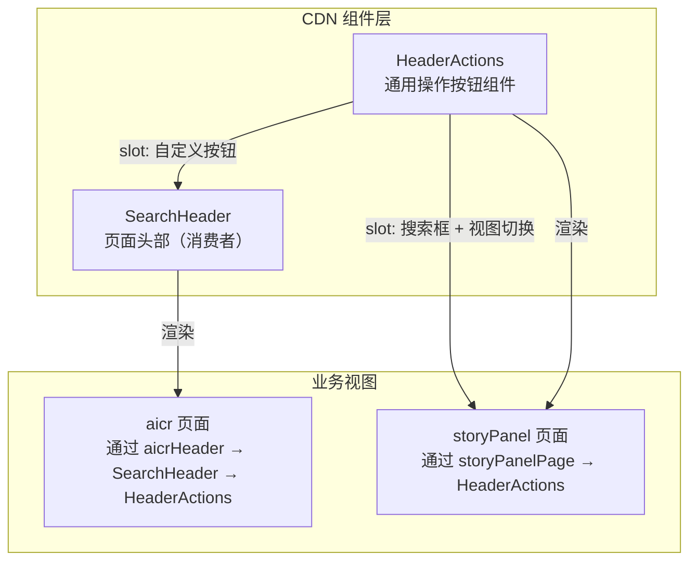
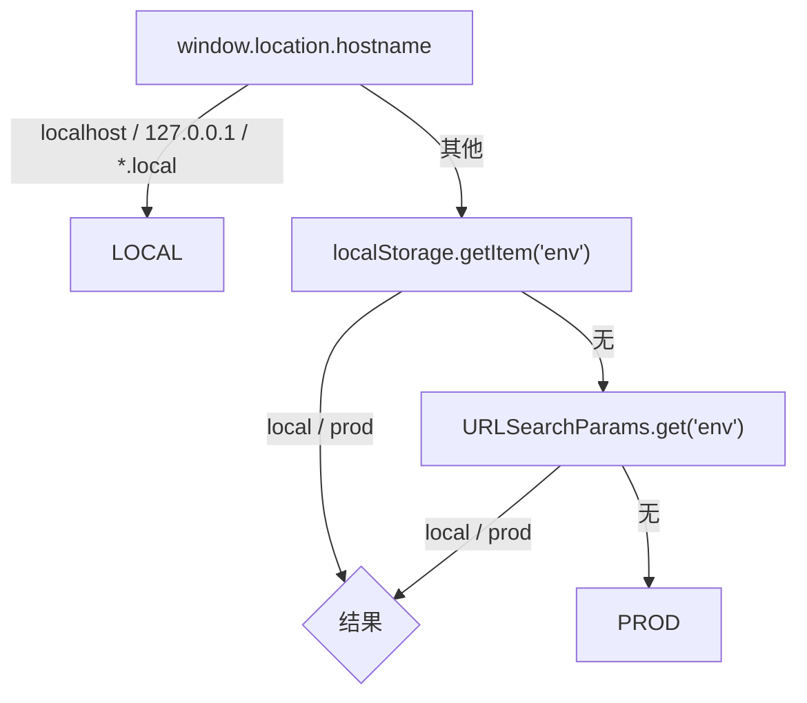
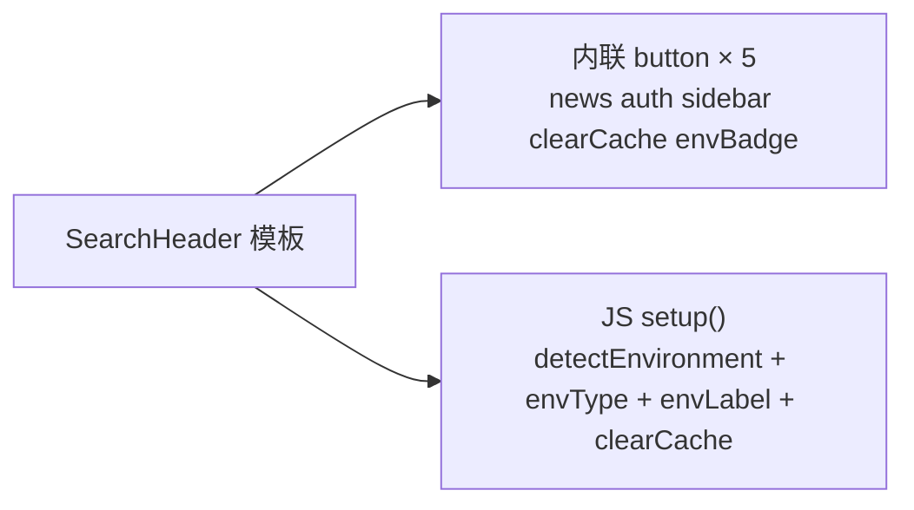
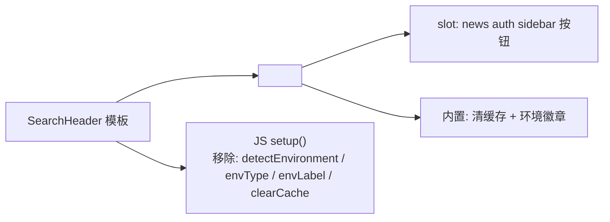
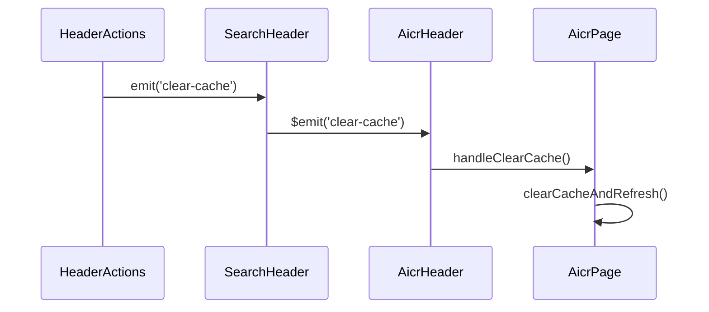

# YiWeb-04-前端技术评审

> | v1.0 | 2026-05-19 | deepseek-v4-pro | 🌿 feat/header-actions | 📎 [../YiWeb-01-故事任务.md](./YiWeb-01-故事任务.md) |

> **来源引用**: 上游 01-故事任务 §1 Story S1/S2/S3。项目类型 frontend。证据等级 A（源码级实现）。

> **技术约束**: 零构建链（浏览器原生 ESM），组件通过 registerGlobalComponent 全局注册，template 通过 fetch 异步加载。

---

## §1 架构概览



---

## §2 核心模块设计

### 2.1 HeaderActions 组件

**接口契约**:

| 项目 | 内容 |
|------|------|
| 组件名 | `HeaderActions` (kebab: `header-actions`) |
| 注册路径 | `/cdn/components/business/HeaderActions/index.js` |
| 模板路径 | `/cdn/components/business/HeaderActions/template.html` |
| 样式路径 | `/cdn/components/business/HeaderActions/index.css` |

**属性**:

| 属性 | 类型 | 默认值 | 说明 |
|------|------|--------|------|
| `showClearCache` | Boolean | `true` | 是否显示清缓存刷新按钮 |
| `showEnvBadge` | Boolean | `true` | 是否显示环境徽章 |

**事件**:

| 事件 | 参数 | 说明 |
|------|------|------|
| `clear-cache` | 无 | 点击清缓存刷新按钮时触发 |

**插槽**:

| 插槽 | 说明 |
|------|------|
| `default` | 自定义操作按钮区域，位于清缓存按钮之前 |

**环境检测逻辑**:



**选型依据**:

| 决策 | 选择 | 原因 |
|------|------|------|
| 组件注册方式 | `registerGlobalComponent` | 与项目组件体系一致，全局可用，无需 import |
| 模板策略 | 外部 HTML 文件 + fetch 加载 | 遵循项目零构建链约束，模板可与 JS 分离 |
| 环境检测位置 | 组件内部 | 自包含，消费者无需传递环境信息 |
| 插槽位置 | 清缓存按钮之前 | 清缓存和徽章为固定尾部，页面特定按钮在左侧 |

### 2.2 SearchHeader 重构

**重构前**:



**重构后**:



**事件冒泡链**:



**变更清单（SearchHeader JS）**:

| 变更 | 说明 |
|------|------|
| 移除 `detectEnvironment()` | 迁移到 HeaderActions 内部 |
| 移除 `envType` ref | 迁移到 HeaderActions |
| 移除 `envLabel` computed | 迁移到 HeaderActions |
| 移除 `clearCache()` 方法 | 替换为模板中 `$emit('clear-cache')` |
| 保留 `openAuth()` | 仍在 slot 按钮中使用 |
| 保留 `toggleSidebar()` | 仍在 slot 按钮中使用 |

### 2.3 storyPanelPage 接入

**接入前**:

```html
<div class="sp-header-right">
  <div class="sp-search">...</div>
  <button class="sp-view-toggle">...</button>
  <button class="sp-clear-cache-btn">...</button>
</div>
```

**接入后**:

```html
<header-actions @clear-cache="clearCache">
  <div class="sp-search">...</div>
  <button class="sp-view-toggle">...</button>
</header-actions>
```

**CSS 清理**: 移除 `.sp-header-right`（flex 布局）和 `.sp-clear-cache-btn`（按钮样式）规则，由 HeaderActions CSS 提供。

---

## §3 关键决策

| 决策点 | 选择 | 原因 |
|--------|------|------|
| 环境检测置于组件内 | HeaderActions 内部 detectEnvironment | 自包含，消费者无需感知环境检测逻辑 |
| 清缓存按钮事件冒泡 | `$emit('clear-cache')` 经由 SearchHeader 透传 | SearchHeader 作为中间层保持接口兼容 |
| 组件间样式策略 | CSS 规则在 HeaderActions 和 SearchHeader 中均有定义 | 向后兼容 SearchHeader 的其他消费者；重复定义不产生冲突 |
| 组件注册时序 | HeaderActions 模块在 SearchHeader 之前加载 | `waitForComponents` 机制确保依赖组件先就绪 |
| 不改动 aicrHeader | aicrHeader 保持原有 `@clear-cache="handleClearCache"` 绑定 | SearchHeader 对外事件接口不变，无缝升级 |

---

## §4 影响面

| 层面 | 影响 | 风险等级 |
|------|------|:--------:|
| HeaderActions (新增) | 3 个新文件（js + html + css），总计约 100 行 | 无（新增） |
| SearchHeader 模板 | `<div class="header-actions">` 替换为 `<header-actions>` 组件，slot 注入原有按钮 | 低 |
| SearchHeader JS | 移除 41 行（env 检测 + clearCache），净减少 | 低 |
| storyPanelPage 模板 | `<div class="sp-header-right">` 替换为 `<header-actions>` | 低 |
| storyPanelPage CSS | 移除 `.sp-header-right` 和 `.sp-clear-cache-btn` 约 50 行 | 低 |
| aicr/index.js | 新增 HeaderActions 到 components + componentModules | 低 |
| storyPanel/index.js | 新增 HeaderActions 到 components + componentModules | 低 |
| cdn/components/index.js | 新增 HeaderActions 导出 | 低 |

---

## §5 安全考量

| 关注点 | 评估 | 缓解 |
|--------|------|------|
| 环境信息泄露 | 环境徽章在页面中明文显示 local/prod | 仅显示环境名，不展示具体 hostname 或配置细节 |
| localStorage 读取 | 环境检测读取 localStorage('env') | 仅读取 env 键，不涉及 Token 或其他敏感数据 |
| XSS | 组件通过 Vue template 渲染，无 v-html | 插槽内容由 Vue 自动转义 |
