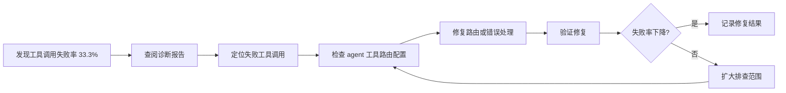
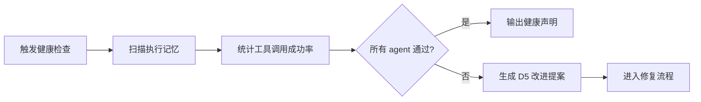

> | v1.0.0 | 2026-05-22 | deepseek-v4-pro | 🌿 feat/improve-rui-story-d5 | ⏱️ — | 📎 [YrY-故事任务](./YrY-故事任务.md) |

> **导航**: [← YrY-故事任务](./YrY-故事任务.md) · [YrY-技术评审 →](./YrY-技术评审.md)

> **来源引用**: 基于 [YrY-故事任务](./YrY-故事任务.md) §1 Story。

---

### 主要价值

- 🎯 完整维护者旅程 — 从发现问题到验证修复的全流程
- 🔒 异常覆盖 — 诊断数据不完整 / 修复无效 / 回退路径
- ⚡ 每场景含流程图 — 操作步骤可视化
- 📊 场景覆盖矩阵 — 显式溯源至诊断证据

---

## §1 使用场景

### 场景 1: 维护者诊断并修复工具调用失败

**角色**: 项目维护者
**目标**: 定位并解决 agent 协作中的工具路由问题

| 步骤 | 操作 | 预期 |
|------|------|------|
| 1 | 查看 D5 诊断证据 | 确认失败的工具调用 ID 和上下文 |
| 2 | 检查对应 agent 的工具声明 | 定位工具权限不匹配或路由错误 |
| 3 | 修复工具配置或错误处理 | 修改后工具调用成功率回升 |
| 4 | 执行验证 | 失败率降至可接受范围 |

**空状态**: 诊断数据不完整时，先采集更多执行记忆再分析
**错误恢复**: 修复无效时回退变更，记录 skip 避免死循环

---

### 场景 2: 维护者审查 agent 协作健康度

**角色**: 项目维护者
**目标**: 定期检查所有 agent 的工具调用和协作状态

| 步骤 | 操作 | 预期 |
|------|------|------|
| 1 | 运行诊断扫描 | 获取各 agent 工具调用统计 |
| 2 | 对比基线阈值 | 失败率 > 20% 标记为异常 |
| 3 | 生成改进提案 | 异常 agent 自动生成 D5 提案 |

**空状态**: 无执行记忆时提示先运行管线采集数据
**错误恢复**: 扫描异常时降级为 `no-metrics`，不阻断管线

---

### 场景覆盖矩阵

| 场景 | 关联 FP# | 关联 AC# | 正常路径 | 空状态 | 错误恢复 |
|------|---------|---------|:--:|:--:|:--:|
| 场景 1: 诊断修复 | FP1, FP2 | AC1, AC2 | ✓ | ✓ | ✓ |
| 场景 2: 健康检查 | FP3 | AC3 | ✓ | ✓ | ✓ |
