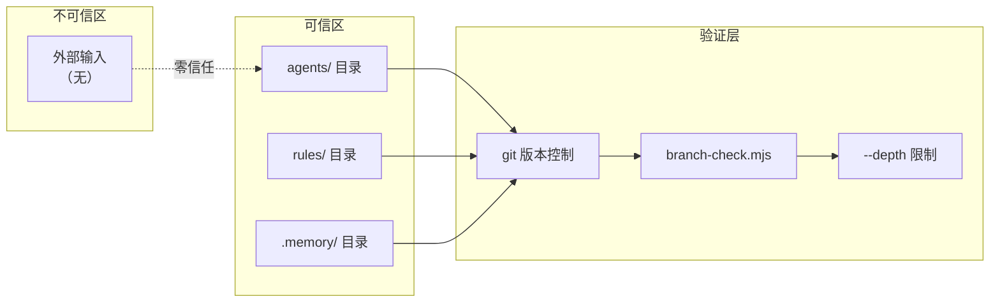

> | v1.0.0 | 2026-05-22 | deepseek-v4-pro | 🌿 feat/improve-rui-story-d5 | ⏱️ — | 📎 [YrY-故事任务](./YrY-故事任务.md) |

> **导航**: [← YrY-技术评审](./YrY-技术评审.md) · [YrY-实施报告 →](./YrY-实施报告.md)

> **来源引用**: 基于 [YrY-技术评审](./YrY-技术评审.md) §1 Agent 协作模型 + §2 工具路由机制。

> **独立审计标记**: 本审计由 security agent 独立执行。

---

### 主要价值

- 🎯 最小攻击面 — meta 项目无用户输入/API/数据库
- 🔒 Agent 权限边界审计 — 6 Agent 工具权限矩阵
- ⚡ 配置注入风险 — 工具声明与路由配置
- 📊 STRIDE 六类全覆盖

---

## §1 资产识别

| 资产 | 敏感度 | 存储 |
|------|:--:|------|
| Agent 工具声明 (frontmatter) | 中 | `agents/*.md` |
| 管线编排配置 (SKILL.md) | 高 | `skills/rui/SKILL.md` |
| 执行记忆 (execution-memory.jsonl) | 中 | `.memory/` |
| 改进提案 (proposals.jsonl) | 低 | `.improvement/` |
| 诊断规则 (rules/*.md) | 中 | `rules/` |

---

## §2 STRIDE 威胁建模

### S — Spoofing

| 威胁 | 缓解 |
|------|------|
| 伪造 Agent 身份执行未授权操作 | Agent 类型由编排器硬编码，不可外部注入 |
| 伪造诊断数据触发误改进 | 诊断数据仅来自本地 .memory/ 文件 |

### T — Tampering

| 威胁 | 缓解 |
|------|------|
| Agent frontmatter 被篡改获取写权限 | agents/ 目录受 git 版本控制，变更需 commit |
| 管线规则被修改跳过门禁 | rules/ 受版本控制，关键门禁有 branch-check.mjs 硬验证 |

### R — Repudiation

| 威胁 | 缓解 |
|------|------|
| Agent 操作无审计记录 | execution-memory.jsonl 记录每次 Agent 调用及结果 |
| 改进提案无法追溯 | proposals.jsonl 含 proposal_id + 时间戳 |

### I — Information Disclosure

| 威胁 | 缓解 |
|------|------|
| 执行记忆泄露项目结构信息 | .memory/ 在 .gitignore 中，不提交到远端 |
| Agent 交接上下文含敏感路径 | 交接文档限定在项目内，不包含外部系统路径 |

### D — Denial of Service

| 威胁 | 缓解 |
|------|------|
| 无限循环改进消耗资源 | yry 深度上限 --depth 默认 3，连续 3 轮无效终止 |
| 工具调用死循环 | 同一改进项失败 ≥ 2 次 → skip + 记录 |

### E — Elevation of Privilege

| 威胁 | 缓解 |
|------|------|
| 只读 Agent 通过 Bash 执行写操作 | Bash 工具受沙箱限制，且 branch-check.mjs 门禁仅对 coder 放行 |
| coder 在非 feat/ 分支写入 | branch-check.mjs 硬阻断，exit code ≠ 0 即阻断 |

---

## §3 信任边界

---

## §4 合规检查

| 检查项 | 状态 | 说明 |
|--------|:--:|------|
| 最小权限原则 | ✓ | 6 Agent 中仅 coder 有写权限 |
| 审计追踪 | ✓ | execution-memory.jsonl 全量记录 |
| 版本控制 | ✓ | 全部配置受 git 管理 |
| 隔离机制 | ✓ | branch-check.mjs + feat/ 分支隔离 |
| 深度限制 | ✓ | --depth 防无限循环 |
| 无外部攻击面 | ✓ | meta 项目无用户输入/API/网络服务 |
