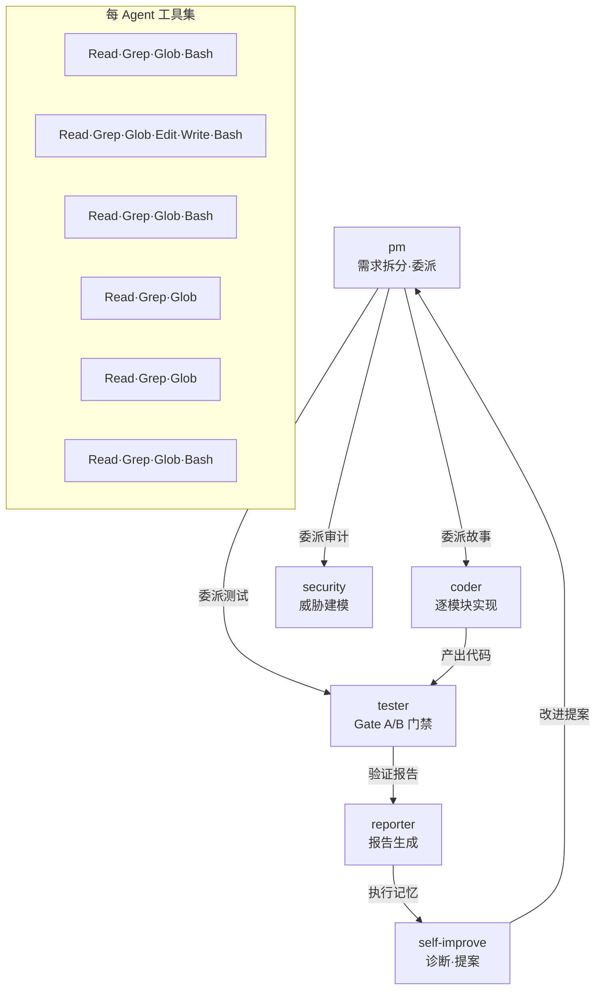
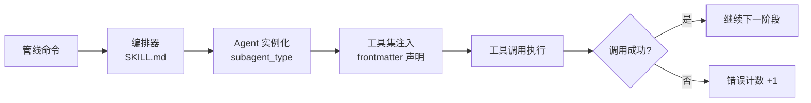
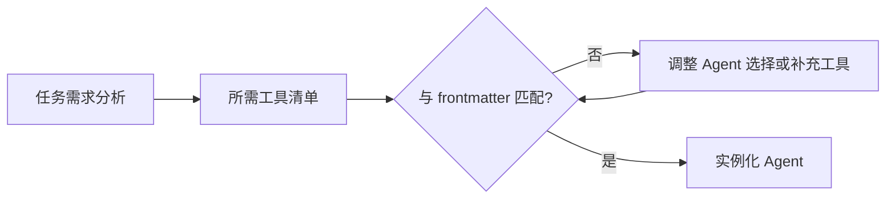

> | v1.0.0 | 2026-05-22 | deepseek-v4-pro | 🌿 feat/improve-rui-story-d5 | ⏱️ — | 📎 [YrY-故事任务](./YrY-故事任务.md) |

> **导航**: [← YrY-使用场景](./YrY-使用场景.md) · [YrY-测试设计 →](./YrY-测试设计.md) · [YrY-安全审计 →](./YrY-安全审计.md)

> **来源引用**: 基于 [YrY-故事任务](./YrY-故事任务.md) §2 诊断证据 + agents/ 目录结构分析。

---

### 主要价值

- 🎯 Agent 协作模型可视化 — 6 agent 的工具路由与交接机制
- 🔒 故障模式枚举 — 工具调用失败的 3 类根因
- ⚡ 改进方案对比 — 路由修复 vs 错误降级 vs 重试机制
- 📊 证据可追溯 — 每个断言附 agents/ 文件路径

---

## §0 基线溯源

| 溯源目标 | 本文档章节 |
|---------|-----------|
| D5 诊断: 工具调用失败率 33.3% | §1 故障分析 + §3 改进方案 |
| Story: agent 协作工具路由 | §1 Agent 协作模型 |
| 场景 1: 诊断修复 | §2 工具路由机制 + §3 改进方案 |
| 场景 2: 健康检查 | §4 监控与诊断 |

---

## §1 Agent 协作模型

| Agent | 工具权限 | 写操作门禁 | 证据来源 |
|------|---------|-----------|---------|
| pm | Read, Grep, Glob, Bash | 无写权限 | `agents/pm.md` |
| coder | Read, Grep, Glob, Edit, Write, Bash | `branch-check.mjs` 验证 | `agents/coder.md` |
| tester | Read, Grep, Glob, Bash | 无源码写权限 | `agents/tester.md` |
| security | Read, Grep, Glob | 纯只读 | `agents/security.md` |
| reporter | Read, Grep, Glob | 仅 git commit | `agents/reporter.md` |
| self-improve | Read, Grep, Glob, Bash | 无源码写权限 | `agents/self-improve.md` |

---

## §2 工具路由机制

### §2.1 工具调用路径

### §2.2 故障模式

| 故障类型 | 表现 | 可能原因 | 影响 |
|---------|------|---------|------|
| 工具权限缺失 | Agent 调用未授权工具 | frontmatter 声明不完整 | 调用失败，任务中断 |
| 路由错误 | 任务委派到错误 Agent | 编排器匹配逻辑错误 | 任务无法完成 |
| 参数传递失败 | Agent 收到不完整上下文 | handoff 信号格式错误 | 产出质量下降 |

---

## §3 改进方案

### 方案 A: 工具路由校验（推荐）

在 Agent 实例化前增加工具集校验步骤，确保 frontmatter 声明的工具与实际需要的工具一致。

### 方案 B: 错误降级

工具调用失败时不中断管线，降级为人工介入或跳过非关键步骤。

### 方案 C: 自动重试

失败工具调用自动重试 1 次（切换 Agent 或参数格式），2 次失败后降级。

---

## §4 监控与诊断

| 监控项 | 数据源 | 阈值 | 动作 |
|--------|-------|------|------|
| 工具调用成功率 | execution-memory.jsonl | < 80% | 触发 D5 诊断 |
| Agent 交接耗时 | rui-state.json | > 60s | 触发 D2 诊断 |
| 阻断频率 | rui-state.json blocked 计数 | > 3/故事 | 触发 D0 诊断 |
