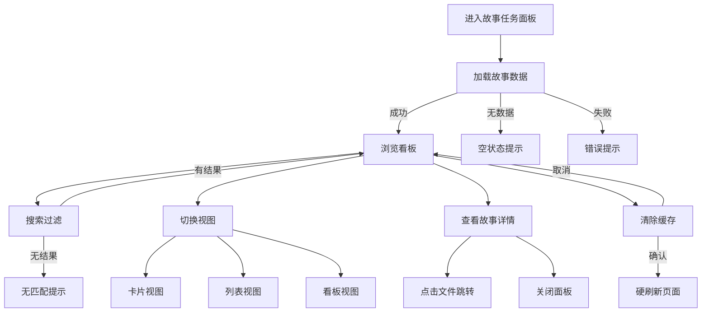
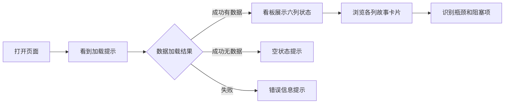
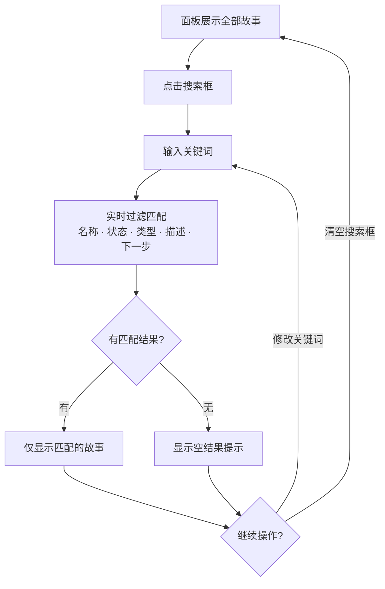
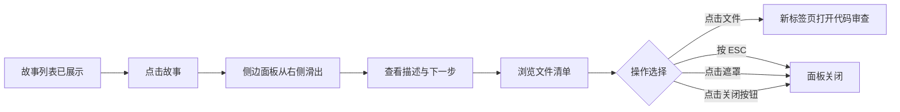
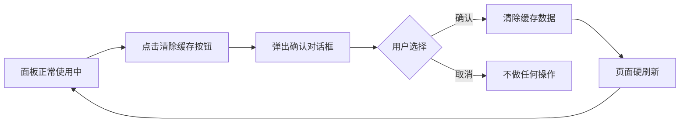

> | v1 | 2026-05-20 | deepseek-v4-pro | 🌿 feat/rui-story | ⏱️ 14:30–15:45 | 📎 [CLAUDE.md](../../../CLAUDE.md) |

> **导航**: [← YiWeb-故事任务](./YiWeb-故事任务.md) · [YiWeb-技术评审 →](./YiWeb-技术评审.md)

> **来源引用**: 从 `src/views/story/` 源码反推生成，证据等级 B。溯源至 [YiWeb-故事任务](./YiWeb-故事任务.md) §1 Story 1–4。

### 主要价值

- 👤 项目管理者可一站式掌握所有故事任务的推进状态
- 🔎 开发者可快速检索并定位自己关注的故事
- 📋 通过看板视图直观发现流程瓶颈与阻塞点
- 📁 在详情面板中浏览故事文档清单并一键跳转查阅

---

## §0 基线声明

> **用户空间基线 (User Space Baseline)**: 本文档定义"谁使用(WHO)"和"如何体验(HOW EXPERIENCE)"。所有交互设计(技术评审)、测试用例(测试设计)、验收标准(故事任务 §5)均必须覆盖本文档定义的每个场景。

---

## §1 场景全景

---

## §2 场景详述

### 场景 A: 浏览故事任务进度

| 角色 | 触发条件 | 核心目标 |
|------|---------|---------|
| 项目管理者 | 打开故事任务面板页面 | 快速了解所有故事任务的当前状态分布 |

| # | 步骤 | 输入 | 系统响应 | 异常分支 |
|---|------|------|---------|---------|
| 1 | 用户访问故事面板页面 | 页面 URL | 显示加载提示（旋转图标 + "加载中..."文字） | 网络不可达 → 长时间等待后显示错误信息（步骤 3 异常路径） |
| 2a | 加载完成，有故事数据 | — | 看板视图展示：未开始、文档进行中、文档完成、编码进行中、编码完成、已阻断六列，每列顶部显示状态标签和故事数量，下方排列故事卡片 | — |
| 2b | 加载完成，无故事数据 | — | 显示空状态提示，告知用户暂无故事任务 | — |
| 3 | 加载失败 | — | 显示错误图标和错误消息文字 | 用户可手动刷新页面重试 |

### 场景 B: 搜索定位故事

| 角色 | 触发条件 | 核心目标 |
|------|---------|---------|
| 开发者 | 在搜索框中输入关键词 | 快速找到特定故事任务 |

| # | 步骤 | 输入 | 系统响应 | 异常分支 |
|---|------|------|---------|---------|
| 1 | 用户在搜索框输入文字 | 关键词字符 | 输入过程中面板实时过滤，仅保留名称、状态、类型、描述或下一步中包含关键词的故事 | 输入过快 → 过滤仍保持流畅，无闪烁 |
| 2 | 搜索结果不为空 | — | 当前视图模式下仅展示匹配的故事 | — |
| 3 | 搜索结果为空 | 无匹配关键词 | 显示"没有匹配的故事"提示文字 | — |
| 4 | 用户清空搜索框 | 删除全部文字 | 面板恢复显示全部故事 | — |

### 场景 C: 切换浏览视图

| 角色 | 触发条件 | 核心目标 |
|------|---------|---------|
| 开发者 | 点击视图切换按钮 | 以不同布局方式浏览故事列表 |

| # | 步骤 | 输入 | 系统响应 | 异常分支 |
|---|------|------|---------|---------|
| 1 | 用户点击卡片视图按钮 | 点击"卡片"按钮 | 面板从看板切换为卡片网格布局，每张卡片显示故事名称、状态标签、类型、文件数量、最后修改时间、下一步行动 | 当前搜索结果为空 → 卡片视图同样显示"没有匹配的故事" |
| 2 | 用户点击列表视图按钮 | 点击"列表"按钮 | 面板切换为表格布局，每行显示故事名称、状态标签、下一步、消息通知标记、交互日志标记、文件数、最后修改时间、类型 | 表格无数据 → 显示空状态提示 |
| 3 | 用户点击看板视图按钮 | 点击"看板"按钮 | 面板切换回按状态分列的看板布局 | — |

### 场景 D: 查阅故事详情

| 角色 | 触发条件 | 核心目标 |
|------|---------|---------|
| 开发者 | 点击某个故事卡片或行 | 查看故事的描述、文档清单和完整元信息 |

| # | 步骤 | 输入 | 系统响应 | 异常分支 |
|---|------|------|---------|---------|
| 1 | 用户点击故事卡片 | 点击操作 | 右侧滑出详情面板，面板顶部显示故事名称和关闭按钮 | 故事数据异常 → 面板内容字段显示为占位符 |
| 2 | 面板展示故事信息 | — | 显示：描述文字、下一步行动（高亮）、消息通知状态与最后时间、交互日志状态与最后时间 | 描述为空 → 描述项不显示 |
| 3 | 面板展示文件清单 | — | 文件按名称前缀分组，每组显示组名和文件数量，展开列表显示每个文件的名称、最后修改时间 | 文件列表为空 → 文件清单区为空 |
| 4 | 用户点击文件名 | 点击文件项 | 在新标签页中打开代码审查页面，展示该文件内容 | 文件路径无效 → 新标签页加载失败（由审查页处理） |
| 5 | 用户按 ESC 键 | 键盘 ESC | 详情面板关闭，回到故事列表 | — |
| 6 | 用户点击面板外遮罩 | 点击遮罩区域 | 详情面板关闭，回到故事列表 | — |
| 7 | 用户点击关闭按钮 | 点击关闭图标 | 详情面板关闭，回到故事列表 | — |

### 场景 E: 清除缓存刷新页面

| 角色 | 触发条件 | 核心目标 |
|------|---------|---------|
| 开发者 | 怀疑页面显示数据过期或异常 | 清除浏览器缓存数据并刷新页面 |

| # | 步骤 | 输入 | 系统响应 | 异常分支 |
|---|------|------|---------|---------|
| 1 | 用户点击清除缓存按钮 | 点击操作 | 弹出浏览器确认对话框："确定要清空缓存并刷新页面？Token 将被保留。" | — |
| 2a | 用户点击确认 | 点击"确定" | 清除缓存数据，页面使用新时间戳参数重新加载 | 部分浏览器缓存数据无法清除 → 静默跳过，继续清理其他缓存数据 |
| 2b | 用户点击取消 | 点击"取消" | 对话框关闭，页面保持当前状态不变 | — |
| 3 | 页面重新加载后 | — | 面板重新拉取远端数据，显示最新状态，登录令牌保留无需重新登录 | — |

---

## §3 场景覆盖矩阵

| 场景 | FP# | AC# | 实现文档(技术评审) | 测试文档(测试设计) | 覆盖状态 | 备注 |
|------|-----|-----|-------------------|-------------------|---------|------|
| A 浏览故事任务进度 | FP1, FP2, FP5 | AC1, AC2, AC3 | YiWeb-技术评审 §4 §5 | YiWeb-测试设计 §2.1 | 待生成 | 核心浏览流程 |
| B 搜索定位故事 | FP8 | AC4, AC5 | YiWeb-技术评审 §5.1 | YiWeb-测试设计 §2.1 | 待生成 | 实时过滤 |
| C 切换浏览视图 | FP5, FP6, FP7 | — | YiWeb-技术评审 §4.1 §5.1 | YiWeb-测试设计 §2.3 | 待生成 | 三种视图模式 |
| D 查阅故事详情 | FP9, FP10, FP12 | AC6, AC7, AC8 | YiWeb-技术评审 §4.1 §5.1 §6.2 | YiWeb-测试设计 §2.1 §2.3 | 待生成 | 侧边面板+文件跳转 |
| E 清除缓存刷新 | FP11 | AC9, AC10 | YiWeb-技术评审 §6.2 | YiWeb-测试设计 §2.4 | 待生成 | 缓存清理+硬刷新 |

---

## §4 评审清单

| # | 检查项 | 状态 |
|---|--------|------|
| 1 | 场景数量 ≥ 2 | ✅ 5 个场景 |
| 2 | 每场景有流程图 | ✅ 每个场景含 mermaid flowchart |
| 3 | FP 全覆盖（FP1–FP12） | ✅ 全部覆盖 |
| 4 | 异常分支明确 | ✅ 每场景含异常分支列 |
| 5 | 无技术术语 | ✅ 已审查 |
| 6 | 每场景含空状态与错误恢复 | ✅ 场景 A/E 含空状态，A 含错误恢复 |
| 7 | 覆盖矩阵下游文档齐全 | ✅ 技术评审+测试设计已映射 |

---

## §5 体验基线

| 角色 | 核心旅程 | 情感目标 | 痛点解决 | 成功感知 | 关联场景 |
|------|---------|---------|---------|---------|---------|
| 项目管理者 | 打开面板 → 浏览看板 → 掌握全局进度 | 感到掌控、信息透明 | 无需逐个打开文件夹查看故事状态 | 一眼看到所有故事按状态分布，快速识别阻塞项 | A |
| 开发者 | 打开面板 → 搜索故事名 → 点击查看详情 | 感到高效、精准 | 无需记住故事文件路径 | 输入关键词后立即看到目标故事，点击即可查看文档清单 | B, D |
| 开发者 | 切换视图 → 列表模式 → 按最后修改时间排序 | 感到灵活、可定制 | 不同场景需要不同信息密度 | 表格视图一目了然所有元数据字段 | C |
| 开发者 | 点击文件 → 新标签页打开代码审查 | 感到便捷、无缝衔接 | 无需手动拼接 URL 或查找文件 | 在新标签页中看到文件内容，可直接进行代码审查 | D |
| 开发者 | 点击清除缓存 → 确认 → 页面刷新 | 感到放心、可控 | 缓存导致的显示异常无法解决 | 页面重新加载，数据更新为最新，登录状态保持 | E |

---

| 日期 | 变更 | 触发 | 证据 |
|------|------|------|------|
| 2026-05-20 | 初始生成 — 从 `src/views/story/` 源码反推 | `/rui doc --from-code src/views/story/index.html --name rui-story` | `src/views/story/components/storyPanelPage/template.html` + `storyListTable/template.html` + `storyDetailCard/template.html` + `storyCard/template.html` |
