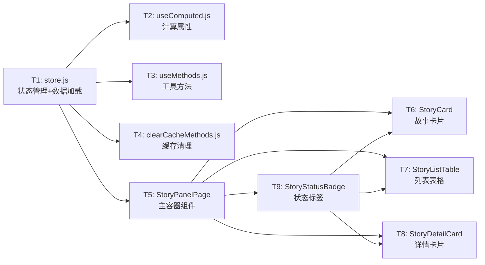
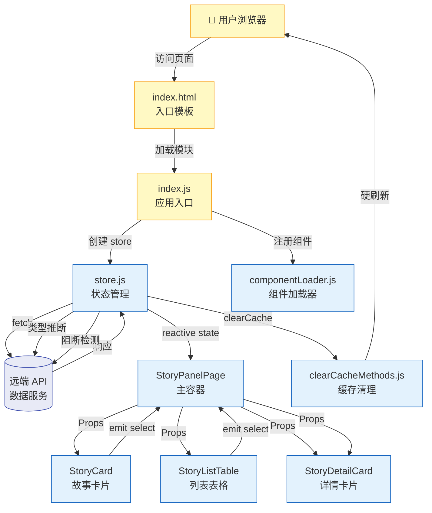
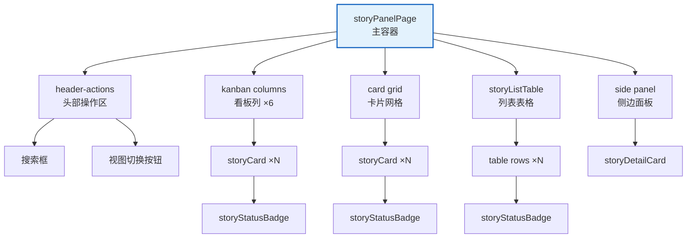
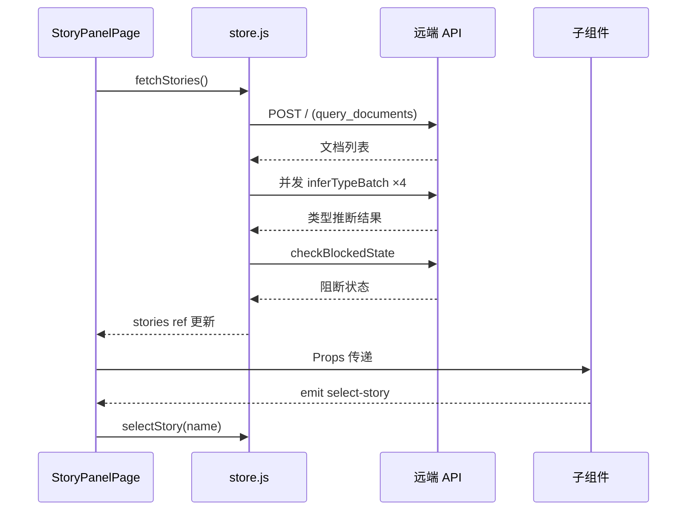
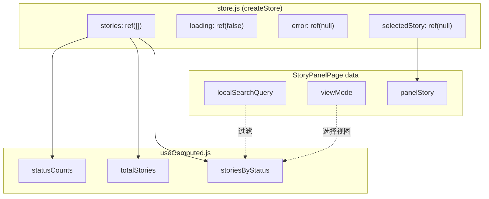
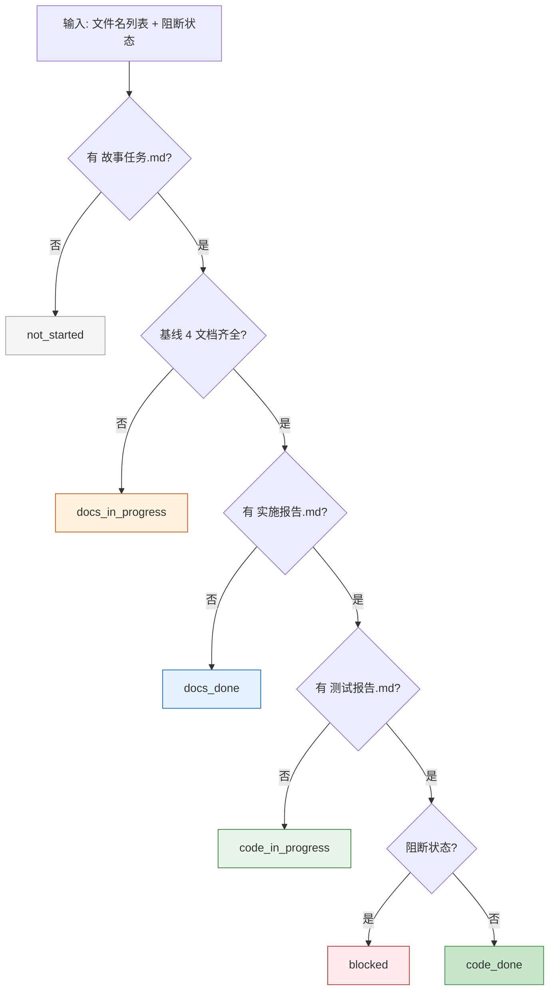
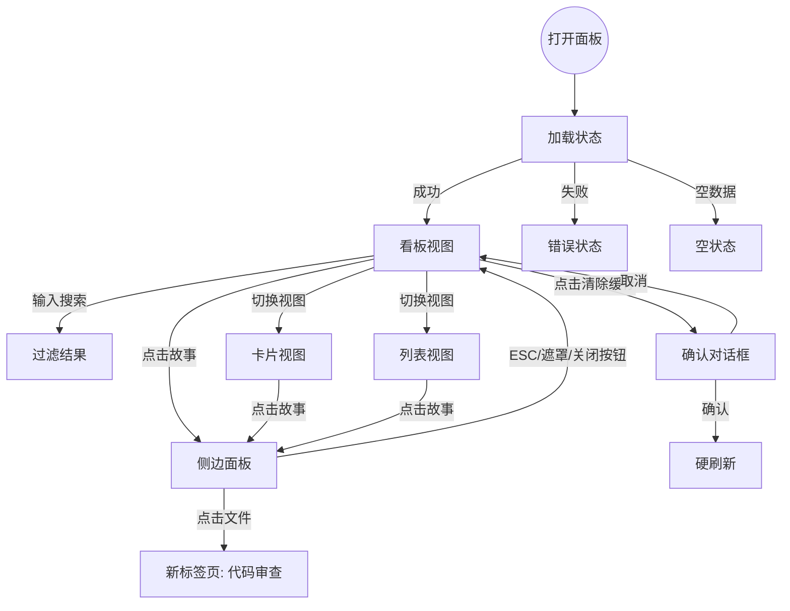

> | v1 | 2026-05-20 | deepseek-v4-pro | 🌿 feat/rui-story | ⏱️ 14:30–15:45 | 📎 [CLAUDE.md](../../../CLAUDE.md) |

> **导航**: [← YiWeb-使用场景](./YiWeb-使用场景.md) · [YiWeb-测试设计 →](./YiWeb-测试设计.md) · [YiWeb-安全审计 →](./YiWeb-安全审计.md)

> **来源引用**: 从 `src/views/story/` 源码反推生成，证据等级 B。溯源至 [YiWeb-故事任务](./YiWeb-故事任务.md) §2 FP1–FP12 和 [YiWeb-使用场景](./YiWeb-使用场景.md) §2 场景 A–E。
>
> **项目类型**: 前端 — 跳过 §2 API 接口、§3 数据模型，后端性能章节合并入 §8。

### 主要价值

- 🏗️ 梳理故事面板的组件树、状态层和通信通道，形成完整架构视图
- 📊 定义六状态判定逻辑与四类型推断算法的输入输出契约
- 🔄 明确搜索过滤、视图切换、详情面板的状态流与事件流
- 🛡️ 识别前端安全边界：认证头注入、XSS 防护、缓存清理的数据残留

---

## §0 设计决策与任务规划

### §0.0 基线溯源

| 本设计章节 | 实现 YiWeb-故事任务 | 服务 YiWeb-使用场景 | 覆盖状态 |
|-----------|-------------------|-------------------|---------|
| §1 系统架构 | FP1, FP5, FP6, FP7 | 场景 A, C | 已覆盖 |
| §4 组件与状态 | FP1, FP2, FP3, FP4, FP8 | 场景 A, B, D | 已覆盖 |
| §5 交互与样式 | FP5, FP6, FP7, FP8, FP9, FP12 | 场景 A, B, C, D | 已覆盖 |
| §6 DOM·事件·依赖 | FP9, FP10, FP12 | 场景 D, E | 已覆盖 |
| §7 安全约束 | FP1, FP11 | 场景 A, E | 已覆盖 |
| §8 性能与限制 | FP1, FP8 | 场景 A, B | 已覆盖 |

### §0.1 设计决策

| 决策领域 | 选定方案 | 选择理由 | 详见 | 实现 FP# |
|---------|---------|---------|------|---------|
| 视图框架 | Vue 3 CDN 运行时（Options API 风格） | 零构建链约束，浏览器直接加载 ESM | §4 | FP5, FP6, FP7 |
| 状态管理 | 响应式 ref + 中心化 store | 符合项目 `createBaseView` 模式，语义与 Vue Options API 一致 | §4.2 | FP1, FP2, FP3, FP4 |
| 组件通信 | Props down, Events up | 符合 Vue 单向数据流约定 | §4.3 | FP5–FP12 |
| 数据加载 | fetch + 统一认证头 + credentials:omit | 符合项目 API 层安全约定 | §1.3 | FP1 |
| 类型推断 | 并发批量请求远端技术评审文档 + 关键词匹配 | 4 并发 worker 平衡速度与服务端压力 | §4.2 | FP3 |
| 视图模式 | 纯 CSS 切换，无路由 | 单一页面内的三种布局模式，不需要路由 | §5 | FP5, FP6, FP7 |
| 缓存清理 | 分层 try-catch 静默容错 | 每层存储 API 独立清理，单层失败不阻断后续 | §6.2 | FP11 |

### §0.2 任务规划



| ID | 描述 | 工作量 | 依赖 | 交付物 | Agent | 门禁 | 交接下游 | 实现 FP# |
|----|------|--------|------|--------|-------|------|---------|---------|
| T1 | 状态管理与数据加载 | L | 无 | `hooks/store.js` | coder | P0 审查 | T2, T3, T4, T5 | FP1, FP2, FP3, FP4 |
| T2 | 计算属性 | S | T1 | `hooks/useComputed.js` | coder | P0 审查 | T5 | — |
| T3 | 工具方法 | S | T1 | `hooks/useMethods.js` | coder | P0 审查 | T5 | — |
| T4 | 缓存清理方法 | S | 无 | `hooks/clearCacheMethods.js` | coder | P0 审查 | T5 | FP11 |
| T5 | 主容器组件 | L | T1, T2, T3, T4 | `components/storyPanelPage/` | coder | P0 审查 | T6, T7, T8 | FP5, FP6, FP7, FP8, FP12 |
| T6 | 故事卡片组件 | S | T9 | `components/storyCard/` | coder | P0 审查 | T5 | FP5, FP6 |
| T7 | 列表表格组件 | S | T9 | `components/storyListTable/` | coder | P0 审查 | T5 | FP7 |
| T8 | 详情卡片组件 | M | T9 | `components/storyDetailCard/` | coder | P0 审查 | T5 | FP9, FP10 |
| T9 | 状态标签组件 | S | 无 | `components/storyStatusBadge/` | coder | P0 审查 | T6, T7, T8 | FP2 |

---

## §1 系统架构

### 效果示意



### 1.1 服务/进程

| 变更类型 | 模块/文件 | 职责 |
|---------|----------|------|
| 新增 | `src/views/story/index.js` | 应用入口，初始化 store + 注册组件 + 挂载 |
| 新增 | `src/views/story/hooks/store.js` | 中心状态管理，数据加载，类型推断，阻断检测 |
| 新增 | `src/views/story/hooks/useComputed.js` | 计算属性：状态计数、故事分组 |
| 新增 | `src/views/story/hooks/useMethods.js` | 工具方法：格式化、标签映射 |
| 新增 | `src/views/story/hooks/clearCacheMethods.js` | 缓存清理与硬刷新 |

### 1.2 组件树



| 组件 | 类型 | 文件 | 注册路径 | 变更 |
|------|------|------|---------|------|
| StoryPanelPage | 业务 | `src/views/story/components/storyPanelPage/` | 全局 `registerGlobalComponent` | 新增 |
| StoryListTable | 业务 | `src/views/story/components/storyListTable/` | 全局 `registerGlobalComponent` | 新增 |
| StoryDetailCard | 业务 | `src/views/story/components/storyDetailCard/` | 全局 `registerGlobalComponent` | 新增 |
| StoryCard | 业务 | `src/views/story/components/storyCard/` | 全局 `registerGlobalComponent` | 新增 |
| StoryStatusBadge | 业务 | `src/views/story/components/storyStatusBadge/` | 全局 `registerGlobalComponent` | 新增 |
| YiIcon | 通用 | `cdn/icons/YiIcon/` | 全局 | 复用 |
| YiButton | 通用 | `cdn/components/common/buttons/YiButton/` | 全局 | 复用 |
| YiTag | 通用 | `cdn/components/common/tags/YiTag/` | 全局 | 复用 |
| YiLoading | 通用 | `cdn/components/common/loaders/YiLoading/` | 全局 | 复用 |
| YiEmptyState | 通用 | `cdn/components/common/feedback/YiEmptyState/` | 全局 | 复用 |
| YiErrorState | 通用 | `cdn/components/common/feedback/YiErrorState/` | 全局 | 复用 |
| HeaderActions | 通用 | `cdn/components/business/HeaderActions/` | 全局 | 复用 |

### 1.3 通信通道



| 通道 | 方向 | 协议 | Payload | 错误处理 |
|------|------|------|---------|---------|
| Store → API (列表) | 单向请求 | HTTPS POST JSON | `{module_name, method_name, parameters: {cname, limit}}` | catch → error ref 设置错误消息 |
| Store → API (类型推断) | 单向请求 ×4 并发 | HTTPS POST JSON | `{target_file}` | 单请求失败 → 返回 'meta'，不阻塞 |
| Store → API (阻断检测) | 单向请求 | HTTPS POST JSON | `{target_file}` | 文件不存在/解析失败 → 返回 null |
| UI → Store | 单向调用 | JS 方法调用 | `selectStory(name)`, `clearSelection()` | — |
| UI → Child | Props down | Vue Props | story objects, loading, error | — |
| Child → UI | Events up | Vue Emit | `select-story`, `back` | — |

---

## §4 组件与状态

### 4.1 组件接口

| 组件 | Props | Events | Expose |
|------|-------|--------|--------|
| StoryPanelPage | `loading: Boolean`, `error: String`, `stories: Array`, `statusCounts: Object`, `totalStories: Number`, `selectedStory: Object`, `storiesByStatus: Object` | `select-story`, `back` | — |
| StoryListTable | `stories: Array`, `loading: Boolean`, `error: String` | `select` | — |
| StoryDetailCard | `story: Object`, `panel: Boolean` | `back`, `close` | — |
| StoryCard | `story: Object` | `select` | — |
| StoryStatusBadge | `status: String`, `size: String` | — | — |

**Story 对象结构**（契约）:

| 字段 | 类型 | 说明 |
|------|------|------|
| name | string | kebab-case 故事名称 |
| status | enum | 六状态之一 |
| type | enum | 四类型之一 |
| description | string | 从故事任务文档 title 提取 |
| nextStep | string | 下一步行动或阻断原因 |
| hasNotify | boolean | 是否有消息通知文档 |
| hasLog | boolean | 是否有交互日志 |
| notifyUpdatedAt | number | 通知最后更新时间戳 |
| logUpdatedAt | number | 日志最后更新时间戳 |
| fileCount | number | 关联文件数量 |
| files | Array\<{filePath, fileName, updatedAt, createdAt, title}\> | 文件列表 |
| lastModified | number | 最后修改时间戳 |
| createdAt | number | 创建时间戳 |

### 4.2 状态定义

| Store/State | 文件 | 状态字段 | 使用组件 |
|-------------|------|---------|---------|
| stories | `hooks/store.js` | `ref([])` — 故事对象数组 | StoryPanelPage, StoryCard, StoryListTable, StoryDetailCard |
| loading | `hooks/store.js` | `ref(false)` — 加载中标志 | StoryPanelPage, StoryListTable |
| error | `hooks/store.js` | `ref(null)` — 错误消息字符串 | StoryPanelPage, StoryListTable |
| selectedStory | `hooks/store.js` | `ref(null)` — 当前选中故事对象 | StoryPanelPage |
| localSearchQuery | StoryPanelPage data | 搜索框输入文本 | StoryPanelPage |
| viewMode | StoryPanelPage data | `'board'` / `'cards'` / `'list'` | StoryPanelPage |
| panelStory | StoryPanelPage data | 侧边面板当前展示的故事 | StoryPanelPage |



**状态判定逻辑**（`determineStatus`）:



**类型推断逻辑**（`inferType`）:

| 关键词类别 | 匹配词 | 判定结果 |
|-----------|--------|---------|
| 后端关键词 | api, 数据, 后端, 服务端, 接口, 数据库, server, backend, 服务, 路由 | backend |
| 前端关键词 | 组件, 交互, 样式, 前端, 页面, ui, frontend, 界面, 布局, 渲染, 响应式 | frontend |
| 两端均命中 | — | fullstack |
| 均不命中 | — | meta |

### 4.3 状态流向

| 数据流 | 触发源 | 状态变更 | 消费方 |
|--------|--------|---------|--------|
| 页面加载 → 数据加载 | `onMounted` → `store.fetchStories()` | loading → true → false, stories → [...] | StoryPanelPage → 所有子组件 |
| 用户点击故事 | `storyCard.onClick` / `storyListTable.onSelect` | selectedStory → story object | StoryPanelPage → StoryDetailCard |
| 用户返回/关闭 | `goBack` / `closePanel` | selectedStory → null, panelStory → null | StoryPanelPage |
| 用户搜索 | `localSearchQuery` v-model | localSearchQuery 变化 → filteredStories 重新计算 | StoryPanelPage → 当前视图子组件 |
| 用户切换视图 | `setView(mode)` | viewMode → 'board'/'cards'/'list' | StoryPanelPage → 条件渲染 |
| 缓存清理 | `clearCacheAndRefresh()` | localStorage/sessionStorage/cache/indexedDB 清空 → 硬刷新 | window.location |

---

## §5 交互与样式

### 5.1 用户操作流



### 5.2 视图状态矩阵

| 视图 | 正常 | 加载 | 空 | 错误 | 禁用 |
|------|------|------|---|------|------|
| 看板视图 | 六列展示故事卡片 | 旋转加载图标 + "加载中..." | 每列显示 "—" 占位符 | 错误图标 + 错误消息 | — |
| 卡片视图 | 故事卡片网格 | 旋转加载图标 + "加载中..." | "没有匹配的故事" 提示 | 错误图标 + 错误消息 | — |
| 列表视图 | 故事表格行 | 表格内 "加载中..." | "暂无故事任务" 提示 | 表格内错误消息 | — |
| 侧边面板 | 故事详情 + 文件清单 | — | 文件清单为空 | — | — |
| 搜索框 | 输入文字实时过滤 | — | 搜索无结果显示 "没有匹配的故事" | — | — |
| 清除缓存按钮 | 可点击 | — | — | — | — |

### 5.3 动画

| 元素 | 类型 | 时长 | 触发条件 |
|------|------|------|---------|
| 侧边面板 | CSS 滑入 (translateX) | 300ms | 点击故事卡片/行 |
| 侧边面板关闭 | CSS 滑出 (translateX) | 200ms | ESC/遮罩/关闭按钮 |
| 加载图标 | 旋转动画 | 持续 | loading 状态 |
| 视图切换 | 即时切换 | 0ms | 点击视图切换按钮 |

### 5.4 样式策略

| 场景 | 方案 | 说明 |
|------|------|------|
| 样式隔离 | BEM 风格类名前缀 `sp-` | 所有组件样式使用 `sp-` 前缀，避免与全局样式冲突 |
| 布局 | CSS Flexbox + Grid | 看板用 flex 横排，卡片用 grid，面板用 fixed 定位 |
| 响应式 | 媒体查询 `@media (max-width: 768px)` | 移动端看板改为纵向滚动 |
| 主题 | CSS 自定义属性 | `--yi-*` 变量来自全局主题 |
| 字体 | Inter (UI) + JetBrains Mono (代码) | Google Fonts CDN |

| 文件 | 用途 | 加载方式 |
|------|------|---------|
| `src/views/story/styles/index.css` | 全局布局与 CSS 变量 | `<link>` 标签 |
| `components/storyPanelPage/index.css` | 主容器布局、搜索框、看板、面板样式 | componentLoader 动态注入 |
| `components/storyCard/index.css` | 卡片样式、状态色条、悬停效果 | componentLoader 动态注入 |
| `components/storyListTable/index.css` | 表格样式、行悬停、列宽 | componentLoader 动态注入 |
| `components/storyDetailCard/index.css` | 详情区、文件列表样式 | componentLoader 动态注入 |
| `components/storyStatusBadge/index.css` | 六状态颜色、尺寸变体 | componentLoader 动态注入 |
| Font Awesome 6.4.0 | 图标字体 | CDN `<link>` |
| Google Fonts | Inter + JetBrains Mono | CDN `<link>` |

---

## §6 DOM·事件·依赖

### 6.1 挂载点

| 组件 | 容器 | 创建方式 | 生命周期 |
|------|------|---------|---------|
| StoryPanelPage | `#app` 内的 `<story-panel-page>` 标签 | Vue 模板渲染 | onMounted: 注册 keydown 监听 → beforeUnmount: 移除 keydown |
| StoryCard | `<story-card>` 自定义元素 | Vue 动态组件 | — |
| StoryListTable | `<story-list-table>` 自定义元素 | Vue 动态组件 | — |
| StoryDetailCard | `<story-detail-card>` 自定义元素 | Vue 动态组件 | — |
| StoryStatusBadge | `<story-status-badge>` 自定义元素 | Vue 动态组件 | — |
| 全局加载指示器 | `#global-loading-indicator` | HTML 静态元素 | 初始显示，JS 加载后隐藏 |

### 6.2 事件

| 事件 | 监听方式 | 处理逻辑 | 清理时机 |
|------|---------|---------|---------|
| `keydown` (ESC) | `document.addEventListener` in StoryPanelPage mounted | `panelVisible` 时 ESC → `closePanel()` | `beforeUnmount` 中 `removeEventListener` |
| 遮罩点击 | `@click` on backdrop div | `e.target === e.currentTarget` → `closePanel()` | 组件销毁时自动清理 |
| 面板关闭按钮 | `@click` on close button | `closePanel()` | 组件销毁时自动清理 |
| 故事卡片点击 | `@click` on card div | `onClick` → `$emit('select', story)` | 组件销毁时自动清理 |
| 表格行点击 | `@click` on tr | `onSelect(story)` → `$emit('select', story.name)` | 组件销毁时自动清理 |
| 文件项点击 | `@click` on file li | `onFileClick(file)` → `window.open(...)` | 组件销毁时自动清理 |
| 清除缓存 | `@clear-cache` on header-actions | `clearCacheAndRefresh()` | 组件销毁时自动清理 |

### 6.3 加载顺序

```
1. <link>   Google Fonts (preconnect)
2. <link>   Font Awesome 6.4.0 CDN
3. <link>   src/views/story/styles/index.css
4. <script> Vue 3.5.26 CDN (global)
5. <script type="module"> src/core/config.js
6. <script type="module"> src/views/story/index.js
7. <script type="module"> /cdn/utils/core/performance.js
```

| 新增文件 | 插入位置 | 依赖上游 |
|---------|---------|---------|
| `src/views/story/index.js` | 步骤 6 | Vue CDN (步骤 4), config.js (步骤 5), componentLoader.js, baseView.js, log.js, error.js |
| `hooks/store.js` | index.js import | Vue ref, authUtils.js, log.js |
| `hooks/useComputed.js` | index.js import | Vue computed, store |
| `hooks/useMethods.js` | index.js import | store |
| `hooks/clearCacheMethods.js` | StoryPanelPage import | 无 |

### 6.4 命名空间

| 文件 | 注册到 | 类型 |
|------|--------|------|
| `hooks/store.js` | `window.storyStore` | 调试暴露 |
| `index.js` (app) | `window.storyApp` | 调试暴露 |
| `clearCacheMethods.js` | `window.clearCacheAndRefresh` | 全局可用 |
| StoryPanelPage | `registerGlobalComponent` | 全局组件 |
| StoryListTable | `registerGlobalComponent` | 全局组件 |
| StoryDetailCard | `registerGlobalComponent` | 全局组件 |
| StoryCard | `registerGlobalComponent` | 全局组件 |
| StoryStatusBadge | `registerGlobalComponent` | 全局组件 |

---

## §7 安全约束

| # | 威胁 | 信任边界 | 缓解措施 | 优先级 |
|---|------|---------|---------|--------|
| 1 | 认证令牌泄露 | X-Token 存储在 localStorage | 所有 fetch 使用 `credentials: 'omit'` 防止自动携带 Cookie；令牌通过自定义 `X-Token` 头传递 | P0 |
| 2 | XSS via 故事名称/描述 | 远端返回的故事 name/description 字段直接渲染 | Vue 模板 `{{ }}` 自动转义 HTML；无 `v-html` 使用 | P0 |
| 3 | 文件路径注入 | `file.filePath` 用于 `encodeURIComponent` 构建 URL | `encodeURIComponent` 编码文件路径；新标签页打开，无同源脚本执行风险 | P1 |
| 4 | 缓存清理不完整 | localStorage 保留令牌键 | 白名单 `PRESERVE_KEYS` 仅含 Token 和模型选择键，其余全部清除 | P1 |
| 5 | 搜索输入 XSS | 用户搜索输入直接用于字符串匹配 | 使用 `toLowerCase().includes()` 纯字符串操作；不构建正则或 innerHTML | P1 |
| 6 | 确认对话框注入风险 | `window.confirm` 显示固定字符串 | 对话框文本为硬编码中文文案，不可注入 | P2 |

---

## §8 性能与限制

| 维度 | 约束 | 应对 |
|------|------|------|
| 首屏渲染 | Vue CDN + 组件加载 + API 请求 | 预连接 CDN (preconnect)；CSS 先于 JS 加载；全局加载指示器覆盖等后期 |
| 搜索过滤 | 客户端 O(n) 字符串匹配，实时过滤 | 数据量小（预期 < 100 故事），无需 debounce 或虚拟滚动 |
| 类型推断 | 最多 4 并发远端请求 | Worker 模式批量推断，避免串行阻塞 |
| 组件加载 | 13 个组件动态注册 | 组件 CSS/HTML 按需加载，componentLoader 管理缓存 |
| 内存 | 故事对象持有文件列表副本 | 无分页；大数据量时需考虑虚拟列表 |
| 渲染帧率 | 视图切换无条件渲染 | 当前无动画过渡，切换为即时显示/隐藏 |
| 限制 | 无离线支持 | Service Worker 用于注销非缓存，页面需网络连接 |

---

## §9 评审清单

| # | 检查项 | 状态 |
|---|--------|------|
| 1 | 组件命名空间独立（`sp-` 前缀） | ✅ |
| 2 | 状态变更走 store，无跨组件直接修改 | ✅ |
| 3 | 样式隔离（BEM 前缀 + 组件级 CSS） | ✅ |
| 4 | 事件监听在 beforeUnmount 清理 | ✅ (keydown 事件已清理) |
| 5 | 加载顺序正确（Vue → Config → App → Performance） | ✅ |
| 6 | 基线溯源完备 | ✅ §0.0 全部映射 |
| 7 | 效果示意完整 | ✅ §1 含 mermaid 全景图 |
| 8 | 裁剪正确（前端跳过 §2 API, §3 数据模型） | ✅ |
| 9 | 无硬编码密钥 | ✅ Token 来自 authUtils |
| 10 | 输入校验完整 | ✅ encodeURIComponent 编码文件路径 |

---

| 日期 | 变更 | 触发 | 证据 |
|------|------|------|------|
| 2026-05-20 | 初始生成 — 从 `src/views/story/` 源码反推 | `/rui doc --from-code src/views/story/index.html --name rui-story` | 全部组件 JS/HTML + hooks 源码 |
