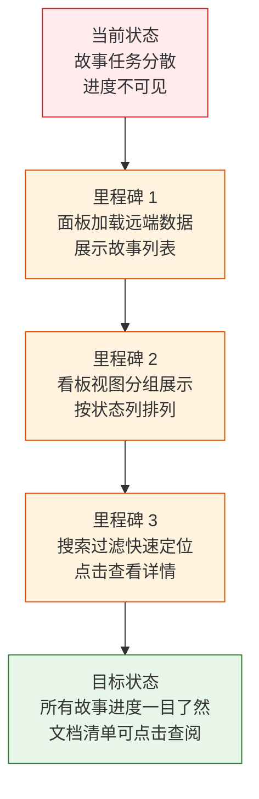

> | v1 | 2026-05-20 | deepseek-v4-pro | 🌿 feat/rui-story | ⏱️ 14:30–15:45 | 📎 [CLAUDE.md](../../../CLAUDE.md) |

> **导航**: [YiWeb-使用场景 →](./YiWeb-使用场景.md)

> **来源引用**: 从源码 `src/views/story/` 反推生成，证据等级 B。反推触发: `/rui doc --from-code src/views/story/index.html --name rui-story`

### 需求概述

为项目管理人员和开发者提供一个故事任务进度面板，集中查看所有故事任务的当前状态、文档完整度和下一步行动。面板以看板、卡片、列表三种视图呈现故事任务，支持按名称和状态快速检索，点击故事可查看其文档清单与元信息。

### 效果示意

### 主要价值

- 🎯 集中查看所有故事任务的进度状态，无需翻阅文件系统
- 🔍 按名称、状态、类型快速搜索定位目标故事
- 📋 看板视图直观展示各阶段故事分布，识别瓶颈
- ⚡ 一键查看故事文档清单，点击文件跳转至代码审查页
- 🔄 支持清除缓存并硬刷新，确保数据与远端同步

---

## §0 基线声明

> **问题空间基线 (Problem Space Baseline)**: 本文档定义"做什么(WHAT)"和"为什么(WHY)"。所有后续文档(03-09)的设计、实现、验证、改进决策均必须可追溯至本文档的具体章节。

---

## §1 Story

### Story 1: 故事任务总览看板

| 字段 | 内容 |
|------|------|
| 作为 | 项目管理者 |
| 我想要 | 在一个面板中看到所有故事任务按进度状态分列展示 |
| 以便 | 快速识别瓶颈故事和整体进度分布 |
| 优先级 | P0 |
| 范围边界 | 加载远端故事数据，按状态分列渲染看板 |
| 依赖 | 远端数据接口可用，浏览器支持现代 JavaScript |

#### 范围外

- 不涉及故事任务的创建、编辑、删除
- 不修改远端数据

##### §1.1 User Operations

| # | 操作 | 触发条件 | 操作步骤 | 预期结果 |
|---|------|---------|---------|---------|
| 1 | 打开故事面板 | 用户访问故事面板页面 | 页面加载 → 自动请求远端故事数据 → 渲染看板视图 | 看到所有故事按状态（任务/设计/实施/测试/报告/改进）分列展示的看板 |
| 2 | 查看空面板 | 远端无故事数据 | 页面加载 → 请求远端 → 返回空列表 | 看到友好的空状态提示 |
| 3 | 加载失败处理 | 远端接口不可达或返回错误 | 页面加载 → 请求失败 | 看到错误提示信息，可手动刷新重试 |

---

### Story 2: 故事搜索与视图切换

| 字段 | 内容 |
|------|------|
| 作为 | 开发者 |
| 我想要 | 按名称或状态搜索故事，并在看板、卡片、列表三种视图间切换 |
| 以便 | 快速定位关注的故事，按偏好的方式浏览 |
| 优先级 | P1 |
| 范围边界 | 本地搜索过滤 + 视图模式切换，不触发远端请求 |
| 依赖 | Story 1 数据已加载 |

#### 范围外

- 不涉及服务端搜索
- 不保存用户的视图偏好

##### §1.1 User Operations

| # | 操作 | 触发条件 | 操作步骤 | 预期结果 |
|---|------|---------|---------|---------|
| 1 | 搜索故事 | 用户在搜索框输入关键词 | 输入文字 → 面板实时过滤展示匹配的故事 | 仅显示名称、状态、类型、描述或下一步中包含关键词的故事 |
| 2 | 清空搜索 | 用户清空搜索框 | 删除搜索文字 → 面板恢复显示全部故事 | 显示全部故事 |
| 3 | 无匹配结果 | 搜索词无匹配 | 输入无匹配关键词 → 面板显示空结果 | 看到"没有匹配的故事"提示 |
| 4 | 切换为卡片视图 | 用户点击卡片视图按钮 | 点击卡片图标 → 面板切换展示 | 故事以卡片网格形式排列，每张卡片显示名称、状态、类型、文件数、最后修改时间、下一步 |
| 5 | 切换为列表视图 | 用户点击列表视图按钮 | 点击列表图标 → 面板切换展示 | 故事以表格行形式排列，列含名称、状态、下一步、消息、日志、文件数、最后修改、类型 |
| 6 | 切换回看板视图 | 用户点击看板视图按钮 | 点击看板图标 → 面板切换展示 | 恢复按状态分列的看板布局 |

---

### Story 3: 故事详情查阅

| 字段 | 内容 |
|------|------|
| 作为 | 开发者 |
| 我想要 | 点击故事查看其描述、下一步行动、文件清单和元信息 |
| 以便 | 了解故事的完整文档基线和最后修改时间 |
| 优先级 | P0 |
| 范围边界 | 本地展示已加载的故事详情，文件点击跳转至外部审查页 |
| 依赖 | Story 1 数据已加载 |

#### 范围外

- 不涉及故事文档的编辑
- 不在面板内预览文件内容

##### §1.1 User Operations

| # | 操作 | 触发条件 | 操作步骤 | 预期结果 |
|---|------|---------|---------|---------|
| 1 | 查看故事详情 | 用户点击某个故事卡片或行 | 点击故事 → 侧边面板滑出 | 面板展示故事描述、下一步行动、消息通知状态、交互日志状态、远端路径、类型、文件数、按前缀分组的文件清单 |
| 2 | 打开文件 | 用户在详情面板点击文件项 | 点击文件名称 → 新标签页打开 | 跳转至代码审查页面展示该文件内容 |
| 3 | 关闭详情面板 | 用户点击关闭按钮、遮罩层或按 ESC 键 | 点击关闭/遮罩/按 ESC → 面板收起 | 回到故事列表视图 |
| 4 | 详情面板中无文件 | 故事无关联文件 | 打开详情面板 → 文件清单区为空 | 文件清单区显示空状态 |

---

### Story 4: 缓存清理与数据刷新

| 字段 | 内容 |
|------|------|
| 作为 | 开发者 |
| 我想要 | 清除浏览器中除登录凭据外的所有缓存数据并硬刷新页面 |
| 以便 | 解决因缓存导致的显示异常或数据过期问题 |
| 优先级 | P2 |
| 范围边界 | 浏览器端缓存清理 + 页面硬刷新，保留登录令牌和模型选择 |
| 依赖 | 浏览器支持 CacheStorage、IndexedDB、ServiceWorker API |

#### 范围外

- 不涉及服务端缓存清理
- 不清除用户登录凭据

##### §1.1 User Operations

| # | 操作 | 触发条件 | 操作步骤 | 预期结果 |
|---|------|---------|---------|---------|
| 1 | 清除缓存并刷新 | 用户点击清除缓存按钮 | 点击按钮 → 确认对话框 → 确认后清除本地存储、会话存储、缓存存储、索引数据库、注销 Service Worker → 页面硬刷新 | 页面重新加载，缓存数据被清除，登录令牌保留 |
| 2 | 取消清除 | 用户在确认对话框点取消 | 点击按钮 → 确认对话框 → 点击取消 | 不做任何操作，页面保持当前状态 |

---

## §2 Requirements

### 功能点

| FP# | 描述 | 输入 | 输出 | 错误行为 | 优先级 |
|-----|------|------|------|---------|--------|
| FP1 | 故事数据加载 — 从远端获取故事任务面板数据并按故事名称分组 | 页面加载触发 | 按状态分类的故事列表，含名称、状态、类型、描述、文件清单、时间戳 | 加载失败时显示错误信息，不阻塞页面交互 | P0 |
| FP2 | 故事状态判定 — 基于文档存在性判定故事进度状态 | 故事的文件名列表 + 阻断状态 | 七种状态之一：任务/设计/实施/测试/报告/改进/已阻断 | 无法判定时默认显示原始状态值 | P0 |
| FP3 | 项目类型推断 — 分析故事技术评审内容推断项目类型 | 故事的技术评审文档内容 | 四种类型之一：前端/后端/全栈/元数据 | 推断失败时默认显示为元数据 | P1 |
| FP4 | 阻断状态检测 — 读取远端阻断状态文件 | 故事的阻断状态文件 | 阻断标记与阻断原因 | 文件不存在或读取失败时视为未阻断 | P1 |
| FP5 | 看板视图 — 按状态分列展示故事卡片 | 已分组的故事数据 | 六列看板，每列含状态标题、故事计数、故事卡片 | 某列无故事时显示占位符 | P0 |
| FP6 | 卡片视图 — 网格排列故事卡片 | 故事数据 | 故事卡片网格，无故事时显示空状态提示 | 搜索无结果时显示"没有匹配的故事" | P1 |
| FP7 | 列表视图 — 表格展示故事列表 | 故事数据 | 八列表格：名称、状态、下一步、消息、日志、文件数、最后修改、类型 | 数据为空时显示空状态提示 | P1 |
| FP8 | 本地搜索 — 按关键词过滤故事 | 用户输入的关键词 | 过滤后的故事列表，支持名称、状态、类型、描述、下一步字段匹配 | 无匹配时显示空结果提示 | P1 |
| FP9 | 故事详情侧边面板 — 展示故事完整信息 | 被点击的故事数据 | 侧边面板：描述、下一步、消息通知状态、交互日志状态、远端路径、类型、文件数、文件清单（按前缀分组） | 面板打开期间按 ESC 或点击遮罩关闭 | P0 |
| FP10 | 文件跳转 — 点击文件名打开代码审查页 | 文件路径 | 新标签页打开代码审查页面 | 路径异常时静默忽略 | P1 |
| FP11 | 缓存清理 — 清除浏览器缓存并硬刷新 | 用户确认操作 | 清除 localStorage(保留令牌)、sessionStorage、CacheStorage、IndexedDB、ServiceWorker 后硬刷新 | 各存储 API 异常时静默忽略，继续后续清理 | P2 |
| FP12 | 键盘导航 — ESC 关闭详情面板 | 键盘 ESC 按下 | 详情面板关闭 | — | P1 |

### 业务规则

| R# | 描述 | 校验方式 | 证据级别 |
|----|------|---------|---------|
| R1 | 故事状态按文档基线完整性递进判定：无故事任务=not_started，缺基线=docs_in_progress，缺实施报告=docs_done，缺测试报告=code_in_progress，缺自改进复盘=code_done，阻断=blocked，全部齐备=self_improve | 对照 `src/views/story/hooks/store.js:32-55` 判定逻辑验证 | B |
| R2 | 项目类型通过远端技术评审文档内容关键词推断，前端关键词含组件/交互/样式/页面/UI，后端关键词含API/数据/服务端/接口/数据库 | 对照 `src/views/story/hooks/store.js:54-85` 推断逻辑验证 | B |
| R3 | 故事名称从文件路径中提取（故事任务面板/<名称>/） | 对照 `src/views/story/hooks/store.js:20-25` 提取逻辑验证 | B |
| R4 | 清除缓存时保留登录令牌和模型选择两项，其余 localStorage 全部移除 | 对照 `src/views/story/hooks/clearCacheMethods.js:12-15` 保留键列表验证 | B |
| R5 | 数据加载使用统一的认证头，不携带浏览器 Cookie | 对照 `src/views/story/hooks/store.js:147` 的 `credentials: 'omit'` 验证 | B |

### 数据约束

| 约束 | 类型 | 范围/格式 | 来源 |
|------|------|----------|------|
| 故事名称 | string | `^[a-z0-9]+(-[a-z0-9]+)*$` (kebab-case) | 命名规范约定 |
| 故事状态 | enum | `not_started` / `docs_in_progress` / `docs_done` / `code_in_progress` / `code_done` / `blocked` / `self_improve` | store.js determineStatus() |
| 项目类型 | enum | `frontend` / `backend` / `fullstack` / `meta` | store.js inferType() |
| 基线文档集 | 固定 4 文档 | 使用场景、技术评审、测试设计、安全审计 | store.js BASELINE_DOCS |
| 文档文件名前缀 | string | `YiWeb-` | store.js PROJECT_PREFIX |
| 保留键 | 固定 2 键 | `YiWeb.apiToken.v1`、`YiWeb.apiModel.v1` | clearCacheMethods.js PRESERVE_KEYS |

---

## §3 成功标准

| SC# | 描述 | 度量方式 | 目标值 | 优先级 | 关联 FP# |
|-----|------|---------|--------|--------|---------|
| SC1 | 用户打开面板后可在 3 秒内看到故事列表 | 页面加载到首屏故事渲染的时间 | ≤ 3 秒 | P0 | FP1, FP5 |
| SC2 | 用户可通过搜索在 1 秒内定位到目标故事 | 输入关键词到结果过滤的时间 | ≤ 1 秒 | P1 | FP8 |
| SC3 | 用户可在看板、卡片、列表三种视图间即时切换 | 点击切换按钮到视图更新的时间 | ≤ 0.3 秒 | P1 | FP5, FP6, FP7 |
| SC4 | 用户点击故事后可在 0.5 秒内看到详情面板 | 点击故事到面板展示的时间 | ≤ 0.5 秒 | P0 | FP9 |
| SC5 | 用户可在详情面板中点击文件名跳转查看文档内容 | 点击文件到新标签页打开的时间 | ≤ 2 秒 | P1 | FP10 |
| SC6 | 用户在无数据时看到清晰指引而非空白页面 | 空状态提示文案存在且友好 | 100% | P0 | FP5, FP6, FP7 |

---

## §4 范围边界

### 范围内

| # | 条目 | 关联 FP# | 边界说明 |
|---|------|---------|---------|
| 1 | 故事数据加载与展示 | FP1, FP5, FP6, FP7 | 从远端加载故事任务面板数据，在看板/卡片/列表视图中渲染 |
| 2 | 故事状态判定 | FP2 | 基于文档存在性自动判定六种进度状态 |
| 3 | 项目类型推断 | FP3 | 自动分析技术评审文档内容推断项目类型 |
| 4 | 阻断状态检测 | FP4 | 读取远端阻断状态文件展示阻断标记与原因 |
| 5 | 本地搜索过滤 | FP8 | 按名称、状态、类型、描述、下一步实时过滤 |
| 6 | 故事详情面板 | FP9, FP10 | 展示故事完整信息与文件清单，支持点击跳转 |
| 7 | 缓存清理 | FP11 | 清除浏览器缓存并硬刷新，保留登录凭据 |
| 8 | 键盘交互 | FP12 | ESC 关闭面板 |

### 范围外

| # | 条目 | 排除原因 | 替代方案 |
|---|------|---------|---------|
| 1 | 故事创建/编辑/删除 | 属于 rui 管线操作 | 使用 `/rui doc` 和 `/rui code` 命令 |
| 2 | 文档内容编辑 | 面板为只读查看 | 在其他编辑器中修改文档 |
| 3 | 故事进度变更 | 由 rui 管线自动推进 | 执行对应的 rui 命令 |
| 4 | 服务端搜索 | 当前数据量小，客户端过滤满足需求 | 大数据量时再引入服务端搜索 |
| 5 | 视图偏好持久化 | 当前用户量小，默认看板视图即可 | 需要时引入 localStorage 存储偏好 |
| 6 | 实时数据推送 | 无 WebSocket 基础设施 | 手动刷新页面重新加载数据 |

---

## §5 AC

| AC# | Given | When | Then | 门禁 |
|-----|-------|------|------|------|
| AC1 | 远端有故事数据 | 用户打开故事面板页面 | 看板视图展示所有故事按状态分列，每列含故事卡片和计数 | Gate A |
| AC2 | 远端无故事数据 | 用户打开故事面板页面 | 显示友好的空状态提示，不显示空白区域 | Gate A |
| AC3 | 远端接口返回错误 | 用户打开故事面板页面 | 显示错误信息，不崩溃 | Gate A |
| AC4 | 用户在搜索框输入关键词 | 输入过程中 | 故事列表实时过滤，仅显示匹配的故事 | Gate A |
| AC5 | 搜索结果为空 | 用户输入无匹配的关键词 | 显示"没有匹配的故事"提示 | Gate A |
| AC6 | 用户点击故事卡片 | 点击故事 | 侧边面板滑出，展示故事详情与文件清单 | Gate A |
| AC7 | 详情面板打开中 | 用户按 ESC 键或点击遮罩层 | 详情面板关闭，回到列表视图 | Gate A |
| AC8 | 用户点击文件项 | 点击文件名称 | 在新标签页打开代码审查页面 | Gate A |
| AC9 | 用户在确认对话框 | 点击清除缓存按钮后点确认 | 清除缓存后页面硬刷新，登录令牌保留 | Gate B |
| AC10 | 用户在确认对话框 | 点击清除缓存按钮后点取消 | 不做任何操作，页面保持不变 | Gate B |

---

## §6 风险与假设

| # | 风险/假设 | 类型 | 可能性 | 影响 | 缓解/验证策略 | 关联 FP# |
|---|----------|------|--------|------|-------------|---------|
| 1 | 远端数据接口不可用导致面板无法加载数据 | 风险 | M | H | 页面展示明确错误信息，用户可手动刷新重试 | FP1 |
| 2 | 缓存清理时某些浏览器 API 不可用导致部分清理失败 | 风险 | L | L | 每个清理步骤独立 try-catch，异常静默继续后续步骤 | FP11 |
| 3 | 文件路径格式变化导致故事名称提取失败 | 风险 | L | M | 提取失败时跳过该条目，不影响其他故事的展示 | FP1 |
| 4 | 类型推断的远端请求超时或失败 | 风险 | M | L | 失败时默认标记为元数据类型，不阻塞面板加载 | FP3 |
| 5 | 大量故事导致面板渲染性能下降 | 风险 | L | M | 当前故事量小；大量时引入虚拟滚动 | FP5, FP6, FP7 |
| 6 | 用户浏览器不支持 ES Module 导致页面完全不可用 | 风险 | L | H | 提供 noscript 降级提示 | — |
| 7 | 远端数据接口可用且返回格式稳定 | 假设 | — | — | 与后端约定稳定的响应格式 | FP1 |
| 8 | 浏览器支持 CacheStorage、IndexedDB、ServiceWorker API | 假设 | — | — | 缓存清理代码中已做特性检测 | FP11 |

---

## §7 跨文档索引

| 本文档章节 | 基线内容 | 下游文档编号 | 预期覆盖 | 状态 |
|-----------|---------|-------------|---------|------|
| §1 Story 1–4 | 故事拆分与用户操作 | YiWeb-使用场景 | 4 个主要场景的详细用户旅程 | 已对齐 |
| §1 Story 1–4 | 故事拆分与用户操作 | YiWeb-技术评审 | 组件架构、状态管理、交互设计 | 已对齐 |
| §2 FP1–FP12 | 功能点清单 | YiWeb-测试设计 | 每个 FP 至少 1 个测试用例 | 已对齐 |
| §2 FP1–FP12 | 功能点清单 | YiWeb-安全审计 | 数据加载、认证、缓存清理的安全分析 | 已对齐 |
| §3 SC1–SC6 | 成功标准 | YiWeb-实施报告 | 每项成功标准的达成验证 | 已对齐 |
| §3 SC1–SC6 | 成功标准 | YiWeb-测试报告 | 冒烟与回归测试覆盖全部 SC | 已对齐 |
| §5 AC1–AC10 | 验收标准 | YiWeb-测试设计 | 每条 AC 映射到具体测试用例 | 已对齐 |
| §5 AC1–AC10 | 验收标准 | YiWeb-测试报告 | 每条 AC 的执行结果 | 已对齐 |
| §6 R1–R8 | 风险与假设 | YiWeb-自改进复盘 | 风险实际触发情况与缓解效果 | 已对齐 |

---

## §L 自改进循环

> 待首次管线执行完成后追加。

---

| 日期 | 变更 | 触发 | 证据 |
|------|------|------|------|
| 2026-05-20 | 初始生成 — 从 `src/views/story/` 源码反推 | `/rui doc --from-code src/views/story/index.html --name rui-story` | `src/views/story/index.html` + `index.js` + `hooks/store.js` + `hooks/useComputed.js` + `hooks/useMethods.js` + `hooks/clearCacheMethods.js` + 全部组件源码 |
