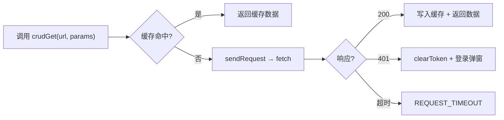
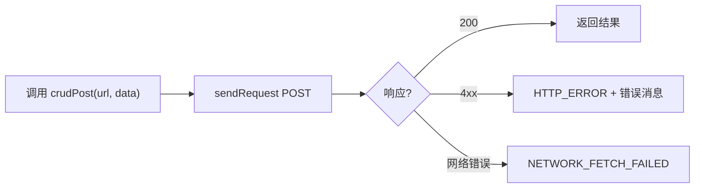
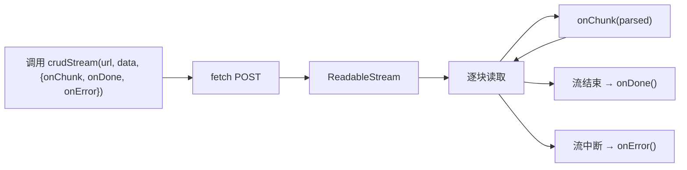

> | v1.0.0 | 2026-05-22 | deepseek-v4-pro | 🌿 feat/services | ⏱️ — | 📎 [CLAUDE.md](../../../CLAUDE.md) |

> **导航**: [← YiWeb-故事任务](./YiWeb-故事任务.md) · [YiWeb-技术评审 →](./YiWeb-技术评审.md)

> **来源引用**: 基于 [YiWeb-故事任务](./YiWeb-故事任务.md) §1 Story 1–3。

---

### 主要价值

- 🎯 三个核心调用场景 — GET 请求、POST 提交、流式对话
- 🔒 异常路径覆盖 — 401/超时/网络错误处理
- ⚡ 每场景含操作流程 mermaid 图
- 📊 场景覆盖矩阵溯源至 FP#

---

## §1 使用场景

### 场景 1: 视图开发者获取数据列表

**角色**: 视图开发者
**目标**: 从远端 API 获取数据列表并利用缓存加速

### 场景 2: 视图开发者提交数据

**角色**: 视图开发者
**目标**: 向远端 API 提交数据并处理结果

### 场景 3: 流式 AI 对话

**角色**: 视图开发者
**目标**: 使用流式请求实现 AI 对话的逐字渲染

---

## §2 场景覆盖矩阵

| 场景 | 关联 FP# | 关联 AC# | 正常 | 异常 |
|------|---------|---------|:--:|:--:|
| 场景 1: GET 列表 | FP1–FP5 | AC1, AC4 | ✅ | ✅ |
| 场景 2: POST 提交 | FP1–FP4 | AC1 | ✅ | ✅ |
| 场景 3: 流式对话 | FP7 | AC1 | ✅ | ✅ |

---

> **变更记录**
> | 日期 | 变更 | 触发 | 证据 |
> |------|------|------|------|
> | 2026-05-22 | 初始生成 | /rui doc --from-code services | YiWeb-故事任务 §1 |
