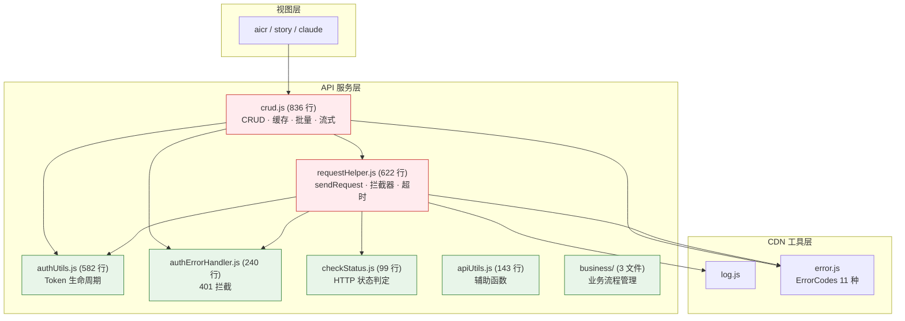
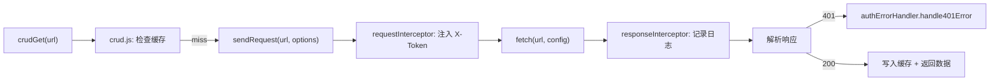

> | v1.0.0 | 2026-05-22 | deepseek-v4-pro | 🌿 feat/services | ⏱️ — | 📎 [CLAUDE.md](../../../CLAUDE.md) |

> **导航**: [← YiWeb-使用场景](./YiWeb-使用场景.md) · [YiWeb-测试设计 →](./YiWeb-测试设计.md) · [YiWeb-安全审计 →](./YiWeb-安全审计.md)

> **来源引用**: 从 `src/core/services/` 源码只读分析生成。

---

### 主要价值

- 🎯 服务层架构全景 — 7 个模块的依赖关系和职责划分
- 🔒 安全策略集中管控 — credentials:'omit' + X-Token 单一入口
- ⚡ 请求链路完整 — 从视图到网络的 5 层调用栈
- 📊 接口契约即文档 — 每个公开方法含签名和错误码

---

## §0 基线溯源

| 溯源目标 | 本文档章节 |
|---------|-----------|
| FP1–FP3: requestHelper | §2 |
| FP4–FP7: crud | §3 |
| FP8–FP10: 认证+错误 | §4 |

---

## §1 架构概览

---

## §2 请求链路

**调用关系**:
- crud.js → requestHelper.js (所有请求)
- crud.js → authUtils.js (getAuthHeaders, getStoredModel)
- crud.js → authErrorHandler.js (handle401Error, isAuthError)
- crud.js → error.js (createError, ErrorCodes)
- requestHelper.js → authUtils.js (getAuthHeaders)
- requestHelper.js → authErrorHandler.js (isAuthError)

---

## §3 缓存策略

| 参数 | 值 | 说明 |
|------|-----|------|
| 存储方式 | `new Map()` | 内存缓存，页面关闭释放 |
| 默认 TTL | 300000ms (5min) | 可配置覆盖 |
| 最大条目 | 100 | 超出时淘汰最旧条目 |
| 缓存键 | URL + query string | GET 请求自动缓存 |
| 手动清除 | `clearCache(pattern?)` | pattern 为空清空全部 |

---

> **变更记录**
> | 日期 | 变更 | 触发 | 证据 |
> |------|------|------|------|
> | 2026-05-22 | 初始生成 | /rui doc --from-code services | src/core/services/ |
