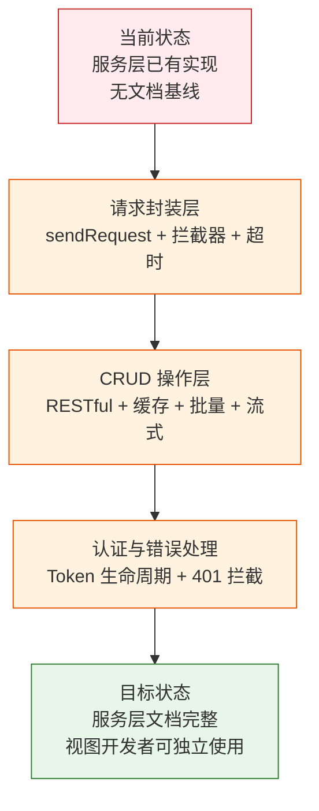

> | v1.0.0 | 2026-05-22 | deepseek-v4-pro | 🌿 feat/services | ⏱️ — | 📎 [CLAUDE.md](../../../CLAUDE.md) |

> **导航**: [YiWeb-使用场景 →](./YiWeb-使用场景.md)

> **来源引用**: 从 `src/core/services/` 源码反推生成，证据 Level B + 源码路径。`/rui doc --from-code services`。

---

### §0 基线声明

> **问题空间基线**: 本文档定义"做什么(WHAT)"和"为什么(WHY)"。

---

### 需求概述

为 YiWeb 提供统一的 API 服务层。封装 HTTP 请求、认证、错误处理、缓存、流式请求等通用能力，供所有视图使用。服务层是视图与后端 API 之间的唯一桥梁，确保所有 API 调用遵循统一的安全策略（credentials: 'omit'、X-Token 认证头）和错误处理规范。

### 效果示意

### 主要价值

- 🎯 统一请求出口 — 所有 HTTP 请求经 sendRequest，安全策略集中管控
- 🔒 认证透明 — 调用方无需手动管理 Token，拦截器自动注入 X-Token
- ⚡ 缓存加速 — 内存缓存减少重复请求，5 分钟 TTL 自动失效
- 📊 错误一致 — 11 种错误码统一管理，调用方按 code 分支处理

---

## §1 Story

### Story 1: HTTP 请求封装

| 字段 | 内容 |
|------|------|
| 作为 | 视图开发者 |
| 我想要 | 一个封装好的 HTTP 请求方法，自动处理认证、超时、错误 |
| 以便 | 不需要重复编写 fetch 调用和错误处理代码 |
| 优先级 | P0 |
| 范围边界 | `src/core/services/helper/requestHelper.js` |

### Story 2: CRUD 操作封装

| 字段 | 内容 |
|------|------|
| 作为 | 视图开发者 |
| 我想要 | 语义化的 CRUD 方法（get/post/put/delete）和高级特性（缓存/批量/流式） |
| 以便 | 用最少的代码完成数据操作 |
| 优先级 | P0 |
| 范围边界 | `src/core/services/modules/crud.js` |
| 依赖 | Story 1 |

### Story 3: 认证与错误处理

| 字段 | 内容 |
|------|------|
| 作为 | 视图开发者 |
| 我想要 | 自动化的 Token 管理和 401 错误处理 |
| 以便 | 不需要手动处理登录态维护 |
| 优先级 | P0 |
| 范围边界 | `authUtils.js` + `authErrorHandler.js` + `checkStatus.js` |
| 依赖 | Story 1 |

---

## §2 Requirements

### 功能点

| FP# | 描述 | 优先级 |
|-----|------|--------|
| FP1 | 统一请求发送 — sendRequest 封装 fetch，含默认配置（超时/headers/credentials） | P0 |
| FP2 | 请求/响应拦截 — requestInterceptor 注入 Token，responseInterceptor 记录日志 | P0 |
| FP3 | 快捷方法 — getRequest/postRequest/putRequest/patchRequest/deleteRequest | P0 |
| FP4 | CRUD 方法族 — crudGet/crudPost/crudPut/crudPatch/crudDelete | P0 |
| FP5 | 内存缓存 — GET 请求自动缓存，可配置 TTL 和最大条目数 | P1 |
| FP6 | 批量请求 — crudBatch（并行）和 crudSerial（串行） | P1 |
| FP7 | 流式请求 — crudStream 支持 ReadableStream 分块处理 | P1 |
| FP8 | Token 管理 — setToken/getToken/clearToken/isTokenExpired | P0 |
| FP9 | 401 拦截 — isAuthError 判定 + handle401Error 弹窗触发 | P0 |
| FP10 | 错误码体系 — 11 种 ErrorCodes 统一管理 | P0 |

### 业务规则

| R# | 描述 |
|----|------|
| R1 | 所有请求默认 `credentials: 'omit'` |
| R2 | 认证通过 `X-Token` 头传递 |
| R3 | GET 请求默认缓存 5 分钟 |
| R4 | 401 错误统一触发登录弹窗 |
| R5 | Token 过期后自动清除并提示重新登录 |

---

## §3 成功标准

| SC# | 描述 | 目标值 |
|-----|------|--------|
| SC1 | 视图开发者用 ≤ 3 行代码完成一次 API 调用 | ≤ 3 行 |
| SC2 | 缓存命中率 ≥ 60%（典型使用场景） | ≥ 60% |
| SC3 | 流式请求首字节延迟 < 500ms | < 500ms |
| SC4 | 错误码完整覆盖所有异常路径 | 11/11 |

---

## §4 范围边界

**范围内**: `src/core/services/helper/` + `src/core/services/modules/` 全部模块
**范围外**: 后端 API 实现、CDN 工具层、视图层逻辑

---

## §5 AC

| AC# | Given | When | Then |
|-----|-------|------|------|
| AC1 | 视图需要获取数据 | 调用 crudGet('/api/data') | 返回数据，自动携带 X-Token |
| AC2 | Token 不存在 | 调用任何需认证的 API | 请求正常发出（不含 X-Token），由后端决定是否拒绝 |
| AC3 | API 返回 401 | 请求完成 | Token 清除，登录弹窗显示 |
| AC4 | 同一 GET 请求重复调用 | 连续两次 crudGet 同一 URL | 第二次命中缓存，不发起网络请求 |
| AC5 | 网络超时 | 请求超过 5 分钟未响应 | 抛出 REQUEST_TIMEOUT 错误 |

---

## §6 风险与假设

| # | 风险 | 缓解 |
|---|------|------|
| 1 | 缓存数据过时导致界面显示旧数据 | clearCache 提供手动清除 + 5 分钟 TTL 自动过期 |
| 2 | Token 过期时间判定依赖 JWT exp 字段 | 后端同步强制过期，前端判定仅作提前优化 |

**产出**: `docs/故事任务面板/services/YiWeb-{故事任务,使用场景,技术评审,测试设计,安全审计}.md`

---

> **变更记录**
> | 日期 | 变更 | 触发 | 证据 |
> |------|------|------|------|
> | 2026-05-22 | 初始生成 — 源码反推 | /rui doc --from-code services | src/core/services/ 源码 |
