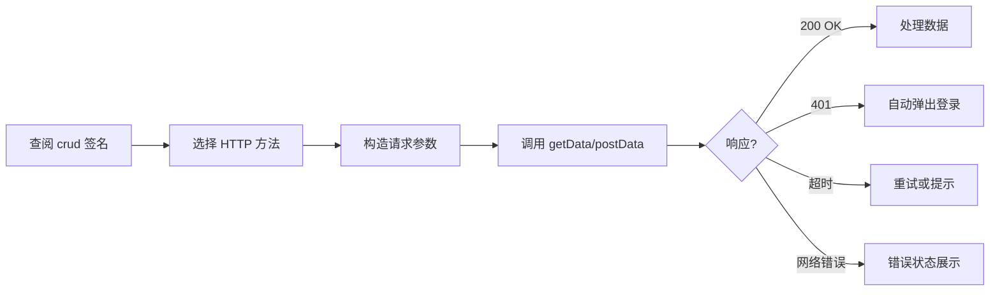
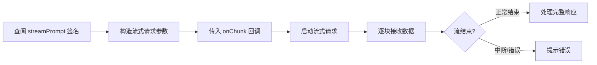
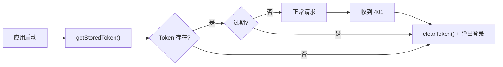
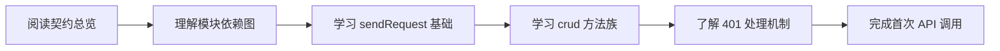
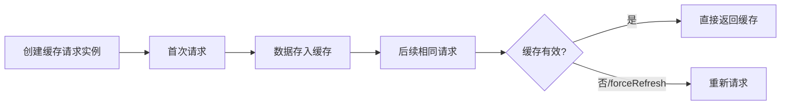

# 使用场景

> | v1.0.0 | 2026-05-26 | deepseek-v4-pro | 📎 [CLAUDE.md](../../../CLAUDE.md) |

> **来源引用**：基于 [故事任务](./故事任务.md) §2 功能点。

---

### 主要价值

- 🎯 覆盖三种角色 — 视图开发者、服务开发者、新成员
- 🔒 异常路径可见 — 401/超时/网络错误处理
- ⚡ 契约即参考 — 每个 API 调用可追溯到源码

---

## §1 使用场景

### 场景 1: 视图开发者调用 CRUD 接口

**角色**: 视图开发者
**目标**: 在 createBaseView methods 中正确调用后端 API

| 步骤 | 操作 | 预期结果 |
|------|------|---------|
| 1 | 查阅 `getData(url, params, options)` 签名 | 了解 params 序列化、cache 选项 |
| 2 | 在 methods 中调用 `window.crudGet('/api/sessions', { limit: 10 })` | 返回 `{ data: [...], total: N }` |
| 3 | 处理 401 错误 | 自动触发登录弹窗 |

---

### 场景 2: 流式聊天请求

**角色**: 视图开发者
**目标**: 正确调用流式 API 并处理分块响应

| 步骤 | 操作 | 预期结果 |
|------|------|---------|
| 1 | 调用 `streamPrompt(url, data, options, onChunk)` | SSE 流式接收数据 |
| 2 | onChunk 回调处理每块数据 | 实时渲染到 UI |
| 3 | 异常处理 | 401 重试 / 422 降级 / 网络中断提示 |

---

### 场景 3: Token 过期处理

**角色**: 任意使用者
**目标**: 理解 Token 生命周期，正确处理过期场景

---

### 场景 4: 新成员接入 API 层

**角色**: 新成员
**目标**: 30 分钟内理解 API 层架构并完成首次调用

| 步骤 | 操作 | 预期结果 |
|------|------|---------|
| 1 | 阅读 `src/core/services/index.js` 导出列表 | 理解所有可用函数 |
| 2 | 阅读 requestHelper.js | 理解拦截器、超时、缓存机制 |
| 3 | 阅读 crud.js | 理解增删改查 + 流式 + 批量 + 缓存 |
| 4 | 阅读 authUtils.js + authErrorHandler.js | 理解认证流程 |
| 5 | 在 console 调用 `getData('/api/sessions')` | 成功返回数据 |

---

### 场景 5: 使用请求缓存优化性能

**角色**: 视图开发者
**目标**: 避免重复 API 调用，提升响应速度

---

## §2 场景覆盖矩阵

| 场景 | 关联 FP# | 正常路径 | 空状态 | 错误恢复 |
|------|---------|:--:|:--:|:--:|
| 场景 1: CRUD 调用 | FP1, FP2, FP10 | ✅ | ✅ | ✅ |
| 场景 2: 流式请求 | FP9 | ✅ | — | ✅ |
| 场景 3: Token 过期 | FP4, FP5 | ✅ | ✅ | ✅ |
| 场景 4: 新成员接入 | 全部 | ✅ | — | — |
| 场景 5: 请求缓存 | FP6 | ✅ | ✅ | — |

---

> **变更记录**
> | 日期 | 变更 | 触发 | 证据 |
> |------|------|------|------|
> | 2026-05-26 | 基线化 | 源码分析 | src/core/services/ |
