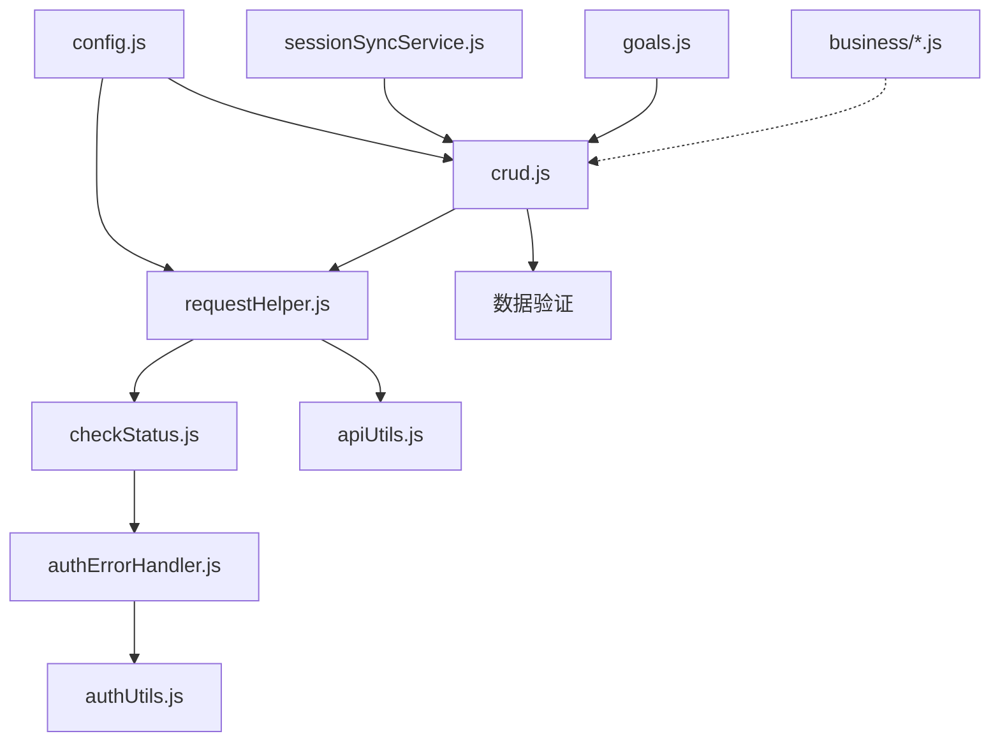
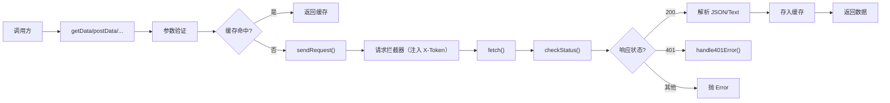

# 技术评审

> | v1.0.0 | 2026-05-26 | deepseek-v4-pro | 📎 [CLAUDE.md](../../../CLAUDE.md) |

> **来源引用**：从 `src/core/services/` 源码分析生成。

---

### 主要价值

- 🎯 分层清晰 — helper → modules → business 三层架构
- 🔒 请求生命周期完整 — 拦截器 → 发送 → 校验 → 缓存 → 重试
- ⚡ 模块化 — 每个文件职责单一，通过 index.js 聚合导出

---

## §1 模块依赖图



---

## §2 请求生命周期



> 证据: `src/core/services/helper/requestHelper.js` · `src/core/services/modules/crud.js`

---

## §3 核心模块详解

### 3.1 requestHelper.js — HTTP 核心

| 功能 | 实现 | 证据 |
|------|------|------|
| 请求拦截 | 注入 X-Token、添加时间戳 | requestHelper.js interceptor |
| 超时控制 | AbortController + Promise.race | sendRequest timeout |
| 401 重试 | 轮询 Token 变化 3s 后重发 | retryOn401 逻辑 |
| 批量请求 | Promise.all 并发 | batchRequests |
| 指数退避重试 | delay × 2ⁿ | retryRequest |
| 内存缓存 | Map 存储 + TTL + LRU | CachedRequest 类 |

### 3.2 crud.js — 数据访问层

| 功能 | 方法 | 特性 |
|------|------|------|
| 查询 | `getData` | 可选缓存 |
| 创建 | `postData` | 验证 + 清缓存 |
| 全量更新 | `updateData` | 验证 + 清缓存 |
| 部分更新 | `patchData` | 验证 + 清缓存 |
| 删除 | `deleteData` | 清缓存 |
| 流式 | `streamPrompt` | SSE 解析 + 401/422 降级 |
| 流式 JSON | `streamPromptJSON` | 流式 + JSON 标准化 |
| 批量 | `batchOperations` | 顺序执行 + 结果收集 |

### 3.3 sessionSyncService.js — 会话同步

```
文件 ↔ 会话 双向同步
  fileToSession()    — 文件对象 → 会话对象
  syncFileToSession() — 创建/更新会话（支持队列批处理）
  loadFromSessions()  — 会话列表 → 文件对象
  renameSession()     — 重命名时更新会话
  deleteSession()     — 删除文件时清理会话
```

### 3.4 authUtils.js — 认证管理

| 功能 | 方法 | 存储 |
|------|------|------|
| Token 存取 | `getStoredToken` / `saveToken` / `clearToken` | localStorage: `YiWeb.apiToken.v1` |
| Model 存取 | `getStoredModel` / `saveModel` | localStorage: `YiWeb.apiModel.v1` |
| 请求头 | `getAuthHeaders` | 返回 `{ "X-Token": ... }` |
| 登录弹窗 | `openAuth` | 自定义 `<dialog>` + Ollama 模型下拉 |

---

## §4 技术决策

| 决策 | 选择 | 原因 |
|------|------|------|
| 凭证策略 | `credentials: 'omit'` | 避免意外携带 Cookie |
| Token 传输 | X-Token 请求头 | 安全于 Authorization header |
| 缓存策略 | 内存 Map + TTL | 无外部依赖，页面关闭即清除 |
| 流式协议 | SSE (text/event-stream) | 浏览器原生支持 |
| 错误码 | 自定义 Error class | 统一错误处理流程 |
| 模块导出 | 聚合 + window 注入 | 支持 ESM import 和全局访问 |

---

> **变更记录**
> | 日期 | 变更 | 触发 | 证据 |
> |------|------|------|------|
> | 2026-05-26 | 基线化 | 源码分析 | src/core/services/ |
