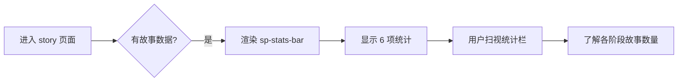
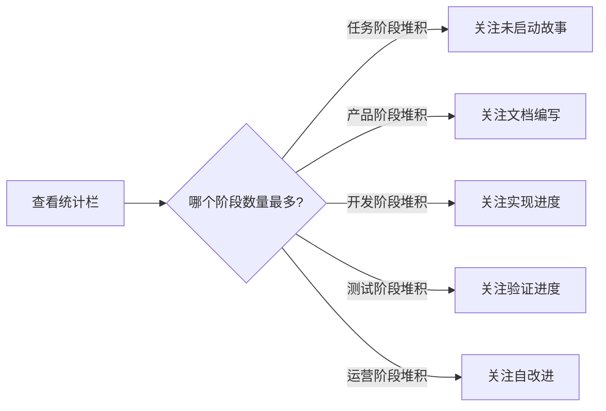

# YiWeb-使用场景

## 元信息

| 属性 | 值 |
|------|-----|
| 故事名称 | sp-stats-bar |
| 版本 | 1.0.0 |
| 创建日期 | 2026-05-24 |
| 基线类型 | 用户空间 |

## 概述

用户在 story 页面通过统计栏快速了解故事在各业务角色阶段的分布情况，定位工作瓶颈。

### 主要价值

- 👤 用户无需理解技术状态机即可看懂故事分布
- 🎯 按角色阶段（任务→产品→开发→测试→运营）直观展示管线进度
- 📊 6 项统计数自洽（子项之和 = 总数），增强数据可信度
- 🔍 为后续按角色阶段筛选故事提供数据锚点

---

## 场景 1：查看故事管线全景

### 正常路径

用户进入 story 页面，页面加载完成后，统计栏展示 6 个数据点：故事总数、任务阶段、产品阶段、开发阶段、测试阶段、运营阶段。用户一眼看清故事在各阶段的分布。

### 空状态

所有统计值均为 0，统计栏仍正常渲染，各项显示 0。用户看到空白统计栏，了解当前无故事数据。

### 错误恢复

若 statusCounts 某字段为 undefined，模板中 `|| 0` 兜底显示 0，不会出现 NaN 或空白。

---

## 场景 2：通过统计栏定位瓶颈

### 正常路径

用户通过统计栏快速识别哪个阶段的故事数量最多，定位当前工作瓶颈。例如任务阶段堆积大量故事，说明需要推进文档化。

---

## 场景覆盖矩阵

| 场景 | 覆盖 FP# | 正常路径 | 空状态 | 错误恢复 |
|------|---------|---------|--------|---------|
| 场景 1：查看全景 | FP1–FP7 | ✓ | ✓ | ✓ |
| 场景 2：定位瓶颈 | FP2–FP7 | ✓ | — | — |

---

## 来源引用

- 故事任务: `docs/故事任务面板/sp-stats-bar/YiWeb-故事任务.md`
- 源码: `src/views/story/components/storyPanelPage/template.html:57-88`

## 变更记录

| 日期 | 版本 | 变更 | 作者 |
|------|------|------|------|
| 2026-05-24 | 1.0.0 | 初始生成 | Claude |
