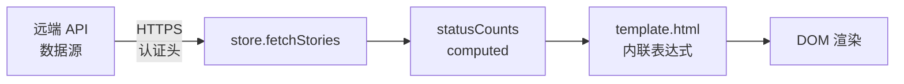

# YiWeb-安全审计

## 元信息

| 属性 | 值 |
|------|-----|
| 故事名称 | sp-stats-bar |
| 版本 | 1.0.0 |
| 创建日期 | 2026-05-24 |
| 审计方式 | 独立审计（security agent） |

## §0 基线溯源

| 来源 | 类型 | 路径 |
|------|------|------|
| 技术评审 | 解决方案空间 | YiWeb-技术评审.md |

---

## §1 资产识别

| 资产 | 类型 | 敏感度 | 存储位置 |
|------|------|--------|---------|
| 故事统计数据 | 展示数据 | 低 | 浏览器内存（vueRef） |
| 统计标签文本 | 静态文案 | 无 | template.html 硬编码 |

---

## §2 STRIDE 威胁建模

| 威胁类型 | 威胁描述 | 可能性 | 影响 | 缓解措施 |
|----------|---------|--------|------|---------|
| Spoofing | N/A — 无身份验证上下文 | — | — | — |
| Tampering | 统计数据被客户端篡改 | L | L | 数据源来自 API 响应，客户端仅展示 |
| Repudiation | N/A — 无操作日志需求 | — | — | — |
| Information Disclosure | 统计数据泄露业务进度 | L | L | 统计数据本身设计为面板内可见 |
| Denial of Service | N/A — 纯展示组件 | — | — | — |
| Elevation of Privilege | N/A — 无权限操作 | — | — | — |

---

## §3 信任边界

本次变更仅涉及 `TEMPLATE → DOM` 环节，为纯展示层变更，不跨越信任边界。

## §4 缓解措施

| 措施 | 状态 | 说明 |
|------|:---:|------|
| XSS 防护 | 已满足 | Vue 模板插值 `{{ }}` 自动转义 HTML |
| 输入校验 | 已满足 | `\|\| 0` 兜底处理 undefined/null |
| 数据源完整性 | 已满足 | 数据来自 API 响应，非用户输入 |

## §5 合规检查

| 检查项 | 状态 | 说明 |
|--------|:---:|------|
| 无用户输入 | ✓ | 纯展示 |
| 无 API 调用 | ✓ | 不发起请求 |
| 无本地存储 | ✓ | 不读写 storage |
| 无 Cookie 操作 | ✓ | — |
| 无第三方脚本 | ✓ | — |
| 无 eval / innerHTML | ✓ | Vue 模板编译 |

---

## 审计结论

**通过**。本次变更为纯前端模板层的统计标签和数据聚合方式调整，不引入新的安全风险。所有现有安全控制（Vue 模板转义、API 认证、数据源完整性）保持不变。

---

## 来源引用

- 技术评审: `docs/故事任务面板/sp-stats-bar/YiWeb-技术评审.md`
- 源码: `src/views/story/components/storyPanelPage/template.html:57-88`

## 变更记录

| 日期 | 版本 | 变更 | 作者 |
|------|------|------|------|
| 2026-05-24 | 1.0.0 | 独立审计 | Claude |
