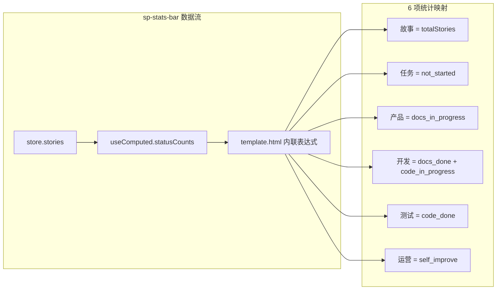

# YiWeb-技术评审

## 元信息

| 属性 | 值 |
|------|-----|
| 故事名称 | sp-stats-bar |
| 版本 | 1.0.0 |
| 创建日期 | 2026-05-24 |
| 项目类型 | frontend |

## §0 基线溯源

| 来源 | 类型 | 路径 |
|------|------|------|
| 故事任务 FP1–FP7 | 问题空间 | YiWeb-故事任务.md §2 |
| 使用场景 1–2 | 用户空间 | YiWeb-使用场景.md |

---

## 效果示意

---

## §1 架构影响

无架构变更。本次修改仅限于 `storyPanelPage` 组件模板层的 DOM 结构和数据绑定表达式，不涉及状态管理、API 层或组件接口变更。

## §4 组件变更

### 4.1 storyPanelPage 模板

**文件**: `src/views/story/components/storyPanelPage/template.html:57-88`

**变更前**（5 项）:
- 故事 (`totalStories`)
- 未开始 (`statusCounts.not_started`)
- 进行中 (`docs_in_progress + code_in_progress`)
- 已完成 (`docs_done + code_done`)
- 自改进 (`self_improve`, v-if 条件渲染)

**变更后**（6 项）:
- 故事 (`totalStories`)
- 任务 (`statusCounts.not_started`)
- 产品 (`statusCounts.docs_in_progress`)
- 开发 (`docs_done + code_in_progress`)
- 测试 (`statusCounts.code_done`)
- 运营 (`statusCounts.self_improve`)

**关键差异**:
- 取消 `v-if` 条件渲染，运营项始终可见
- `docs_done` 从「已完成」移至「开发」分组
- `code_done` 独立为「测试」
- `code_in_progress` 从「进行中」移至「开发」分组

### 4.2 状态管理

无变更。`statusCounts` 计算属性（`useComputed.js:7-22`）输出 6 个 key，模板只需重组聚合方式。

### 4.3 图标映射

| 统计项 | 图标名 | 含义 |
|--------|--------|------|
| 故事 | `list` | 列表/总览 |
| 任务 | `circle` | 待处理 |
| 产品 | `file-alt` | 文档 |
| 开发 | `code` | 编码 |
| 测试 | `check-circle` | 验证 |
| 运营 | `lightbulb` | 改进 |

> 证据: `src/views/story/components/storyPanelPage/template.html:57-88`

---

## §5 交互影响

无交互变更。统计栏为纯展示组件，无点击事件或用户交互。

## §7 安全考量

无安全影响。纯前端模板变更，不涉及用户输入、API 调用或数据存储。

---

## 来源引用

- 模板: `src/views/story/components/storyPanelPage/template.html:57-88`
- 状态管理: `src/views/story/hooks/useComputed.js:7-22`
- 数据模型: `src/views/story/hooks/store.js:116-280`

## 变更记录

| 日期 | 版本 | 变更 | 作者 |
|------|------|------|------|
| 2026-05-24 | 1.0.0 | 初始生成 | Claude |
