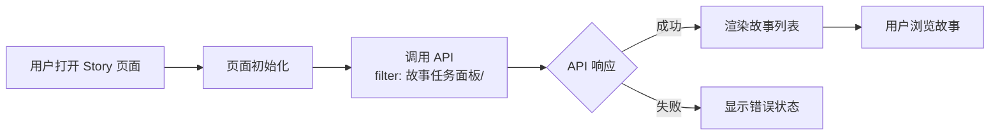
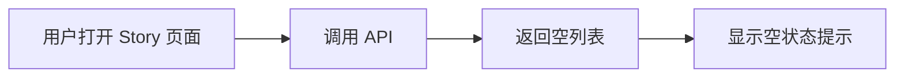
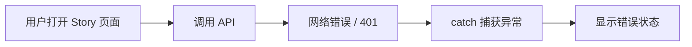

> | v1.0.0 | 2026-05-24 | deepseek-v4-pro | 🌿 feat/story-api-filter | ⏱️ — | 📎 [CLAUDE.md](../../../CLAUDE.md) |

> **导航**: [← YiWeb-故事任务](./YiWeb-故事任务.md) | [YiWeb-技术评审 →](./YiWeb-技术评审.md)

> **来源引用**: [YiWeb-故事任务](./YiWeb-故事任务.md) §1 Story 1

### 主要价值

- 👤 用户零感知 — 服务端过滤对用户透明，体验不变
- 🚀 加载更快 — 减少网络传输量，API 仅返回相关数据
- 🛡️ 防御纵深 — 服务端过滤 + 客户端安全网双重保障
- 📊 数据精准 — 故事面板展示内容始终限定在 故事任务面板 目录

---

## §0 基线声明

> **用户空间基线 (User Space Baseline)**: 本文档描述用户视角的操作流程。所有技术决策必须可追溯至本文档定义的用户旅程。

---

## §1 场景

### 场景 1: 正常加载故事面板

| 步骤 | 用户操作 | 系统行为 | 预期结果 |
|------|---------|---------|---------|
| 1 | 访问 Story 页面 | 触发 onMounted → fetchStories() | 显示加载状态 |
| 2 | — | POST 请求到 API，带 filter 参数 | 服务端返回仅含 故事任务面板/ 前缀的文档 |
| 3 | — | 处理响应，分组、状态判定、类型推断 | 故事列表数据就绪 |
| 4 | 看到故事列表 | 渲染故事卡片/表格 | 各故事展示名称、状态、类型、文件数 |

### 场景 2: 空状态（无故事）

| 步骤 | 用户操作 | 系统行为 | 预期结果 |
|------|---------|---------|---------|
| 1 | 访问 Story 页面 | API 返回空列表 | storyMap.size === 0 |
| 2 | 看到空状态 | stories.value = [] | 页面显示"暂无故事"或空状态 |

### 场景 3: API 不可用

| 步骤 | 用户操作 | 系统行为 | 预期结果 |
|------|---------|---------|---------|
| 1 | 访问 Story 页面 | API 请求失败（网络或认证） | catch 块执行 |
| 2 | 看到错误提示 | error.value 设置错误消息 | 页面显示错误信息和重试按钮 |

---

## §2 场景覆盖矩阵

| 场景 | 类型 | 覆盖 FP# | 覆盖率 |
|------|------|---------|--------|
| 场景 1: 正常加载 | 正常路径 | FP1 | 100% |
| 场景 2: 空状态 | 边界条件 | FP1 | 100% |
| 场景 3: 错误恢复 | 异常路径 | FP2 | 100% |

---

> **变更记录**
> | 日期 | 变更 | 触发 | 证据 |
> |------|------|------|------|
> | 2026-05-24 | 初始生成 | /rui story 页面数据来源应为 API + filter | YiWeb-故事任务.md |
