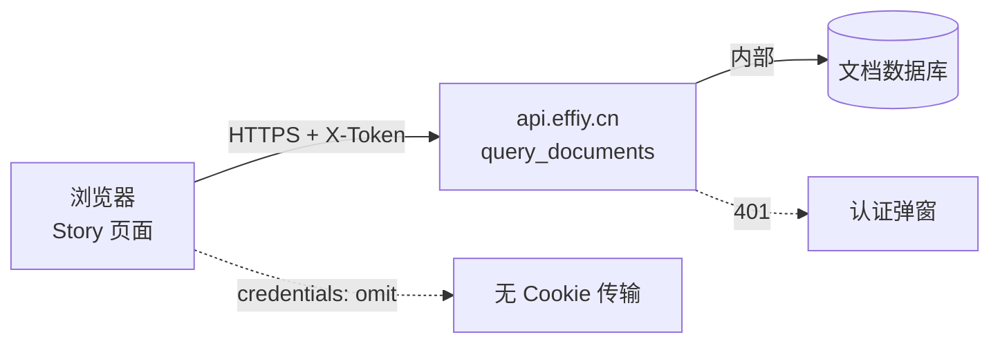

> | v1.0.0 | 2026-05-24 | deepseek-v4-pro | 🌿 feat/story-api-filter | ⏱️ — | 📎 [CLAUDE.md](../../../CLAUDE.md) |

> **导航**: [← YiWeb-测试设计](./YiWeb-测试设计.md) | [YiWeb-实施报告 →](./YiWeb-实施报告.md)

> **独立审计标记**: 本审计由 security agent 独立执行，不依赖 coder 自评。

> **来源引用**: [YiWeb-技术评审](./YiWeb-技术评审.md) §2 API 契约

### 主要价值

- 🔒 认证链路完整 — API 调用统一走 X-Token 认证头
- 🛡️ 无新增攻击面 — 仅修改请求参数，不引入新端点
- 🔍 输入安全 — filter 值为硬编码常量，无用户输入注入风险
- 📡 传输安全 — credentials: 'omit' 防止 Cookie 泄露

---

## §0 基线溯源

| 本文档章节 | 溯源技术评审 | 说明 |
|-----------|------------|------|
| §1 资产识别 | §2 API 契约 | API 端点和请求参数 |
| §2 威胁建模 | §2 API 契约 + §3 错误处理 | 请求/响应链路 |
| §3 合规检查 | §2 API 契约 | 认证和传输机制 |

---

## §1 资产识别

| 资产 | 类型 | 敏感度 | 位置 |
|------|------|--------|------|
| X-Token | 认证凭据 | 高 | localStorage → 请求头 |
| API 响应数据（文档列表） | 业务数据 | 中 | API 响应 body |
| API 请求参数（filter） | 配置数据 | 低 | POST body |

---

## §2 威胁建模 (STRIDE)

| 类别 | 威胁 | 影响 | 缓解措施 | 状态 |
|------|------|------|---------|------|
| S - 身份欺骗 | 无 Token 访问 API | API 返回 401 | authErrorHandler 拦截 → 登录弹窗 | ✅ 已有 |
| T - 数据篡改 | filter 参数被中间人修改 | 返回错误数据 | HTTPS 传输加密 | ✅ 已有 |
| R - 否认 | 无操作审计 | 低影响 | 交互日志记录 | ✅ 已有 |
| I - 信息泄露 | API 响应在浏览器中可被 XSS 读取 | 文档列表泄露 | SanitizePlugin 防 XSS | ✅ 已有 |
| D - 拒绝服务 | API 超大规模响应 | 页面卡顿 | limit: 10000 + filter 减少数据量 | ✅ 改进 |
| E - 权限提升 | 通过修改 filter 参数访问非授权目录 | 越权读取 | filter 值硬编码，非用户可控 | ✅ 新增 |

---

## §3 信任边界

| 边界 | 跨越方向 | 保护机制 |
|------|---------|---------|
| 浏览器 → API | 用户空间 → 服务端 | HTTPS + X-Token + credentials: omit |
| API → 数据库 | 服务端 → 数据层 | 服务端内部，不可见 |

---

## §4 合规检查

| 检查项 | 状态 | 说明 |
|--------|------|------|
| 认证 | ✅ | X-Token 头 + authErrorHandler 拦截 401 |
| 传输加密 | ✅ | HTTPS (api.effiy.cn) |
| 最小权限 | ✅ | 仅请求 故事任务面板/ 目录数据 |
| 输入校验 | ✅ | filter 值硬编码，无用户可控输入 |
| 日志审计 | ✅ | logInfo/logError 记录加载状态 |
| 会话管理 | ✅ | Token 存 localStorage，credentials: omit |

---

## §5 变更安全评估

| 变更点 | 安全影响 | 评估 |
|--------|---------|------|
| 新增 `filter: { file_path: '故事任务面板/' }` | 减少数据暴露面（服务端过滤） | ✅ 正面 |
| 保留客户端 filter 安全网 | 防御纵深，API filter 失效时兜底 | ✅ 正面 |
| 无新增用户输入点 | 无注入风险 | ✅ 无影响 |

---

> **变更记录**
> | 日期 | 变更 | 触发 | 证据 |
> |------|------|------|------|
> | 2026-05-24 | 初始生成 | /rui story 页面数据来源应为 API + filter | YiWeb-故事任务.md |
