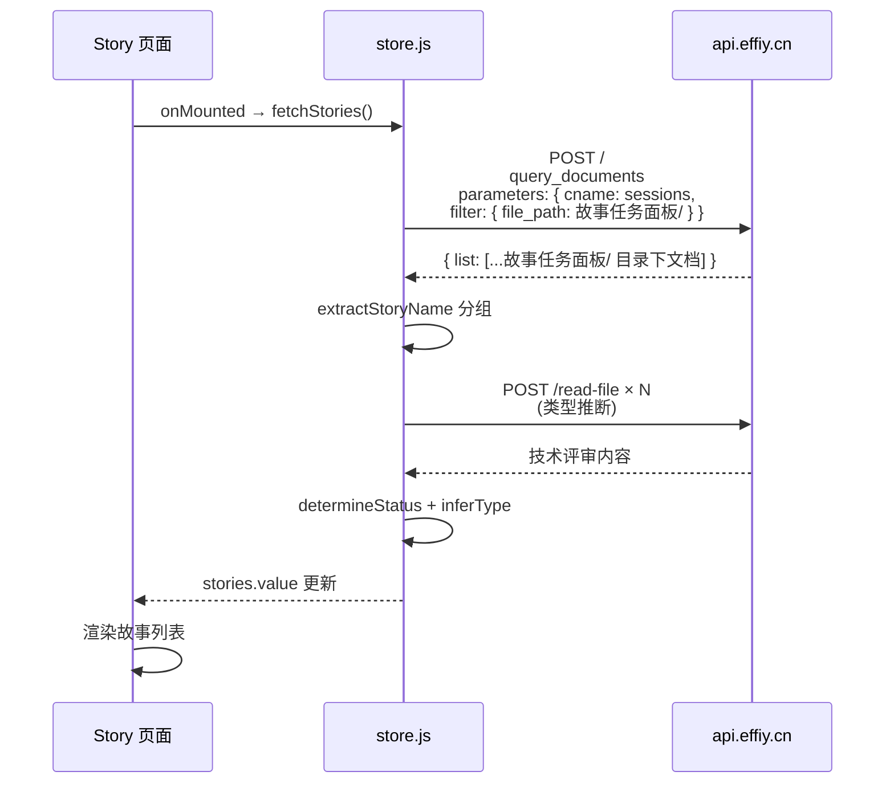

> | v1.0.0 | 2026-05-24 | deepseek-v4-pro | 🌿 feat/story-api-filter | ⏱️ — | 📎 [CLAUDE.md](../../../CLAUDE.md) |

> **导航**: [← YiWeb-使用场景](./YiWeb-使用场景.md) | [YiWeb-测试设计 →](./YiWeb-测试设计.md)

> **来源引用**: [YiWeb-故事任务](./YiWeb-故事任务.md) §2 FP1–FP2

### 主要价值

- 🔍 最小改动 — 仅修改 API 调用参数，不动数据处理管线
- 🎯 精准过滤 — 服务端 filter 替代客户端遍历，语义清晰
- 🧩 兼容现有 — filter 参数格式遵循项目已有的 query_documents 约定
- 🔧 易维护 — 过滤条件集中在 parameters.filter，一处修改全局生效

---

## §0 基线溯源

| 本文档章节 | 溯源故事任务 | 溯源使用场景 |
|-----------|------------|------------|
| §1 请求流 | FP1 API 过滤参数 | 场景 1 正常加载 |
| §2 API 契约 | R1 filter 格式约定 | 场景 1 |
| §3 错误处理 | FP2 错误处理保持 | 场景 3 API 不可用 |

---

## §1 效果示意

---

## §2 API 契约

### query_documents 请求

| 字段 | 类型 | 值 | 说明 |
|------|------|-----|------|
| module_name | string | `services.database.data_service` | 服务模块 |
| method_name | string | `query_documents` | 查询方法 |
| parameters.cname | string | `sessions` | 集合名 |
| parameters.limit | number | `10000` | 最大返回条数 |
| parameters.filter | object | `{ file_path: '故事任务面板/' }` | **新增** — 服务端前缀过滤 |

### 响应结构（不变）

| 字段 | 类型 | 说明 |
|------|------|------|
| data.list | array | 文档数组，每项含 file_path, title, tags, updatedAt, createdAt |
| list | array | 兼容字段 |

---

## §3 错误处理

| 错误类型 | 处理方式 | 用户体验 |
|---------|---------|---------|
| 网络不通 | catch 捕获 → error.value 设置消息 | 显示错误提示 + 重试 |
| 401 未认证 | authErrorHandler 拦截 → 登录弹窗 | 认证流程 |
| API 不支持 filter | 返回全量数据 → 客户端 filter 安全网过滤 | 功能正常，略慢 |
| 空结果 | storyMap.size === 0 → 空数组 | 空状态提示 |

---

## §4 数据流（不变部分）

以下处理逻辑不受本次改动影响：

| 处理步骤 | 函数 | 文件行号 |
|---------|------|---------|
| 故事分组 | extractStoryName → storyMap | store.js:29-32, 150-157 |
| 状态判定 | determineStatus | store.js:39-59 |
| 类型推断 | inferType → inferTypesBatch | store.js:61-111 |
| 结果构建 | results.push({...}) | store.js:216-237 |
| 排序 | results.sort(by lastModified) | store.js:240 |

---

> **变更记录**
> | 日期 | 变更 | 触发 | 证据 |
> |------|------|------|------|
> | 2026-05-24 | 初始生成 | /rui story 页面数据来源应为 API + filter | YiWeb-故事任务.md |
