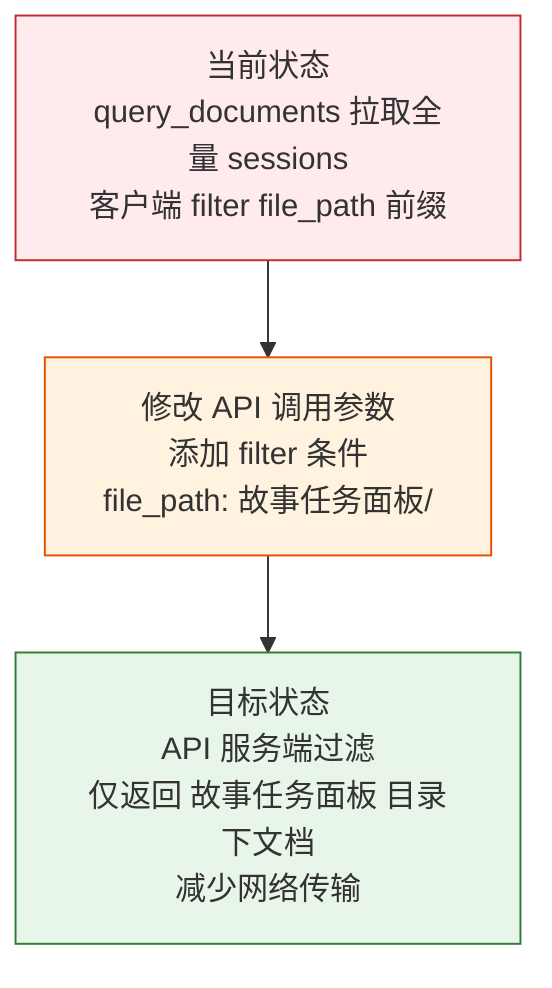

> | v1.0.0 | 2026-05-24 | deepseek-v4-pro | 🌿 feat/story-api-filter | ⏱️ — | 📎 [CLAUDE.md](../../../CLAUDE.md) |

> **导航**: [YiWeb-使用场景 →](./YiWeb-使用场景.md)

> **来源引用**: `/rui story 页面的数据来源应该是 https://api.effiy.cn/?module_name=services.database.data_service&method_name=query_documents&parameters=%7B%22cname%22%3A%22sessions%22%7D 中加上过滤条件，只需要 故事任务面板 目录标签下的内容`，用户需求。

### 需求概述

Story 页面通过远端 API `query_documents` 获取全量 sessions 后在客户端按 `file_path` 前缀过滤 `故事任务面板/`。将过滤条件前移到 API 调用参数中，减少网络传输量和客户端计算开销。

### 效果示意

### 主要价值

- 🚀 服务端过滤 — 减少网络传输量，API 仅返回故事任务面板相关文档
- ⚡ 客户端减负 — 无需客户端遍历过滤，直接消费 API 返回数据
- 🔒 数据精准 — API 调用语义明确，只请求需要的数据
- 🧹 架构清晰 — filter 参数显式声明数据范围，便于维护和调试

---

## §0 基线声明

> **问题空间基线 (Problem Space Baseline)**: 本文档定义"做什么(WHAT)"和"为什么(WHY)"。所有后续文档的设计、实现、验证决策均必须可追溯至本文档的具体章节。

---

## §1 Story

### Story 1: API 调用添加过滤条件

| 字段 | 内容 |
|------|------|
| 作为 | Story 页面 |
| 我想要 | 在 `query_documents` API 调用中添加 `filter` 参数，仅获取 `故事任务面板/` 目录下的文档 |
| 以便 | 减少网络传输量，服务端精准返回所需数据 |
| 优先级 | P0 |
| 范围边界 | 仅修改 `src/views/story/hooks/store.js` 中 `fetchStories` 的 API 请求参数，不改变数据处理逻辑 |
| 依赖 | 远端 API 支持 `filter` 参数 |

#### 范围外

- 不改变故事列表渲染逻辑
- 不改变类型推断、状态判定等下游处理
- 不新增或删除 UI 组件

##### §1.1 User Operations

| # | 操作 | 触发条件 | 操作步骤 | 预期结果 |
|---|------|---------|---------|---------|
| 1 | 正常加载 | 用户打开 story 页面 | 页面加载 → fetchStories 调用 API（带 filter）→ 返回过滤后数据 → 渲染 | 故事列表正常展示，仅含 故事任务面板 目录内容 |
| 2 | 空结果 | 远端无 故事任务面板 目录文档 | API 返回空列表 | 显示空状态 |
| 3 | API 不可用 | 远端 API 网络不通或 Token 缺失 | API 调用失败 | 显示错误状态 |

---

## §2 Requirements

### 功能点

| FP# | 描述 | 输入 | 输出 | 错误行为 | 优先级 |
|-----|------|------|------|---------|--------|
| FP1 | API 过滤参数 — 在 `query_documents` 调用的 `parameters` 中添加 `filter` 字段，限制 `file_path` 前缀为 `故事任务面板/` | 无（API 调用参数） | 服务端过滤后的文档列表 | API 不支持 filter 时回退客户端过滤 | P0 |
| FP2 | 错误处理保持 — API 调用失败时保持现有错误提示逻辑 | API 异常 | 错误状态设置 | 网络错误时 error.value 设置错误消息 | P1 |

### 业务规则

| R# | 描述 | 校验方式 | 证据级别 |
|----|------|---------|---------|
| R1 | filter 参数格式遵循现有 API 约定（`{ field: value }` 对象） | 代码审查对照 `sessionListMethods.js` 中 filter 用法 | B |
| R2 | 服务端过滤结果仍需要客户端验证（防御性编程） | 保留 file_path 前缀检查作为安全网 | B |

### 数据约束

| 约束 | 类型 | 范围/格式 | 来源 |
|------|------|----------|------|
| filter 字段名 | string | `file_path` | 文档 schema |
| filter 值 | string | `故事任务面板/` | 远端路径前缀 |
| API method | string | `query_documents` | services.database.data_service |
| cname | string | `sessions` | 数据库集合名 |

---

## §3 成功标准

| SC# | 描述 | 度量方式 | 目标值 | 优先级 | 关联 FP# |
|-----|------|---------|--------|--------|---------|
| SC1 | API 调用包含 filter 参数 | 浏览器 Network 面板检查请求体 | parameters.filter 存在且值为 `{ file_path: '故事任务面板/' }` | P0 | FP1 |
| SC2 | Story 页面正常加载并展示故事列表 | 打开 story 页面观察 | 故事列表渲染正确，数据完整 | P0 | FP1 |
| SC3 | API 不可用时显示错误状态 | 模拟网络断开或 Token 缺失 | 页面显示错误信息 | P1 | FP2 |

---

## §4 范围边界

### 范围内

| # | 条目 | 关联 FP# | 边界说明 |
|---|------|---------|---------|
| 1 | fetchStories 中 API 请求参数修改 | FP1 | 添加 filter 字段 |
| 2 | 移除客户端过滤逻辑（或降级为安全网） | FP1 | 服务端过滤后客户端无需再过滤 |

### 范围外

| # | 条目 | 排除原因 | 替代方案 |
|---|------|---------|---------|
| 1 | 本地 manifest 加载 | 用户明确要求 API 数据源 | 不引入 manifest 路径 |
| 2 | 其他视图改造 | aicr/claude 视图不变 | 仅 story 视图 |
| 3 | API 接口改造 | API 已有 filter 支持 | 使用现有能力 |

---

## §5 AC

| AC# | Given | When | Then | 门禁 |
|-----|-------|------|------|------|
| AC1 | 远端 API 可用且 Token 有效 | 打开 story 页面 | 故事列表正常展示，API 请求体包含 `filter: { file_path: '故事任务面板/' }` | Gate A |
| AC2 | 远端 API 不可用 | 打开 story 页面 | 显示错误状态，error.value 非空 | Gate A |

---

## §6 风险与假设

| # | 风险/假设 | 类型 | 可能性 | 影响 | 缓解/验证策略 | 关联 FP# |
|---|----------|------|--------|------|-------------|---------|
| 1 | API 的 filter 参数不支持 `file_path` 字段过滤 | 风险 | L | M | 若 API 返回未过滤数据，客户端保留前缀检查作为安全网 | FP1 |
| 2 | filter 参数语法与现有 API 约定不一致 | 风险 | L | M | 参照 `sessionListMethods.js` 中已验证的 filter 用法 | FP1 |
| 3 | `query_documents` 的 filter 参数支持 `file_path` 字段匹配 | 假设 | — | — | 文档系统已有 `file_path` 字段，filter 为通用查询参数 | FP1 |

---

## §7 跨文档索引

| 本文档章节 | 基线内容 | 下游文档编号 | 预期覆盖 | 状态 |
|-----------|---------|-------------|---------|------|
| §1 Story 1 | 添加 API filter 参数 | YiWeb-使用场景 | 3 个场景的详细用户旅程 | 已对齐 |
| §2 FP1–FP2 | 功能点清单 | YiWeb-技术评审 | store.js fetchStories 改造 | 已对齐 |
| §2 FP1–FP2 | 功能点清单 | YiWeb-测试设计 | 每个 FP 至少 1 个测试用例 | 已对齐 |
| §2 FP1–FP2 | 功能点清单 | YiWeb-安全审计 | API 调用安全分析 | 已对齐 |

---

## §L 自改进循环

> 待首次管线执行完成后追加。

---

## §R 关联故事

| 关联故事 | 关系类型 | 说明 |
|---------|---------|------|
| story | 改造目标 | story 页面视图本身，本次修改其数据加载路径 |
| claude | 并行参考 | claude 视图同样使用 query_documents + 客户端过滤 |

---

> **变更记录**
> | 日期 | 变更 | 触发 | 证据 |
> |------|------|------|------|
> | 2026-05-24 | 初始生成 | /rui story 页面数据来源应为 API + filter | 用户需求 |
