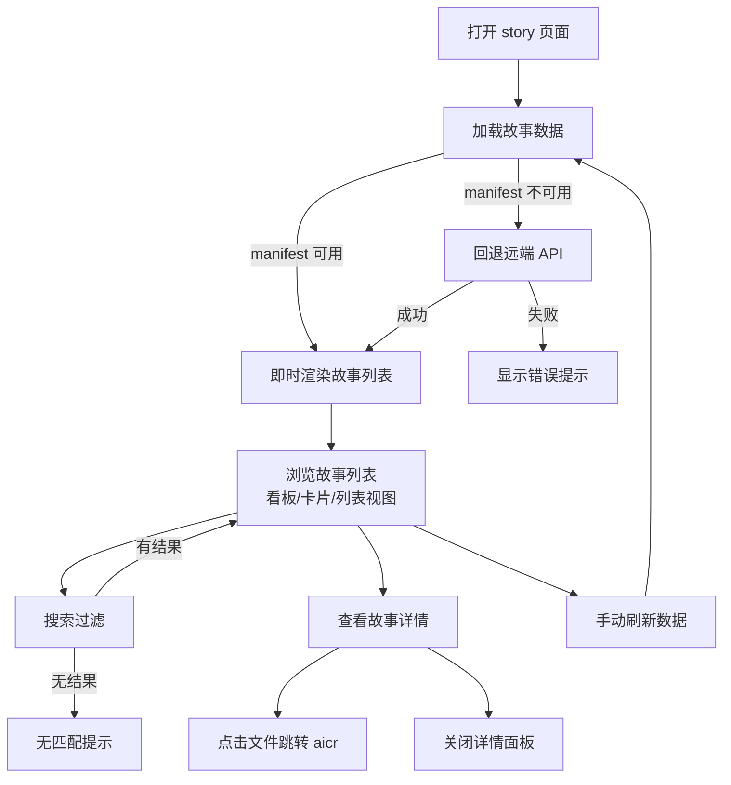
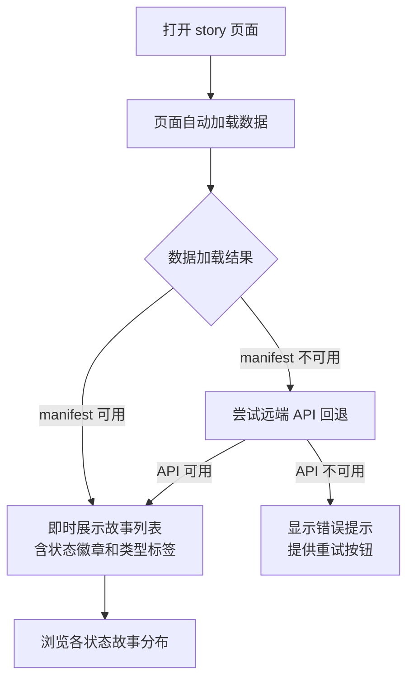
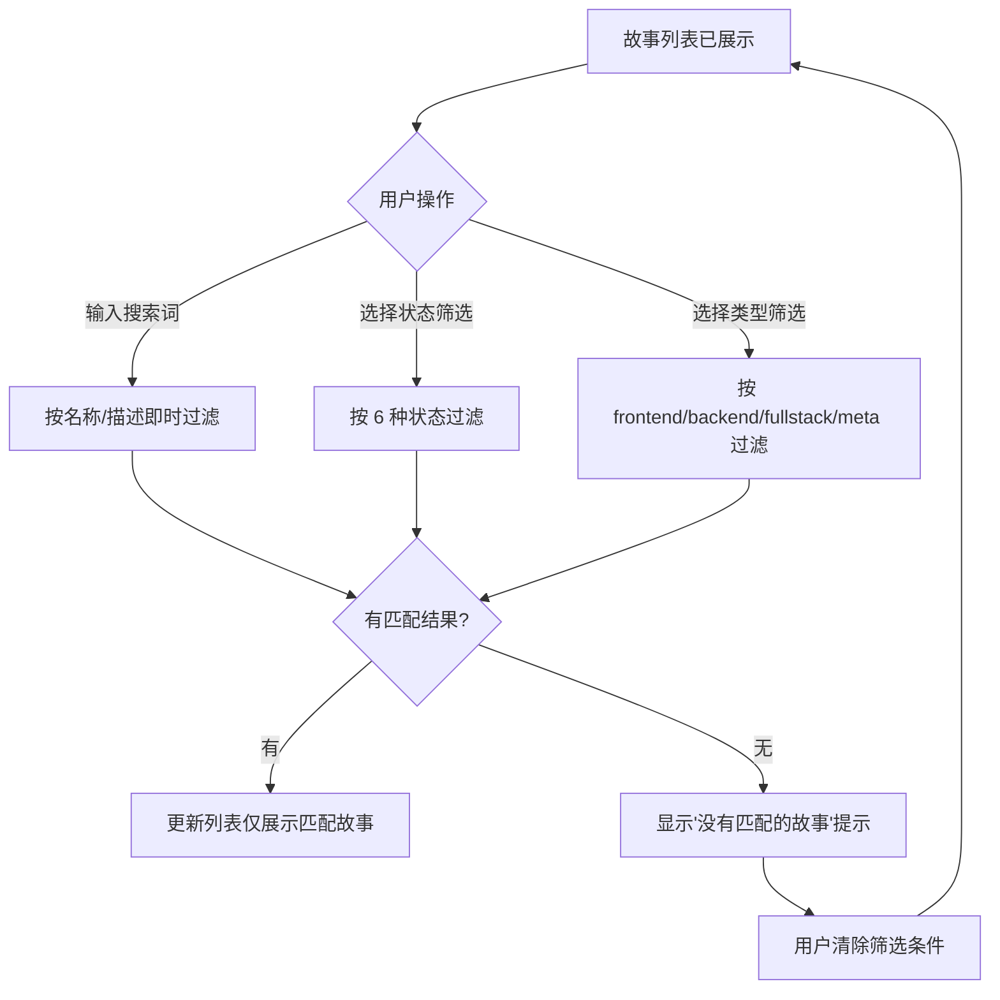
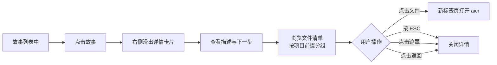
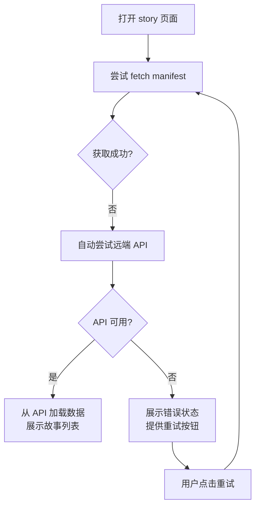

> | v1.0.0 | 2026-05-24 | deepseek-v4-pro | 🌿 feat/story-local-data | ⏱️ — | 📎 [CLAUDE.md](../../../CLAUDE.md) |

> **导航**: [← YiWeb-故事任务](./YiWeb-故事任务.md) · [YiWeb-技术评审 →](./YiWeb-技术评审.md)

> **来源引用**: [YiWeb-故事任务](./YiWeb-故事任务.md) §1 Story 1–3，用户需求。

### 主要价值

- 🚀 零网络依赖 — 打开 story 页面直接加载本地 manifest，无需等待远端 API
- 🔍 即时搜索筛选 — 全部数据已在客户端，按名称/状态/类型即时过滤
- 🛡️ 优雅降级 — manifest 不可用时自动回退远端 API，用户无感知
- 📋 离线可用 — 本地开发时无需 API Token，故事面板即可完整展示

---

## §0 基线声明

> **用户空间基线 (User Space Baseline)**: 本文档定义"谁使用(WHO)"和"如何体验(HOW EXPERIENCE)"。所有交互设计(技术评审)、测试用例(测试设计)、验收标准(故事任务 §5)均必须覆盖本文档定义的每个场景。

---

## §1 场景全景

---

## §2 场景详述

### 场景 A: 打开故事面板查看进度

| 角色 | 触发条件 | 核心目标 |
|------|---------|---------|
| 开发者 | 在浏览器打开 story 页面 | 快速浏览所有故事的当前状态和文档完整度 |

| # | 步骤 | 输入 | 系统响应 | 异常分支 |
|---|------|------|---------|---------|
| 1 | 用户在浏览器打开 story 页面 | 页面 URL | 页面自动 fetch manifest → 解析 JSON → 渲染故事列表 | manifest 404 → 回退远端 API（步骤 2 异常路径） |
| 2a | 数据加载成功，有故事数据 | — | 展示故事列表（看板/卡片/列表视图），每个故事显示名称、状态徽章、类型标签、文件数、更新时间 | — |
| 2b | 数据加载成功，无故事数据 | — | 展示友好的空状态提示，引导用户运行扫描脚本或等待故事创建 | — |
| 3 | manifest 和 API 均失败 | — | 展示错误图标和错误消息，提供重试按钮 | 用户点击重试 → 重新加载数据 |

### 场景 B: 筛选和搜索故事

| 角色 | 触发条件 | 核心目标 |
|------|---------|---------|
| 开发者 | 故事列表已加载，想定位特定故事 | 按名称、状态、类型快速过滤故事列表 |

| # | 步骤 | 输入 | 系统响应 | 异常分支 |
|---|------|------|---------|---------|
| 1 | 用户输入搜索关键词 | 关键词字符 | 输入过程中实时过滤，仅保留名称或描述中包含关键词的故事 | 输入过快 → 过滤保持流畅，所有数据已在客户端，无网络延迟 |
| 2 | 搜索结果不为空 | — | 当前视图模式下仅展示匹配的故事 | — |
| 3 | 搜索结果为空 | 无匹配关键词 | 显示"没有匹配的故事"提示 | 用户修改关键词或清空搜索 → 恢复完整列表 |
| 4 | 用户选择状态筛选 | 点击状态选项 | 列表仅展示该状态的故事，同时保留搜索关键词组合过滤 | 组合筛选无结果 → 提示调整筛选条件 |
| 5 | 用户清除所有筛选 | 点击清除或清空输入 | 列表恢复展示全部故事 | — |

### 场景 C: 查看故事详情

| 角色 | 触发条件 | 核心目标 |
|------|---------|---------|
| 开发者 | 浏览故事列表时想了解某个故事的详细信息 | 查看故事描述、文件清单，点击文件跳转查看 |

| # | 步骤 | 输入 | 系统响应 | 异常分支 |
|---|------|------|---------|---------|
| 1 | 用户点击故事卡片或行 | 点击操作 | 右侧滑出详情面板，展示故事描述、下一步行动、消息通知状态、交互日志状态、类型、文件数和文件清单 | — |
| 2 | 面板展示文件清单 | — | 文件按项目前缀分组，每组显示文件名和最后修改时间 | 文件清单为空 → 显示空状态 |
| 3 | 用户点击文件名 | 点击文件项 | 在新标签页中打开 aicr 页面展示该文件内容 | 文件路径无效 → aicr 页面显示错误 |
| 4 | 用户关闭面板 | ESC / 遮罩点击 / 关闭按钮 | 详情面板关闭，回到故事列表 | — |

### 场景 D: 本地数据不可用（降级）

| 角色 | 触发条件 | 核心目标 |
|------|---------|---------|
| 开发者 | manifest 不可访问时打开 story 页面 | 系统自动回退远端 API，保证页面可用 |

| # | 步骤 | 输入 | 系统响应 | 异常分支 |
|---|------|------|---------|---------|
| 1 | 用户打开页面，manifest 不可访问 | 页面 URL | 页面静默回退到远端 API 加载数据 | — |
| 2 | API 加载成功 | — | 故事列表正常展示，用户无感知降级过程 | — |
| 3 | API 也失败 | — | 展示错误图标和消息："数据不可用，请检查网络连接后重试"，提供重试按钮 | 用户点击重试 → 重新 fetch manifest |
| 4 | 重试后恢复 | 用户点击重试 | manifest 恢复可访问 → 正常加载 | manifest 仍不可用 → 再次尝试 API 回退 |

---

## §3 场景覆盖矩阵

| 场景 | FP# | AC# | 实现文档(技术评审) | 测试文档(测试设计) | 覆盖状态 | 备注 |
|------|-----|-----|-------------------|-------------------|---------|------|
| A 打开面板查看进度 | FP1, FP5, FP6 | AC1, AC2 | YiWeb-技术评审 §1 §3 | YiWeb-测试设计 §2.1 | 已对齐 | 核心浏览流程 |
| B 筛选搜索故事 | FP6 | — | YiWeb-技术评审 §3 | YiWeb-测试设计 §2.1 | 已对齐 | 全客户端即时过滤 |
| C 查看故事详情 | FP6 | — | YiWeb-技术评审 §3 | YiWeb-测试设计 §2.3 | 已对齐 | 详情面板+文件跳转 |
| D 降级加载 | FP7 | AC3, AC4 | YiWeb-技术评审 §3 | YiWeb-测试设计 §2.3 | 已对齐 | manifest→API 三级回退 |

---

## §4 评审清单

| # | 检查项 | 状态 |
|---|--------|------|
| 1 | 场景数量 ≥ 2 | ✅ 4 个场景 |
| 2 | 每场景有流程图 | ✅ 每个场景含 mermaid flowchart |
| 3 | FP 全覆盖（FP1–FP7） | ✅ 全部覆盖 |
| 4 | 异常分支明确 | ✅ 每场景含异常分支列和恢复路径 |
| 5 | 无技术术语 | ✅ 已审查（无组件名/API端点/文件路径） |
| 6 | 每场景含空状态与错误恢复 | ✅ 场景 A 含空状态和错误恢复，场景 D 专注降级恢复 |
| 7 | 覆盖矩阵下游文档齐全 | ✅ 技术评审+测试设计已映射 |

---

## §5 体验基线

| 角色 | 核心旅程 | 情感目标 | 痛点解决 | 成功感知 | 关联场景 |
|------|---------|---------|---------|---------|---------|
| 开发者 | 打开面板 → 立即看到故事列表 | 感到高效、无等待 | 不再需要等待远端 API 响应 | 页面打开瞬间即展示完整故事列表 | A |
| 开发者 | 输入关键词 → 实时过滤结果 | 感到精准、响应即时 | 无需在长列表中肉眼搜索 | 输入过程中列表即时更新，精准定位目标故事 | B |
| 开发者 | 点击故事 → 查看文件清单 → 点击文件跳转 | 感到便捷、无缝衔接 | 无需手动拼接 URL 或查找文件 | 在新标签页中看到文件内容，可直接审查 | C |
| 开发者 | manifest 不可用 → 自动降级 → 功能正常 | 感到可靠、有保障 | 不需要手动切换数据源或修改配置 | 页面正常展示，完全无感知降级过程 | D |

---

> **变更记录**
> | 日期 | 变更 | 触发 | 证据 |
> |------|------|------|------|
> | 2026-05-24 | 初始生成 | /rui story 页面只需要故事任务面板下的数据即可 | YiWeb-故事任务.md §1 |
> | 2026-05-24 | 对齐 formulas.md — 补充 §0 基线声明（用户空间基线）、§1 场景全景、§4 评审清单、§5 体验基线 | /rui 使用新的文档标准重写 docs | formulas.md F.story.scenarios |
