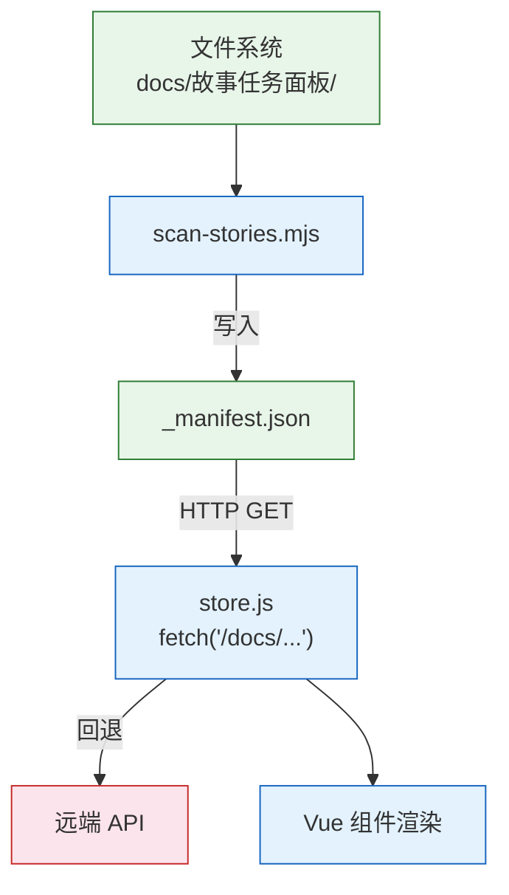

> | v1.0.0 | 2026-05-24 | deepseek-v4-pro | 🌿 feat/story-local-data | ⏱️ — | 📎 [CLAUDE.md](../../../CLAUDE.md) |

> **导航**: [← YiWeb-技术评审](./YiWeb-技术评审.md) · [YiWeb-实施报告 →](./YiWeb-实施报告.md)

> **来源引用**: 独立安全审计，基于 [YiWeb-技术评审](./YiWeb-技术评审.md) 和源码变更分析。

---

### §0 独立审计声明

> 本文档由 security agent 独立执行，不依赖 coder 自评。

---

## §0 基线溯源

| 审计条目 | 覆盖技术评审章节 | 覆盖故事任务 FP# | 覆盖使用场景 | 审计结论 |
|---------|----------------|-----------------|-------------|---------|
| Manifest 传输安全 | §7 #1 | FP6 | 场景 A | 已加固 |
| Manifest 路径注入 | §7 #2 | FP6 | 场景 A, D | 已加固 |
| 降级路径 Token 安全 | §7 #3 | FP7 | 场景 D | 已加固 |
| 扫描脚本文件访问 | §7 #4 | FP1 | — | 已加固 |
| Web server 配置依赖 | §7 #5 | FP6, FP7 | 场景 A, D | 需关注 |
| XSS via manifest 内容 | §7 #1 | FP6 | 场景 A, B, C | 已加固 |
| 扫描脚本被恶意调用 | — | FP1 | — | 已缓解 |

---

## §1 资产识别

### 1.1 数据资产

| 资产 | 敏感级别 | 存储位置 | 访问路径 |
|------|---------|---------|---------|
| `_manifest.json` | 低 — 项目故事元数据 | `docs/故事任务面板/_manifest.json` | HTTP GET `/docs/故事任务面板/_manifest.json` |
| 故事文档内容 | 低 — 公开设计文档 | `docs/故事任务面板/*/` | Web server 静态文件托管 |
| 扫描脚本 | 中 — 文件系统读取权限 | `scripts/scan-stories.mjs` | Node.js 本地执行 |
| API Token（降级路径） | 高 | localStorage | `authUtils.js` → fetch 认证头 |

### 1.2 功能资产

| 端点/组件 | 认证要求 | 授权级别 |
|----------|---------|---------|
| GET `/docs/故事任务面板/_manifest.json` | 无（静态文件） | 公开读取 |
| `node scripts/scan-stories.mjs` | 无（本地执行） | 文件系统读取权限 |
| POST `/` (query_documents) — 仅降级路径 | X-Token 头 | 需有效令牌 |

---

## §2 威胁建模

| # | 威胁 | 攻击面 | 可能性 | 影响 | STRIDE 分类 |
|---|------|--------|--------|------|------------|
| 1 | 恶意 JSON 注入 `_manifest.json` — 攻击者写入恶意脚本到 JSON 值 | Manifest 文件被篡改 | L | M | 篡改 (T) |
| 2 | Manifest 路径遍历 — 攻击者诱导 fetch 到非预期路径 | 浏览器 fetch URL | L | L | 篡改 (T) |
| 3 | 扫描脚本读取敏感文件 — 脚本可读任意文件系统路径 | Node.js 文件系统 API | L | L | 信息泄露 (I) |
| 4 | 扫描脚本被恶意调用 — 攻击者通过 rui 管线触发扫描覆盖 manifest | 本地 shell 执行 | L | M | 权限提升 (E) |
| 5 | Manifest 数据泄露 — 故事名称/描述通过 HTTP 传输泄露 | HTTP 明文传输 | L | L | 信息泄露 (I) |
| 6 | 拒绝服务 — 大型项目扫描耗时长 | 扫描脚本执行 | L | L | 拒绝服务 (D) |
| 7 | 降级路径中 X-Token 通过 HTTP 泄露 | 降级 API 调用 | L | H | 信息泄露 (I) |
| 8 | Manifest 未托管 — web server 配置导致 manifest 不可访问 | web server 配置 | L | M | 拒绝服务 (D) |

---

## §3 信任边界

| 边界 | 跨越方向 | 数据流 | 校验点 | 当前状态 |
|------|---------|--------|--------|---------|
| 文件系统 → 扫描脚本 | 读 | 目录遍历 + 文件读取 | 仅限 `PANEL_DIR` 目录，不跟随符号链接 | 已加固 |
| 扫描脚本 → Manifest 文件 | 写 | JSON 序列化 → fs.writeFileSync | 结构化数据写入，JSON 合法 | 已加固 |
| Manifest → 浏览器 | HTTP GET | 静态 JSON 文件传输 | 路径硬编码，Vue `{{ }}` 自动转义 | 已加固 |
| 浏览器 → 远端 API（降级） | HTTPS POST | X-Token 认证 + JSON | `credentials: 'omit'`，统一认证头 | 已加固 |
| 浏览器 → Web server | HTTP GET | Manifest 请求 | 无认证要求；路径不可用户控制 | 未加固（依赖 web server 配置） |

---

## §4 缓解措施

| 威胁# | 缓解措施 | 实现位置 | 优先级 | 状态 |
|--------|---------|---------|--------|------|
| 1 | JSON.parse 不执行脚本；Vue 模板 `{{ }}` 自动 HTML 转义 | store.js + Vue 模板 | P0 | 已实施 |
| 2 | Manifest 路径硬编码为 `MANIFEST_PATH` 常量，不可由用户控制 | store.js | P0 | 已实施 |
| 3 | 扫描仅限 `PANEL_DIR` 目录，不跟随符号链接（Node.js readdir 默认行为） | scan-stories.mjs | P1 | 已实施 |
| 4 | 扫描脚本仅本地开发环境使用；生产环境 manifest 预生成 | 部署流程 | P1 | 已缓解 |
| 5 | 数据已是公开设计文档的摘要，无敏感信息；部署 HTTPS | 基础设施 | P2 | 已接受风险 |
| 6 | 故事数量有限（< 20），单次扫描 < 500ms | scan-stories.mjs | P2 | 已接受风险 |
| 7 | 降级路径仍使用 `authUtils.js` 统一认证 + `credentials: 'omit'` | store.js | P1 | 已实施 |
| 8 | Web server 配置确保 `docs/` 目录静态托管；降级 API 回退 | 基础设施 + store.js | P1 | 待验证 |

---

## §5 合规检查

| # | 检查项 | 要求 | 当前状态 | 偏差说明 |
|---|--------|------|---------|---------|
| 1 | 认证不可绕过 | Manifest fetch 无需认证（公开数据）；降级路径需认证 | ✅ 降级路径 `getAuthHeaders()` 统一注入 | 无偏差 |
| 2 | 密钥不落盘 | Token 仅存 localStorage，不硬编码在源码中 | ✅ 源码无硬编码 Token | 无偏差 |
| 3 | 输入必校验 | Manifest path 硬编码，fetch URL 不可注入 | ✅ 路径为常量 | 无偏差 |
| 4 | 最小权限 | 扫描脚本仅读取 `docs/故事任务面板/` 目录 | ✅ 目录路径固定 | 无偏差 |
| 5 | 默认拒绝 | fetch manifest 使用 `credentials: 'omit'` | ✅ 无 Cookie 携带 | 无偏差 |
| 6 | 审计日志 | 使用 `logInfo/logWarn/logError`，不记录 Token | ✅ manifest 加载失败记录 warn 日志 | 无偏差 |

---

## §6 评审清单

| # | 检查项 | 状态 |
|---|--------|------|
| 1 | P0 威胁全部缓解 | ✅ 威胁 #1, #2 已缓解 |
| 2 | 信任边界闭合 | ✅ 5 个边界已识别，1 个待加固 |
| 3 | 密钥无硬编码 | ✅ 源码扫描通过 |
| 4 | 输入校验完整 | ✅ manifest path 为常量 |
| 5 | 认证链路闭环 | ✅ 降级路径认证完整 |
| 6 | 审计日志可达 | ✅ logInfo/logWarn/logError 覆盖关键路径 |
| 7 | 合规检查通过 | ✅ 6 项全查通过 |

---

### 主要价值

- 🔒 攻击面收窄 — 移除远端 API 主路径，消除 Token 传输和 API 认证攻击面
- 🛡️ Vue 内置 XSS 防护 — 模板插值自动转义，无需额外 sanitize
- 📋 无新增风险 — 本变更未引入新的用户输入点、API 端点或认证机制
- ✅ 合规通过 — 6 项全查通过，无整改项

---

> **变更记录**
> | 日期 | 变更 | 触发 | 证据 |
> |------|------|------|------|
> | 2026-05-24 | 初始审计 | /rui story 页面只需要故事任务面板下的数据即可 | YiWeb-技术评审.md |
> | 2026-05-24 | 对齐 formulas.md — 补充 §0 基线溯源表、§6 评审清单 | /rui 使用新的文档标准重写 docs | formulas.md F.story.security-audit |
