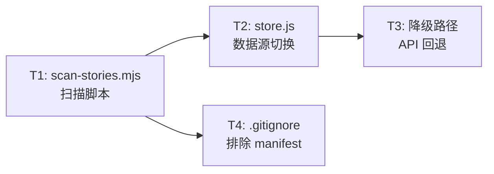
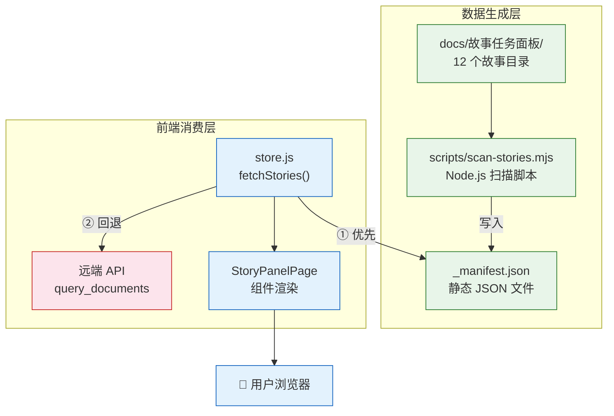
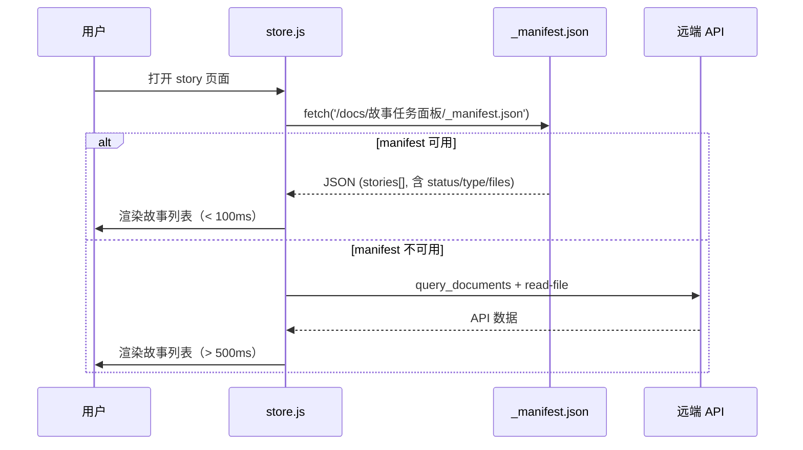
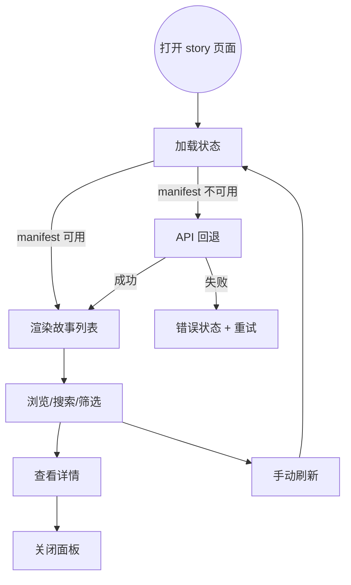

> | v1.0.0 | 2026-05-24 | deepseek-v4-pro | 🌿 feat/story-local-data | ⏱️ — | 📎 [CLAUDE.md](../../../CLAUDE.md) |

> **导航**: [← YiWeb-使用场景](./YiWeb-使用场景.md) · [YiWeb-测试设计 →](./YiWeb-测试设计.md) · [YiWeb-安全审计 →](./YiWeb-安全审计.md)

> **来源引用**: 源码 `src/views/story/hooks/store.js`、`scripts/scan-stories.mjs`（新建），证据等级 B。溯源至 [YiWeb-故事任务](./YiWeb-故事任务.md) §2 FP1–FP7 和 [YiWeb-使用场景](./YiWeb-使用场景.md) §2 场景 A–D。
>
> **项目类型**: 前端 — 跳过 §2 API 接口、§3 数据模型。

### 主要价值

- 🏗️ 梳理本地 manifest 的数据流：扫描脚本 → JSON 文件 → fetch → store → 组件渲染
- 📊 统一状态判定与类型推断逻辑，确保扫描脚本与前端 store 同源一致
- 🔄 明确 manifest 优先 + API 回退的降级架构
- 🛡️ 消除 Token 传输面：本地文件 fetch 无需认证头

---

## §0 设计决策与任务规划

### §0.0 基线溯源

| 本设计章节 | 实现 YiWeb-故事任务 | 服务 YiWeb-使用场景 | 覆盖状态 |
|-----------|-------------------|-------------------|---------|
| §1 系统架构 | FP1, FP5, FP6, FP7 | 场景 A, D | 已覆盖 |
| §4 组件与状态 | FP6, FP7 | 场景 A, B, C, D | 已覆盖 |
| §5 交互与样式 | — | 场景 B, C | 已覆盖 |
| §6 DOM·事件·依赖 | FP6 | 场景 A, C | 已覆盖 |
| §7 安全约束 | FP6, FP7 | 场景 A, D | 已覆盖 |
| §8 性能与限制 | FP6 | 场景 A, B | 已覆盖 |

### §0.1 设计决策

| 决策领域 | 选定方案 | 选择理由 | 详见 | 实现 FP# |
|---------|---------|---------|------|---------|
| 数据源 | 本地静态 JSON (`_manifest.json`) 优先，远端 API 降级 | 消除网络依赖，零 Token 加载；API 回退保证兼容性 | §1 | FP6, FP7 |
| Manifest 生成 | Node.js 脚本 `scripts/scan-stories.mjs` | 项目已有 Node.js 18 环境；同步文件 I/O 简单可靠 | §1 | FP1, FP5 |
| 状态判定 | 基于文件名存在性判定 6 种状态 | 与 store.js determineStatus 逻辑一致，保证迁移无缝 | §4 | FP2 |
| 类型推断 | 正则匹配技术评审文档内容关键词 | 与 store.js inferType 算法一致，扫描时完成推断 | §4 | FP3 |
| 降级架构 | try/catch 嵌套：manifest → API → error | 每一层失败静默回退，用户无感知 | §4.3 | FP7 |
| Git 管理 | manifest 不入库（`.gitignore` 排除） | 生成文件，每次 `node scripts/scan-stories.mjs` 重新生成 | §1 | FP5 |

### §0.2 任务规划



| ID | 描述 | 工作量 | 依赖 | 交付物 | Agent | 门禁 | 交接下游 | 实现 FP# |
|----|------|--------|------|--------|-------|------|---------|---------|
| T1 | 创建扫描脚本，实现目录遍历、状态判定、类型推断、JSON 生成 | L | 无 | `scripts/scan-stories.mjs` | coder | P0 审查 | T2 | FP1, FP2, FP3, FP4, FP5 |
| T2 | 改造 store.js fetchStories，优先 fetch manifest | M | T1 | `src/views/story/hooks/store.js` | coder | P0 审查 | T3 | FP6 |
| T3 | 保留远端 API 回退路径，封装 fetchFromApi | S | T2 | `src/views/story/hooks/store.js` | coder | P0 审查 | — | FP7 |
| T4 | 更新 .gitignore 排除生成文件 | S | T1 | `.gitignore` | coder | P0 审查 | — | FP5 |

---

## §1 系统架构

### 效果示意



### 1.1 服务/进程

| 变更类型 | 模块/文件 | 职责 |
|---------|----------|------|
| 新建 | `scripts/scan-stories.mjs` | 扫描 `docs/故事任务面板/`，生成 `_manifest.json` |
| 修改 | `src/views/story/hooks/store.js` | 新增 `fetchFromManifest()`，改造 `fetchStories()` 为 manifest 优先 |
| 修改 | `.gitignore` | 新增 `docs/故事任务面板/_manifest.json` |

### 1.2 组件树

无新增组件。现有组件（StoryPanelPage、StoryCard、StoryListTable、StoryDetailCard、StoryStatusBadge）不变，仅数据加载路径变化。

### 1.3 通信通道



| 通道 | 方向 | 协议 | Payload | 错误处理 |
|------|------|------|---------|---------|
| Store → Manifest | 单向请求 | HTTP GET | 无 | 404/网络错误 → catch → 回退 API |
| Store → API (回退) | 单向请求 | HTTPS POST JSON | `{module_name, method_name, parameters}` | catch → error ref 设置错误消息 |
| API → Store (回退) | 单向响应 | HTTPS | JSON 文档列表 + read-file 结果 | 解析失败 → 空数组 + 错误消息 |

---

## §4 组件与状态

### 4.1 组件接口

无变化。现有组件接口不变，store 内部数据获取路径变化对组件透明。

### 4.2 状态定义

| Store/State | 文件 | 状态字段 | 使用组件 |
|-------------|------|---------|---------|
| stories | `hooks/store.js` | `ref([])` — 故事对象数组 | StoryPanelPage, StoryCard, StoryListTable, StoryDetailCard |
| loading | `hooks/store.js` | `ref(false)` — 加载中标志 | StoryPanelPage, StoryListTable |
| error | `hooks/store.js` | `ref(null)` — 错误消息 | StoryPanelPage, StoryListTable |

**fetchStories 流程**:

```
fetchStories()
  ├── try: fetchFromManifest()
  │   └── GET /docs/故事任务面板/_manifest.json
  │       └── 成功 → stories.value = manifest.stories
  └── catch: fetchFromApi()  [回退]
      ├── POST query_documents (cname: sessions)
      ├── 客户端过滤 故事任务面板/ 路径
      └── inferTypesBatch (N+1 read-file)
          └── 构建结果 → stories.value = results
```

**状态判定**（扫描脚本与 store.js 一致）:

| 状态 | 条件 |
|------|------|
| `not_started` | 无 `{project}-故事任务.md` |
| `docs_in_progress` | 有故事任务，缺基线文档 |
| `docs_done` | 5 基线文档齐全，无实施报告 |
| `code_in_progress` | 有实施报告，无测试报告 |
| `code_done` | 有测试报告，无自改进复盘 |
| `self_improve` | 全部 8 文档齐全 |

**类型推断**（扫描脚本与 store.js 一致）:

| 关键词类别 | 匹配词 | 判定结果 |
|-----------|--------|---------|
| 前端关键词 | 组件, 交互, 样式, 前端, 页面, ui, frontend, 界面, 布局, 渲染, 响应式 | frontend |
| 后端关键词 | api, 数据, 后端, 服务端, 接口, 数据库, server, backend, 服务, 路由 | backend |
| 两端均命中 | — | fullstack |
| 均不命中 | — | meta |

### 4.3 状态流向

| 数据流 | 触发源 | 状态变更 | 消费方 |
|--------|--------|---------|--------|
| 页面加载 → manifest 加载 | `onMounted` → `store.fetchStories()` | loading → true → false, stories → [...] | StoryPanelPage → 所有子组件 |
| Manifest 不可用 → API 回退 | `fetchFromManifest()` catch | 内部重试 `fetchFromApi()` | 同上 |
| 手动刷新 | 用户点击刷新按钮 | 重新执行 `fetchStories()` | StoryPanelPage |

---

## §5 交互与样式

### 5.1 用户操作流



### 5.2 视图状态矩阵

| 视图 | 正常 | 加载 | 空 | 错误 |
|------|------|------|---|------|
| 故事列表 | 展示故事卡片/行 | 加载指示器 | 空状态提示 | 错误消息 + 重试按钮 |
| 详情面板 | 展示故事详情 | — | 文件清单为空 | — |
| 搜索 | 过滤结果 | — | "没有匹配的故事" | — |

无新增动画或样式变更。

---

## §6 DOM·事件·依赖

### 6.1 挂载点

无新增挂载点。现有组件挂载方式不变。

### 6.2 事件

| 事件 | 监听方式 | 处理逻辑 | 清理时机 |
|------|---------|---------|---------|
| 页面加载 | `onMounted` → `fetchStories()` | 优先 fetch manifest → 失败回退 API | — |
| 手动刷新 | `@click` on refresh button | 重新执行 `fetchStories()` | 组件销毁时自动清理 |

### 6.3 加载顺序

无变化。现有加载顺序不变。

### 6.4 命名空间

无新增命名空间。

---

## §7 安全约束

| # | 威胁 | 信任边界 | 缓解措施 | 优先级 |
|---|------|---------|---------|--------|
| 1 | Manifest 文件被恶意篡改，注入 XSS payload | 文件系统 → HTTP → 浏览器 | Vue 模板 `{{ }}` 自动转义 HTML；manifest 路径硬编码不可注入 | P0 |
| 2 | Manifest path 遍历攻击 | 浏览器 → web server | 路径硬编码为 `MANIFEST_PATH` 常量，不可由用户控制 | P0 |
| 3 | 降级路径中 API Token 泄露 | 浏览器 → 网络 | 降级仍使用 `authUtils.js` 统一认证，`credentials: 'omit'` | P1 |
| 4 | 扫描脚本读取非预期文件 | 脚本 → 文件系统 | 仅遍历 `PANEL_DIR` 目录，不跟随符号链接 | P1 |
| 5 | Manifest 未托管时无数据 | web server 配置 | 降级回退远端 API 保证可用性 | P1 |

---

## §8 性能与限制

| 维度 | 约束 | 应对 |
|------|------|------|
| 首屏渲染 | 本地静态 JSON，无网络延迟 | fetch manifest 通常 < 50ms（本地文件），远优于 API 调用 |
| 搜索过滤 | 客户端 O(n) 字符串匹配 | 数据量小（< 20 故事），实时过滤无延迟 |
| Manifest 大小 | 13 个故事的全量元数据 | 约 32KB（含文件清单），可在 < 10ms 内解析 |
| 扫描脚本耗时 | 同步文件 I/O，13 个目录 | 单次扫描 < 500ms，开发环境可忽略 |
| 降级路径性能 | 远端 API + N+1 read-file | 仅边缘情况触发；保留并发 worker 模式 |
| 限制 | manifest 需手动/管线触发重扫 | 不监听文件变更；rui 管线末端自动执行 |

---

## §9 评审清单

| # | 检查项 | 状态 |
|---|--------|------|
| 1 | 无硬编码密钥 | ✅ manifest 路径为常量，无 Token |
| 2 | 输入校验完整 | ✅ manifest path 硬编码，fetch URL 不可注入 |
| 3 | 基线溯源完备 | ✅ §0.0 全部映射 |
| 4 | 效果示意完整 | ✅ §1 含 mermaid 架构全景图 |
| 5 | 裁剪正确（前端跳过 §2 API, §3 数据模型） | ✅ |
| 6 | 降级路径可用 | ✅ manifest → API 三级回退 |
| 7 | 状态判定与 store.js 一致 | ✅ 同源算法 |
| 8 | 类型推断与 store.js 一致 | ✅ 同源关键词 |
| 9 | 组件无侵入 | ✅ 现有组件不变 |
| 10 | Git 管理合规 | ✅ manifest 不入库 |

---

> **变更记录**
> | 日期 | 变更 | 触发 | 证据 |
> |------|------|------|------|
> | 2026-05-24 | 初始生成 | /rui story 页面只需要故事任务面板下的数据即可 | store.js + scan-stories.mjs |
> | 2026-05-24 | 对齐 formulas.md — 补充 §0.1 设计决策、§0.2 任务规划、§8 性能与限制、§9 评审清单 | /rui 使用新的文档标准重写 docs | formulas.md F.story.technical-review |
