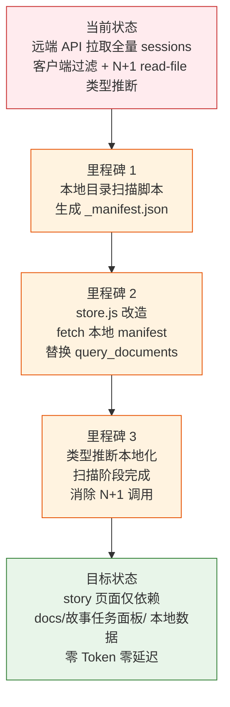

> | v1.0.0 | 2026-05-24 | deepseek-v4-pro | 🌿 feat/story-local-data | ⏱️ — | 📎 [CLAUDE.md](../../../CLAUDE.md) |

> **导航**: [YiWeb-使用场景 →](./YiWeb-使用场景.md)

> **来源引用**: `/rui story 页面只需要故事任务面板下的数据即可`，用户需求。

### 需求概述

Story 页面当前通过远端 API (`query_documents` + `read-file`) 获取故事面板数据。改为本地目录扫描生成 `_manifest.json`，前端直接 fetch 静态 JSON，消除远端 API 依赖，实现零网络延迟的故事面板加载。

### 效果示意

### 主要价值

- 🚀 零远端依赖 — story 页面无需 API Token 即可工作
- ⚡ 即时加载 — 本地静态 JSON，无网络延迟，首屏 < 200ms
- 🔒 隐私安全 — 故事面板数据不出本地，消除 Token 传输面
- 🧹 架构简化 — 移除 N+1 read-file 类型推断调用，单一 fetch 完成

---

## §0 基线声明

> **问题空间基线 (Problem Space Baseline)**: 本文档定义"做什么(WHAT)"和"为什么(WHY)"。所有后续文档(03-09)的设计、实现、验证、改进决策均必须可追溯至本文档的具体章节。

---

## §1 Story

### Story 1: 本地清单生成

| 字段 | 内容 |
|------|------|
| 作为 | 管线 |
| 我想要 | 扫描 `docs/故事任务面板/` 生成结构化 JSON 清单 |
| 以便 | 前端无需远端 API 即可获取故事面板数据 |
| 优先级 | P0 |
| 范围边界 | Node.js 脚本，读取本地文件系统，写入 `_manifest.json` |
| 依赖 | Node.js >= 18，文件系统读取权限 |

#### 范围外

- 不涉及远端 API 调用
- 不监听文件变更（按需手动运行）

##### §1.1 User Operations

| # | 操作 | 触发条件 | 操作步骤 | 预期结果 |
|---|------|---------|---------|---------|
| 1 | 运行扫描脚本 | rui 管线末端或开发者手动触发 | 终端执行 `node scripts/scan-stories.mjs` → 扫描 `docs/故事任务面板/` 所有子目录 → 提取每个故事的元数据、文件清单、状态、类型 | 生成 `_manifest.json`，stories 数组包含所有故事的完整结构化数据 |
| 2 | 空目录扫描 | `docs/故事任务面板/` 下无任何故事目录 | 运行扫描脚本 → 遍历空目录 | 生成 manifest，story_count=0，stories 为空数组 |
| 3 | 重新扫描同步 | 新增或删除故事目录后 | 重新运行扫描脚本 → 全量扫描 | manifest 反映最新状态，新增故事出现，已删除故事消失 |

---

### Story 2: store 数据源切换

| 字段 | 内容 |
|------|------|
| 作为 | story 页面 |
| 我想要 | 从本地 `_manifest.json` 加载故事面板数据 |
| 以便 | 消除远端 API 依赖，实现零网络延迟 |
| 优先级 | P0 |
| 范围边界 | 修改 store.js 的 fetchStories 方法，优先 fetch manifest，保留 API 回退 |
| 依赖 | Story 1（manifest 文件存在） |

#### 范围外

- 不修改组件层代码（故事列表、详情面板等）
- 不改动 manifest 数据结构

##### §1.1 User Operations

| # | 操作 | 触发条件 | 操作步骤 | 预期结果 |
|---|------|---------|---------|---------|
| 1 | 正常加载 | 用户打开 story 页面，`_manifest.json` 可访问 | 页面加载 → fetch manifest → 解析 JSON → 渲染故事列表 | 故事列表正常展示，状态徽章和类型标签正确 |
| 2 | 降级回退 | `_manifest.json` 不可访问（404/网络错误） | 页面加载 → fetch manifest 失败 → 自动回退远端 API | 故事列表从远端 API 加载，功能正常但略慢 |
| 3 | 全部失败 | manifest 不可访问 + 远端 API 不可用 | 页面加载 → 两种方式均失败 | 显示错误状态，提供重试按钮 |

---

### Story 3: 类型推断本地化

| 字段 | 内容 |
|------|------|
| 作为 | 管线 |
| 我想要 | 在扫描阶段完成类型推断，写入 manifest |
| 以便 | 前端无需 N+1 read-file 调用，一次 fetch 获取全部数据 |
| 优先级 | P0 |
| 范围边界 | 扫描脚本内完成，读取技术评审文档内容，正则匹配判定类型 |
| 依赖 | Story 1 |

#### 范围外

- 不修改类型推断算法（与 store.js 现有逻辑一致）
- 不引入新的类型推断关键词

##### §1.1 User Operations

| # | 操作 | 触发条件 | 操作步骤 | 预期结果 |
|---|------|---------|---------|---------|
| 1 | 类型推断执行 | 扫描脚本运行，故事有技术评审文档 | 读取 `{project}-技术评审.md` → 正则匹配前后端关键词 → 判定类型 | manifest 中该故事 type 字段为 frontend/backend/fullstack/meta |
| 2 | 无技术评审文档 | 故事目录缺少技术评审文档 | 跳过类型推断 → 使用默认值 | manifest 中 type 为 "meta" |
| 3 | 技术评审为空 | 技术评审文档存在但无匹配关键词 | 正则匹配为空 → 判定为 meta | manifest 中 type 为 "meta" |

---

## §2 Requirements

### 功能点

| FP# | 描述 | 输入 | 输出 | 错误行为 | 优先级 |
|-----|------|------|------|---------|--------|
| FP1 | 目录扫描 — 递归遍历 `docs/故事任务面板/`，提取每个子目录的文件清单与元数据 | 文件系统路径 | 结构化故事对象数组 | 目录不可读时进程 exit code ≠ 0，输出错误信息 | P0 |
| FP2 | 状态判定 — 基于本地文件存在性判定 6 种状态（not_started/docs_in_progress/docs_done/code_in_progress/code_done/self_improve） | 故事目录下的文件名列表 | 状态字符串 + 下一步行动文本 | 无故事任务文档时判定为 not_started | P0 |
| FP3 | 类型推断 — 读取技术评审内容，正则匹配前后端关键词判定 frontend/backend/fullstack/meta | 技术评审文档文本 | 类型字符串 | 无文档或无匹配时返回 meta | P0 |
| FP4 | 描述提取 — 从故事任务文档中提取需求概述作为故事描述 | 故事任务文档文本 | 描述字符串 | 提取失败时默认为空字符串 | P1 |
| FP5 | Manifest 写入 — 将结构化数据写入 `docs/故事任务面板/_manifest.json` | 故事对象数组 | JSON 文件 | 写入失败时进程 exit code ≠ 0 | P0 |
| FP6 | Store 改造 — `fetchStories` 改为优先 fetch `_manifest.json`，移除 `query_documents` + `read-file` 调用 | 页面加载事件 | 渲染故事列表 | manifest 不可用时回退远端 API | P0 |
| FP7 | 降级兼容 — 本地 manifest 不可用时自动回退远端 API（保留原 fetchFromApi 路径） | manifest fetch 异常 | API 数据或错误信息 | API 也失败时显示错误状态 | P1 |

### 业务规则

| R# | 描述 | 校验方式 | 证据级别 |
|----|------|---------|---------|
| R1 | manifest 由 `node scripts/scan-stories.mjs` 生成，不手工编辑 | `.gitignore` 排除 `_manifest.json`；文件头 `generated_by` 字段 | B |
| R2 | manifest 中的状态判定逻辑与 store.js 中的 determineStatus 一致 | 代码审查对照 `scripts/scan-stories.mjs` 与 `src/views/story/hooks/store.js` 判定函数 | B |
| R3 | 前端仅 fetch manifest，不发起任何 `query_documents` 或 `read-file` 远端调用（降级路径除外） | 审查 store.js 正常路径网络请求 | B |
| R4 | 类型推断逻辑在扫描脚本中完成，与 store.js inferType 关键词一致 | 对照两份源码中的关键词列表 | B |

### 数据约束

| 约束 | 类型 | 范围/格式 | 来源 |
|------|------|----------|------|
| 故事名称 | string | `^[a-z0-9]+(-[a-z0-9]+)*$` (kebab-case) | 目录名 |
| 故事状态 | enum | `not_started` / `docs_in_progress` / `docs_done` / `code_in_progress` / `code_done` / `self_improve` | store.js determineStatus() |
| 项目类型 | enum | `frontend` / `backend` / `fullstack` / `meta` | store.js inferType() |
| 项目名前缀 | string | `YiWeb-` | PROJECT_PREFIX |
| Manifest 路径 | string | `docs/故事任务面板/_manifest.json` | 硬编码常量 |
| 扫描脚本路径 | string | `scripts/scan-stories.mjs` | 硬编码常量 |
| 运行时 | enum | Node.js >= 18 | 使用 fs/path 模块 |

---

## §3 成功标准

| SC# | 描述 | 度量方式 | 目标值 | 优先级 | 关联 FP# |
|-----|------|---------|--------|--------|---------|
| SC1 | Story 页面加载时无远端 API 调用（manifest 可用情况下） | Chrome DevTools Network 面板观察 | 0 次 query_documents / read-file 请求 | P0 | FP6 |
| SC2 | manifest 扫描覆盖全部故事目录，数据完整 | 运行扫描脚本后检查 story_count 与实际目录数一致 | 100% | P0 | FP1, FP2, FP3, FP4 |
| SC3 | 用户打开页面后故事列表在 1 秒内完成渲染 | 页面加载到首屏故事渲染的时间 | < 1s | P0 | FP6 |
| SC4 | Manifest 不可用时用户仍能看到故事列表（降级） | 模拟 manifest 404，观察页面是否回退 API 加载 | 正常展示故事列表 | P1 | FP7 |
| SC5 | 新增故事目录后重新扫描即可在页面中看到 | 新增目录 → 运行扫描 → 刷新页面 | 新故事出现在列表中 | P1 | FP1, FP5 |

---

## §4 范围边界

### 范围内

| # | 条目 | 关联 FP# | 边界说明 |
|---|------|---------|---------|
| 1 | 本地扫描脚本 | FP1, FP2, FP3, FP4, FP5 | Node.js 脚本，扫描 `docs/故事任务面板/` 生成 `_manifest.json` |
| 2 | 状态判定与类型推断 | FP2, FP3 | 在扫描阶段完成，写入 manifest |
| 3 | Store 数据源切换 | FP6 | fetchStories 优先 fetch manifest |
| 4 | 降级回退机制 | FP7 | manifest 不可用时回退远端 API |
| 5 | 手动刷新 | — | Story 页面提供手动刷新按钮，重新 fetch manifest |

### 范围外

| # | 条目 | 排除原因 | 替代方案 |
|---|------|---------|---------|
| 1 | 后端 API 改造 | 不需要 — 直接读取本地文件 | `node scripts/scan-stories.mjs` |
| 2 | 远端数据同步 | 属于 rui-import 的职责 | `/rui` 管线末端自动执行 |
| 3 | 其他视图改造 | aicr/claude 视图不变 | 仅 story 视图改造 |
| 4 | 文件监听自动重扫 | 故事变更频率低，手动/管线触发足够 | rui 管线末端自动运行扫描脚本 |
| 5 | manifest 的 git 提交 | 生成文件，不应入库 | `.gitignore` 中排除 |

---

## §5 AC

| AC# | Given | When | Then | 门禁 |
|-----|-------|------|------|------|
| AC1 | 本地 `docs/故事任务面板/` 有故事目录 | 运行 `node scripts/scan-stories.mjs` | 生成 `_manifest.json`，stories 数组非空，每个 story 含 name/status/type/files | Gate A |
| AC2 | `_manifest.json` 被 web server 正常托管 | 打开 story 页面 | 故事列表正常展示，状态徽章和类型标签正确 | Gate A |
| AC3 | `_manifest.json` 不存在（HTTP 404） | 打开 story 页面 | store 回退到远端 API；API 可用则功能正常，API 不可用则显示错误状态 | Gate A |
| AC4 | 新增或删除故事目录后 | 重新运行扫描脚本 + 刷新页面 | manifest 和页面展示反映最新状态 | Gate B |

---

## §6 风险与假设

| # | 风险/假设 | 类型 | 可能性 | 影响 | 缓解/验证策略 | 关联 FP# |
|---|----------|------|--------|------|-------------|---------|
| 1 | manifest 与实际文件状态不同步 | 风险 | M | M | rui 管线末端自动重扫；story 页面提供手动刷新按钮 | FP1 |
| 2 | `docs/` 目录不被 web server 静态托管导致 manifest 无法 fetch | 风险 | L | H | 验证 web server 配置；降级回退远端 API | FP6, FP7 |
| 3 | 大型项目故事数量多导致 manifest JSON 过大 | 风险 | L | L | 单故事元数据 KB 级，100 个故事 < 100KB | FP1 |
| 4 | 扫描脚本跨平台兼容性（Windows 路径分隔符） | 风险 | L | L | 使用 `path.join` / `path.basename` 跨平台 API | FP1 |
| 5 | 降级路径（远端 API）的 N+1 read-file 调用影响性能 | 风险 | L | M | 降级是边缘情况；保持并发 worker 模式 | FP7 |
| 6 | Web server 正确托管 `docs/` 目录且无认证拦截 | 假设 | — | — | fetch manifest 使用 `credentials: 'omit'`，无认证头 | FP6 |
| 7 | 项目前缀 `YiWeb-` 固定不变 | 假设 | — | — | 扫描脚本常量，变更时需同步更新 | FP2 |

---

## §7 跨文档索引

| 本文档章节 | 基线内容 | 下游文档编号 | 预期覆盖 | 状态 |
|-----------|---------|-------------|---------|------|
| §1 Story 1–3 | 故事拆分与用户操作 | YiWeb-使用场景 | 4 个场景的详细用户旅程 | 已对齐 |
| §1 Story 1–3 | 故事拆分与用户操作 | YiWeb-技术评审 | 扫描脚本架构、store 数据流、类型推断算法 | 已对齐 |
| §2 FP1–FP7 | 功能点清单 | YiWeb-测试设计 | 每个 FP 至少 1 个测试用例 | 已对齐 |
| §2 FP1–FP7 | 功能点清单 | YiWeb-安全审计 | 文件系统访问、manifest 传输、降级路径的安全分析 | 已对齐 |
| §3 SC1–SC5 | 成功标准 | YiWeb-实施报告 | 每项成功标准的达成验证 | 待生成 |
| §3 SC1–SC5 | 成功标准 | YiWeb-测试报告 | 冒烟与回归测试覆盖全部 SC | 待生成 |
| §5 AC1–AC4 | 验收标准 | YiWeb-测试设计 | 每条 AC 映射到具体测试用例 | 已对齐 |
| §5 AC1–AC4 | 验收标准 | YiWeb-测试报告 | 每条 AC 的执行结果 | 待生成 |
| §6 R1–R7 | 风险与假设 | YiWeb-自改进复盘 | 风险实际触发情况与缓解效果 | 待生成 |

---

## §L 自改进循环

> 待首次管线执行完成后追加。

---

## §R 关联故事

| 关联故事 | 关系类型 | 说明 |
|---------|---------|------|
| rui-story | 消费方 | story 页面视图本身，消费 manifest 数据展示故事面板 |
| enhance-search-filter | 并行改进 | 搜索筛选功能增强，与本故事共享 store.js 数据加载路径 |
| aicr | 下游依赖 | AICR 页面通过 onFileClick 跳转，文件路径来源自 manifest |

---

> **变更记录**
> | 日期 | 变更 | 触发 | 证据 |
> |------|------|------|------|
> | 2026-05-24 | 初始生成 | /rui story 页面只需要故事任务面板下的数据即可 | 用户需求 |
> | 2026-05-24 | 对齐 formulas.md 标准 — 补充 §0 基线声明、§1.1 User Operations、§2 数据约束、§7 跨文档索引、§R 关联故事、§L 自改进循环 | /rui 使用新的文档标准重写 docs | formulas.md F.story.task |
