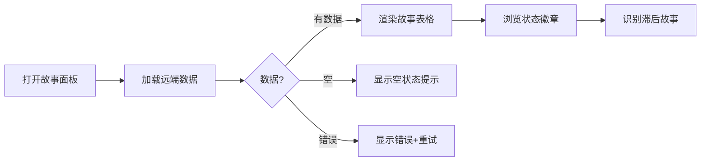
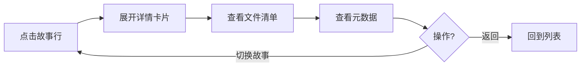

> | v1.0.0 | 2026-05-22 | deepseek-v4-pro | 🌿 feat/story | ⏱️ — | 📎 [CLAUDE.md](../../../CLAUDE.md) |

> **导航**: [← YiWeb-故事任务](./YiWeb-故事任务.md) · [YiWeb-技术评审 →](./YiWeb-技术评审.md)

> **来源引用**: 基于 [YiWeb-故事任务](./YiWeb-故事任务.md) §1 Story 1–3。

---

### 主要价值

- 🎯 两种核心用户旅程 — 进度总览 + 详情深入
- 🔒 异常覆盖 — 加载失败/空数据/网络错误
- ⚡ 每场景含 mermaid 流程图
- 📊 场景覆盖矩阵溯源至 FP#

---

## §1 使用场景

### 场景 1: 管理者查看项目整体进度

**角色**: 项目管理者
**目标**: 打开面板快速了解所有故事的开发进度

| 步骤 | 操作 | 预期 |
|------|------|------|
| 1 | 打开面板 | 加载中状态显示 |
| 2 | 数据返回 | 表格渲染，每行含故事名/状态/类型/文件数/更新时间 |
| 3 | 查看状态 | 6 种状态徽章用不同颜色区分 |
| 4 | 识别问题 | self_improve 状态的故事表示持续改进中 |

**空状态**: 无故事时显示引导提示
**错误恢复**: 加载失败显示重试按钮

---

### 场景 2: 管理者查看故事详情

**角色**: 项目管理者
**目标**: 深入了解特定故事的文档完整度

**空状态**: 故事无文件时显示"文档为空"
**错误恢复**: 详情加载失败时显示错误占位

---

## §2 场景覆盖矩阵

| 场景 | 关联 FP# | 关联 AC# | 正常 | 空状态 | 异常 |
|------|---------|---------|:--:|:--:|:--:|
| 场景 1: 进度总览 | FP1–FP4 | AC1, AC2 | ✅ | ✅ | ✅ |
| 场景 2: 故事详情 | FP5, FP6 | AC3, AC4 | ✅ | ✅ | ✅ |

---

> **变更记录**
> | 日期 | 变更 | 触发 | 证据 |
> |------|------|------|------|
> | 2026-05-22 | 初始生成 | /rui doc --from-code story | YiWeb-故事任务 §1 |
