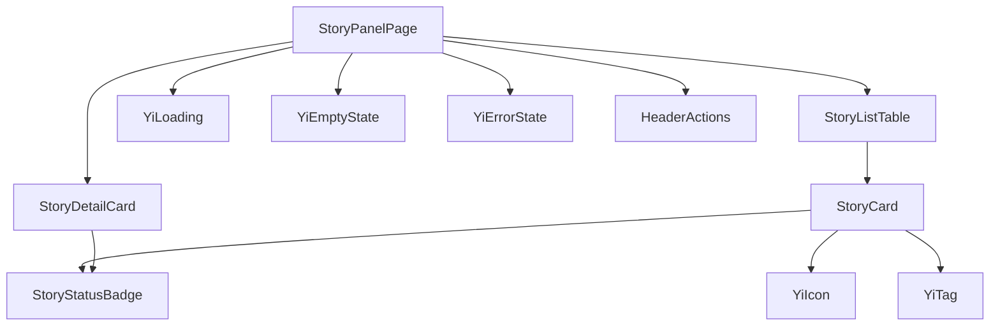
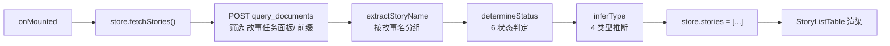

> | v1.0.0 | 2026-05-22 | deepseek-v4-pro | 🌿 feat/story | ⏱️ — | 📎 [CLAUDE.md](../../../CLAUDE.md) |

> **导航**: [← YiWeb-使用场景](./YiWeb-使用场景.md) · [YiWeb-测试设计 →](./YiWeb-测试设计.md) · [YiWeb-安全审计 →](./YiWeb-安全审计.md)

> **来源引用**: 从 `src/views/story/` 源码只读分析生成。

---

### 主要价值

- 🎯 组件架构清晰 — 3 个业务组件 + 7 个通用组件的依赖关系
- 🔒 状态判定引擎 — 6 状态判定逻辑完整文档化
- ⚡ 数据流透明 — 从远端 API 到视图渲染的全链路
- 📊 证据路径可追溯 — 每断言附源码行号

---

## §0 基线溯源

| 溯源目标 | 本文档章节 |
|---------|-----------|
| FP1: 远端查询 | §2 数据流 |
| FP2: 状态判定 | §3 状态判定引擎 |
| FP3: 类型推断 | §3 |
| FP4: 列表表格 | §1 组件树 |

---

## §1 组件树

| 组件 | 来源 | 职责 |
|------|------|------|
| StoryPanelPage | `components/storyPanelPage/` | 根页面，列表/详情切换 |
| StoryListTable | `components/storyListTable/` | 故事表格渲染 |
| StoryCard | `components/storyCard/` | 单行故事卡片 |
| StoryStatusBadge | `components/storyStatusBadge/` | 6 状态徽章 |
| StoryDetailCard | `components/storyDetailCard/` | 故事详情卡片 |

---

## §2 数据流

> 证据: `src/views/story/hooks/store.js:30–50`

---

## §3 状态判定引擎

> 证据: `src/views/story/hooks/store.js:30–49`

| 状态 | 条件 | 含义 |
|------|------|------|
| `not_started` | 无 {project}-故事任务.md | 未开始 |
| `docs_in_progress` | 故事任务存在，基线不完整 | 文档生成中 |
| `docs_done` | 基线完整，无实施报告 | 文档就绪 |
| `code_in_progress` | 有实施报告，无测试报告 | 编码中 |
| `code_done` | 有测试报告，无自改进复盘 | 编码完成 |
| `self_improve` | 全部文档齐全 | 自改进中 |

**基线文档**: 使用场景、技术评审、测试设计、安全审计（4 个）
**项目前缀**: `YiWeb-`（从 `window.PROJECT_NAME` 或默认值读取）

---

## §4 并发类型推断

> 证据: `src/views/story/hooks/store.js:16` TYPE_CONCURRENCY = 4

类型推断并发读取远端技术评审文档内容，检查 API/数据章节（判定 backend）和组件/状态/交互章节（判定 frontend）。

| 类型 | 判定条件 |
|------|---------|
| backend | 技术评审含 API 设计或数据模型章节 |
| frontend | 技术评审含组件设计或状态管理章节 |
| fullstack | 同时含前后端章节 |
| meta | 均不含或无法判定 |

---

> **变更记录**
> | 日期 | 变更 | 触发 | 证据 |
> |------|------|------|------|
> | 2026-05-22 | 初始生成 | /rui doc --from-code story | src/views/story/ |
