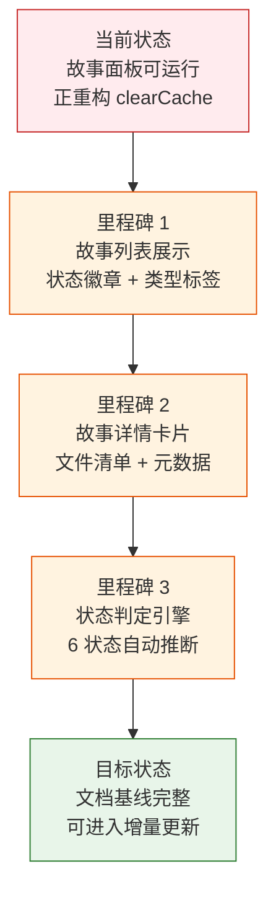

> | v1.0.0 | 2026-05-22 | deepseek-v4-pro | 🌿 feat/story | ⏱️ — | 📎 [CLAUDE.md](../../../CLAUDE.md) |

> **导航**: [YiWeb-使用场景 →](./YiWeb-使用场景.md)

> **来源引用**: 从 `src/views/story/` 源码反推生成，证据 Level B + 源码路径。`/rui doc --from-code story`。

---

### §0 基线声明

> **问题空间基线**: 本文档定义"做什么(WHAT)"和"为什么(WHY)"。

---

### 需求概述

提供一个故事任务面板仪表板。用户可以查看所有故事的状态概览、按状态和类型筛选故事、点击故事查看详细信息和文件清单。面板通过远端 API 获取故事数据，自动判定每个故事的进度状态（未开始/文档中/文档完成/编码中/编码完成/自改进）。

### 效果示意

### 主要价值

- 🎯 故事进度一目了然 — 状态徽章 + 类型标签 + 文件数统计
- 🔒 自动状态判定 — 基于远端文档存在性，无需手动维护状态
- ⚡ 远端数据源 — 查询远端 API，不读本地文件系统
- 📊 详情卡片 — 单故事文件清单/状态/类型/分支完整展示

---

## §1 Story

### Story 1: 故事列表展示

| 字段 | 内容 |
|------|------|
| 作为 | 项目管理者 |
| 我想要 | 查看所有故事的进度表格，含状态/类型/文件数/最后修改 |
| 以便 | 快速了解项目整体进度 |
| 优先级 | P0 |
| 范围边界 | 故事列表查询 + 表格渲染 + 状态徽章 + 类型标签 |

### Story 2: 故事详情查看

| 字段 | 内容 |
|------|------|
| 作为 | 项目管理者 |
| 我想要 | 点击故事查看详细信息，包含文件清单和元数据 |
| 以便 | 深入了解特定故事的文档完整度 |
| 优先级 | P0 |
| 范围边界 | 详情卡片 + 文件清单 + 元数据展示 |
| 依赖 | Story 1 |

### Story 3: 状态自动判定

| 字段 | 内容 |
|------|------|
| 作为 | 系统 |
| 我想要 | 根据远端文档存在性自动判定故事状态 |
| 以便 | 无需人工维护状态标记 |
| 优先级 | P0 |
| 范围边界 | 6 状态判定逻辑 + 项目类型推断 |

---

## §2 Requirements

### 功能点

| FP# | 描述 | 优先级 |
|-----|------|--------|
| FP1 | 远端故事查询 — 从 API 获取故事面板数据 | P0 |
| FP2 | 状态判定 — 6 状态自动推断（not_started/docs_in_progress/docs_done/code_in_progress/code_done/self_improve） | P0 |
| FP3 | 类型推断 — 从技术评审内容推断项目类型（frontend/backend/fullstack/meta） | P0 |
| FP4 | 故事列表表格 — 展示故事名/状态/类型/文件数/更新时间 | P0 |
| FP5 | 故事详情卡片 — 文件清单 + 元数据展示 | P0 |
| FP6 | 返回导航 — 从详情返回列表 | P1 |

### 业务规则

| R# | 描述 |
|----|------|
| R1 | 状态判定基于 `{project}-` 前缀文档的存在性 |
| R2 | 类型推断通过读取远端技术评审文档内容 |
| R3 | 数据源为远端 API，不读本地文件系统 |

---

## §3 成功标准

| SC# | 描述 | 目标值 |
|-----|------|--------|
| SC1 | 故事列表在页面加载后 3 秒内展示 | < 3 秒 |
| SC2 | 状态判定准确率 100% | 100% |
| SC3 | 详情卡片切换响应 < 200ms | < 200ms |

---

## §4 范围边界

**范围内**: 故事列表展示 / 状态判定 / 详情卡片 / 类型推断
**范围外**: 故事创建/编辑（那是 /rui doc 的职责）、代码修改（那是 /rui code 的职责）

---

## §5 AC

| AC# | Given | When | Then |
|-----|-------|------|------|
| AC1 | 用户打开故事面板 | 页面加载完成 | 故事列表从远端加载，每个故事显示状态徽章和类型标签 |
| AC2 | 远端有多个故事 | 状态判定引擎运行 | 每个故事被正确分类为 6 种状态之一 |
| AC3 | 用户点击一个故事 | 故事被选中 | 详情卡片展示，含文件清单/状态/类型/元数据 |
| AC4 | 用户在详情页 | 点击返回按钮 | 返回列表视图 |

---

## §6 风险与假设

| # | 风险 | 缓解 |
|---|------|------|
| 1 | 当前重构中（clearCache 提取），文档可能略有过时 | 重构完成后通过 /rui update story 刷新 |

**产出**: `docs/故事任务面板/story/YiWeb-{故事任务,使用场景,技术评审,测试设计,安全审计}.md`

---

> **变更记录**
> | 日期 | 变更 | 触发 | 证据 |
> |------|------|------|------|
> | 2026-05-22 | 初始生成 — 源码反推 | /rui doc --from-code story | src/views/story/ 源码 |
