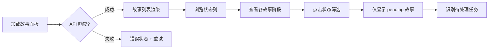

# 使用场景

> | v1.0.0 | 2026-05-26 | deepseek-v4-pro | 📎 [CLAUDE.md](../../../CLAUDE.md) |

> **来源引用**：基于 [故事任务](./故事任务.md) §1 Story 1–2。

---

### 主要价值

- 🎯 覆盖项目管理者、开发者两种角色
- 🔒 视图切换 + 筛选排序全路径
- ⚡ 与 aicr/claude 面板统一的交互模式

---

## §1 使用场景

### 场景 1: 项目管理者查看全局进度

**角色**: 项目管理者
**目标**: 查看所有故事的状态分布，识别阻塞项

| 步骤 | 操作 | 预期结果 |
|------|------|---------|
| 1 | 打开故事面板 | 故事列表加载展示 |
| 2 | 查看状态标签 | 每个故事显示当前阶段 |
| 3 | 筛选 pending 故事 | 列表仅显示待处理故事 |
| 4 | 点击故事 | 详情卡片展示 |

---

### 场景 2: 开发者查找特定故事

**角色**: 开发者
**目标**: 通过搜索和筛选快速定位目标故事

| 步骤 | 操作 | 预期结果 |
|------|------|---------|
| 1 | 搜索框输入"aicr" | 仅显示名称含 aicr 的故事 |
| 2 | 点击类型"前端"标签 | 进一步缩小到前端类型 |
| 3 | 点击列头按名称排序 | 列表按名称升序/降序切换 |
| 4 | 点击目标故事 | 详情卡片展示 |

---

### 场景 3: 切换视图浏览

**角色**: 项目管理者
**目标**: 在不同视图模式间切换以适应不同场景

---

## §2 场景覆盖矩阵

| 场景 | 关联 FP# | 关联 AC# | 正常路径 | 空状态 | 错误恢复 |
|------|---------|---------|:--:|:--:|:--:|
| 场景 1: 全局进度 | FP1, FP6 | AC1, AC4 | ✅ | ✅ | ✅ |
| 场景 2: 搜索定位 | FP5, FP7, FP8 | AC3, AC5, AC6, AC7 | ✅ | ✅ | ✅ |
| 场景 3: 视图切换 | FP3, FP4 | AC1 | ✅ | ✅ | — |

---

> **变更记录**
> | 日期 | 变更 | 触发 | 证据 |
> |------|------|------|------|
> | 2026-05-26 | 基线化 | 源码分析 | src/views/story/ |
