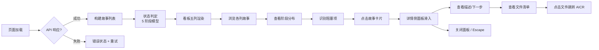
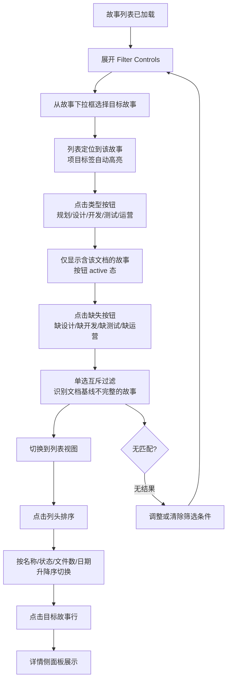
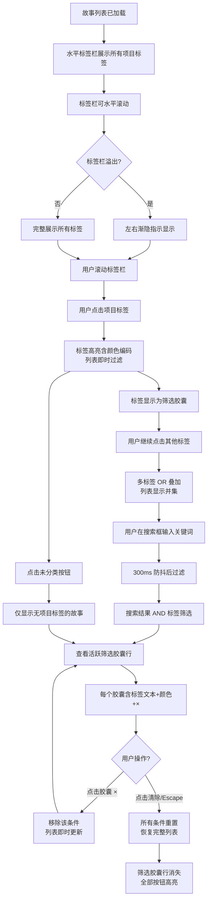

# 使用场景

> | v3.0.0 | 2026-05-27 | deepseek-v4-pro | 📎 [CLAUDE.md](../../../CLAUDE.md) |

> **导航**: [← 故事任务](./故事任务.md) · [技术评审 →](./技术评审.md)
>
> **来源引用**：基于 [故事任务](./故事任务.md) §1 Story 1–3。

---

[§1 使用场景](#s-1-使用场景) · [场景 1](#场景-1-项目管理者查看全局进度) · [场景 2](#场景-2-开发者搜索定位故事) · [场景 3](#场景-3-浏览模式切换) · [场景 4](#场景-4-通过标签栏与关键词快速定位)

## 概述

描述两种用户角色在故事面板中的四种典型使用场景，每场景包含 mermaid 流程图与操作步骤表，覆盖正常路径、空状态与异常恢复。

### 主要价值

- 🎯 覆盖两种用户角色 — 项目管理者、开发者，四种使用场景与故事任务一一对应
- 🔒 异常路径可见 — 每场景含 API 失败、空状态、错误恢复
- ⚡ 交互链路清晰 — 每场景含 mermaid 流程图

---

## §1 使用场景

### 场景 1: 项目管理者查看全局进度

**角色**: 项目管理者
**目标**: 查看所有故事的状态分布，识别阻塞项和文档缺失
🏗️ 技术评审: [场景 1 全维度技术方案](./技术评审.md#s-1-场景-1-项目管理者查看全局进度) — 数据流 · 布局线框 · 模块 · 测试用例

| 步骤 | 操作 | 预期结果 |
|------|------|---------|
| 1 | 打开故事面板 | 故事列表从远端加载，以看板视图展示 |
| 2 | 查看看板列标题 | 五列显示规划/设计/开发/测试/运营及各自计数 |
| 3 | 浏览"规划"列 | 查看所有处于规划阶段的故事卡片 |
| 4 | 发现文档缺失 | 卡片阶段进度条显示不完整（如 1/5 文档） |
| 5 | 点击目标故事卡片 | 详情侧面板从右侧滑入 |
| 6 | 查看故事描述 | 了解故事目标和当前状态 |
| 7 | 查看下一步行动 | 根据阶段获取建议的下一步操作 |
| 8 | 查看文件清单 | 按项目标签分组的文档列表 |
| 9 | 点击文档文件 | 跳转到 AICR 审查面板查看文档内容 |
| 10 | 按 Escape 关闭面板 | 侧面板滑出，回到看板视图 |

---

### 场景 2: 开发者使用 Filter Controls 精细筛选

**角色**: 开发者
**目标**: 通过 Filter Controls 面板按故事名称、文档类型和缺失状态筛选故事，配合列排序组织结果
🏗️ 技术评审: [场景 2 全维度技术方案](./技术评审.md#s-2-场景-2-开发者搜索定位故事) — 数据流 · 布局线框 · 模块 · 测试用例

| 步骤 | 操作 | 预期结果 |
|------|------|---------|
| 1 | 展开 Filter Controls 面板 | 3 组筛选控件显示：故事下拉框 / 类型按钮组 / 缺失按钮组，含实时计数 |
| 2 | 从故事下拉框选择"story" | 列表精确定位到 story 故事；项目标签区同步高亮 |
| 3 | 点击类型按钮"实施报告" | 进一步缩小到已包含实施报告的故事；按钮 active 态 |
| 4 | 点击缺失按钮"测试报告" | 再过滤出缺少测试报告的故事（单选互斥，切换至该过滤） |
| 5 | 切换到列表视图 | 故事以表格形式展示 |
| 6 | 点击"最后修改"列头 | 列表按最后修改日期降序排列；排序箭头 ↓ 指示 |
| 7 | 再次点击"最后修改"列头 | 排序方向反转为升序；箭头变为 ↑ |
| 8 | 点击目标故事行 | 详情侧面板展示故事完整信息 |
| 9 | 折叠 Filter Controls | 3 组控件隐藏，仅显示展开按钮；筛选条件保持 |
| 10 | 点击清除或按 Escape | 所有 Filter Controls 条件重置，恢复完整列表 |

---

### 场景 3: 浏览模式切换

**角色**: 项目管理者
**目标**: 在不同视图模式间切换以适应不同浏览场景
🏗️ 技术评审: [场景 3 全维度技术方案](./技术评审.md#s-3-场景-3-浏览模式切换) — 数据流 · 布局线框 · 模块 · 测试用例

| 步骤 | 操作 | 预期结果 |
|------|------|---------|
| 1 | 默认看板视图加载 | 故事按五阶段分列展示，每列含故事卡片 |
| 2 | 点击"卡片"视图按钮 | 切换为网格卡片布局，故事以卡片形式排列 |
| 3 | 在卡片视图中搜索 | 搜索结果实时过滤，卡片网格更新 |
| 4 | 点击"列表"视图按钮 | 切换为表格布局，展示名称/状态/标签/阶段/文件数/日期 |
| 5 | 在列表视图中点击列头排序 | 列表按选中列重排，排序箭头指示方向 |
| 6 | 点击"看板"视图按钮 | 切换回看板布局，筛选条件保持 |

---

### 场景 4: 通过标签栏与关键词快速定位

**角色**: 项目管理者
**目标**: 通过项目标签栏和搜索框快速缩小故事范围，查看筛选胶囊并精准管理筛选条件
🏗️ 技术评审: [场景 4 全维度技术方案](./技术评审.md#s-4-场景-4-通过标签栏与关键词快速定位) — 数据流 · 布局线框 · 模块 · 测试用例

| 步骤 | 操作 | 预期结果 |
|------|------|---------|
| 1 | 故事列表加载完成 | 水平标签栏展示全部项目标签 + "全部"按钮 + "未分类 (N)"按钮，每标签含实时计数 |
| 2 | 标签栏溢出时 | 标签栏可水平滚动，左侧和/或右侧显示渐隐指示 |
| 3 | 点击项目标签"YiWeb" | 标签高亮（含 hash 颜色编码），列表仅显示 YiWeb 项目下的故事；标签显示为活跃筛选胶囊 |
| 4 | 继续点击标签"YrY" | YrY 标签也高亮，列表显示 YiWeb 或 YrY 项目的故事（并集）；两个筛选胶囊并排显示 |
| 5 | 搜索框输入"auth" | 输入停止 300ms 后，在标签筛选结果基础上再过滤名称/描述含 auth 的故事；搜索词显示为筛选胶囊 |
| 6 | 查看筛选摘要胶囊行 | 顶部显示 3 个胶囊："YiWeb"（蓝色）+ "YrY"（橙色）+ "搜索: auth"，每个含 × 关闭按钮 |
| 7 | 点击"YrY"胶囊的 × | YrY 筛选移除，该标签取消高亮，列表仅显示 YiWeb AND auth 的结果，胶囊行更新为 2 个 |
| 8 | 点击"全部"按钮或按 Escape | 所有标签和搜索条件清除，筛选胶囊行消失，完整故事列表恢复，全部按钮高亮 |
| 9 | 点击"未分类 (3)"按钮 | 列表仅显示 3 个无项目标签的故事；未分类按钮高亮；与其他标签筛选互斥 |
| 10 | 标签栏滚动 | 拖动或滚轮滚动标签栏，渐隐指示随 scrollLeft 实时更新 |

---

## §2 场景覆盖矩阵

| 场景 | 关联 FP# | 关联 AC# | 正常路径 | 空状态 | 错误恢复 |
|------|---------|---------|:--:|:--:|:--:|
| 场景 1: 全局进度 | FP1, FP2, FP3, FP6 | AC1, AC2, AC13, AC14 | ✅ | ✅ | ✅ |
| 场景 2: 搜索定位 | FP7, FP8, FP9, FP10 | AC3, AC4, AC5 | ✅ | ✅ | ✅ |
| 场景 3: 视图切换 | FP3, FP4, FP5 | AC1 | ✅ | ✅ | — |
| 场景 4: 标签定位 | FP12, FP13, FP14, FP15, FP16, FP17, BR1 | AC6, AC7, AC8, AC9, AC10, AC11, AC12, AC17 | ✅ | ✅ | ✅ |

---

> **变更记录**
> | 日期 | 变更 | 触发 | 证据 |
> |------|------|------|------|
> | 2026-05-26 | 基线化 | 源码分析 | src/views/story/ |
> | 2026-05-27 | 重构为三场景结构，采用 aicr-story 模板：每场景含 mermaid 流程图 + 操作步骤表 + 🏗️ 技术评审链接 | /rui doc | 故事任务 §1 Story 1–2 |
> | 2026-05-27 | 场景 2 更新：流程图和操作步骤表反映新 Filter Controls（3 组控件 + 活跃筛选胶囊行 + 双向级联） | /rui update | 故事任务 v2.1.0 · store.js 数据流修复 |
| 2026-05-27 | 新增场景 4「通过标签栏与关键词快速定位」：mermaid 流程图含标签滚动/多选OR/搜索AND/胶囊管理/未分类/清除全部分支；10 步操作步骤表；场景覆盖矩阵新增场景 4 行；场景 2 范围收敛至 Filter Controls 面板 | /rui update | 故事任务 v3.0.0 · Story 3 标签筛选与搜索 |
