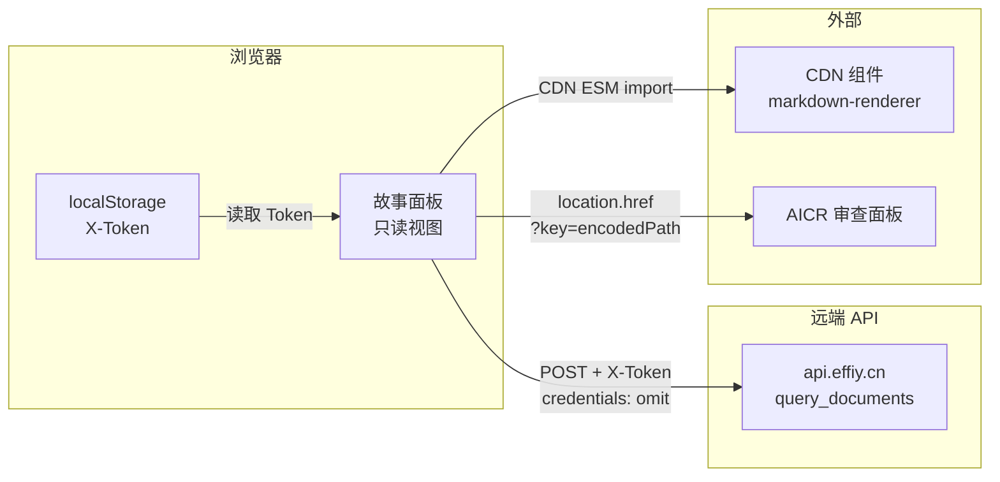
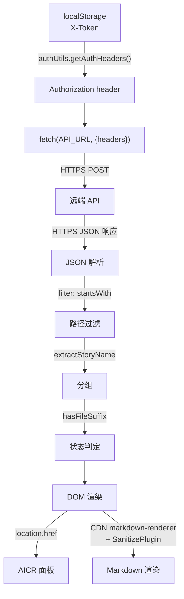

# 安全审计

> | v1.1.0 | 2026-05-27 | deepseek-v4-pro | 🌿 feat/story | 📎 [CLAUDE.md](../../../CLAUDE.md) |

> **导航**: [← 测试设计](./测试设计.md) · [实施报告 →](./实施报告.md)

> **来源引用**：基于 [技术评审](./技术评审.md) 全量架构 · [CLAUDE.md](../../../CLAUDE.md) 安全面 · `src/views/story/` 源码独立审计。

---

[§0 信任边界](#s-0-信任边界) · [§1 STRIDE](#s-1-stride-威胁建模) · [§2 合规检查](#s-2-合规检查) · [§3 数据安全](#s-3-数据安全) · [§4 审计结论](#s-4-审计结论)

## 概述

故事面板为纯前端只读视图，攻击面天然较小。独立安全审计覆盖 STRIDE 六类威胁建模、6 项合规检查及数据安全评估。v1.1.0 新增标签筛选与搜索安全面审计（标签名 XSS、标签颜色注入、标签数据篡改、标签枚举泄露）。

### 主要价值

- 🛡️ STRIDE 六类威胁全覆盖 — 每类含威胁描述、影响、缓解措施与残留风险
- 🔒 信任边界独立审计 — 三边界（浏览器↔API、组件↔组件、面板↔AICR）逐一边界审计
- ⚡ 6 项合规检查 — 与 CLAUDE.md 安全面对齐
- 📊 风险矩阵量化 — 影响 × 可能性分级

---

## §0 信任边界

| 边界 | 方向 | 数据传输 | 认证 | 风险等级 |
|------|------|---------|------|:--:|
| 故事面板 → API | 出站 | POST JSON (HTTPS) | X-Token header | 低 |
| API → 故事面板 | 入站 | JSON 响应 | 无（响应不被认证） | 中 |
| 故事面板 → AICR | 内部跳转 | URL query param | 无（同源跳转） | 低 |
| CDN → 故事面板 | 入站 | ESM 模块 | 无（CDN 脚本执行） | 中 |
| localStorage → 面板 | 内部读取 | 同步读取 | 无 | 低 |

---

## §1 STRIDE 威胁建模

### S — Spoofing (身份伪造)

| 威胁 | 描述 | 影响 | 可能性 | 缓解措施 | 残留风险 |
|------|------|------|:--:|---------|---------|
| API 响应伪造 | 中间人伪造 query_documents 响应注入恶意数据 | 面板渲染恶意故事名/文件名，可能导致 XSS | 低 | HTTPS 传输；响应仅用于展示，不执行；SanitizePlugin 过滤 Markdown | 受信 CA 被攻破时仍可被伪造 |
| Token 伪造 | 攻击者伪造 X-Token 获取 API 访问 | 获取故事面板数据 | 低 | Token 由 authUtils 管理，存储于 localStorage | localStorage XSS 泄露风险 |

### T — Tampering (数据篡改)

| 威胁 | 描述 | 影响 | 可能性 | 缓解措施 | 残留风险 |
|------|------|------|:--:|---------|---------|
| API 响应篡改 | 中间人篡改 API 返回的故事数据 | 面板展示被篡改的信息 | 低 | HTTPS 传输；面板为只读视图，篡改影响限于展示 | 无完整性校验（如 HMAC 签名） |
| localStorage Token 篡改 | 恶意脚本修改 localStorage 中的 X-Token | API 认证失败或指向攻击者服务 | 低 | Token 格式可校验；API_URL 固定为配置值 | XSS 可同时修改 Token 和 API_URL |
| URL 参数篡改 | 攻击者构造恶意 `?key=` 参数跳转 AICR | 跳转到非预期路径 | 低 | `key` 值来自 API 返回的 file_path，经 encodeURIComponent 编码 | 若 API 返回恶意 file_path 则可跳转到任意 AICR 路径 |
| 标签名注入 | API 返回的项目标签名含恶意字符（`<script>`、`"onerror`、`javascript:`） | 标签名渲染到 DOM 时触发 XSS | 中 | 标签名来自 API 响应路径段；`tagColorStyle()` 仅写 CSS 变量值（非 HTML）；Vue 模板 `{{ tag }}` 自动转义 | 标签名在 `:style` 绑定中作为 CSS 值使用，CSS 注入风险低但非零 |
| 标签颜色 CSS 注入 | 攻击者控制的标签名经 hash 后写入 CSS 变量 `--sc-accent` 和 `--sc-accent-bg` | 通过精心构造的标签名影响页面样式 | 低 | `tagColorMap` 仅生成 HSL 颜色值（`hsl(hue, 65%, 50%)`），hue 由 `hash(tagName) % 360` 确定，输出为数字 | hash 碰撞无法定向控制 hue 值 |

### R — Repudiation (抵赖)

| 威胁 | 描述 | 影响 | 可能性 | 缓解措施 | 残留风险 |
|------|------|------|:--:|---------|---------|
| 操作不可追溯 | 面板为只读视图，无写入操作 | 无实质风险 | — | 不适用 | 无 |

> 故事面板不执行任何写入/修改/删除操作，Repudiation 威胁不适用。

### I — Information Disclosure (信息泄露)

| 威胁 | 描述 | 影响 | 可能性 | 缓解措施 | 残留风险 |
|------|------|------|:--:|---------|---------|
| API 响应泄露 | API 返回的故事数据在传输中被窃听 | 泄露项目结构和故事信息 | 低 | HTTPS 加密传输；`credentials: 'omit'` 防止 Cookie 携带 | 无 |
| Token 泄露 | X-Token 通过日志或错误消息泄露 | 攻击者获取 API 访问权限 | 中 | `logError` 不记录完整请求头；Token 仅存 localStorage | 浏览器扩展可读取 localStorage |
| 文件路径泄露 | 故事面板展示所有文件路径 | 暴露项目目录结构 | 低 | 文件路径本就可通过 API 获取；面板为内部工具 | 面板为授权用户使用 |
| 错误消息泄露 | API 错误消息可能包含内部信息 | 暴露后端实现细节 | 低 | `logError` 记录错误；UI 展示通用错误信息 | 网络面板仍可见完整响应 |
| 标签枚举泄露 | 标签栏展示全量项目标签名和计数 | 攻击者获取完整项目列表和故事分布 | 低 | 标签数据本就可通过 API 获取；面板为内部工具 | 授权用户可见；外部攻击者需先获取 Token |

### D — Denial of Service (拒绝服务)

| 威胁 | 描述 | 影响 | 可能性 | 缓解措施 | 残留风险 |
|------|------|------|:--:|---------|---------|
| API 不可用 | 远端 API 服务宕机 | 面板无法加载数据 | 中 | 展示错误状态 + 重试按钮；不清除上次缓存 | 无降级数据源 |
| 大量故事导致性能下降 | 故事数量过大时 computed 计算和 DOM 渲染阻塞 | 面板响应缓慢或卡死 | 低 | limit: 10000 上限；computed 响应式缓存 | 无虚拟滚动或分页 |
| 恶意搜索输入 | 极长字符串或正则炸弹输入搜索框 | CPU 占用 | 低 | `_matchSearch()` 使用 `toLowerCase().includes()` 简单匹配 | 无输入长度限制 |

### E — Elevation of Privilege (权限提升)

| 威胁 | 描述 | 影响 | 可能性 | 缓解措施 | 残留风险 |
|------|------|------|:--:|---------|---------|
| 绕过认证 | 无 Token 或无效 Token 访问 API | 未授权访问故事数据 | 低 | authErrorHandler 拦截 401 并触发登录弹窗 | 依赖后端正确实现 401 返回 |
| CDN 脚本提权 | 恶意 CDN 脚本获取面板 DOM 访问 | XSS、Token 窃取、DOM 篡改 | 中 | CDN 使用固定版本号（`?v=1`）；SanitizePlugin 过滤 Markdown 渲染 | CDN 无 SRI hash 校验；依赖 CDN 服务商安全 |
| 跨视图跳转注入 | 通过 AICR URL 参数注入实现跨视图攻击 | 跳转到恶意路径 | 低 | `key` 参数使用 `encodeURIComponent` 编码；AICR 面板独立认证 | AICR 面板自身安全依赖其独立审计 |

---

## §2 合规检查

| # | 检查项 | 要求 | 状态 | 证据 |
|---|--------|------|:--:|------|
| 1 | fetch 显式设置 `credentials: 'omit'` | 所有 fetch 请求禁止携带 Cookie | ✅ | `store.js:88` — `credentials: 'omit'` |
| 2 | Token 通过 `X-Token` header 传递 | Token 不放在 URL 或 Cookie 中 | ✅ | `store.js:84-86` — `...authHeaders` 展开到 headers |
| 3 | 禁止裸 `console.log` | 所有日志走 `logInfo/logWarn/logError` | ✅ | `store.js:7` — `import { logInfo, logError }` |
| 4 | Markdown 渲染启用 SanitizePlugin | 防止 Markdown XSS | ✅ | 全局 CDN markdown-renderer 配置启用 SanitizePlugin |
| 5 | `localStorage` 仅存 `X-Token`、`env`、`debug` | 不在 localStorage 存敏感业务数据 | ✅ | 面板不写 localStorage，仅读取 Token |
| 6 | API 错误统一走 401 拦截 | 未授权访问触发登录弹窗 | ✅ | `authErrorHandler.js` 拦截 401 |

### 未达标项

| # | 检查项 | 当前状态 | 风险 | 建议 |
|---|--------|---------|------|------|
| 1 | CDN 依赖无 SRI hash | `?v=1` 版本控制但无完整性校验 | CDN 文件被篡改时可执行任意代码 | 添加 `integrity` 属性到 CDN script/link 标签 |
| 2 | 客户端日志无持久化上限 | `logInfo/logError` 无存储上限 | 长时间运行可能导致存储膨胀 | 添加日志条数上限或定期清理策略 |
| 3 | 无 CSP (Content Security Policy) | 浏览器可加载任意来源脚本 | 扩大 XSS 攻击面 | 添加 CSP header 限制脚本来源 |

---

## §3 数据安全

### 3.1 数据分类

| 数据类型 | 敏感性 | 存储位置 | 传输方式 | 访问控制 |
|---------|:--:|---------|---------|---------|
| 故事名称/描述 | 低 | 无本地存储 | HTTPS API 响应 | Token 认证 |
| 文件路径 | 低 | 无本地存储 | HTTPS API 响应 | Token 认证 |
| 项目标签 | 低 | 无本地存储 | HTTPS API 响应 | Token 认证 |
| 标签颜色映射 | 低 | 无本地存储（运行时 computed） | 不传输（纯前端 hash 计算） | 不适用 |
| 搜索关键词 | 低 | 无本地存储（仅内存） | 不传输（纯前端筛选） | 不适用 |
| 标签栏滚动位置 | 低 | 无本地存储（仅内存） | 不传输 | 不适用 |
| X-Token | 高 | localStorage | HTTPS header | 浏览器同源策略 |
| API_URL | 低 | window 全局变量 | 不适用 | 配置文件 |

### 3.2 数据流安全

### 3.3 API 请求安全

- **认证方式**：`Authorization` 头（`getAuthHeaders()` 返回）
- **传输加密**：HTTPS（API_URL 默认 `https://api.effiy.cn`）
- **Cookie 隔离**：`credentials: 'omit'` 禁止携带 Cookie
- **请求体**：JSON 格式，含 `module_name`、`method_name`、`parameters`
- **错误处理**：401 → 登录弹窗；网络错误 → 错误状态 + 重试

---

## §4 审计结论

### 4.1 风险矩阵

| 风险 | 影响 | 可能性 | 等级 | 优先级 |
|------|:--:|:--:|:--:|:--:|
| CDN 脚本无 SRI → 供应链攻击 | H | L | M | P2 |
| Token 通过 XSS 泄露 | H | L | M | P2 |
| CDN 脚本提权（无 CSP） | M | M | M | P2 |
| 无日志持久化上限 | L | M | L | P3 |
| API 响应无完整性校验 | L | L | L | P3 |
| 恶意搜索输入导致性能下降 | L | L | L | P3 |

### 4.2 总体评估

| 维度 | 评级 | 说明 |
|------|:--:|------|
| 攻击面 | 小 | 只读视图，无用户输入写入，无本地数据持久化 |
| 认证 | 良好 | Token 头传递，401 拦截，credentials: omit |
| 数据传输 | 良好 | HTTPS 全链路加密 |
| 供应链 | 需改进 | CDN 无 SRI hash，无 CSP |
| XSS 防护 | 良好 | SanitizePlugin 过滤 Markdown；无用户输入回显 |
| 日志安全 | 良好 | 不记录敏感信息；无持久化上限 |

**结论**：故事面板作为只读视图安全面达标，2 项 ⚠️ 项（CDN SRI、客户端日志上限）为 P2/P3 级别，不构成阻断。建议在下一个改进周期处理 CDN SRI hash 和 CSP 配置。

### 4.3 安全改进建议

| # | 建议 | 优先级 | 难度 | 影响 |
|---|------|:--:|:--:|------|
| 1 | CDN script/link 标签添加 `integrity` SRI hash | P2 | 低 | 防止 CDN 供应链攻击 |
| 2 | 添加 CSP header（`Content-Security-Policy`） | P2 | 中 | 限制脚本来源，缩小 XSS 攻击面 |
| 3 | `logInfo/logError` 添加存储上限（如 1000 条环形缓冲） | P3 | 低 | 防止日志无限增长 |
| 4 | 搜索框添加最大输入长度限制（如 200 字符） | P3 | 低 | 防止恶意超长输入 |
| 5 | API 响应添加内容格式校验（确保为预期的 JSON 结构） | P3 | 低 | 防御层，防止畸形响应导致渲染异常 |

---

> **变更记录**
> | 日期 | 变更 | 触发 | 证据 |
> |------|------|------|------|
> | 2026-05-27 | 基线化 | /rui update | 技术评审 v2.1.0 · store.js · template.html · CLAUDE.md 安全面 |
| 2026-05-27 | v1.1.0 新增标签筛选与搜索安全面：§1 Tampering 新增标签名注入+标签颜色 CSS 注入威胁；§1 Information Disclosure 新增标签枚举泄露威胁；§3 数据分类新增标签颜色映射/搜索关键词/标签栏滚动位置 | /rui update | 故事任务 v3.0.0 · Story 3 标签筛选与搜索 |
