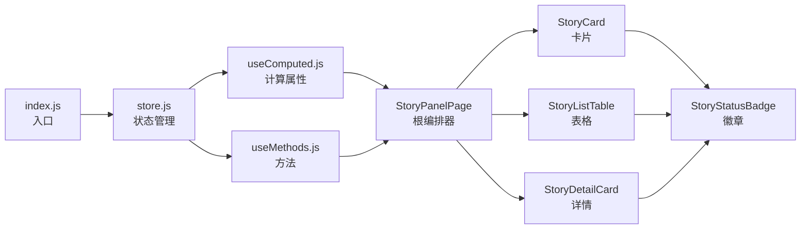

# 实施报告

> | v1.1.0 | 2026-05-27 | deepseek-v4-pro | 🌿 feat/story | 📎 [CLAUDE.md](../../../CLAUDE.md) |

> **导航**: [← 安全审计](./安全审计.md) · [自改进复盘 →](./自改进复盘.md)

> **来源引用**：基于 [故事任务](./故事任务.md) §1 Story 1–2 与 [使用场景](./使用场景.md) §1 场景 1–3，从 `src/views/story/` 源码验证。

---

[§0 基线](#s-0-基线溯源) · [§1 场景 1](#s-1-场景-1-项目管理者查看全局进度) · [§2 场景 2](#s-2-场景-2-开发者搜索定位故事) · [§3 场景 3](#s-3-场景-3-浏览模式切换) · [§4 概要](#s-4-变更概要)

## 概述

三场景交付文件清单，与使用场景一一对应。共 15 个源文件，覆盖 5 个业务组件 + 入口 + store + computed + methods + 样式。故事面板与 claude 面板采用镜像架构（createBaseView + store 工厂 + computed + methods）。

### 主要价值

- 🎯 三场景交付 — 与使用场景一一对应，每场景独立交付文件表
- 🔒 源码可追溯 — 每文件附实际路径，可验证可审计
- 📊 架构对照 — 与 claude 面板镜像架构，共享通用组件
- ⚡ 精简交付视角 — 仅列交付文件，不含过程偏差与审查细节

---

## §0 基线溯源

| 使用场景 | 故事任务 Story | 文件数 | 说明 |
|---------|:---:|:---:|------|
| [场景 1: 项目管理者查看全局进度](./使用场景.md#场景-1-项目管理者查看全局进度) | Story 1 | 10 | 入口 + store + computed + methods + 5 业务组件 |
| [场景 2: 开发者搜索定位故事](./使用场景.md#场景-2-开发者搜索定位故事) | Story 2 | 3 | StoryPanelPage（筛选引擎）+ StoryListTable（排序） |
| [场景 3: 浏览模式切换](./使用场景.md#场景-3-浏览模式切换) | Story 1 | 3 | StoryPanelPage（视图切换）+ StoryCard + StoryListTable |
| **合计** | | **15** | 跨场景共享模块在场景间复用 |

> **架构说明**：场景 2 和场景 3 的核心逻辑集中在 StoryPanelPage 组件中（筛选/排序/视图切换），因此文件清单与场景 1 高度重叠。

---

## §1 场景 1: 项目管理者查看全局进度

> 对应 [使用场景 — 场景 1](./使用场景.md#场景-1-项目管理者查看全局进度) · Story 1

| 文件 | 职责 |
|------|------|
| `src/views/story/index.js` | 入口初始化：createStore → createBaseView → onMounted |
| `src/views/story/index.html` | HTML 模板：Vue 挂载点 + CDN 脚本 + 全局加载指示器 |
| `src/views/story/hooks/store.js` | 响应式 store：fetchStories / selectStory / clearSelection + 状态判定引擎 |
| `src/views/story/hooks/useComputed.js` | 计算属性：storiesByStatus / statusCounts / totalStories / allProjectTags |
| `src/views/story/hooks/useMethods.js` | 方法：viewStory / goBack / formatDate / statusLabel / statusVariant |
| `src/views/story/components/storyPanelPage/index.js` | 根编排器：视图切换 / 筛选引擎 / 排序 / 面板状态管理 |
| `src/views/story/components/storyPanelPage/index.html` | 页面模板：看板 / 卡片 / 列表三视图 + 筛选栏 + 侧面板 |
| `src/views/story/components/storyPanelPage/index.css` | 页面样式：布局 / 响应式 / 动画 |
| `src/views/story/components/storyCard/index.js` | 故事卡片：标签强调色 / 阶段进度条 / 点击选择 |
| `src/views/story/components/storyCard/index.html` | 卡片模板：标签 / 日期 / 名称 / 文件数 / 阶段进度 |
| `src/views/story/components/storyCard/index.css` | 卡片样式：悬停效果 / 左边框着色 / 阶段进度条 |
| `src/views/story/components/storyDetailCard/index.js` | 详情面板：描述 / 下一步 / 通知 / 日志 / 文件清单分组 |
| `src/views/story/components/storyDetailCard/index.html` | 详情模板：返回按钮 / 状态徽章 / 摘要面板 / 文件清单 |
| `src/views/story/components/storyDetailCard/index.css` | 详情样式：面板布局 / 文件行悬停 |
| `src/views/story/components/storyStatusBadge/index.js` | 状态徽章：五阶段中文标签 / 尺寸变体 / 颜色映射 |
| `src/views/story/components/storyStatusBadge/index.html` | 徽章模板：纯文本状态标签 |
| `src/views/story/components/storyStatusBadge/index.css` | 徽章样式：按状态着色 / 尺寸变体 |
| `src/views/story/styles/index.css` | 主样式表：全局布局 + 组件样式聚合导入 |

---

## §2 场景 2: 开发者搜索定位故事

> 对应 [使用场景 — 场景 2](./使用场景.md#场景-2-开发者搜索定位故事) · Story 2

核心逻辑在 StoryPanelPage 中：

| 文件 | 场景相关职责 |
|------|------------|
| `src/views/story/components/storyPanelPage/index.js` | 筛选引擎：`_applyFilters()` + `_matchSearch()` / 搜索防抖 / 标签选择 / 文档类型筛选 / 缺失文档筛选 / 排序引擎 `sortStories()` + `toggleSort()` |
| `src/views/story/components/storyListTable/index.js` | 列表表格：可排序列头 / 排序箭头 / 行点击选择 |
| `src/views/story/components/storyListTable/index.html` | 列表模板：表格列（名称/状态/标签/阶段/文件数/日期） |
| `src/views/story/components/storyListTable/index.css` | 列表样式：表头悬停 / 排序箭头 / 行高亮 |

---

## §3 场景 3: 浏览模式切换

> 对应 [使用场景 — 场景 3](./使用场景.md#场景-3-浏览模式切换) · Story 1

核心逻辑在 StoryPanelPage 中：

| 文件 | 场景相关职责 |
|------|------------|
| `src/views/story/components/storyPanelPage/index.js` | 视图切换：`setView(mode)` / `viewModes` 静态定义 / 看板列构建 `kanbanColumns` / 条件渲染 |
| `src/views/story/components/storyPanelPage/index.html` | 视图模板：SegmentedControl 切换按钮 + 三视图条件渲染区块 |
| `src/views/story/components/storyCard/index.js` | 卡片组件：看板和卡片视图共用 |
| `src/views/story/components/storyListTable/index.js` | 表格组件：列表视图专用 |

---

## §4 变更概要

### 4.1 架构特征

### 4.2 与 Claude 面板共享组件

| 通用组件 | story 面板 | claude 面板 |
|---------|:--:|:--:|
| YiIcon | ✅ | ✅ |
| YiButton | ✅ | ✅ |
| YiTag | ✅ | ✅ |
| YiLoading | ✅ | ✅ |
| YiEmptyState | ✅ | ✅ |
| YiErrorState | ✅ | ✅ |
| HeaderActions | ✅ | ✅ |

### 4.3 独特模块

| 模块 | 说明 |
|------|------|
| StoryStatusBadge | story 面板独有 — 五阶段状态徽章 |
| determineStatus() | story 面板独有 — 基于文档存在性的状态判定引擎（hasFileSuffix 后缀匹配） |
| 看板视图 (board) | story 面板独有 — claude 面板无看板 |
| 缺失文档筛选 | story 面板独有 — 识别文档基线不完整的故事 |
| Filter Controls | story 面板独有 — 3 组控件（故事下拉/类型按钮/缺失按钮）+ 活跃筛选胶囊摘要行 |

### 4.4 v1.1.0 变更概要

| 文件 | 变更类型 | 描述 |
|------|---------|------|
| `src/views/story/hooks/store.js` | 修复 | `hasProjectFile()` → `hasFileSuffix()`：修复文件名前缀匹配错误导致状态判定/健康分/描述提取全部失败；新增 `STATUS_FILE_SUFFIXES` 数组统一管理阶段判定优先级 |
| `src/views/story/components/storyPanelPage/template.html` | 重构 | 移除旧 `.sp-filter-bar` 可折叠筛选栏；新增 `.sp-active-filters` 活跃筛选胶囊摘要行 + `.sp-filter-controls` 3 组控件（故事下拉框/类型按钮组/缺失按钮组，含分隔线）；新增 Filter Controls 折叠切换按钮 |
| `src/views/story/components/storyPanelPage/index.js` | 重构 | `filterBarCollapsed` → `filterControlsCollapsed`；`toggleFilterBar()` → `toggleFilterControls()`；新增 `onStorySelect()` 故事下拉选择方法；新增 `filterSummaryPills` computed；故事-项目标签双向级联逻辑 |
| `src/views/story/components/storyPanelPage/index.css` | 重构 | 移除旧 `.sp-filter-bar`、`.sp-filter-group`、`.sp-filter-tag` 等样式；新增 `.sp-active-filters`、`.sp-active-filter-pill`、`.sp-filter-controls`、`.sp-filter-controls-group`、`.sp-filter-controls-btn`、`.sp-filter-controls-select`、`.sp-filter-controls-divider`、`.sp-filter-controls-toggle` 等样式 |

---

> **变更记录**
> | 日期 | 变更 | 触发 | 证据 |
> |------|------|------|------|
> | 2026-05-27 | 基线化 | /rui doc --from-code story | src/views/story/ 全量源码 |
> | 2026-05-27 | v1.1.0：Filter Bar 重构（3 组 Filter Controls + 活跃筛选胶囊行）+ 数据流修复（hasFileSuffix 替代 hasProjectFile）+ 故事-项目标签双向级联 | /rui update | store.js · template.html · index.js · index.css |
