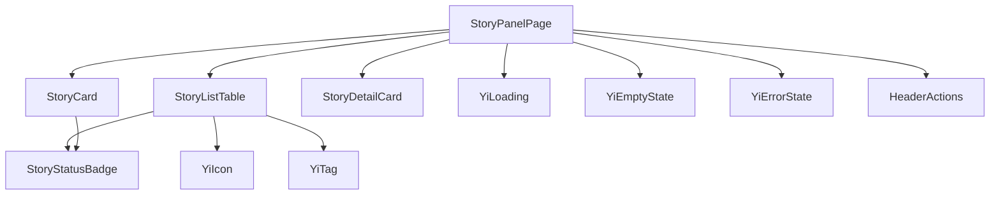
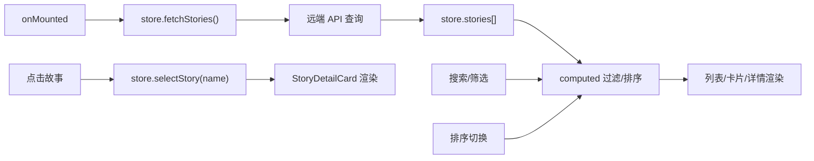

# 技术评审

> | v1.0.0 | 2026-05-26 | deepseek-v4-pro | 📎 [CLAUDE.md](../../../CLAUDE.md) |

> **来源引用**：从 `src/views/story/` 源码分析生成。

---

### 主要价值

- 🎯 createBaseView 标准视图 — store + computed + methods 三位一体
- 🔒 组件依赖清晰 — 5 个业务组件 + 7 个通用组件
- ⚡ 与 claude 面板镜像架构 — 同一模式两个视图

---

## §1 组件树



| 组件 | 来源 | 职责 |
|------|------|------|
| StoryPanelPage | `components/storyPanelPage/` | 根页面，视图切换 |
| StoryListTable | `components/storyListTable/` | 故事表格列表 |
| StoryCard | `components/storyCard/` | 故事卡片 |
| StoryDetailCard | `components/storyDetailCard/` | 故事详情卡片 |
| StoryStatusBadge | `components/storyStatusBadge/` | 状态标签 |

---

## §2 数据流



> 证据: `src/views/story/index.js` · `src/views/story/hooks/store.js`

---

## §3 架构对比

| 维度 | claude 面板 | story 面板 |
|------|------------|------------|
| 入口模式 | createBaseView | createBaseView |
| 核心组件 | ClaudePanelPage / ClaudeProjectCard / ClaudeDetailCard | StoryPanelPage / StoryListTable / StoryCard / StoryDetailCard / StoryStatusBadge |
| 状态管理 | store.js + useComputed + useMethods | store.js + useComputed + useMethods |
| 数据流 | fetchProjects → 列表渲染 | fetchStories → 状态判定 → 列表渲染 |
| 独特功能 | — | 状态判定（按文档存在性） |
| 通用组件 | YiIcon / YiButton / YiTag / YiLoading / YiEmptyState / YiErrorState / HeaderActions | 同左 |

---

## §4 状态判定逻辑

```
故事阶段 = function(文档存在性):
  hasStoryTask  + hasScenario + hasTechReview + hasSecurityAudit + hasTestDesign
  5/5 → completed
  3-4/5 → in_progress
  1-2/5 → pending (doc stage)
  0/5 → pending (init)
```

---

> **变更记录**
> | 日期 | 变更 | 触发 | 证据 |
> |------|------|------|------|
> | 2026-05-26 | 基线化 | 源码分析 | src/views/story/ |
