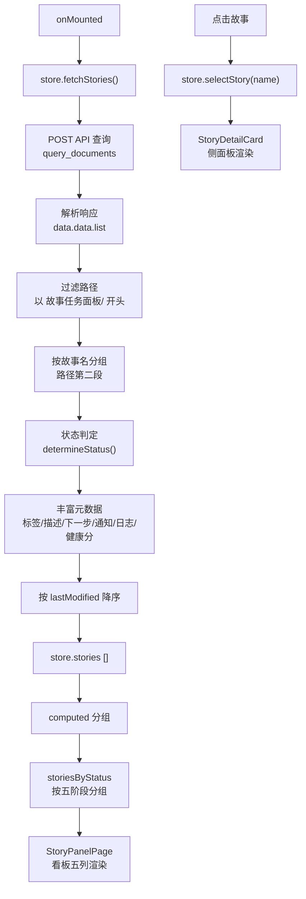
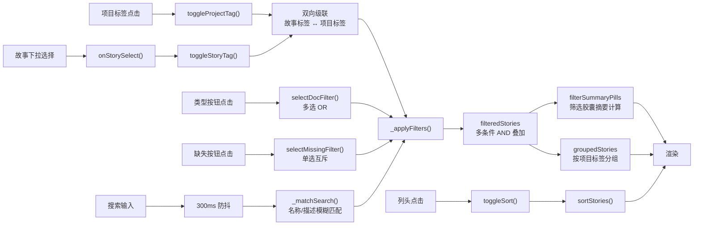
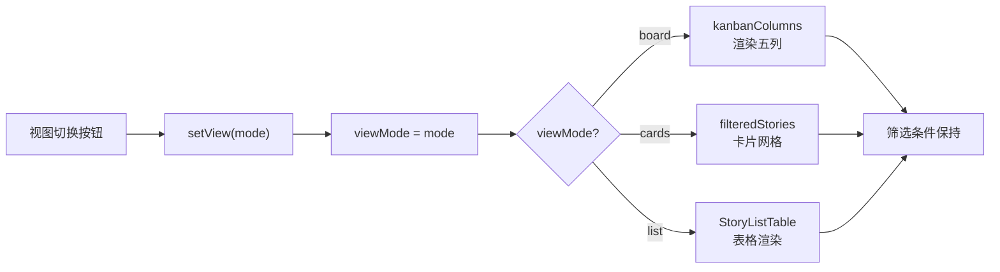
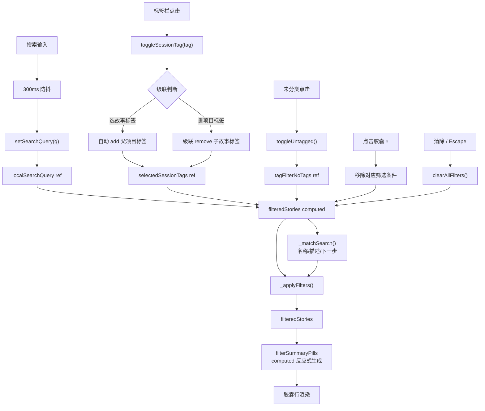
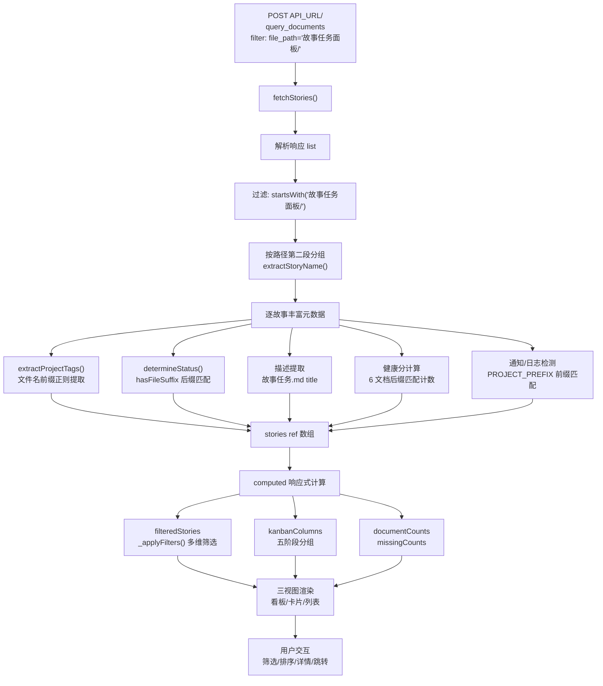
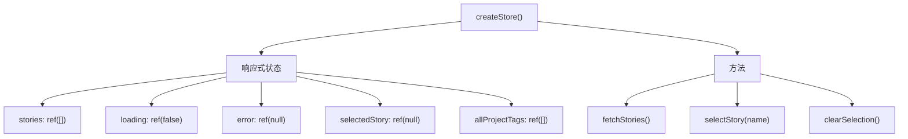

# 技术评审

> | v3.0.0 | 2026-05-27 | deepseek-v4-pro | 🌿 feat/story | 📎 [CLAUDE.md](../../../CLAUDE.md) |

> **导航**: [← 使用场景](./使用场景.md) · [测试设计 →](./测试设计.md)

> **来源引用**：基于 [故事任务](./故事任务.md) §1 Story 1–3 与 [使用场景](./使用场景.md) §1 场景 1–4，从 `src/views/story/` 源码分析生成。

---

[§0 技术栈](#s-0-技术栈与-api-总览) · [§1 场景 1](#s-1-场景-1-项目管理者查看全局进度) · [§2 场景 2](#s-2-场景-2-开发者搜索定位故事) · [§3 场景 3](#s-3-场景-3-浏览模式切换) · [§4 场景 4](#s-4-场景-4-通过标签栏与关键词快速定位) · [§5 共享架构](#s-5-跨场景共享架构)

## 概述

四场景全维度技术方案，每场景含布局线框、mermaid 数据流图、涉及模块与状态、UI 微交互及 Given/When/Then 测试用例。§5 覆盖跨场景共享架构（Store 工厂、状态判定引擎、筛选管道、视图切换机制）。

### 主要价值

- 🎯 四场景全维度技术方案 — 与使用场景一一对应，每场景独立可评审
- 🔒 源码证据链 — 每模块附源码路径，可追溯可验证
- ⚡ 架构可视化 — 每场景含布局线框 + mermaid 数据流图
- 🧪 测试用例内嵌 — 每场景含 Given/When/Then 可执行用例
- 🎨 与 claude 面板镜像架构 — 同一 createBaseView 模式，降低认知负担

---

## §0 技术栈与 API 总览

### 0.1 技术栈

| 维度 | 选择 | 原因 |
|------|------|------|
| 视图框架 | createBaseView (Vue 3 CDN) | 零构建，浏览器原生 ESM |
| 状态管理 | vueRef + store 工厂 | 集中式状态，computed 响应式缓存 |
| API 层 | fetch (POST JSON) | 浏览器原生，无外部依赖 |
| 组件注册 | registerGlobalComponent | 全局注册，延迟加载 HTML/CSS |
| 图标 | Font Awesome 6.4.0 (CDN) | CDN 托管，无需本地打包 |
| 字体 | Inter (UI) + JetBrains Mono (代码) | CDN 加载，统一视觉风格 |

### 0.2 设计令牌

| 令牌 | 取值 | 用途 |
|------|------|------|
| `--sc-accent` | 按项目标签 hash 动态计算 hue | 标签胶囊主色 |
| `--sc-accent-bg` | 同 hue, 12% opacity | 标签胶囊背景色 |
| `--font-mono` | JetBrains Mono | 故事名称等宽字体 |
| `--font-sans` | Inter | 界面无衬线字体 |
| `--z-modal` | CSS 变量层级 | 详情面板/弹窗层级 |
| `--transition-default` | 200ms ease | 默认过渡动画 |

### 0.3 API 接口总览

> 故事面板所有后端请求统一发送到 `window.API_URL`（默认 `https://api.effiy.cn`）。
> 认证方式：`X-Token` 请求头（`localStorage` 存储），`credentials: 'omit'`。

#### 服务路由

| 路由方式 | 端点 | 用途 |
|---------|------|------|
| `POST ${API_URL}/` + body 路由 | `services.database.data_service` | 故事面板文档查询 |

#### 接口清单

| 接口 | 方法 | 服务模块 | 用途 | 场景 |
|------|------|---------|------|------|
| `query_documents` | POST (body 路由) | `data_service` | 查询故事任务面板下所有文档（filter: `故事任务面板/`） | [§1](#s-1-场景-1-项目管理者查看全局进度) [§2](#s-2-场景-2-开发者搜索定位故事) [§3](#s-3-场景-3-浏览模式切换) [§4](#s-4-场景-4-通过标签栏与关键词快速定位) |

<details>
<summary>curl 示例（展开查看）</summary>

#### 查询故事面板文档列表

```bash
curl -X POST 'https://api.effiy.cn/' \
  -H 'Content-Type: application/json' -H 'Accept: application/json' -H 'X-Token: <token>' \
  -d '{"module_name":"services.database.data_service","method_name":"query_documents","parameters":{"cname":"sessions","limit":10000,"filter":{"file_path":"故事任务面板/"}}}'
```

</details>

---

## §1 场景 1: 项目管理者查看全局进度

> 对应 [使用场景 — 场景 1](./使用场景.md#场景-1-项目管理者查看全局进度) · Story 1

### 1.1 布局线框

**看板全景视图** — 五阶段列 + 筛选栏 + 详情侧面板。

```
┌──────────────────────────────────────────────────────────────────┐
│  Top Bar                                                          │
│  ┌──────────────┐  ┌─────────────────────────┐  ┌──────────────┐ │
│  │ YiWeb 故事面板│  │ 🔍 搜索故事名称...       │  │ 看板|卡片|列表│ │
│  └──────────────┘  └─────────────────────────┘  └──────────────┘ │
├──────────────────────────────────────────────────────────────────┤
│  Filter Bar (可折叠)                                               │
│  ┌──────────────────────────────────────────────────────────────┐ │
│  │ [项目: YiWeb ×] [项目: CDN ×]  [文档类型 ▾] [缺失文档 ▾]  🔄 │ │
│  └──────────────────────────────────────────────────────────────┘ │
├──────────────────────────────────────────────────────────────────┤
│  Kanban Board (responsive: 1400px→3列, 900px→2列)                  │
│                                                                    │
│  ┌──────────┐  ┌──────────┐  ┌──────────┐  ┌──────────┐  ┌──────┐│
│  │● 规划 (3)│  │● 设计 (2)│  │● 开发 (1)│  │● 测试 (1)│  │●运营(2)│
│  ├──────────┤  ├──────────┤  ├──────────┤  ├──────────┤  ├──────┤│
│  │┌────────┐│  │┌────────┐│  │┌────────┐│  │┌────────┐│  │┌────┐││
│  ││ aicr   ││  ││ story  ││  ││ cdn    ││  ││ claude ││  ││yi- │││
│  ││ YiWeb  ││  ││ YiWeb  ││  ││ CDN    ││  ││ YiWeb  ││  ││web │││
│  ││ 1/5 📄 ││  ││ 5/5 ✅ ││  ││ 3/5 📄 ││  ││ 3/5 📄 ││  ││arch│││
│  ││ █░░░░  ││  ││ █████  ││  ││ ███░░  ││  ││ ███░░  ││  ││5/5✅││
│  │└────────┘│  │└────────┘│  │└────────┘│  │└────────┘│  │└────┘││
│  │┌────────┐│  │┌────────┐│  │           │  │           │  │┌────┐││
│  ││services││  ││yiweb-  ││  │           │  │           │  ││    ││
│  ││ YiWeb  ││  ││self-   ││  │           │  │           │  ││    ││
│  ││ 1/5 📄 ││  ││test    ││  │           │  │           │  ││    ││
│  ││ █░░░░  ││  ││ YiWeb  ││  │           │  │           │  ││    ││
│  │└────────┘│  ││ 4/5 📄 ││  │           │  │           │  ││    ││
│  │           │  ││ ████░  ││  │           │  │           │  ││    ││
│  │           │  │└────────┘│  │           │  │           │  │└────┘│
│  └──────────┘  └──────────┘  └──────────┘  └──────────┘  └──────┘│
├──────────────────────────────────────────────────────────────────┤
│  Detail Side Panel (slideInRight 0.2s ease)                        │
│  ┌────────────────────────────────────────────────────────────┐   │
│  │ ← 返回    │ aicr                 │ ● 规划 │ 1/5 文件        │   │
│  │           ├────────────────────────────────────────────────┤   │
│  │           │ [📋描述] [📌下一步] [🔔通知] [📝日志] [📄文件]   │   │
│  │           ├────────────────────────────────────────────────┤   │
│  │           │ 📄 文件清单 (按项目标签分组)                     │   │
│  │           │  ├─ YiWeb/故事任务面板/aicr/故事任务.md  → AICR  │   │
│  │           │  ├─ YiWeb/故事任务面板/aicr/使用场景.md  → AICR  │   │
│  │           │  └─ ...                                         │   │
│  └────────────────────────────────────────────────────────────┘   │
│  关闭方式: ← 返回按钮 · 点击遮罩 · Escape 键                        │
└──────────────────────────────────────────────────────────────────┘
```

| 区域 | 组件 | 关键交互 |
|------|------|---------|
| Top Bar | HeaderActions + YiInput + SegmentedControl | 搜索输入（300ms防抖）、视图模式切换 |
| Filter Bar | YiTag × N + YiSelect × 2 | 项目标签切换（多选OR）、文档/缺失筛选（单选） |
| Kanban Board | StoryPanelPage → StoryCard × N | 卡片悬停左边框着色、点击选中打开详情 |
| Detail Panel | StoryDetailCard | 滑入动画 0.2s、文件行点击跳转 AICR、Escape/遮罩关闭 |

### 1.2 数据流



> 证据: `src/views/story/index.js` · `src/views/story/hooks/store.js`

### 1.3 涉及模块

| 模块 | 路径 | 职责 |
|------|------|------|
| 入口 | `src/views/story/index.js` | createStore → createBaseView → onMounted |
| Store | `src/views/story/hooks/store.js` | fetchStories / selectStory / clearSelection |
| 计算属性 | `src/views/story/hooks/useComputed.js` | storiesByStatus / statusCounts / allProjectTags |
| 方法 | `src/views/story/hooks/useMethods.js` | viewStory / goBack / formatDate / statusLabel |
| 页面组件 | `src/views/story/components/storyPanelPage/` | 根编排器：视图切换 / 筛选 / 排序 / 面板状态 |
| 卡片组件 | `src/views/story/components/storyCard/` | 看板/网格故事卡片 |
| 详情组件 | `src/views/story/components/storyDetailCard/` | 侧面板：描述/下一步/通知/日志/文件清单 |
| 表格组件 | `src/views/story/components/storyListTable/` | 列表视图表格 |
| 徽章组件 | `src/views/story/components/storyStatusBadge/` | 五阶段状态徽章 |

### 1.4 状态判定引擎

```
determineStatus(filenames):
  按优先级检查文件名后缀（后缀匹配，不依赖项目前缀）：
  1. 含 "自改进复盘.md" → "operations" (运营)
  2. 含 "测试报告.md"   → "testing"    (测试)
  3. 含 "测试设计.md"   → "testing"    (测试)
  4. 含 "实施报告.md"   → "develop"    (开发)
  5. 含 "使用场景.md"   → "design"     (设计)
  默认 → "planning"
```

> 证据: `src/views/story/hooks/store.js` — `determineStatus()` 函数 · `STATUS_FILE_SUFFIXES` 数组

**数据流修复 (v2.1.0)**：`hasProjectFile()` 使用 `PROJECT_PREFIX + docType` 拼接文件名（如 `YiWeb-故事任务.md`），但实际文件无项目前缀（如 `故事任务.md`），导致状态判定/健康分/描述提取全部失败。修复为 `hasFileSuffix(filenames, suffix)` 通过后缀匹配（如 `endsWith('故事任务.md')`），兼容带前缀与不带前缀两种命名。NOTIFY/LOG 文件检测保持使用 PROJECT_PREFIX（`YiWeb-消息通知列表.md`、`YiWeb-交互日志.md`）。

**阶段映射**：

| 状态键 | 中文标签 | 含义 | 判定依据 |
|--------|---------|------|---------|
| planning | 规划 | 仅有故事任务文档 | 存在 故事任务.md |
| design | 设计 | 已有使用场景 | 存在 使用场景.md |
| develop | 开发 | 已有实施报告 | 存在 实施报告.md |
| testing | 测试 | 已有测试报告 | 存在 测试报告.md |
| operations | 运营 | 已完成自改进复盘 | 存在 自改进复盘.md |

### 1.5 UI 微交互

| 交互 | 触发 | 行为 |
|------|------|------|
| 面板滑入 | 点击故事卡片/行 | `slideInRight 0.2s ease`，从右侧滑入 |
| 面板关闭 | 返回按钮 / 遮罩点击 / Escape | 面板滑出，清除选中 |
| 卡片悬停 | 鼠标悬停故事卡片 | 左边框 3px 着色（基于标签哈希的强调色） |
| 文件点击 | 点击文件行 | `location.href = ../aicr/index.html?key={encodedPath}` |
| 加载状态 | API 请求中 | YiLoading 旋转器 + "加载中..." |
| 错误状态 | API 失败 | YiErrorState + 错误信息 + 重试按钮 |
| 空状态 | 无故事数据 | YiEmptyState + "暂无故事任务" |

### 1.6 测试用例

| # | Given | When | Then |
|---|-------|------|------|
| N01 | 远端 API 正常 | 页面加载 | 故事列表加载，看板五列渲染 |
| N02 | 故事列表已加载 | 点击故事卡片 | 详情侧面板从右侧滑入 |
| N03 | 详情面板打开 | 点击文件行 | 跳转到 AICR 审查面板 |
| N04 | 详情面板打开 | 按 Escape | 面板关闭，选中清除 |
| E01 | 远端 API 不可达 | 页面加载 | 错误状态 + 重试按钮 |
| E02 | API 返回空列表 | 页面加载 | 空状态"暂无故事任务" |

---

## §2 场景 2: 开发者搜索定位故事

> 对应 [使用场景 — 场景 2](./使用场景.md#场景-2-开发者搜索定位故事) · Story 2

### 2.1 布局线框

**搜索筛选视图** — 搜索框 + 项目标签栏 + Filter Controls + 筛选胶囊 + 排序表格。

```
┌──────────────────────────────────────────────────────────────────┐
│  Top Bar                                                          │
│  ┌──────────────┐  ┌─────────────────────────┐  ┌──────────────┐ │
│  │ YiWeb 故事面板│  │ 🔍 aicr                  │  │ 看板|卡片|列表│ │
│  └──────────────┘  └─────────────────────────┘  └──────────────┘ │
├──────────────────────────────────────────────────────────────────┤
│  Meta Row (项目标签 + 统计栏)                                      │
│  ┌──────────────────────────────────────────────────────────────┐ │
│  │ 项目标签: [全部] [未分类 (2)] [YiWeb (5)] [CDN (2)]  ◀ ░░ ▶ │ │
│  │ 统计栏:   ● 规划 3  │ ◉ 设计 2  │ ◉ 开发 1 │ ◉ 测试 1 │ ◉ 运营 2 │ │
│  └──────────────────────────────────────────────────────────────┘ │
├──────────────────────────────────────────────────────────────────┤
│  Active Filter Summary (筛选摘要胶囊，有活跃筛选条件时展示)          │
│  ┌──────────────────────────────────────────────────────────────┐ │
│  │ [搜索: "aicr" ×] [项目: YiWeb ×] [类型: 实施报告 ×]  ✕ 清除  │ │
│  └──────────────────────────────────────────────────────────────┘ │
├──────────────────────────────────────────────────────────────────┤
│  Filter Controls (3 组，可折叠，带分隔线)                            │
│  ┌──────────────────────────────────────────────────────────────┐ │
│  │ 故事: [全部故事 ▾]  │  类型: [规划 3] [设计 2] [开发 1]       │ │
│  │                     │        [测试 1] [运营 2]                │ │
│  │                     │  缺失: [缺设计 2] [缺开发 3]            │ │
│  │                     │        [缺测试 4] [缺运营 5]            │ │
│  └──────────────────────────────────────────────────────────────┘ │
│                                               [展开/收起 ▴]       │
├──────────────────────────────────────────────────────────────────┤
│  Story List Table (列表视图，支持排序)                              │
│  ┌──────────────────────────────────────────────────────────────┐ │
│  │ 名称 ▲        │ 状态    │ 项目标签   │ 阶段进度 │ 文件数│ 日期 │ │
│  ├──────────────────────────────────────────────────────────────┤ │
│  │ aicr          │ ● 设计  │ YiWeb      │ ██░░░ 2/5│   5   │05-27│ │
│  │ story         │ ● 运营  │ YiWeb      │ █████ 5/5│   7   │05-27│ │
│  └──────────────────────────────────────────────────────────────┘ │
│  (点击列头切换排序 ▲/▼，默认 lastModified 降序)                     │
├──────────────────────────────────────────────────────────────────┤
│  Empty State (搜索无匹配时)                                        │
│  ┌──────────────────────────────────────────────────────────────┐ │
│  │                    🔍 未找到匹配故事                           │ │
│  │               请尝试其他关键词或清除筛选条件                    │ │
│  └──────────────────────────────────────────────────────────────┘ │
└──────────────────────────────────────────────────────────────────┘
```

| 区域 | 组件 | 关键交互 |
|------|------|---------|
| Search Bar | YiInput (v-model + 300ms防抖) | 输入停止 300ms 后触发 `_matchSearch()` 模糊匹配名称/描述 |
| Project Tags | 水平滚动标签栏 (YiIcon × N) | 多选 OR，左右渐隐溢出指示，未分类独立按钮，含实时计数 |
| Stats Bar | 5 个统计按钮（规划/设计/开发/测试/运营） | 点击可快速筛选文档类型，与 Filter Controls 类型按钮联动 |
| Filter Summary | 筛选胶囊行 (YiTag × N) | 活跃条件可视化，每个胶囊含 × 关闭，最右含"清除"全部按钮 |
| Filter Controls | 3 组控件 + 分隔线 | 故事 select 下拉框 · 类型按钮组（多选）· 缺失按钮组（单选互斥） |
| Filter Toggle | 展开/收起按钮 | 折叠时控件组隐藏，筛选条件保持 |
| Story Table | StoryListTable | 可排序列头（名称/状态/文件数/日期），行点击选中打开详情 |
| Empty State | YiEmptyState | 无匹配结果时展示，含清除按钮引导 |

### 2.2 数据流



> 证据: `src/views/story/components/storyPanelPage/index.js`

### 2.3 筛选管道

| 阶段 | 方法 | 触发组件 | 逻辑 | 维度 |
|------|------|---------|------|------|
| 1 | 项目标签 | `toggleProjectTag(tag)` | 水平滚动标签栏按钮 | 多选 OR；与故事标签双向级联 |
| 2 | 故事名称 | `toggleStoryTag(name)` → `onStorySelect(event)` | Filter Controls 故事 select 下拉框 | 单选；自动关联其项目标签 |
| 3 | 文档类型 | `selectDocFilter(docType)` | Filter Controls 类型按钮组 | 多选 OR；含实时计数；与统计栏按钮联动 |
| 4 | 缺失文档 | `selectMissingFilter(filter)` | Filter Controls 缺失按钮组 | 单选互斥；含实时计数 |
| 5 | 关键词 | `_matchSearch(story, query)` | 搜索框 input | 模糊匹配名称/描述/下一步 |

**筛选逻辑**：所有维度 AND 叠加。`_applyFilters()` 接受可选的 `exclude` 参数以跳过特定维度（用于 `missingCounts`、`documentCounts`、`storyOptions` 等独立计数计算）。

**级联规则**：选择故事时自动关联其项目标签；移除项目标签时级联移除仅属于该项目的子故事标签。选择"未分类"与项目标签互斥。

### 2.4 排序引擎

| 字段 | 排序键 | 说明 |
|------|--------|------|
| name | `story.name` | 故事名称字典序 |
| status | `story.status` | 状态优先级 |
| fileCount | `story.fileCount` | 文件数量 |
| lastModified | `story.lastModified` | 最后修改时间（默认降序） |
| createdAt | `story.createdAt` | 创建时间 |

**行为**：点击同一列头反转方向；切换列重置为降序。仅列表视图支持排序。

### 2.5 涉及模块

| 模块 | 路径 | 职责 |
|------|------|------|
| 页面组件 | `src/views/story/components/storyPanelPage/index.js` | 全部筛选状态 + 排序状态 + 筛选引擎 |
| 搜索 | 页面组件内 `localSearchQuery` | v-model 绑定 + 300ms 防抖 |
| 筛选状态 | 页面组件内 `selectedProjectTags` 等 | 响应式筛选数组 |
| 标签滚动 | 页面组件内 `handleTagsScroll()` | 水平溢出渐隐效果 |

### 2.6 测试用例

| # | Given | When | Then |
|---|-------|------|------|
| N01 | 列表已加载 | 输入搜索关键词 | 300ms 后列表过滤为匹配故事 |
| N02 | 列表已加载 | 点击项目标签 | 列表仅显示该项目故事 |
| N03 | 列表已加载 | 选择文档类型筛选 | 列表仅显示包含该文档的故事 |
| N04 | 已应用多条件 | 点击清除 | 所有条件重置，恢复完整列表 |
| N05 | 列表视图 | 点击"名称"列头 | 列表按名称升序排列 |
| N06 | 列表已排序 | 再次点击同列头 | 排序方向反转 |
| E01 | 列表已加载 | 搜索不存在的名称 | 空状态"未找到匹配故事" |
| E02 | 已应用筛选 | 组合筛选无交集 | 空结果 + 清除按钮提示 |

---

## §3 场景 3: 浏览模式切换

> 对应 [使用场景 — 场景 3](./使用场景.md#场景-3-浏览模式切换) · Story 1

### 3.1 布局线框

**三视图模式切换** — 看板 / 卡片 / 列表，筛选条件跨视图保持。

```
┌──────────────────────────────────────────────────────────────────┐
│  View Mode SegmentedControl                                       │
│  ┌──────────────────────────────────────────────────────────────┐ │
│  │  [● 看板]     [○ 卡片]     [○ 列表]          viewMode='board'│ │
│  └──────────────────────────────────────────────────────────────┘ │
├──────────────────────────────────────────────────────────────────┤
│                                                                   │
│  Board (看板)                    Cards (卡片)                      │
│  ┌──────┬──────┬──────┐         ┌─────┐ ┌─────┐ ┌─────┐          │
│  │ 规划 │ 设计 │ 开发 │         │aicr │ │story│ │ cdn │          │
│  ├──────┼──────┼──────┤         │ 规划 │ │ 运营│ │ 开发│          │
│  │aicr  │story │ cdn  │         │1/5 📄│ │5/5✅│ │3/5📄│          │
│  │1/5📄 │5/5✅ │3/5📄 │         │████░│ │█████│ │███░░│          │
│  ├──────┼──────┼──────┤         └─────┘ └─────┘ └─────┘          │
│  │servi-│yiweb-│      │         ┌─────┐ ┌─────┐                  │
│  │ces   │self- │      │         │servi│ │yiweb│                  │
│  │1/5📄 │test  │      │         │ces  │ │-self│                  │
│  │      │4/5📄 │      │         │1/5📄│ │test │                  │
│  ├──────┼──────┼──────┤         │     │ │4/5📄│                  │
│  │ 测试 │ 运营 │      │         └─────┘ └─────┘                  │
│  │claude│yiweb-│     │                                           │
│  │3/5📄 │arch  │     │         List (列表)                        │
│  │      │5/5✅ │     │         ┌──────────────────────────┐      │
│  └──────┴──────┴──────┘         │ 名称▲│状态│标签│文件│日期│      │
│                                  ├──────────────────────────┤      │
│  切换行为:                       │ aicr │设计│YiWeb│ 5 │05-27│     │
│  · 筛选条件保持                  │ story│运营│YiWeb│ 7 │05-27│     │
│  · 排序仅列表视图生效             │ cdn  │开发│CDN  │ 4 │05-26│     │
│  · 看板 responsive 断点:         └──────────────────────────┘      │
│    1400px→3列, 900px→2列                                          │
└──────────────────────────────────────────────────────────────────┘
```

| 区域 | 组件 | 关键交互 |
|------|------|---------|
| View Toggle | SegmentedControl (3 按钮) | `setView(mode)` 切换 viewMode，active 态高亮 |
| Board View | StoryPanelPage → kanbanColumns | 五列按 `storiesByStatus` computed 分组，卡片含进度条 |
| Cards View | StoryPanelPage → StoryCard grid | CSS Grid 响应式网格，卡片含标签强调色 + 阶段进度 |
| List View | StoryPanelPage → StoryListTable | 表格含可排序列头，行点击选中，排序仅在列表视图生效 |

### 3.2 视图模式

| 模式 | viewMode 值 | 渲染组件 | 适用场景 |
|------|------------|---------|---------|
| 看板 | `'board'` | StoryCard × N（按列分组） | 查看阶段分布，识别阻塞 |
| 卡片 | `'cards'` | StoryCard × N（网格布局） | 浏览故事概览 |
| 列表 | `'list'` | StoryListTable | 查看详细信息，排序比较 |

### 3.3 视图切换机制



**关键行为**：视图切换不重置筛选条件。`viewModes` 定义为静态数组 `[{value, label, icon}]`，SegmentedControl 渲染。

### 3.4 看板列构建

```
kanbanColumns = [
  { status: 'planning',   label: '规划', stories: [...] },
  { status: 'design',     label: '设计', stories: [...] },
  { status: 'develop',    label: '开发', stories: [...] },
  { status: 'testing',    label: '测试', stories: [...] },
  { status: 'operations', label: '运营', stories: [...] },
]
```

每列渲染列标题（StoryStatusBadge + 计数） + StoryCard 列表。看板响应式：1400px 以下 3 列，900px 以下 2 列。

### 3.5 测试用例

| # | Given | When | Then |
|---|-------|------|------|
| N01 | 默认看板视图 | 点击"卡片"按钮 | 切换为卡片网格布局 |
| N02 | 卡片视图 | 点击"列表"按钮 | 切换为表格布局 |
| N03 | 已应用筛选条件 | 切换到看板视图 | 筛选条件保持，看板列数据更新 |
| N04 | 列表视图 | 点击列头排序 | 排序生效，切换回看板后排序不适用 |

---

## §4 场景 4: 通过标签栏与关键词快速定位

> 对应 [使用场景 — 场景 4](./使用场景.md#场景-4-通过标签栏与关键词快速定位) · Story 3

### 4.1 布局线框

**标签栏 + 搜索 + 筛选胶囊视图** — 水平滚动项目标签栏 + 搜索框 + 活跃筛选胶囊摘要行。

```
┌──────────────────────────────────────────────────────────────────┐
│  Top Bar                                                          │
│  ┌──────────────┐  ┌─────────────────────────┐  ┌──────────────┐ │
│  │ YiWeb 故事面板│  │ 🔍 搜索故事...            │  │ 看板|卡片|列表│ │
│  └──────────────┘  └─────────────────────────┘  └──────────────┘ │
├──────────────────────────────────────────────────────────────────┤
│  Project Tag Bar (水平滚动 + 渐隐指示)                             │
│  ┌──────────────────────────────────────────────────────────────┐ │
│  │ ◀ fade  [全部] [未分类 (3)] [YiWeb (8)] [CDN (2)] [YrY (5)] ▶│ │
│  │          ████████░░░░░░░░░░░░░░░░░░░░░░░░░░░░░░░░░░░░  fade │ │
│  └──────────────────────────────────────────────────────────────┘ │
│  标签行为：多选 OR 逻辑 · 每标签 hash 颜色编码 · 含实时计数          │
│  级联规则：选择故事 → 自动选中其项目标签；移除标签 → 级联移除子故事  │
├──────────────────────────────────────────────────────────────────┤
│  Active Filter Pills (活跃筛选胶囊摘要行)                           │
│  ┌──────────────────────────────────────────────────────────────┐ │
│  │ [搜索: "auth" ×] [YiWeb ×] [CDN ×]              ✕ 清除       │ │
│  └──────────────────────────────────────────────────────────────┘ │
│  每个胶囊含 × 关闭按钮 · 标签胶囊含 hash 颜色 · 清除重置全部       │
├──────────────────────────────────────────────────────────────────┤
│  Story Content (与标签/搜索 AND 叠加 Filter Controls 条件)         │
│  ┌──────────────────────────────────────────────────────────────┐ │
│  │ (看板/卡片/列表) — 仅展示满足所有筛选条件的故事                 │ │
│  └──────────────────────────────────────────────────────────────┘ │
│  搜索范围：故事名称/描述/下一步（300ms 防抖）                       │
│  搜索 AND 标签 AND Filter Controls 三组条件取交集                  │
└──────────────────────────────────────────────────────────────────┘
```

| 区域 | 组件 | 关键交互 |
|------|------|---------|
| Search Bar | input (v-bind:value + @input) | 300ms 防抖 → `_matchSearch()` 匹配名称/描述/下一步；清除按钮重置 |
| Project Tag Bar | 水平滚动 div + YiIcon × N | 标签按钮点击 → `toggleSessionTag()` 多选 OR；scroll 事件 → 左右渐隐指示更新 |
| Tag Color | tagColorMap (hash computed) | `hash(tagName) % 360` → hsl(hue, 65%, 50%) 主色 + 12% opacity 背景，确定性配色 |
| Untagged Filter | 独立按钮 | `toggleUntagged()` 与标签筛选互斥；含实时未分类计数 |
| Filter Pills | YiTag closeable × N | `filterSummaryPills` computed 生成；独立关闭 → 精确移除单个条件；清除 → 全部重置 |
| Cascade Logic | selectedSessionTags 单数组 | 选故事 → 自动 add 项目标签；删项目标签 → 级联 remove 仅属于该项目的子故事标签 |

### 4.2 数据流



> 证据: `src/views/story/hooks/methods/filterMethods.js` · `src/views/story/hooks/computed/useComputed.js`

### 4.3 标签颜色引擎

```
tagColorMap = computed:
  for tag in allProjectTags:
    hue = simpleHash(tag) % 360
    colorMap[tag] = {
      '--sc-accent':     `hsl(${hue}, 65%, 50%)`,
      '--sc-accent-bg':  `hsl(${hue}, 65%, 50%, 0.12)`,
    }
  return colorMap

simpleHash(str):
  for char in str:
    hash = (hash * 31 + charCode) & 0x7fffffff
  return hash
```

同一标签名始终产出相同 hue 值（确定性），不同标签颜色在 0–360 色相环上均匀分布。映射存储在 `tagColorMap` computed 中，模板通过 `tagColorStyle(tag)` 方法读取。

### 4.4 标签栏滚动与渐隐

```
标签栏容器: overflow-x: auto, white-space: nowrap
渐隐指示: 绝对定位的渐变遮罩层 (.sp-tags-fade)
  — .sp-tags-fade--left:  left: 0,  linear-gradient(to right, bg, transparent)
  — .sp-tags-fade--right: right: 0, linear-gradient(to left,  bg, transparent)

显示条件:
  left-fade  visible ⇔ scrollLeft > 0
  right-fade visible ⇔ scrollLeft + clientWidth < scrollWidth - 1

onTagsScroll(event):
  tagsScrollLeft = event.target.scrollLeft
  tagsScrollAtEnd = scrollLeft + clientWidth >= scrollWidth - 1
```

### 4.5 筛选胶囊计算

```
filterSummaryPills = computed:
  pills = []
  if localSearchQuery:
    pills.push({ type: 'search', label: `搜索: ${q}`, clear: clearSearchQuery })
  for tag in selectedProjectTags:
    pills.push({ type: 'tag', label: tag, clear: () => toggleSessionTag(tag) })
  for tag in selectedTypeTags:
    pills.push({ type: 'type', label: typeLabel(tag), clear: () => toggleTypeTag(tag) })
  if selectedMissingFilter:
    pills.push({ type: 'missing', label: missingLabel(filter), clear: () => toggleMissingFilter(null) })
  return pills
```

每个 pill 对象含 `type`（用于样式区分）、`label`（展示文本）、`clear()`（清除回调）。标签胶囊继承 hash 颜色编码。

### 4.6 涉及模块

| 模块 | 路径 | 职责 |
|------|------|------|
| 页面组件 | `src/views/story/components/storyPanelPage/index.js` | 标签栏滚动状态 + 搜索输入 + 事件转发 |
| Filter Methods | `src/views/story/hooks/methods/filterMethods.js` | toggleSessionTag / toggleUntagged / setSearchQuery / clearAllFilters |
| Computed | `src/views/story/hooks/computed/useComputed.js` | filteredStories / filterSummaryPills / tagColorMap / projectTagCounts / untaggedCount |
| 标签栏模板 | `src/views/story/components/storyPanelPage/template.html` | 水平滚动标签栏 + 渐隐遮罩 + 筛选胶囊摘要行 |

### 4.7 测试用例

| # | Given | When | Then |
|---|-------|------|------|
| N01 | 标签栏已渲染 | 点击项目标签 | 标签高亮含颜色编码；列表过滤为该项目的并集；标签显示为筛选胶囊 |
| N02 | 已选一个标签 | 点击另一个项目标签 | 两标签均高亮；列表显示两项目的并集；两胶囊并排展示 |
| N03 | 标签栏含大量标签 | 标签栏溢出可视区 | 标签栏可水平滚动；右侧渐隐可见；滚至最右时右渐隐消失 |
| N04 | 搜索框已有值 | 输入停止 300ms | 列表按名称/描述/下一步匹配过滤；搜索词显示为筛选胶囊 |
| N05 | 已选标签 | 输入搜索关键词 | 标签筛选 AND 搜索叠加；列表显示两者交集 |
| N06 | 胶囊行展示多个条件 | 点击某胶囊 × | 仅该条件移除；列表即时更新；对应标签取消高亮 |
| N07 | 多种筛选条件生效 | 点击"清除"或按 Escape | 所有条件重置；胶囊行消失；列表恢复完整 |
| N08 | 存在无标签故事 | 点击"未分类 (N)" | 列表仅显示 N 个无项目标签的故事；按钮高亮 |
| E01 | 标签+搜索无匹配 | 组合条件过严 | 空状态"没有匹配的故事" + 清除按钮提示 |
| E02 | 搜索不存在的名称 | 输入随机字符串 | 空状态"未找到匹配故事" |

---

## §5 跨场景共享架构

### 4.0 数据来源与完整数据流

面板为纯前端只读视图，数据全部来自远端 API。不读本地文件系统，不在前端生成或修改故事数据。



**关键设计决策**：
- **全量加载 + 前端筛选**：一次性拉取 limit: 10000 条文档，筛选/排序/分组纯前端计算，不触发后端请求
- **后缀匹配优于前缀匹配**：`hasFileSuffix()` 兼容带/不带项目前缀的文件名，避免 `hasProjectFile()` 的硬编码前缀问题
- **NOTIFY/LOG 仍用前缀匹配**：消息通知列表和交互日志是 YiWeb 项目级文件，始终带有 PROJECT_PREFIX

### 4.1 Store 工厂



> 证据: `src/views/story/hooks/store.js`

### 4.2 createBaseView 集成

```javascript
createBaseView({
  store,
  useComputed,   // statusCounts, totalStories, allProjectTags, storiesByStatus
  useMethods,    // viewStory, goBack, formatDate, statusLabel, statusVariant
  components,    // 5 业务组件 + 7 通用组件
  onMounted: () => store.fetchStories()
})
```

> 证据: `src/views/story/index.js`

### 4.3 组件依赖

| 业务组件 | 依赖的通用组件 |
|---------|-------------|
| StoryPanelPage | YiIcon, YiButton, YiTag, YiLoading, YiEmptyState, YiErrorState, HeaderActions |
| StoryListTable | StoryStatusBadge, YiIcon |
| StoryCard | StoryStatusBadge |
| StoryDetailCard | StoryStatusBadge, YiIcon |
| StoryStatusBadge | — (纯展示) |

### 4.4 与 Claude 面板架构对比

| 维度 | claude 面板 | story 面板 |
|------|------------|------------|
| 入口模式 | createBaseView | createBaseView |
| 核心组件 | ClaudePanelPage / ClaudeProjectCard / ClaudeDetailCard | StoryPanelPage / StoryCard / StoryListTable / StoryDetailCard / StoryStatusBadge |
| 状态管理 | store.js + useComputed + useMethods | store.js + useComputed + useMethods |
| 数据流 | fetchProjects → 列表渲染 | fetchStories → 状态判定 → 列表渲染 |
| 独特功能 | — | 五阶段状态判定引擎 · 文档缺失筛选 · 看板视图 |
| 通用组件 | YiIcon / YiButton / YiTag / YiLoading / YiEmptyState / YiErrorState / HeaderActions | 同左 |

---

> **变更记录**
> | 日期 | 变更 | 触发 | 证据 |
> |------|------|------|------|
> | 2026-05-26 | 基线化 | 源码分析 | src/views/story/ |
> | 2026-05-27 | 重构为三场景结构，采用 aicr-story 模板：§0 技术栈+API总览 · §1–§3 每场景全维度方案 · §4 跨场景共享架构 | /rui doc | 故事任务 §1 · 使用场景 §1 · src/views/story/ |
> | 2026-05-27 | Filter Bar 重构：§2.1 布局线框替换为 3 组 Filter Controls + 项目标签栏 + 胶囊摘要行；§2.2 数据流新增级联逻辑与 filterSummaryPills；§2.3 筛选管道更新控件映射；§1.4 记录 hasFileSuffix 数据流修复；§4.0 新增数据来源与完整数据流 mermaid 图 | /rui update | store.js · template.html · index.js · 故事任务 v2.1.0 |
| 2026-05-27 | 结构拆分（v3.0.0）：新增 §4 场景 4「通过标签栏与关键词快速定位」— 布局线框含标签栏+搜索+胶囊三区；§4.2 数据流含级联判断+标签颜色引擎+渐隐指示；§4.3 标签颜色 hash 编码公式；§4.4 滚动渐隐 CSS；§4.5 筛选胶囊计算逻辑；§4.7 含 10 条 Given/When/Then 测试用例；原 §4 跨场景共享架构顺延为 §5 | /rui update | filterMethods.js · useComputed.js · template.html · 故事任务 v3.0.0 · Story 3 |
