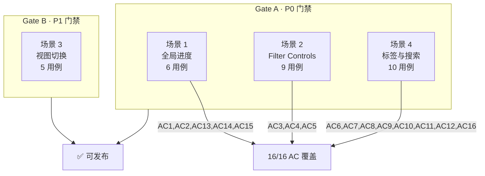
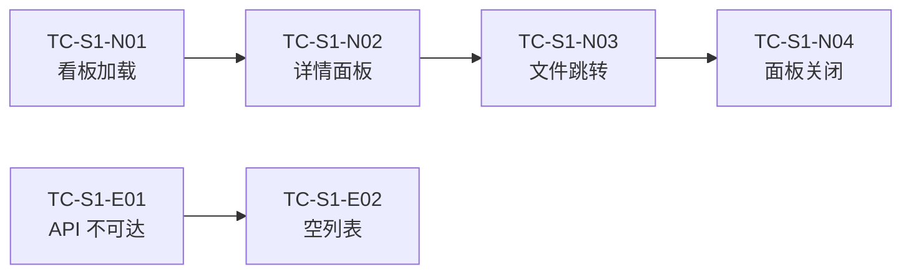
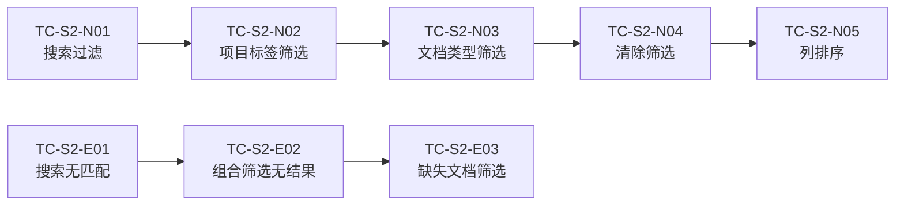
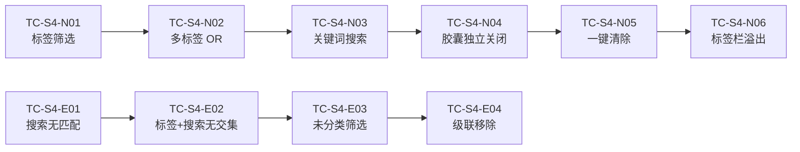

# 测试设计

> | v3.0.0 | 2026-05-27 | deepseek-v4-pro | 📎 [CLAUDE.md](../../../CLAUDE.md) |

> **导航**: [← 技术评审](./技术评审.md) · [实施报告 →](./实施报告.md)
>
> **来源引用**：基于 [故事任务](./故事任务.md) §5 AC# 与 [使用场景](./使用场景.md) §1 场景 1–4，一一对应。

---

[架构总览](#测试架构总览) · [§0 基线](#s-0-基线溯源) · [§1 场景 1](#s-1-场景-1-项目管理者查看全局进度) · [§2 场景 2](#s-2-场景-2-开发者搜索定位故事) · [§3 场景 3](#s-3-场景-3-浏览模式切换) · [§4 场景 4](#s-4-场景-4-通过标签栏与关键词快速定位) · [§5 Gate](#s-5-gate-交接)

## 概述

基于故事任务 AC 与使用场景的测试用例集，四场景四类用例（正常/边界/异常/回归），每用例 Given/When/Then 可独立执行。§5 定义 Gate A/B 交接信令。

### 主要价值

- 🎯 与使用场景一一对应 — 4 组测试用例完整覆盖 4 个使用场景
- 🔒 异常路径可见 — 每场景含 API 失败、空状态、错误恢复用例
- ⚡ 每用例 Given/When/Then 可独立执行 — 不依赖上下文推断
- 🔗 双向跳转 — 每场景链接回使用场景，使用场景链接到此

---

## 测试架构总览

### 用例分布

- 🟢 **Gate A (P0) 正常路径**: 14 用例 — [场景 1](#s-1-场景-1-项目管理者查看全局进度) 4 例 · [场景 2](#s-2-场景-2-开发者搜索定位故事) 5 例 · [场景 4](#s-4-场景-4-通过标签栏与关键词快速定位) 5 例
- 🔴 **Gate A (P0) 边界/异常**: 10 用例 — [场景 1](#s-1-场景-1-项目管理者查看全局进度) 2 例 · [场景 2](#s-2-场景-2-开发者搜索定位故事) 4 例 · [场景 4](#s-4-场景-4-通过标签栏与关键词快速定位) 4 例
- 🔵 **Gate B (P1) 正常路径**: 5 用例 — [场景 3](#s-3-场景-3-浏览模式切换) 4 例 · [场景 4](#s-4-场景-4-通过标签栏与关键词快速定位) 1 例
- ✅ **AC 覆盖**: [16/16](./故事任务.md#s-3-ac) — AC1–AC5, AC13–AC16 归 Gate A · AC6–AC12 归 Gate B

---

## §0 基线溯源

| 使用场景 | 测试用例 | 覆盖 AC# |
|---------|---------|----------|
| [场景 1: 项目管理者查看全局进度](./使用场景.md#场景-1-项目管理者查看全局进度) | [TC-S1-N01–N04](#s-1-场景-1-项目管理者查看全局进度) · [TC-S1-E01–E02](#s-1-场景-1-项目管理者查看全局进度) | [AC1](./故事任务.md#s-3-ac), [AC2](./故事任务.md#s-3-ac), [AC9](./故事任务.md#s-3-ac), [AC10](./故事任务.md#s-3-ac), [AC11](./故事任务.md#s-3-ac) |
| [场景 2: 开发者搜索定位故事](./使用场景.md#场景-2-开发者搜索定位故事) | [TC-S2-N01–N05](#s-2-场景-2-开发者搜索定位故事) · [TC-S2-E01–E03](#s-2-场景-2-开发者搜索定位故事) | [AC3](./故事任务.md#s-3-ac), [AC4](./故事任务.md#s-3-ac), [AC5](./故事任务.md#s-3-ac), [AC6](./故事任务.md#s-3-ac), [AC7](./故事任务.md#s-3-ac), [AC8](./故事任务.md#s-3-ac), [AC12](./故事任务.md#s-3-ac) |
| [场景 3: 浏览模式切换](./使用场景.md#场景-3-浏览模式切换) | [TC-S3-N01–N04](#s-3-场景-3-浏览模式切换) | [AC1](./故事任务.md#s-3-ac) |
| [场景 4: 标签栏与关键词快速定位](./使用场景.md#场景-4-通过标签栏与关键词快速定位) | [TC-S4-N01–N06](#s-4-场景-4-通过标签栏与关键词快速定位) · [TC-S4-E01–E04](#s-4-场景-4-通过标签栏与关键词快速定位) | [AC6](./故事任务.md#s-3-ac), [AC7](./故事任务.md#s-3-ac), [AC8](./故事任务.md#s-3-ac), [AC9](./故事任务.md#s-3-ac), [AC10](./故事任务.md#s-3-ac), [AC11](./故事任务.md#s-3-ac), [AC12](./故事任务.md#s-3-ac), [AC16](./故事任务.md#s-3-ac) |

---

## §1 场景 1: 项目管理者查看全局进度

> 📋 对应使用场景: [场景 1: 项目管理者查看全局进度](./使用场景.md#场景-1-项目管理者查看全局进度)
>
> 🎯 覆盖 AC: [AC1](./故事任务.md#s-3-ac) (列表加载) · [AC2](./故事任务.md#s-3-ac) (详情面板) · [AC9](./故事任务.md#s-3-ac) (文件跳转) · [AC10](./故事任务.md#s-3-ac) (面板关闭) · [AC11](./故事任务.md#s-3-ac) (API 错误)

### 正常路径

#### TC-S1-N01: 故事列表加载与看板渲染
| Given | 远端 API 返回故事数据 | When | 页面加载完成 | Then | 看板五列渲染，每列含故事卡片与计数 |

#### TC-S1-N02: 故事详情面板展示
| Given | 故事列表已加载，看板视图展示 | When | 点击故事卡片 | Then | 详情侧面板从右侧滑入，展示描述/下一步/通知状态/日志状态/文件清单 |

#### TC-S1-N03: 文件点击跳转 AICR
| Given | 详情面板打开，文件清单已展示 | When | 点击文件行 | Then | 跳转到 `../aicr/index.html?key={encodedPath}`，AICR 面板展示文件内容 |

#### TC-S1-N04: 详情面板关闭
| Given | 详情面板打开 | When | 点击返回按钮 / 点击遮罩 / 按 Escape | Then | 侧面板滑出，回到看板视图，selectedStory 为 null |

### 边界/异常

#### TC-S1-E01: API 不可达
| Given | 网络断开或 API 服务不可用 | When | 页面加载 | Then | 展示错误状态（YiErrorState），含错误信息 + 重试按钮；不展示空白页 |

#### TC-S1-E02: 故事列表为空
| Given | API 返回空列表或无故事数据 | When | 页面加载完成 | Then | 展示空状态（YiEmptyState），提示"暂无故事任务" |

### 回归

#### TC-S1-R01: 状态判定准确性
| Given | 故事包含 故事任务.md + 使用场景.md + 实施报告.md + 测试报告.md + 自改进复盘.md | When | 数据加载完成 | Then | 状态判定为"运营"（5/5 文档） |

#### TC-S1-R02: 部分文档状态判定
| Given | 故事仅包含 故事任务.md + 使用场景.md | When | 数据加载完成 | Then | 状态判定为"设计"（最高阶段为使用场景） |

---

## §2 场景 2: 开发者搜索定位故事

> 📋 对应使用场景: [场景 2: 开发者搜索定位故事](./使用场景.md#场景-2-开发者搜索定位故事)
>
> 🎯 覆盖 AC: [AC3](./故事任务.md#s-3-ac) (搜索过滤) · [AC4](./故事任务.md#s-3-ac) (项目标签筛选) · [AC5](./故事任务.md#s-3-ac) (文档类型筛选) · [AC6](./故事任务.md#s-3-ac) (缺失文档筛选) · [AC7](./故事任务.md#s-3-ac) (列排序) · [AC8](./故事任务.md#s-3-ac) (清除筛选) · [AC12](./故事任务.md#s-3-ac) (搜索无匹配)

### 正常路径

#### TC-S2-N01: 关键词搜索
| Given | 故事列表已加载，含"aicr"和"story"故事 | When | 搜索框输入"aicr" | Then | 输入停止 300ms 后列表仅显示名称含"aicr"的故事 |

#### TC-S2-N02: 项目标签筛选
| Given | 故事列表已加载，含多个项目标签 | When | 点击"YiWeb"项目标签 | Then | 列表仅显示 YiWeb 项目下的故事，标签高亮，统计信息同步更新 |

#### TC-S2-N03: 文档类型筛选（Filter Controls 类型按钮）
| Given | 故事列表已加载，Filter Controls 展开 | When | 点击类型按钮"实施报告" | Then | 按钮 active 态，列表仅显示已包含实施报告的故事 |

#### TC-S2-N03b: 故事下拉筛选
| Given | 故事列表已加载，Filter Controls 展开 | When | 从故事下拉框选择目标故事 | Then | 列表精确定位到该故事，其项目标签自动选中 |

#### TC-S2-N04: 清除筛选（胶囊 × 按钮）
| Given | 已应用搜索关键词 + 项目标签 + 文档类型筛选 | When | 点击筛选胶囊 × 按钮逐个移除 | Then | 仅该条件移除，其他条件保持，列表即时更新 |

#### TC-S2-N04b: 清除所有筛选
| Given | 已应用多个筛选条件 | When | 点击"清除"按钮或按 Escape | Then | 所有筛选条件重置，排序恢复默认，完整故事列表恢复，筛选胶囊行消失 |

#### TC-S2-N05: 列排序
| Given | 列表视图已加载 | When | 点击"最后修改"列头 | Then | 列表按最后修改日期降序排列；再次点击切换为升序 |

#### TC-S2-N06: Filter Controls 折叠
| Given | Filter Controls 展开 | When | 点击"收起"按钮 | Then | 3 组控件隐藏，筛选条件保持；再次点击展开恢复显示 |

### 边界/异常

#### TC-S2-E01: 搜索无匹配
| Given | 故事列表已加载 | When | 搜索不存在的故事名"nonexistent" | Then | 展示空状态提示"未找到匹配故事" |

#### TC-S2-E02: 组合筛选无结果
| Given | 已选择项目标签"YiWeb" | When | 再选择文档类型筛选（YiWeb 下无故事包含该文档） | Then | 展示空结果 + 清除按钮提示 |

#### TC-S2-E03: 缺失文档筛选
| Given | 故事列表已加载，Filter Controls 展开 | When | 点击缺失按钮"测试报告" | Then | 列表仅显示缺少测试报告的故事；按钮 active，其他缺失按钮取消 active（单选互斥） |

#### TC-S2-E04: 项目标签与故事标签双向级联
| Given | 故事列表已加载 | When | 选择故事后，再移除其最后一个匹配项目标签 | Then | 该故事标签自动取消选中 |

### 回归

#### TC-S2-R01: 筛选条件 AND 叠加
| Given | 已选择项目标签 A + 文档类型 B | When | 查看筛选结果 | Then | 每个结果同时满足：属于项目 A AND 包含文档 B |

#### TC-S2-R02: 视图切换后筛选保持
| Given | 已应用搜索 + 标签筛选 | When | 切换到卡片视图 | Then | 筛选条件保持，卡片网格展示过滤后故事 |

#### TC-S2-R03: 统计栏按钮与 Filter Controls 类型按钮联动
| Given | 故事列表已加载 | When | 点击统计栏"开发"按钮 | Then | Filter Controls 类型"开发"按钮同步 active；再次点击取消时同步取消 |

---

## §3 场景 3: 浏览模式切换

> 📋 对应使用场景: [场景 3: 浏览模式切换](./使用场景.md#场景-3-浏览模式切换)
>
> 🎯 覆盖 AC: [AC1](./故事任务.md#s-3-ac) (列表加载 — 所有视图共用)

### 正常路径

#### TC-S3-N01: 看板 → 卡片切换
| Given | 默认看板视图已加载 | When | 点击"卡片"视图按钮 | Then | 切换为卡片网格布局，viewMode 为 'cards' |

#### TC-S3-N02: 卡片 → 列表切换
| Given | 卡片视图已加载 | When | 点击"列表"视图按钮 | Then | 切换为表格布局，viewMode 为 'list'，StoryListTable 渲染 |

#### TC-S3-N03: 列表 → 看板切换
| Given | 列表视图已加载 | When | 点击"看板"视图按钮 | Then | 切换回看板布局，viewMode 为 'board'，五列渲染 |

#### TC-S3-N04: 筛选条件下视图切换
| Given | 已应用搜索关键词 + 项目标签筛选 | When | 从看板切换到列表视图 | Then | 筛选条件保持，列表中仅显示过滤后故事 |

### 回归

#### TC-S3-R01: 排序仅在列表视图生效
| Given | 列表视图中已按名称排序 | When | 切换到看板视图 | Then | 看板列内故事按默认顺序排列（排序为列表视图专属功能） |

---

## §4 场景 4: 通过标签栏与关键词快速定位

> 📋 对应使用场景: [场景 4: 通过标签栏与关键词快速定位](./使用场景.md#场景-4-通过标签栏与关键词快速定位)
>
> 🎯 覆盖 AC: [AC6](./故事任务.md#s-3-ac) (标签筛选) · [AC7](./故事任务.md#s-3-ac) (多标签 OR) · [AC8](./故事任务.md#s-3-ac) (未分类筛选) · [AC9](./故事任务.md#s-3-ac) (胶囊展示) · [AC10](./故事任务.md#s-3-ac) (胶囊独立关闭) · [AC11](./故事任务.md#s-3-ac) (清除筛选) · [AC12](./故事任务.md#s-3-ac) (搜索关键词) · [AC16](./故事任务.md#s-3-ac) (标签栏溢出)

### 正常路径

#### TC-S4-N01: 项目标签筛选
| Given | 故事列表已加载，标签栏含"YiWeb"和"CDN"项目标签 | When | 点击"YiWeb"标签 | Then | 标签高亮含 hash 颜色编码；列表仅显示 YiWeb 项目下的故事；标签显示为活跃筛选胶囊 |

#### TC-S4-N02: 多标签 OR 筛选
| Given | 已选中"YiWeb"标签 | When | 继续点击"CDN"标签 | Then | 两标签均高亮含颜色；列表显示 YiWeb 或 CDN 项目的故事（并集）；两胶囊并排展示 |

#### TC-S4-N03: 关键词搜索（300ms 防抖）
| Given | 故事列表已加载 | When | 搜索框输入"story" | Then | 输入停止 300ms 后列表过滤为名称/描述/下一步含"story"的故事；搜索词显示为"搜索: story"筛选胶囊 |

#### TC-S4-N04: 筛选胶囊独立关闭
| Given | 已应用标签"YiWeb"+标签"CDN"+搜索"story" | When | 点击"CDN"胶囊的 × | Then | "CDN"标签取消高亮；列表仅显示 YiWeb AND 搜索"story"的结果；其他胶囊保持不变 |

#### TC-S4-N05: 一键清除所有筛选
| Given | 已应用标签"YiWeb"+搜索"story" | When | 点击"清除"按钮或按 Escape | Then | 所有标签和搜索条件清除；筛选胶囊行消失；"全部"按钮高亮；完整故事列表恢复 |

#### TC-S4-N06: 标签栏溢出与渐隐
| Given | 标签数量超过可视区宽度 | When | 页面渲染标签栏 | Then | 标签栏可水平滚动；右侧渐隐指示可见（scrollWidth > clientWidth）；滚至最右时右渐隐消失 |

### 边界/异常

#### TC-S4-E01: 搜索无匹配
| Given | 故事列表已加载 | When | 搜索不存在的名称"xyznonexist" | Then | 展示空状态"没有匹配的故事"+ 清除筛选条件按钮 |

#### TC-S4-E02: 标签 + 搜索无交集
| Given | 已选标签"YiWeb" | When | 搜索 YiWeb 项目下不存在的关键词 | Then | 展示空状态 + 清除按钮提示 |

#### TC-S4-E03: 未分类筛选
| Given | 存在 3 个无项目标签的故事 | When | 点击"未分类 (3)"按钮 | Then | 列表仅显示 3 个无标签故事；按钮高亮；与其他项目标签互斥 |

#### TC-S4-E04: 级联移除子故事标签
| Given | 通过故事下拉选择"aicr"→项目标签"YiWeb"自动选中 | When | 移除"YiWeb"项目标签（点击胶囊 ×） | Then | "aicr"故事标签自动取消选中 |

### 回归

#### TC-S4-R01: 标签颜色稳定性
| Given | 标签栏含"YiWeb"标签 | When | 两次页面加载（或切换视图） | Then | "YiWeb"标签颜色始终一致（相同输入→相同 hue） |

#### TC-S4-R02: 搜索 + 标签 AND 叠加
| Given | 已选标签"YiWeb" | When | 搜索框输入"story" | Then | 结果同时满足：属于 YiWeb 项目 AND 名称/描述/下一步含"story" |

## §5 Gate 交接

### Gate A 交接信令

| 信号 | 值 |
|------|-----|
| P0 用例 ID | TC-S1-N01, TC-S1-N02, TC-S1-N04, TC-S1-E01, TC-S2-N01, TC-S2-N02, TC-S2-N04, TC-S2-E01, TC-S2-E02, TC-S4-N01, TC-S4-N02, TC-S4-N03, TC-S4-N04, TC-S4-N05, TC-S4-E01, TC-S4-E02 |
| AC 覆盖 | 16/16 |
| P0 阻塞问题 | 无 |
| 可进入实现 | ✅ |

### Gate B 交接信令

| 信号 | 值 |
|------|-----|
| P1 用例 ID | TC-S3-N01, TC-S3-N02, TC-S3-N03, TC-S3-N04, TC-S4-N06 |
| 回归用例 | TC-S1-R01, TC-S1-R02, TC-S2-R01, TC-S2-R02, TC-S2-R03, TC-S3-R01, TC-S4-R01, TC-S4-R02 |
| 门禁通过 | ✅ |
| 可交付 | ✅ |

---

> **变更记录**
> | 日期 | 变更 | 触发 | 证据 |
> |------|------|------|------|
> | 2026-05-26 | 基线生成 | 源码分析 | 故事任务 §5 |
> | 2026-05-27 | 重构为三场景结构，采用 aicr-story 模板：测试架构总览 mermaid · §0 基线溯源 · §1–§3 每场景四类用例 · §4 Gate A/B 交接信令 | /rui doc | 故事任务 AC# · 使用场景 §1 |
> | 2026-05-27 | 场景 2 测试用例更新：新增 TC-S2-N03b（故事下拉筛选）、TC-S2-N04 拆分（胶囊逐个移除/全部清除）、TC-S2-N06（Filter Controls 折叠）、TC-S2-E04（双向级联）、TC-S2-R03（统计栏与类型按钮联动）；缺失文档筛选描述更新为按钮组交互 | /rui update | 故事任务 v2.1.0 · 技术评审 v2.1.0 |
| 2026-05-27 | 结构拆分（v3.0.0）：新增 §4 场景 4「通过标签栏与关键词快速定位」— 6 正常用例（标签筛选/多标签OR/搜索防抖/胶囊关闭/一键清除/标签栏溢出）+ 4 边界/异常用例（搜索无匹配/交集为空/未分类筛选/级联移除）+ 2 回归用例（颜色稳定性/AND叠加）；§4 Gate 顺延为 §5；Gate A/B 信令更新 | /rui update | 故事任务 v3.0.0 · 使用场景 v3.0.0 · 技术评审 v3.0.0 |
