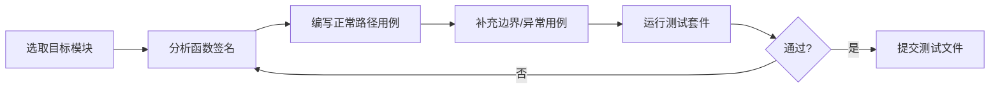
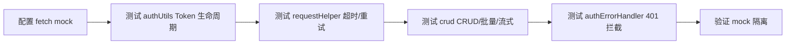
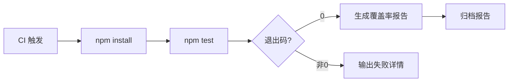
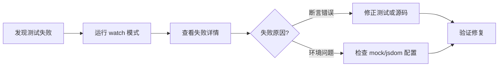

> | v1.0.0 | 2026-05-22 | deepseek-v4-pro | 🌿 feat/test-framework-setup | ⏱️ — | 📎 [CLAUDE.md](../../../CLAUDE.md) |

> **导航**: [← YiWeb-故事任务](./YiWeb-故事任务.md) · [YiWeb-技术评审 →](./YiWeb-技术评审.md)

> **来源引用**: 基于 [YiWeb-故事任务](./YiWeb-故事任务.md) §1 Story 1–4 的用户操作推导。需求来源：L-1 基建补齐推荐。

---

### 主要价值

- 🎯 覆盖全部用户角色 — 项目维护者编写测试、CI 运行测试、开发者查看报告
- 🔒 异常路径可见 — 每场景含正常路径 + 至少 1 个异常/边界路径
- ⚡ 命令即操作 — 每个场景映射到可执行的 npm/vitest 命令
- 📊 场景覆盖矩阵 — 每场景显式溯源至故事任务 FP# 和 AC#

---

## §1 使用场景

### 场景 1: 项目维护者初始化测试框架

**角色**: 项目维护者
**目标**: 在零构建链项目中引入 Vitest，不破坏现有 ESM 架构

| 步骤 | 操作 | 预期结果 |
|------|------|---------|
| 1 | 在项目根目录执行初始化 | 生成 package.json，含 `"type": "module"` |
| 2 | 创建 `vitest.config.js` | 配置 ESM 模式 + resolve.alias 路径映射 |
| 3 | 创建 `test/smoke.test.js` | 导入 `/cdn/utils/core/error.js` 并验证 ErrorCodes 定义 |
| 4 | 运行 `npx vitest run` | 1 个测试通过，退出码 0 |

**空状态**: package.json 已存在时 → 合并 vitest 依赖而非覆盖
**错误恢复**: vitest 安装失败 → 检查 Node.js 版本 ≥ 18，网络可达 npm registry

---

### 场景 2: 开发者编写 CDN 工具层单元测试

**角色**: 开发者
**目标**: 为 error/log/validation/storage 等工具模块建立测试安全网

| 步骤 | 操作 | 预期结果 |
|------|------|---------|
| 1 | 创建 `test/cdn/utils/core/error.test.js` | 覆盖 createError / ErrorCodes / ErrorTypes |
| 2 | 创建 `test/cdn/utils/core/log.test.js` | 覆盖 logInfo/logWarn/logError 格式 |
| 3 | 创建 `test/cdn/utils/core/validation.test.js` | 覆盖类型校验、格式校验、边界值 |
| 4 | 创建 `test/cdn/utils/core/storage.test.js` | 覆盖 localStorage 读写、JSON 序列化异常 |
| 5 | 创建 `test/cdn/utils/core/string.test.js` 等 | 覆盖字符串/数组/对象工具函数 |
| 6 | 运行 `npx vitest run test/cdn/` | ≥ 30 条用例全部通过 |

**空状态**: 无测试文件 → 从 error.js（依赖最少、纯函数最多）开始
**错误恢复**: mock 未清理导致测试污染 → `afterEach` 中 `vi.clearAllMocks()`

---

### 场景 3: 开发者测试 API 服务层

**角色**: 开发者
**目标**: 在 mock fetch 环境下验证请求封装、认证、错误处理

| 步骤 | 操作 | 预期结果 |
|------|------|---------|
| 1 | 创建 `test/src/core/services/helper/authUtils.test.js` | Token 存储/读取/清除/过期判定正确 |
| 2 | 创建 `test/src/core/services/helper/requestHelper.test.js` | 超时抛出 REQUEST_TIMEOUT，网络错误抛出 NETWORK_FETCH_FAILED |
| 3 | 创建 `test/src/core/services/modules/crud.test.js` | GET/POST/PUT/DELETE 方法正确，缓存命中/失效逻辑正确 |
| 4 | 创建 `test/src/core/services/helper/authErrorHandler.test.js` | 401 响应触发登录弹窗，非 401 错误透传 |
| 5 | 运行 `npx vitest run test/src/core/services/` | ≥ 15 条用例全部通过 |

**空状态**: authUtils 是其他模块的依赖 → 优先测试
**错误恢复**: fetch mock 跨测试泄漏 → 每个测试文件 `beforeEach` 重置 `global.fetch`

---

### 场景 4: CI 环境自动运行测试

**角色**: CI 系统
**目标**: 在无头环境运行全部测试并输出报告

| 步骤 | 操作 | 预期结果 |
|------|------|---------|
| 1 | CI checkout 代码后执行 `npm install` | vitest 及其依赖安装完成 |
| 2 | 执行 `npm test` | 全部测试套件运行，退出码 0 |
| 3 | 执行 `npm run test:coverage` | 生成 text/json/html 覆盖率报告 |
| 4 | 归档 `coverage/` 和 `test-results.xml` | CI 面板可查看趋势 |

**空状态**: 首次 CI 运行无历史数据 → 建立基线覆盖率数据
**错误恢复**: CI 环境 Node 版本不匹配 → package.json engines 字段声明 `>=18`

---

### 场景 5: 开发者调试失败测试

**角色**: 开发者
**目标**: 快速定位失败测试的原因并修复

| 步骤 | 操作 | 预期结果 |
|------|------|---------|
| 1 | 运行 `npm run test:watch` | Vitest 进入 watch 模式，仅重跑相关测试 |
| 2 | 按 `f` 过滤失败测试 | 仅显示失败用例，含 diff 输出 |
| 3 | 修复后保存文件 | watch 模式自动重跑，通过后显示绿色 |
| 4 | 运行 `npm test` 确认全量通过 | 退出码 0 |

---

## §2 场景覆盖矩阵

| 场景 | 关联 FP# | 关联 AC# | 正常路径 | 空状态 | 错误恢复 |
|------|---------|---------|:--:|:--:|:--:|
| 场景 1: 初始化框架 | FP1, FP2 | AC1, AC2, AC3 | ✅ | ✅ | ✅ |
| 场景 2: CDN 工具层测试 | FP3 | AC4 | ✅ | ✅ | ✅ |
| 场景 3: API 服务层测试 | FP4 | AC5 | ✅ | ✅ | ✅ |
| 场景 4: CI 运行 | FP6, FP7 | SC6 | ✅ | ✅ | ✅ |
| 场景 5: 调试失败 | FP6 | SC4 | ✅ | — | ✅ |

---

> **变更记录**
> | 日期 | 变更 | 触发 | 证据 |
> |------|------|------|------|
> | 2026-05-22 | 初始生成 | /rui doc | YiWeb-故事任务 §1 Story 1–4 |
