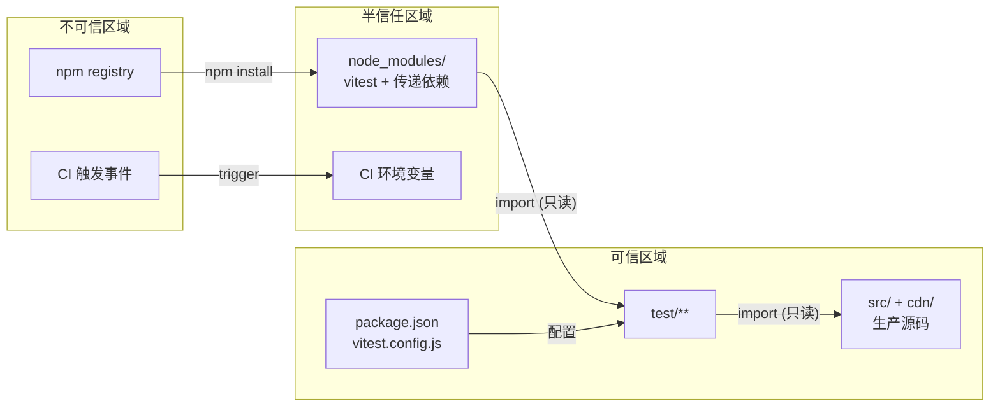

> | v1.0.0 | 2026-05-22 | deepseek-v4-pro | 🌿 feat/test-framework-setup | ⏱️ — | 📎 [CLAUDE.md](../../../CLAUDE.md) |

> **导航**: [← YiWeb-技术评审](./YiWeb-技术评审.md) · [YiWeb-实施报告 →](./YiWeb-实施报告.md)

> **来源引用**: 基于 [YiWeb-技术评审](./YiWeb-技术评审.md) §7 安全考量 + [YiWeb-故事任务](./YiWeb-故事任务.md) §6 风险与假设。

> **独立审计标记**: 本审计由 security agent 独立执行，不依赖 coder 自评。

[§1 资产识别](#sec1-assets) · [§2 STRIDE 威胁建模](#sec2-stride) · [§3 信任边界](#sec3-trust) · [§4 缓解措施](#sec4-mitigation) · [§5 合规检查](#sec5-compliance)

---

### 主要价值

- 🎯 供应链透明 — 审查 vitest 依赖链，识别潜在攻击面
- 🔒 隔离验证 — 确认测试运行时与生产代码的隔离边界
- ⚡ Mock 安全 — 验证 mock 机制不会意外泄漏到生产环境
- 📊 六类全覆盖 — STRIDE 六类威胁逐项建模

---

## §1 资产识别

| 资产 | 类型 | 敏感度 | 存储位置 |
|------|------|:--:|------|
| package.json | 项目清单文件 | 低 | 项目根目录 |
| vitest.config.js | 测试配置 | 低 | 项目根目录 |
| test/** 测试文件 | 测试代码 | 低 | test/ 目录 |
| vitest 依赖包 | npm 供应链 | 中 | node_modules/ |
| 源码导入路径 | 模块引用 | 低 | import 语句 |
| CI 环境变量 | CI 配置 | 中 | CI 系统 |
| coverage 报告 | 覆盖率数据 | 低 | coverage/ 目录 |

---

## §2 STRIDE 威胁建模

### S — Spoofing（身份伪造）

| 威胁 | 可能性 | 影响 | 缓解 |
|------|:--:|:--:|------|
| 恶意 package.json 伪装为项目文件 | L | L | package.json 仅含测试依赖，不包含生产配置 |
| 伪造 vitest 配置文件注入恶意 alias | L | M | vitest.config.js 由项目维护者编写，不接收外部输入 |

### T — Tampering（数据篡改）

| 威胁 | 可能性 | 影响 | 缓解 |
|------|:--:|:--:|------|
| 测试过程中修改 localStorage 污染开发环境 | L | L | jsdom 提供独立 localStorage 实例，不触碰浏览器真实存储 |
| coverage 报告被篡改以隐藏覆盖率下降 | L | L | CI 归档 coverage/ 为只读制品 |
| node_modules 被植入后门 | M | H | 锁定版本号，定期 `npm audit`，使用 lockfile |

### R — Repudiation（否认）

| 威胁 | 可能性 | 影响 | 缓解 |
|------|:--:|:--:|------|
| 测试结果无审计日志 | L | L | CI 系统记录每次运行的时间戳和结果 |
| 开发者跳过测试提交代码 | M | M | CI 门禁强制 `npm test` 通过才能合并 |

### I — Information Disclosure（信息泄漏）

| 威胁 | 可能性 | 影响 | 缓解 |
|------|:--:|:--:|------|
| coverage 报告含文件绝对路径 | L | L | vitest 默认使用相对路径；CI 日志不公开 |
| 测试文件中硬编码真实 API 密钥 | L | H | 测试使用 mock，禁止 import 真实配置；Code review 扫描 |
| CI 环境变量（API_X_TOKEN）泄漏到测试日志 | M | H | 测试环境不加载 .env；CI 日志屏蔽敏感变量 |

### D — Denial of Service（拒绝服务）

| 威胁 | 可能性 | 影响 | 缓解 |
|------|:--:|:--:|------|
| 测试文件无限循环耗尽 CI 资源 | L | M | vitest --pool=forks 子进程隔离，CI 设置超时（5 分钟） |
| node_modules 体积过大拖慢 CI | L | L | 仅 1 个 devDependency（vitest），总依赖树小 |

### E — Elevation of Privilege（权限提升）

| 威胁 | 可能性 | 影响 | 缓解 |
|------|:--:|:--:|------|
| vitest 插件获取文件系统写权限 | L | M | 不使用 vitest 插件/扩展，仅核心功能 |
| jsdom 沙箱逃逸访问 Node.js API | L | M | vitest --pool=forks 子进程隔离；jsdom 默认禁止 fs 访问 |
| `vi.mock` 劫持模块导入链注入恶意代码 | L | M | mock 仅在测试文件作用域生效，不修改原始模块 |

---

## §3 信任边界

| 边界 | 方向 | 控制 |
|------|------|------|
| npm registry → node_modules | 入站 | package-lock.json 锁定版本 + npm audit |
| node_modules → 测试代码 | 入站 | import 只读，vitest 沙箱隔离 |
| 测试代码 → 生产源码 | 出站 | import 只读，测试不修改源码 |
| CI 环境 → 测试运行时 | 入站 | CI 环境变量最小化，不传敏感值 |
| 测试运行时 → CI 日志 | 出站 | 日志脱敏，屏蔽 Token/密码模式 |

---

## §4 缓解措施

| 措施 | 优先级 | 实施方式 | 验证 |
|------|:--:|------|------|
| 版本锁定 | P0 | package.json 使用精确版本（无 ^/~），生成 package-lock.json | `npm ls vitest` 检查版本 |
| npm audit | P1 | CI pipeline 中 `npm audit --production` | 0 个高危漏洞 |
| Mock 隔离 | P0 | 每个测试文件 `afterEach` 中 `vi.restoreAllMocks()` | TC-R03 验证 |
| CI 超时 | P1 | CI 配置 `timeout-minutes: 5` | 超时自动终止 |
| 无环境变量泄漏 | P0 | vitest 不加载 .env 文件；测试中 mock 所有外部 API | grep 测试文件无 `API_X_TOKEN` |
| 源码只读 | P0 | 测试仅 import，不 write/delete 源文件 | TC-R01 验证 |
| lockfile 提交 | P1 | package-lock.json 纳入 git | `git ls-files package-lock.json` |

---

## §5 合规检查

| 检查项 | 状态 | 说明 |
|------|:--:|------|
| 依赖许可证 | ✅ | vitest MIT 许可证，与项目兼容 |
| 个人数据处理 | N/A | 测试不涉及个人数据 |
| 凭证管理 | ✅ | 测试使用 mock，不访问真实 API 凭证 |
| 日志保留 | N/A | CI 日志按 CI 系统策略自动过期 |
| 第三方审计 | ⚠️ | node_modules 传递依赖需定期 `npm audit` |
| 安全更新 | ⚠️ | vitest 安全更新需手动 `npm update`，建议 CI 定期检查 |

---

> **变更记录**
> | 日期 | 变更 | 触发 | 证据 |
> |------|------|------|------|
> | 2026-05-22 | 初始审计 — 独立执行 | /rui doc security agent | YiWeb-技术评审 §7 |
