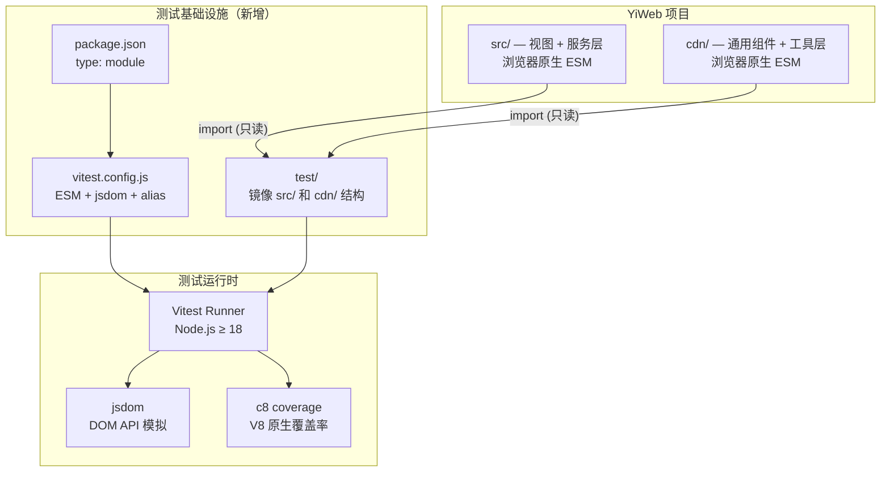
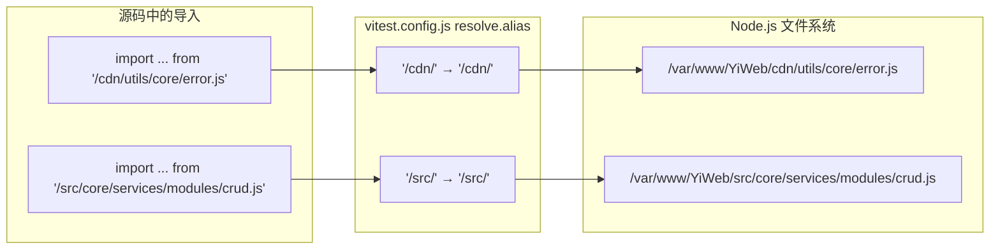
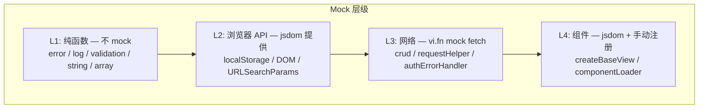
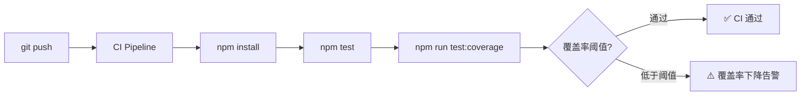

> | v1.0.0 | 2026-05-22 | deepseek-v4-pro | 🌿 feat/test-framework-setup | ⏱️ — | 📎 [CLAUDE.md](../../../CLAUDE.md) |

> **导航**: [← YiWeb-使用场景](./YiWeb-使用场景.md) · [YiWeb-测试设计 →](./YiWeb-测试设计.md) · [YiWeb-安全审计 →](./YiWeb-安全审计.md)

> **来源引用**: 基于 [YiWeb-故事任务](./YiWeb-故事任务.md) §2 FP1–FP7 + [YiWeb-使用场景](./YiWeb-使用场景.md) 场景 1–5。

[§0 基线溯源](#sec0-baseline) · [§1 架构概览](#sec1-arch) · [§2 配置设计](#sec2-config) · [§3 路径别名映射](#sec3-alias) · [§4 Mock 策略](#sec4-mock) · [§5 测试目录结构](#sec5-structure) · [§6 CI 集成](#sec6-ci) · [§7 安全考量](#sec7-security)

---

### 主要价值

- 🎯 零侵入 — 测试基础设施完全独立于源码，不修改任何 src/ 或 cdn/ 文件
- 🔒 ESM 原生 — Vitest 原生支持 import/export，无需 babel/ts-jest 等 transform 插件
- ⚡ 快反馈 — watch 模式仅重跑受影响测试，增量运行 < 2 秒
- 📊 可量化 — 内置覆盖率报告（c8/istanbul），支持 text/json/html 多格式

---

<a id="sec0-baseline"></a>

## §0 基线溯源

| 溯源目标 | 本文档章节 | 关系 |
|---------|-----------|------|
| FP1: package.json 初始化 | §2 配置设计 | 技术实现 |
| FP2: Vitest 配置 | §2 配置设计 + §3 路径别名映射 | 技术实现 |
| FP3: CDN 工具层测试 | §4 Mock 策略 + §5 测试目录结构 | 测试策略 |
| FP4: API 服务层测试 | §4 Mock 策略（fetch mock） | Mock 策略 |
| FP5: 视图框架测试 | §4 Mock 策略（jsdom） | Mock 策略 |
| FP6: 测试命令集成 | §2 配置设计 | 配置实现 |
| FP7: CI 就绪 | §6 CI 集成 | CI 配置 |
| 场景 1: 初始化框架 | §1 架构概览 + §2 配置设计 | 端到端流程 |
| 场景 3: API 服务层测试 | §4 Mock 策略（fetch mock） | Mock 策略 |

---

<a id="sec1-arch"></a>

## §1 架构概览



**核心决策**:

| 决策 | 选项 | 选择 | 理由 |
|------|------|------|------|
| 测试框架 | Vitest vs Jest vs Mocha | Vitest | 原生 ESM 支持，零配置启动，与 Vite 生态兼容（未来若引入构建） |
| DOM 环境 | jsdom vs happy-dom vs 无 | jsdom | API 兼容性最广，Canvas/SVG 支持好 |
| Mock 方式 | vi.mock vs vi.fn vs 手动 | vi.fn + vi.mock | Vitest 内置，无需额外依赖 |
| 覆盖率引擎 | c8 vs istanbul vs v8 | c8（Vitest 默认） | V8 原生覆盖率，零配置，速度快 |
| 包管理 | npm vs pnpm vs yarn | npm | Node.js 内置，零额外依赖 |

---

<a id="sec2-config"></a>

## §2 配置设计

### package.json

```json
{
  "name": "yiweb",
  "version": "1.0.0",
  "type": "module",
  "private": true,
  "description": "YiWeb — browser-native ESM single-page app",
  "engines": {
    "node": ">=18.0.0"
  },
  "scripts": {
    "test": "vitest run",
    "test:watch": "vitest",
    "test:coverage": "vitest run --coverage"
  },
  "devDependencies": {
    "vitest": "^1.6.0"
  }
}
```

### vitest.config.js

```javascript
import { defineConfig } from 'vitest/config';
import { resolve } from 'node:path';

const ROOT = resolve(import.meta.dirname);

export default defineConfig({
  test: {
    // ESM 模式 — 不需要 transform
    environment: 'jsdom',
    globals: true,

    // 测试文件匹配
    include: ['test/**/*.test.js'],

    // 隔离：每个文件独立上下文
    pool: 'forks',
    isolate: true,

    // 覆盖率
    coverage: {
      provider: 'v8',
      reporter: ['text', 'json', 'html'],
      include: ['cdn/utils/core/**/*.js', 'src/core/services/**/*.js'],
      exclude: ['test/**'],
    },
  },

  // 路径别名 — 将浏览器裸路径映射到文件系统
  resolve: {
    alias: {
      '/cdn/': resolve(ROOT, 'cdn/'),
      '/src/': resolve(ROOT, 'src/'),
    },
  },
});
```

### 路径别名映射表

| 浏览器导入路径 | 文件系统路径 | 用途 |
|---------------|-------------|------|
| `/cdn/utils/core/error.js` | `cdn/utils/core/error.js` | 错误处理 |
| `/cdn/utils/core/log.js` | `cdn/utils/core/log.js` | 日志 |
| `/cdn/utils/core/validation.js` | `cdn/utils/core/validation.js` | 校验 |
| `/cdn/utils/core/storage.js` | `cdn/utils/core/storage.js` | 存储 |
| `/cdn/utils/view/baseView.js` | `cdn/utils/view/baseView.js` | 视图框架 |
| `/src/core/services/helper/requestHelper.js` | `src/core/services/helper/requestHelper.js` | 请求封装 |
| `/src/core/services/modules/crud.js` | `src/core/services/modules/crud.js` | CRUD |
| `/src/core/services/helper/authUtils.js` | `src/core/services/helper/authUtils.js` | 认证工具 |

---

<a id="sec3-alias"></a>

## §3 路径别名映射



**注意**: 裸路径 `/cdn/` 和 `/src/` 在浏览器中由 Web Server 提供根路径映射。Vitest 通过 `resolve.alias` 模拟此行为。如项目新增路径前缀，需同步更新 alias 配置。

---

<a id="sec4-mock"></a>

## §4 Mock 策略



| 层级 | 模块 | Mock 方式 | 清理方式 |
|------|------|---------|---------|
| L1 | error / log / validation / string / array / object | 不 mock — 纯函数测试 | 无需清理 |
| L2 | storage / form / i18n | jsdom 内置（localStorage / URLSearchParams） | `localStorage.clear()` in afterEach |
| L3 | crud / requestHelper / authErrorHandler | `vi.fn().mockResolvedValue()` mock global fetch | `vi.restoreAllMocks()` in afterEach |
| L4 | baseView / componentLoader | jsdom + 手动注册组件到 DOM | `document.body.innerHTML = ''` in afterEach |

### fetch mock 示例模式

```javascript
// 每个测试文件 beforeAll
global.fetch = vi.fn();

// beforeEach: 重置默认行为
beforeEach(() => {
  fetch.mockReset();
  fetch.mockResolvedValue({
    ok: true,
    status: 200,
    json: async () => ({ data: {} }),
    text: async () => '{}',
  });
});

// 单个测试中覆盖
it('handles 401', () => {
  fetch.mockResolvedValueOnce({ ok: false, status: 401 });
  // ...
});
```

---

<a id="sec5-structure"></a>

## §5 测试目录结构

```
test/
├── smoke.test.js                          # Story 1: ESM 导入链验证
├── cdn/
│   └── utils/
│       └── core/
│           ├── error.test.js               # Story 2: 错误处理
│           ├── log.test.js                 # Story 2: 日志
│           ├── validation.test.js          # Story 2: 校验
│           ├── storage.test.js             # Story 2: 存储
│           ├── string.test.js              # Story 2: 字符串工具
│           ├── array.test.js               # Story 2: 数组工具
│           └── object.test.js              # Story 2: 对象工具
│       └── view/
│           └── baseView.test.js            # Story 4: 视图框架
└── src/
    └── core/
        └── services/
            ├── helper/
            │   ├── authUtils.test.js        # Story 3: 认证
            │   ├── requestHelper.test.js    # Story 3: 请求封装
            │   └── authErrorHandler.test.js # Story 3: 认证错误
            └── modules/
                └── crud.test.js            # Story 3: CRUD
```

---

<a id="sec6-ci"></a>

## §6 CI 集成



| 配置项 | 值 | 说明 |
|--------|-----|------|
| Node 版本 | ≥ 18 | Vitest 要求 |
| 安装命令 | `npm install` | 仅 devDependencies |
| 测试命令 | `npm test` | `vitest run` |
| 覆盖率命令 | `npm run test:coverage` | 含 text/json/html 报告 |
| 覆盖率阈值（后续） | 70% | 当前阶段不强制，建基线后启用 |
| 报告归档 | `coverage/` + `test-results.xml` | CI 面板趋势图 |

---

<a id="sec7-security"></a>

## §7 安全考量

| 威胁 | 影响 | 缓解 |
|------|------|------|
| vitest 依赖供应链攻击 | 测试环境代码执行 | 锁定版本号（无 ^/~ 前缀），定期 audit |
| test 文件访问敏感环境变量 | 凭据泄漏 | test 环境不加载 .env 文件，mock 所有外部调用 |
| jsdom 沙箱逃逸 | 测试访问文件系统 | vitest --pool=forks 子进程隔离 |
| coverage 报告泄漏路径信息 | 信息泄漏 | CI 归档 coverage/ 为内部制品，不公开 |

---

> **变更记录**
> | 日期 | 变更 | 触发 | 证据 |
> |------|------|------|------|
> | 2026-05-22 | 初始生成 | /rui doc | YiWeb-故事任务 §2 + YiWeb-使用场景 §1 |
