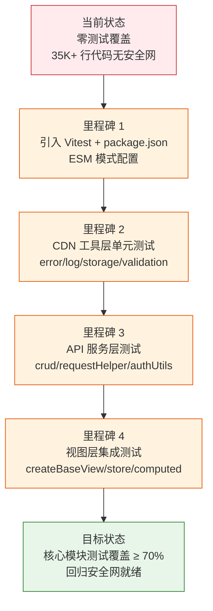

> | v1.0.0 | 2026-05-22 | deepseek-v4-pro | 🌿 feat/test-framework-setup | ⏱️ — | 📎 [CLAUDE.md](../../../CLAUDE.md) |

> **导航**: [YiWeb-使用场景 →](./YiWeb-使用场景.md)

> **来源引用**: 由 L-1 基建完整性检查触发 — I7（测试框架）缺失，CLAUDE.md 标注「测试框架 | None」。基于 `/rui doc "引入测试框架 Vitest"` 生成。

[§1 Story](#sec1-story) · [§2 Requirements](#sec2-requirements) · [§3 成功标准](#sec3-success) · [§4 范围边界](#sec4-scope) · [§5 AC](#sec5-ac) · [§6 风险与假设](#sec6-risks) · [§7 跨文档索引](#sec7-index)

---

### §0 基线声明

> **问题空间基线 (Problem Space Baseline)**: 本文档定义"做什么(WHAT)"和"为什么(WHY)"。所有后续文档的设计、实现、验证、改进决策均必须可追溯至本文档的具体章节。

---

### 需求概述

为 YiWeb 项目引入测试框架，建立单元测试和集成测试基础设施。项目当前零构建链、无 package.json，所有代码为浏览器原生可执行的 ESM 模块。测试框架需兼容 ESM 模式，支持对 `createBaseView` 视图、store/computed/methods 模式、CDN 组件和 API 服务层的测试覆盖。

### 效果示意

### 主要价值

- 🎯 建立测试基础设施 — 从零到一的测试框架引入，为 35K+ 行代码建立安全网
- 🔒 回归保护 — 每次代码变更自动验证核心路径，防止回归
- ⚡ ESM 原生兼容 — Vitest 原生支持 ESM，与项目零构建链哲学对齐
- 📊 覆盖度可见 — 测试报告量化代码质量，驱动持续改进

---

## §1 Story

### Story 1: 引入测试框架并配置 ESM 环境

| 字段 | 内容 |
|------|------|
| 作为 | 项目维护者 |
| 我想要 | 在项目中引入 Vitest 测试框架并配置 ESM 模式 |
| 以便 | 为所有模块提供统一的测试运行环境和断言能力 |
| 优先级 | P0 |
| 范围边界 | 仅配置文件和基础设施，不写业务测试 |
| 依赖 | 无 |

#### 范围外

- 不涉及业务模块的测试用例编写（由 Story 2–4 覆盖）
- 不修改现有源码结构

#### §1.1 User Operations

| # | 操作 | 触发条件 | 操作步骤 | 预期结果 |
|---|------|---------|---------|---------|
| 1 | 初始化 package.json | 项目根目录无 package.json | 创建 package.json，声明 type: "module"，添加 vitest 依赖 | package.json 就绪，`node -e "import('vitest')"` 成功 |
| 2 | 配置 Vitest | package.json 就绪 | 创建 vitest.config.js，配置 ESM 模式 + jsdom 环境 + 路径别名 | `npx vitest run` 可执行 |
| 3 | 编写 smoke test | Vitest 配置完成 | 创建 test/smoke.test.js，验证框架可加载 ESM 模块 | 首个测试通过，验证 ESM 导入链正常 |

---

### Story 2: CDN 工具层单元测试

| 字段 | 内容 |
|------|------|
| 作为 | 项目维护者 |
| 我想要 | 为 CDN 工具层核心模块编写单元测试 |
| 以便 | 确保 error/log/storage/validation 等基础工具的行为正确 |
| 优先级 | P0 |
| 范围边界 | 仅 `cdn/utils/core/` 下的纯函数模块 |
| 依赖 | Story 1 完成 |

#### §1.1 User Operations

| # | 操作 | 触发条件 | 操作步骤 | 预期结果 |
|---|------|---------|---------|---------|
| 1 | 测试 error.js | Vitest 就绪 | 覆盖 createError / ErrorCodes / ErrorTypes / ErrorLevels | 错误创建、类型枚举、消息模板全部通过 |
| 2 | 测试 log.js | error 测试通过 | 覆盖 logInfo/logWarn/logError 输出格式 | 日志级别、格式化、参数传递正确 |
| 3 | 测试 validation.js | log 测试通过 | 覆盖类型检查、格式校验、边界值 | 校验函数边界行为正确 |
| 4 | 测试 storage.js | validation 测试通过 | 覆盖 localStorage 读写、JSON 序列化 | 存储操作正确，异常路径覆盖 |
| 5 | 测试 string/array/object 工具 | storage 测试通过 | 覆盖字符串处理、数组操作、对象合并 | 工具函数边界正确 |

---

### Story 3: API 服务层测试

| 字段 | 内容 |
|------|------|
| 作为 | 项目维护者 |
| 我想要 | 为 API 服务层编写单元测试 |
| 以便 | 确保请求封装、认证头、错误处理、重试逻辑正确 |
| 优先级 | P0 |
| 范围边界 | `src/core/services/` — crud / requestHelper / authUtils / authErrorHandler |
| 依赖 | Story 2 完成 |

#### §1.1 User Operations

| # | 操作 | 触发条件 | 操作步骤 | 预期结果 |
|---|------|---------|---------|---------|
| 1 | 测试 authUtils.js | Story 2 完成 | 覆盖 Token 存储/读取/清除/过期判定 | Token 生命周期管理正确 |
| 2 | 测试 requestHelper.js | authUtils 测试通过 | Mock fetch，覆盖超时/重试/错误码映射 | 请求封装行为正确 |
| 3 | 测试 crud.js | requestHelper 测试通过 | 覆盖 CRUD 操作/批量请求/流式请求/缓存 | API 调用模式正确 |
| 4 | 测试 authErrorHandler.js | crud 测试通过 | 覆盖 401 拦截/登录弹窗触发 | 认证错误处理正确 |

---

### Story 4: 视图层集成测试

| 字段 | 内容 |
|------|------|
| 作为 | 项目维护者 |
| 我想要 | 为 createBaseView 视图框架编写集成测试 |
| 以便 | 确保 store/computed/methods 三件套正确协作 |
| 优先级 | P1 |
| 范围边界 | `cdn/utils/view/baseView.js` + 代表性视图 |
| 依赖 | Story 3 完成 |

#### §1.1 User Operations

| # | 操作 | 触发条件 | 操作步骤 | 预期结果 |
|---|------|---------|---------|---------|
| 1 | 测试 createBaseView | Story 3 完成 | 覆盖视图注册/store 初始化/computed 计算/methods 调用 | 视图框架核心流程正确 |
| 2 | 测试 vueRef 响应式 | createBaseView 测试通过 | 覆盖 ref 创建/读写/依赖追踪 | 响应式系统正确 |
| 3 | 测试组件加载器 | vueRef 测试通过 | 覆盖组件注册/模板加载/渲染 | 组件系统正确 |

---

## §2 Requirements

### 功能点

| FP# | 描述 | 输入 | 输出 | 错误行为 | 优先级 |
|-----|------|------|------|---------|--------|
| FP1 | package.json 初始化 — 创建项目清单，声明 ESM 模块类型 | 项目根目录 | package.json（type: "module" + vitest 依赖） | 文件已存在时合并而非覆盖 | P0 |
| FP2 | Vitest 配置 — ESM 模式 + jsdom 环境 + 路径别名解析 | package.json | vitest.config.js | 路径别名不匹配时降级为手动映射 | P0 |
| FP3 | CDN 工具层测试 — error / log / validation / storage / string / array / object | 源码文件 | test/cdn/utils/core/*.test.js | 纯函数无副作用，mock 不应污染后续测试 | P0 |
| FP4 | API 服务层测试 — crud / requestHelper / authUtils / authErrorHandler | 源码文件 + mock fetch | test/src/core/services/*.test.js | fetch mock 必须隔离，不可跨测试泄漏状态 | P0 |
| FP5 | 视图框架测试 — createBaseView / vueRef / componentLoader | 源码文件 + jsdom | test/cdn/utils/view/*.test.js | jsdom 环境缺失 DOM API 时跳过并报告 | P1 |
| FP6 | 测试命令集成 — `npm test` / `npm run test:watch` / `npm run test:coverage` | vitest.config.js | package.json scripts | vitest 未安装时提示 npm install | P1 |
| FP7 | CI 就绪 — 测试可在无头环境运行，输出 JUnit 报告 | vitest.config.js | test-results.xml | CI 环境变量缺失时降级为终端输出 | P2 |

### 业务规则

| R# | 描述 | 校验方式 | 证据级别 |
|----|------|---------|---------|
| R1 | 测试框架必须兼容浏览器 ESM 语法（import/export） | smoke test 验证 ESM 导入链 | A |
| R2 | 测试不得依赖构建工具（webpack/vite/rollup），Vitest 原生 ESM 模式 | vitest.config.js 无 transform 配置 | A |
| R3 | CDN 工具层测试覆盖率 ≥ 80% | coverage report | B |
| R4 | API 服务层测试覆盖率 ≥ 70% | coverage report | B |
| R5 | 每个测试文件独立运行，不依赖执行顺序 | `vitest --pool=forks` 随机顺序验证 | B |
| R6 | Mock 必须在 afterEach 中清理，不可跨测试泄漏 | 测试内校验 mock 调用计数 | B |

### 数据约束

| 约束 | 类型 | 范围/格式 | 来源 |
|------|------|----------|------|
| package.json type | string | "module" | ESM 规范 |
| vitest 版本 | semver | ^1.x | 稳定版本 |
| 测试文件命名 | string | `*.test.js` | Vitest 默认约定 |
| 测试目录结构 | string | `test/` 镜像 src/ 和 cdn/ 结构 | 项目约定 |
| 覆盖率报告格式 | enum | text / json / html | Vitest 内置 |

---

## §3 成功标准

| SC# | 描述 | 度量方式 | 目标值 | 优先级 | 关联 FP# |
|-----|------|---------|--------|--------|---------|
| SC1 | 从零到首个测试通过 | `npx vitest run` 退出码 0 | 至少 1 个测试通过 | P0 | FP1, FP2 |
| SC2 | CDN 工具层核心模块有测试覆盖 | `npx vitest run test/cdn/` 通过 | ≥ 5 个测试文件，≥ 30 条用例 | P0 | FP3 |
| SC3 | API 服务层核心模块有测试覆盖 | `npx vitest run test/src/core/services/` 通过 | ≥ 3 个测试文件，≥ 15 条用例 | P0 | FP4 |
| SC4 | `npm test` 一键运行全部测试 | `npm test` 退出码 0 | 全部测试套件通过 | P0 | FP6 |
| SC5 | 视图框架有集成测试 | `npx vitest run test/cdn/utils/view/` 通过 | ≥ 1 个测试文件，≥ 5 条用例 | P1 | FP5 |
| SC6 | 测试在 CI 环境可运行 | CI 环境 `npm test` 退出码 0 | 无头环境通过 | P2 | FP7 |

---

## §4 范围边界

### 范围内

| # | 条目 | 关联 FP# | 边界说明 |
|---|------|---------|---------|
| 1 | package.json 创建与 Vitest 配置 | FP1, FP2 | 首次引入包管理器和测试框架 |
| 2 | CDN 工具层单元测试 | FP3 | error / log / validation / storage / string / array / object |
| 3 | API 服务层测试 | FP4 | crud / requestHelper / authUtils / authErrorHandler |
| 4 | 视图框架集成测试 | FP5 | createBaseView / vueRef / componentLoader |
| 5 | 测试命令脚本 | FP6 | test / test:watch / test:coverage |

### 范围外

| # | 条目 | 排除原因 | 替代方案 |
|---|------|---------|---------|
| 1 | 业务视图完整测试（aicr/story/claude） | 属于各自故事的 code 阶段 | 使用 `/rui code <name>` |
| 2 | E2E 测试（Playwright/Cypress） | 需浏览器环境，超出单元测试范围 | 后续独立故事 |
| 3 | 性能测试 / 压力测试 | 非当前阶段需求 | 后续独立故事 |
| 4 | 修改现有源码以支持测试 | 测试先行原则：先建框架，不改源码 | Story 2–4 中按需暴露测试接口 |
| 5 | 构建工具引入（Vite/Webpack） | 违反零构建链约束 | Vitest 原生 ESM 模式满足需求 |

---

## §5 AC

| AC# | Given | When | Then | 门禁 |
|-----|-------|------|------|------|
| AC1 | 项目根目录无 package.json | 执行 Story 1 初始化 | package.json 含 type: "module" + vitest 依赖，vitest.config.js 存在 | Gate A |
| AC2 | Vitest 配置完成 | 运行 `npx vitest run` | 退出码 0，无测试文件时输出 "No test files found"（非错误） | Gate A |
| AC3 | 编写首个 smoke test | 运行 `npx vitest run` | smoke test 通过，验证 ESM 导入链正常 | Gate A |
| AC4 | CDN 工具层测试文件就绪 | 运行 `npx vitest run test/cdn/` | ≥ 5 个测试文件，全部通过，无 mock 泄漏 | Gate A |
| AC5 | API 服务层测试文件就绪 | 运行 `npx vitest run test/src/core/services/` | ≥ 3 个测试文件，全部通过，fetch mock 隔离正确 | Gate A |
| AC6 | `npm test` 配置完成 | 运行 `npm test` | 全部测试套件通过，退出码 0 | Gate B |
| AC7 | 视图框架测试就绪 | 运行 `npx vitest run test/cdn/utils/view/` | ≥ 1 个测试文件，≥ 5 条用例通过 | Gate B |
| AC8 | 测试不修改 src/ 和 cdn/ 下的源码 | `git diff --name-only` 检查 | 仅新增文件（package.json, vitest.config.js, test/**），无源码修改 | Gate B |

---

## §6 风险与假设

| # | 风险/假设 | 类型 | 可能性 | 影响 | 缓解/验证策略 | 关联 FP# |
|---|----------|------|--------|------|-------------|---------|
| 1 | 引入 package.json 后开发者可能意外引入构建工具依赖 | 风险 | M | H | CLAUDE.md 约束明确禁止构建工具；vitest 原生 ESM 模式不需要 transform | FP1 |
| 2 | jsdom 无法完全模拟浏览器 DOM API | 风险 | M | M | 视图测试限定为逻辑层（store/computed/methods），DOM 渲染测试暂不覆盖 | FP5 |
| 3 | CDN 模块路径别名（/cdn/、/src/）在 Node 环境无法解析 | 风险 | H | H | vitest.config.js 配置 resolve.alias 映射到文件系统绝对路径 | FP2 |
| 4 | fetch mock (vitest-fetch-mock) 与流式请求不兼容 | 风险 | M | M | 流式请求测试使用 ReadableStream mock 或降级为集成测试 | FP4 |
| 5 | 测试文件增多后运行时间过长 | 风险 | L | L | Vitest 原生多线程 + --pool=forks 已优化；可按需拆分测试套件 | FP6 |
| 6 | package.json 的引入被团队视为破坏零构建哲学 | 风险 | M | M | 明确沟通：package.json 仅用于测试依赖声明，不影响生产代码的零构建特性 | FP1 |
| 7 | Vitest 能正确解析浏览器 ESM 裸路径导入（如 `/cdn/utils/core/error.js`） | 假设 | — | — | vitest.config.js resolve.alias 验证 | FP2 |
| 8 | 项目不使用 TypeScript/JSX，无需 transform 插件 | 假设 | — | — | 验证 vitest 默认处理纯 JS ESM | FP2 |

**约束**: 不修改源码 · 不引入构建工具 · ESM 原生模式 · 测试文件镜像源码结构

**产出**: package.json · vitest.config.js · test/cdn/utils/core/*.test.js · test/src/core/services/*.test.js · test/cdn/utils/view/*.test.js

---

## §7 跨文档索引

| 文档 | 关系 | 关键内容 |
|------|------|---------|
| [YiWeb-使用场景](./YiWeb-使用场景.md) | 用户空间基线 | WHO 需要测试，HOW 使用测试命令 |
| [YiWeb-技术评审](./YiWeb-技术评审.md) | 技术方案 | Vitest 架构设计、路径别名、Mock 策略 |
| [YiWeb-测试设计](./YiWeb-测试设计.md) | 测试计划 | 四类测试用例（正常/边界/异常/回归） |
| [YiWeb-安全审计](./YiWeb-安全审计.md) | 安全审计 | 测试框架供应链安全、mock 隔离审计 |

---

## §L 自改进循环

> 当前无执行记忆数据（新故事），自改进循环待 code 阶段完成后启动。

---

> **变更记录**
> | 日期 | 变更 | 触发 | 证据 |
> |------|------|------|------|
> | 2026-05-22 | 初始生成 — L-1 基建补齐推荐 | /rui doc "引入测试框架 Vitest" | CLAUDE.md 标注测试框架=None |
