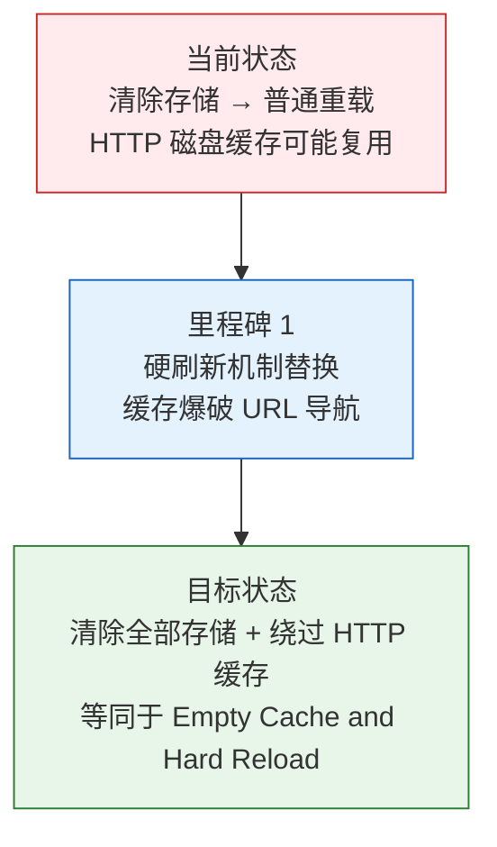
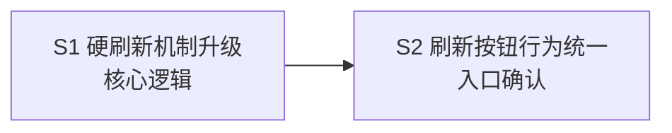

> | v1.0 | 2026-05-19 | deepseek-v4-pro | 🌿 main | 📎 [CLAUDE.md](../../../CLAUDE.md) |

> **导航**: [02-用户使用场景 →](./YiWeb-02-用户使用场景.md) | [04-前端技术评审 →](./YiWeb-04-前端技术评审.md)

> **来源引用**: 由用户需求 `统一刷新按钮的操作，应该是强制刷新页面，Delete browsing data，token的内容除外，必须清空该域名下的 cached images and files` 驱动生成。证据等级 A（源码可验证）。

### 主要价值

- 🔄 统一刷新语义 — 所有「清缓存并刷新」按钮行为一致，等同于浏览器 DevTools 的 Empty Cache and Hard Reload
- 🧹 彻底清理 — 清除 localStorage（保留 Token）、sessionStorage、CacheStorage、IndexedDB、Service Worker 注册
- ⚡ 硬刷新 — 绕过浏览器 HTTP 磁盘缓存，强制从服务器重新请求所有静态资源
- 🔑 Token 安全 — 刷新过程中保留认证 Token，不中断用户登录态

---

## §0 基线声明

> **问题空间基线 (Problem Space Baseline)**: 本文档是 `YiWeb` 项目的**第一基线文档**，与 02-用户使用场景 构成双基线。本文档定义刷新按钮统一化的"做什么(WHAT)"和"为什么(WHY)"。

| 约束 | 规则 |
|------|------|
| 语言边界 | 仅使用业务语言与用户语言。**禁止**包含：代码文件路径、API 路由、组件名称、数据库表名、技术栈选型、框架名称 |
| 下游可追溯 | 04 和 05 必须引用本文档的 §1 Story# 或 §2 FP# 或 §3 SC# 或 §5 AC# |
| 版本优先 | 需求变更时本文档先于所有其他文档更新 |
| 评审门禁 | 文档审查时检查禁止内容：含代码路径/API路由/组件名/技术栈名 = P0 阻断 |

---

### 需求概述

YiWeb 当前的「清缓存并刷新」按钮使用浏览器的普通刷新机制，仅清除 localStorage / sessionStorage / CacheStorage 后调用页面重载。这种普通重载仍可能命中浏览器的 HTTP 磁盘缓存，导致静态资源（图片、样式、脚本等）未从服务器重新拉取，出现版本不匹配问题。本次统一将该按钮升级为完整的 Delete browsing data + Hard Reload，确保该域名下的所有缓存数据被彻底清除后，从服务器强制重新加载全部资源。

### 效果示意

---

## §1 故事拆分

| ID | 故事 | 范围 | 优先级 |
|----|------|------|:------:|
| S1 | 硬刷新机制升级 | 页面刷新核心逻辑 | P0 |
| S2 | 刷新按钮行为统一 | 页面头部刷新按钮 | P0 |

### S1 — 硬刷新机制升级

**目标**: 将刷新核心逻辑从普通重载升级为真正的硬刷新，确保清除全部浏览器存储后，使用缓存爆破 URL 导航绕过 HTTP 磁盘缓存。

**成功判定**: 点击刷新按钮后，浏览器 DevTools Network 面板中所有请求均无 `(disk cache)` 标记，全部资源从服务器重新拉取。

### S2 — 刷新按钮行为统一

**目标**: 确保页面头部「清缓存并刷新」按钮使用统一的硬刷新逻辑，用户点击后看到确认弹窗 → 清除 → 强制重载的完整流程。

**成功判定**: 按钮行为与 S1 硬刷新逻辑一致，Token 在刷新后依然有效。

---

## §2 功能点

| ID | 功能点 | 关联故事 | 优先级 |
|----|--------|:--------:|:------:|
| FP1 | 硬刷新函数：构造带唯一时间戳的 URL，用页面替换导航绕过 HTTP 缓存 | S1 | P0 |
| FP2 | 存储清理：localStorage（保留 Token 键）、sessionStorage、CacheStorage、IndexedDB、Service Worker | S1 | P0 |
| FP3 | 确认弹窗：刷新前提示用户「Token 将被保留」 | S2 | P0 |
| FP4 | 按钮入口：页面头部提供「清缓存并刷新」按钮触发硬刷新 | S2 | P0 |

---

## §3 成功标准

| ID | 标准 | 衡量方式 |
|----|------|---------|
| SC1 | 刷新后 Network 面板无 `(disk cache)` 或 `(memory cache)` 标记 | 打开 DevTools → 点击刷新按钮 → 检查 Network 面板 Size 列 |
| SC2 | Token 在刷新后保持不变 | 刷新前后对比 localStorage 中 Token 键的值 |
| SC3 | 其他 localStorage 数据被清除 | 刷新前后对比 localStorage 键数量（仅 Token 键保留） |
| SC4 | CacheStorage 被清空 | 刷新后打开 DevTools Application → Cache Storage → 空 |
| SC5 | IndexedDB 被清空 | 刷新后打开 DevTools Application → IndexedDB → 空 |
| SC6 | Service Worker 被注销 | 刷新后打开 DevTools Application → Service Workers → 无注册 |

---

## §4 范围边界

| 维度 | 包含 | 不包含 |
|------|------|--------|
| 刷新范围 | 页面级别硬刷新（清除全部缓存 + 强制重载） | 局部数据刷新（模型列表、FAQ 列表、标签列表等 API 数据刷新） |
| 存储清理 | localStorage(保留Token)、sessionStorage、CacheStorage、IndexedDB、Service Worker | Cookie 清理（防止误清认证 Cookie） |
| 浏览器兼容 | 支持 CacheStorage / IndexedDB / Service Worker API 的现代浏览器 | IE11 及以下 |
| 降级策略 | API 不可用时静默跳过对应清理步骤 | — |

---

## §5 验收标准

| ID | 验收标准 | 关联 SC |
|----|---------|:------:|
| AC1 | 点击「清缓存并刷新」按钮后弹出确认对话框，提示「确定要清空缓存并刷新页面？Token 将被保留。」 | SC2 |
| AC2 | 确认后清除除 Token 键外的所有 localStorage 数据 | SC3 |
| AC3 | 确认后清除所有 sessionStorage 数据 | SC3 |
| AC4 | 确认后清除所有 CacheStorage 缓存 | SC4 |
| AC5 | 确认后清除所有 IndexedDB 数据库 | SC5 |
| AC6 | 确认后注销所有 Service Worker 注册 | SC6 |
| AC7 | 最终执行的页面导航绕过 HTTP 缓存，所有静态资源从服务器重新请求 | SC1 |
| AC8 | 用户取消确认对话框时不执行任何清理操作 | — |

---

## §6 风险与缓解

| 风险 | 影响 | 概率 | 缓解措施 |
|------|------|:----:|---------|
| 缓存爆破参数与现有 URL 参数冲突 | 低 | 低 | 使用独立的 `_t` 参数名，不与业务参数冲突 |
| 某些浏览器不支持某存储 API | 低 | 低 | 每个清理步骤独立 try-catch，异常静默跳过 |
| 硬刷新后首次加载较慢 | 中 | 高 | 预期行为，用户主动触发时已有心理预期 |
| CacheStorage 异步删除未完成即导航 | 高 | 低 | 所有异步清理操作 await 完成后再执行导航 |

---

## §7 依赖与顺序

S1 必须先完成，S2 依赖 S1 的硬刷新函数。
