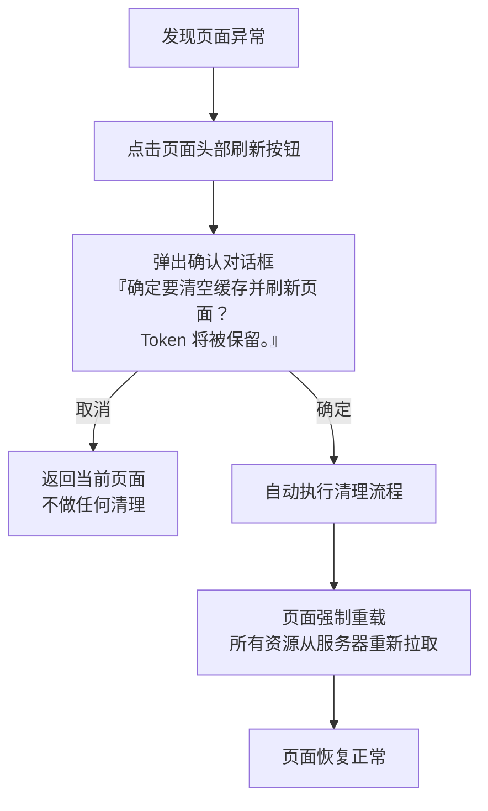

> | v1.0 | 2026-05-19 | deepseek-v4-pro | 🌿 main | 📎 [../YiWeb-01-故事任务.md](./YiWeb-01-故事任务.md) |

> **来源引用**: 上游 01-故事任务 §1–§5 的需求拆解。证据等级 A。

---

## §1 用户角色

| 角色 | 描述 | 典型行为 |
|------|------|---------|
| 普通用户 | 使用 YiWeb 进行日常操作的终端用户 | 页面异常时点击刷新恢复 |
| 开发者 | 了解浏览器 DevTools 的技术用户 | 验证静态资源是否从服务器重新拉取 |

---

## §2 使用场景

### SCENARIO-1: 页面异常恢复

**前置条件**: 用户正在使用 YiWeb，页面出现异常（UI 错乱、数据不更新、功能无响应）。

**操作流程**:

**预期结果**: 页面像首次访问一样重新加载所有资源，异常消失。用户无需重新登录（Token 保留）。

---

### SCENARIO-2: 版本升级后缓存冲突

**前置条件**: YiWeb 发布了新版本，用户浏览器缓存了旧版本的脚本和样式文件。

**操作流程**:

1. 用户发现界面样式异常或功能不工作
2. 点击「清缓存并刷新」按钮
3. 确认弹窗中选择「确定」
4. 系统清除所有浏览器缓存（Token 除外）
5. 页面强制从服务器拉取最新版本的 HTML、脚本、样式和图片
6. 用户看到最新版本的界面

**预期结果**: 清除旧版本缓存后加载新版本资源，版本冲突消失。

---

### SCENARIO-3: 取消操作

**前置条件**: 用户误触了刷新按钮。

**操作流程**:

1. 用户点击「清缓存并刷新」按钮
2. 弹出确认对话框
3. 用户选择「取消」
4. 对话框关闭，页面保持当前状态，无任何清理操作执行

**预期结果**: 零副作用，用户继续当前操作不受影响。

---

## §3 交互状态覆盖

| 状态 | SCENARIO-1 | SCENARIO-2 | SCENARIO-3 |
|------|:----------:|:----------:|:----------:|
| 默认态（按钮可见可点击） | ✓ | ✓ | ✓ |
| 确认态（弹窗展示） | ✓ | ✓ | ✓ |
| 执行态（清理 + 导航中） | ✓ | ✓ | — |
| 取消态（弹窗关闭回默认） | ✓ | — | ✓ |
| 空态 | — | — | — |
| 错误态（某存储 API 异常静默跳过） | ✓ | ✓ | — |
| 加载态 | — | — | — |

---

## §4 非功能性要求

| 维度 | 要求 |
|------|------|
| 响应时间 | 确认弹窗在点击后 100ms 内展示 |
| 数据安全 | Token 键在清理后值不变；异步清理操作全部完成后方可导航 |
| 可访问性 | 按钮有明确的 title 和 aria-label 属性 |
