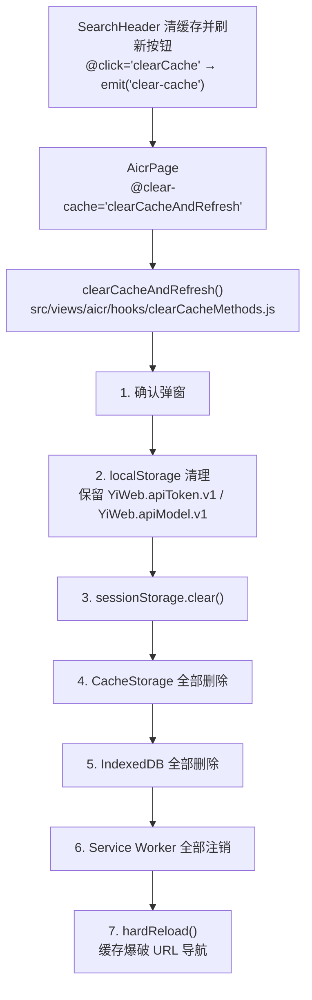
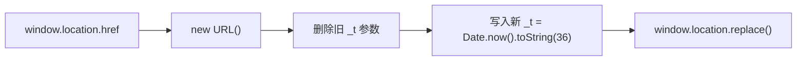
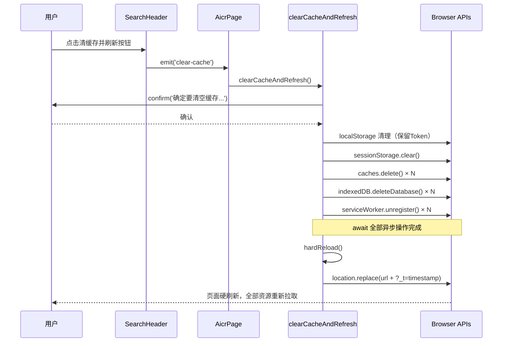

> | v1.0 | 2026-05-19 | deepseek-v4-pro | 🌿 main | 📎 [../YiWeb-01-故事任务.md](./YiWeb-01-故事任务.md) |

> **来源引用**: 上游 01-故事任务 §1 Story S1/S2。项目类型 frontend。证据等级 A（源码级实现）。

> **技术约束**: 零构建链（浏览器原生 ESM），无外部包管理，所有操作均为浏览器标准 API。

---

## §1 架构概览

---

## §2 核心模块设计

### 2.1 hardReload() — 硬刷新函数

**接口契约**:

| 项目 | 内容 |
|------|------|
| 签名 | `function hardReload(): void` |
| 输入 | 无（读取当前 `window.location.href`） |
| 输出 | 无返回（执行页面导航，当前执行上下文销毁） |
| 副作用 | 修改浏览器 URL（添加 `_t` 参数），触发页面级导航 |
| 不变式 | 导航前所有异步清理操作已完成 |

**实现策略**:

**选型依据**:

| 方案 | 效果 | 选择 |
|------|------|:----:|
| `location.reload()` | 普通重载，可能复用 HTTP 磁盘缓存 | ✗ |
| `location.reload(true)` | 已废弃，各浏览器行为不一致 | ✗ |
| URL 缓存爆破 + `location.replace()` | 浏览器视为全新请求，无法命中 HTTP 缓存 | ✓ |

`location.replace()` 的优势：
- 浏览器将带新查询参数的 URL 视为与缓存无关的全新导航
- 不产生历史记录条目（用户点「后退」不会回到带 `_t` 的地址）
- `Date.now().toString(36)` 生成短且唯一的标识符

### 2.2 存储清理序列

| 步骤 | API | 保留规则 | 异常处理 |
|------|-----|---------|---------|
| localStorage | `localStorage.key()` + `removeItem()` | `YiWeb.apiToken.v1`、`YiWeb.apiModel.v1` | 单键异常跳过，整体异常跳过 |
| sessionStorage | `sessionStorage.clear()` | 无 | 异常静默跳过 |
| CacheStorage | `caches.keys()` + `caches.delete()` | 无 | 异常静默跳过 |
| IndexedDB | `indexedDB.databases()` + `deleteDatabase()` | 无 | 异常静默跳过 / API 不可用跳过 |
| Service Worker | `navigator.serviceWorker.getRegistrations()` + `unregister()` | 无 | 异常静默跳过 / API 不可用跳过 |

**异步清理执行策略**: 所有异步清理操作（CacheStorage、IndexedDB、Service Worker）通过 `await Promise.all()` 并行执行，确保全部完成后再调用 `hardReload()`，避免导航竞态导致清理中断。

### 2.3 事件流

---

## §3 关键决策

| 决策点 | 选择 | 原因 |
|--------|------|------|
| 导航方式 | `location.replace()` 而非 `location.reload()` | 带唯一查询参数的 URL 无法被浏览器 HTTP 缓存命中 |
| Token 保留机制 | 白名单 Set 匹配 `localStorage.key(i)` | 精确控制保留项，避免 Token 丢失导致用户重新登录 |
| 异步清理等待 | `await Promise.all()` 所有删除操作 | 防止导航时异步删除未完成，导致缓存残留 |
| 全局暴露 | `window.clearCacheAndRefresh` | 向后兼容，允许非 Vue 上下文中调用 |
| Cookie 不清理 | 跳过 `document.cookie` | 避免误清可能存在的认证 Cookie；当前项目 Token 存于 localStorage |

---

## §4 影响面

| 层面 | 影响 | 风险等级 |
|------|------|:--------:|
| clearCacheMethods.js | 核心变更：提取 `hardReload()` 函数，替换 `location.reload()` | 低 |
| SearchHeader 模板 | 无变更（已绑定 `clear-cache` 事件） | 无 |
| AicrPage | 无变更（已通过 methods 暴露 `clearCacheAndRefresh`） | 无 |
| config.js env 切换 | 无变更（`location.reload()` 仅用于环境切换，不需 hardReload） | 无 |
| 其他刷新按钮 | 无变更（模型列表/FAQ/标签刷新为数据刷新，不涉及页面重载） | 无 |

---

## §5 安全考量

| 关注点 | 评估 | 缓解 |
|--------|------|------|
| URL 参数注入 | `_t` 参数仅用于缓存爆破，不参与任何业务逻辑 | URL 参数不作为服务端输入 |
| Token 泄露 | Token 键名硬编码在白名单中，确认弹窗告知用户 | Token 仅在 localStorage 中保留，不通过网络传输到新 URL |
| DoS（频繁刷新） | 用户可多次点击触发 | 确认弹窗作为人机交互门槛 |
