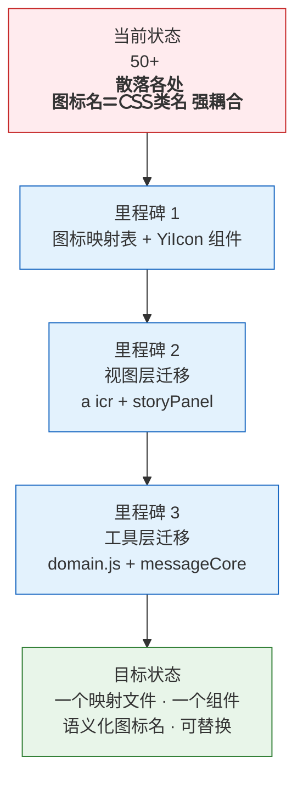
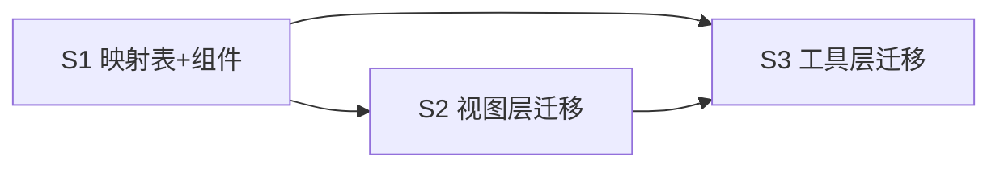

> | v1.0 | 2026-05-19 | deepseek-v4-pro | 🌿 main | 📎 [CLAUDE.md](../../../CLAUDE.md) |

> **导航**: [02-用户使用场景 →](./YiWeb-02-用户使用场景.md) | [04-前端技术评审 →](./YiWeb-04-前端技术评审.md)

> **来源引用**: 由用户需求 `统一图标库，将项目中的图标放在 cdn 里统一管理` 驱动生成。证据等级 A（源码可验证）。

### 主要价值

- 🎯 图标集中管理 — 所有图标名→类的映射在单一文件中，增删改一处生效
- 🧩 统一组件渲染 — YiIcon 组件统一渲染，消除 <i> 标签散落
- 📝 语义化命名 — 用 search/refresh/close 替代 fas fa-search/fa-sync-alt/fa-times
- 🔄 可替换性 — 更换图标库只需改映射文件，无需遍历所有模板

---

## §0 基线声明

> **问题空间基线 (Problem Space Baseline)**: 本文档是 `YiWeb` 项目的**第一基线文档**，与 02-用户使用场景 构成双基线。本文档定义图标统一化的"做什么(WHAT)"和"为什么(WHY)".

| 约束 | 规则 |
|------|------|
| 语言边界 | 仅使用业务语言与用户语言。**禁止**包含：代码文件路径、API 路由、组件名称、数据库表名、技术栈选型、框架名称 |
| 下游可追溯 | 04 和 05 必须引用本文档的 §1 Story# 或 §2 FP# 或 §3 SC# 或 §5 AC# |
| 版本优先 | 需求变更时本文档先于所有其他文档更新 |
| 评审门禁 | 文档审查时检查禁止内容：含代码路径/API路由/组件名/技术栈名 = P0 阻断 |

---

### 需求概述

YiWeb 当前使用 Font Awesome 图标库，所有图标以原始 CSS 类名（`fas fa-*` / `fab fa-*`）散落在各视图模板和 JS 文件中。这导致：(1) 图标名与 CSS 类名强耦合，更换图标库需要全局搜索替换；(2) 同一语义图标可能在不同位置使用了不同类名；(3) 没有统一的图标组件，每个 `<i>` 标签手写。本次统一将图标映射集中到 cdn/icons/ 下，用语义化名称替代原始类名，并创建统一的 YiIcon 渲染组件。

### 效果示意

---

## §1 故事拆分

| ID | 故事 | 范围 | 优先级 |
|----|------|------|:------:|
| S1 | 创建图标映射表与 YiIcon 组件 | cdn/icons/ | P0 |
| S2 | 视图层图标迁移 | aicr + storyPanel 模板 | P0 |
| S3 | 工具层图标迁移 | domain.js + messageCore + YiButton | P1 |

### S1 — 图标映射表与 YiIcon 组件

**目标**: 在 cdn/icons/ 下创建图标名→CSS 类的映射表，以及 YiIcon 通用组件。

**成功判定**: 所有图标通过语义名访问，映射表覆盖全部 50+ 现有图标。

### S2 — 视图层图标迁移

**目标**: 将 aicr 和 storyPanel 视图中所有 `<i class="fas fa-*">` 替换为 `<yi-icon name="*">`。

**成功判定**: 视图模板中无直接 `fas fa-*` / `fab fa-*` 硬编码。

### S3 — 工具层图标迁移

**目标**: domain.js 的 icon 属性从 CSS 类名改为语义名；messageCore 的 emoji 图标接入映射表；YiButton 的 icon prop 支持语义名。

**成功判定**: JS 文件中无直接 `fas fa-*` / `fab fa-*` 字符串。

---

## §2 功能点

| ID | 功能点 | 关联故事 | 优先级 |
|----|--------|:--------:|:------:|
| FP1 | 图标映射表：语义名 → CSS 类，覆盖全部 50+ 图标 | S1 | P0 |
| FP2 | YiIcon 组件：接受 name prop，渲染对应图标 | S1 | P0 |
| FP3 | YiButton icon prop 兼容语义名 | S1, S3 | P0 |
| FP4 | 视图模板中 <i> 标签全部替换为 YiIcon | S2 | P0 |
| FP5 | domain.js 图标属性迁移 | S3 | P1 |
| FP6 | messageCore 图标迁移 | S3 | P1 |

---

## §3 成功标准

| ID | 标准 | 衡量方式 |
|----|------|---------|
| SC1 | 所有图标通过映射表访问，无直接 CSS 类名硬编码 | 搜索 `fas fa-` / `fab fa-` 零匹配（除映射表和组件本身） |
| SC2 | YiIcon 组件可在任意视图中使用 | 在任一视图模板中写 `<yi-icon name="search">` 即可渲染 |
| SC3 | 图标视觉效果与迁移前一致 | 手动对比迁移前后界面截图 |
| SC4 | 新增图标只需在映射表中加一行 | 添加映射 → 视图中用 name 引用即可 |

---

## §4 范围边界

| 维度 | 包含 | 不包含 |
|------|------|--------|
| 图标来源 | 将现有 Font Awesome 用法集中管理 | 引入新图标库、SVG sprite |
| 组件 | YiIcon 渲染组件 | 图标动画、图标按钮重构 |
| 迁移 | 所有现有图标使用点 | 布局/样式/颜色变更 |
| 文件类型图标 | emoji 图标（📄📁 等）保留 | 文件类型 emoji → Font Awesome |

---

## §5 验收标准

| ID | 验收标准 | 关联 SC |
|----|---------|:------:|
| AC1 | `cdn/icons/iconMap.js` 存在且覆盖全部 50+ 现有图标 | SC1 |
| AC2 | `cdn/icons/YiIcon/` 组件完整（index.js + template.html + index.css） | SC2 |
| AC3 | aicr 模板中无 `fas fa-*` / `fab fa-*` 硬编码（文件类型 emoji 除外） | SC1 |
| AC4 | storyPanel 模板中无 `fas fa-*` / `fab fa-*` 硬编码 | SC1 |
| AC5 | domain.js 中 icon 属性使用语义名 | SC1 |
| AC6 | YiButton icon prop 支持语义名（通过 YiIcon 渲染） | SC2 |
| AC7 | 所有现有功能正常，图标显示无异常 | SC3 |

---

## §6 风险与缓解

| 风险 | 影响 | 概率 | 缓解措施 |
|------|------|:----:|---------|
| 迁移遗漏导致部分图标不显示 | 中 | 中 | 全局搜索 + 逐视图验证 |
| 语义名映射错误 | 低 | 低 | 对照迁移前代码一一校验 |
| 动态绑定的图标类名遗漏 | 中 | 中 | 搜索 `:class` 中的 fa- 模式 |

---

## §7 依赖与顺序

S1 必须先完成，S2 和 S3 依赖 S1 的映射表和组件。
