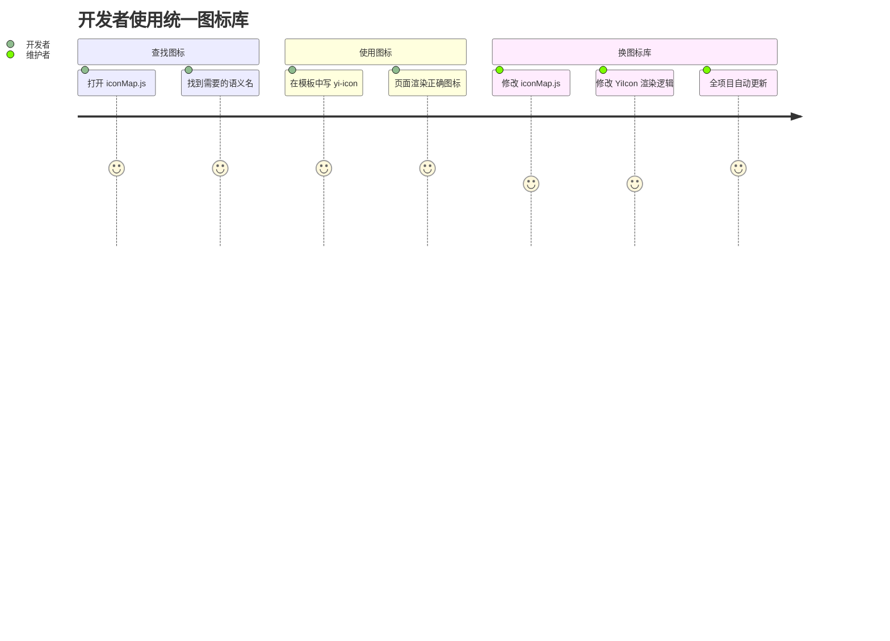

> | v1.0 | 2026-05-19 | deepseek-v4-pro | 🌿 main | 📎 [01-故事任务 ←](./YiWeb-01-故事任务.md) |

> **导航**: [← 01-故事任务](./YiWeb-01-故事任务.md) | [04-前端技术评审 →](./YiWeb-04-前端技术评审.md)

> **来源引用**: 由 [YiWeb-01-故事任务](./YiWeb-01-故事任务.md) §1 Story S1–S3 驱动。证据等级 B。

---

## §0 用户画像

| 画像 | 角色 | 使用场景 | 痛点 |
|------|------|---------|------|
| 前端开发者 | 维护者 | 在视图中添加新图标、修改现有图标 | 不知道有哪些图标可用；改一个图标要全局搜索替换 |
| UI 设计者 | 规范制定者 | 统一项目视觉风格 | 同一语义图标在不同位置用了不同的 Font Awesome 类 |

---

## §1 场景覆盖

### 场景 1：开发者在视图中使用图标

**前置条件**: 开发者在编写新功能，需要在按钮上添加图标。

**操作流程**:
1. 查看 cdn/icons/iconMap.js 了解可用图标
2. 在模板中写 `<yi-icon name="refresh">`
3. 图标正确渲染

**预期结果**: 一行代码完成图标引用，无需记忆 Font Awesome 类名。

**关联**: S1 / FP1, FP2 / AC1, AC2

### 场景 2：统一替换图标风格

**前置条件**: 团队决定从 Font Awesome 切换到其他图标库。

**操作流程**:
1. 修改 iconMap.js 中的映射规则
2. 调整 YiIcon 组件的渲染逻辑
3. 全项目图标自动更新

**预期结果**: 只改两处，全局生效。

**关联**: S1 / FP1 / AC1

### 场景 3：开发者使用 YiButton 带图标

**前置条件**: 需要创建带图标的操作按钮。

**操作流程**:
1. 写 `<yi-button icon="refresh">刷新</yi-button>`
2. 图标与文字并排显示

**预期结果**: icon prop 接受语义名，YiButton 内部用 YiIcon 渲染。

**关联**: S3 / FP3 / AC6

---

## §2 用户旅程图

