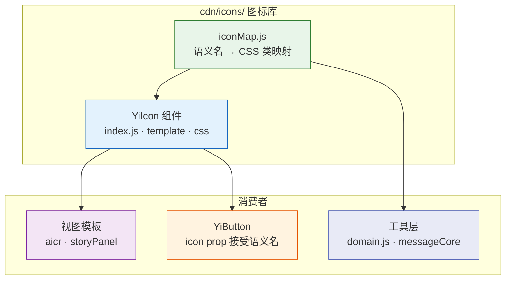
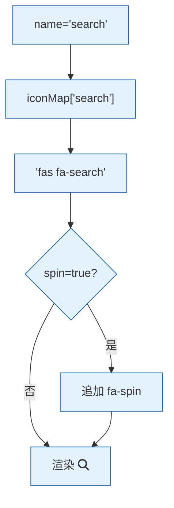

> | v1.0 | 2026-05-19 | deepseek-v4-pro | 🌿 main | 📎 [01-故事任务 ←](./YiWeb-01-故事任务.md) |

> **导航**: [← 01-故事任务](./YiWeb-01-故事任务.md) | [← 02-用户使用场景](./YiWeb-02-用户使用场景.md) | [05-测试用例评审 →](./YiWeb-05-测试用例评审.md)

> **来源引用**: 由 [YiWeb-01-故事任务](./YiWeb-01-故事任务.md) §1 Story S1–S3 驱动。证据等级 A（源码可验证）。

---

## §0 架构全景



---

## §1 图标映射表设计

### 1.1 命名规范

语义名为 kebab-case，按功能分组：

| 分组 | 示例 | 说明 |
|------|------|------|
| 操作 | `search` `refresh` `close` `download` `upload` `copy` `edit` `add` `delete` | 用户操作 |
| 导航 | `chevron-left` `chevron-right` `arrow-left` `external-link` | 导航/跳转 |
| 文件 | `file` `file-code` `file-image` `folder-open` `folder-plus` | 文件操作 |
| 状态 | `success` `warning` `error` `info` `loading` | 状态指示 |
| 品牌 | `github` `youtube` `stack-overflow` | 第三方品牌 |
| 杂项 | `globe` `keyboard` `lightbulb` `palette` `users` `book` `code` | 语义独立 |

### 1.2 映射表结构

```js
// cdn/icons/iconMap.js
export const iconMap = {
  // 操作
  'search': 'fas fa-search',
  'refresh': 'fas fa-sync-alt',
  'close': 'fas fa-times',
  'download': 'fas fa-download',
  'upload': 'fas fa-upload',
  'copy': 'fas fa-copy',
  'edit': 'fas fa-pen',
  'add': 'fas fa-plus',
  // ... 50+ entries
};

export function getIconClass(name) {
  return iconMap[name] || 'fas fa-question-circle';
}
```

---

## §2 YiIcon 组件设计

### 2.1 组件接口

| Prop | 类型 | 默认值 | 说明 |
|------|------|--------|------|
| `name` | String | — | 图标语义名，对应 iconMap 的 key |
| `size` | String | — | 可选：`sm` `lg` |
| `spin` | Boolean | false | 是否旋转动画 |
| `class` | String | — | 额外 CSS 类 |

### 2.2 渲染逻辑



---

## §3 迁移方案

### 3.1 视图模板迁移

| 现状 | 迁移后 |
|------|--------|
| `<i class="fas fa-search">` | `<yi-icon name="search">` |
| `<i class="fas fa-sync-alt">` | `<yi-icon name="refresh">` |
| `<i class="fas fa-times">` | `<yi-icon name="close">` |
| `<i class="fas fa-spinner fa-spin">` | `<yi-icon name="loading" spin>` |
| `<i :class="viewMode === 'board' ? 'fas fa-list' : 'fas fa-columns'">` | `<yi-icon :name="viewMode === 'board' ? 'list' : 'columns'">` |

### 3.2 YiButton icon prop 迁移

| 现状 | 迁移后 |
|------|--------|
| `icon="fas fa-sync-alt"` | `icon="refresh"` |
| `icon="fas fa-plus"` | `icon="add"` |

YiButton 内部判断：如果 icon 值不含空格，则从 iconMap 查找；否则直接作为 CSS 类使用（向后兼容）。

### 3.3 domain.js 迁移

| 现状 | 迁移后 |
|------|--------|
| `icon: 'fas fa-question-circle'` | 使用语义名或直接引用 iconMap |
| `icon: 'fab fa-github'` | 使用语义名 |

### 3.4 涉及文件清单

**修改文件 (≈15)**:
- `cdn/icons/iconMap.js` (新增)
- `cdn/icons/YiIcon/index.js` (新增)
- `cdn/icons/YiIcon/template.html` (新增)
- `cdn/icons/YiIcon/index.css` (新增)
- `cdn/components/common/buttons/YiButton/template.html` (修改)
- `cdn/components/common/buttons/YiButton/index.js` (修改)
- `src/views/aicr/components/aicrCodeArea/index.html` (修改)
- `src/views/aicr/components/aicrHeader/index.html` (修改)
- `src/views/aicr/components/codeView/index.html` (修改)
- `src/views/aicr/components/codeView/index.js` (修改)
- `src/views/aicr/components/keyboardShortcutsHelp/index.html` (修改)
- `src/views/aicr/components/fileTree/fileTreeNode.js` (修改)
- `src/views/aicr/components/AiModelSelector/index.html` (修改)
- `src/views/aicr/hooks/helpers/sessionChatContextShared.welcomeCard.js` (修改)
- `src/views/storyPanel/components/storyPanelPage/template.html` (修改)
- `src/views/storyPanel/components/storyListTable/template.html` (修改)
- `src/views/storyPanel/components/storyDetailCard/template.html` (修改)
- `cdn/utils/data/domain.js` (修改)
