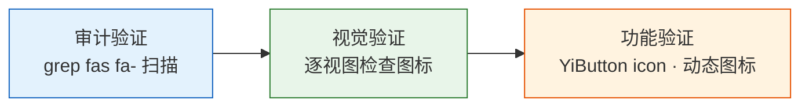

> | v1.0 | 2026-05-19 | deepseek-v4-pro | 🌿 main | 📎 [01-故事任务 ←](./YiWeb-01-故事任务.md) |

> **导航**: [← 01-故事任务](./YiWeb-01-故事任务.md) | [← 04-前端技术评审](./YiWeb-04-前端技术评审.md)

> **来源引用**: 由 [YiWeb-01-故事任务](./YiWeb-01-故事任务.md) §5 AC1–AC7 驱动。证据等级 A（源码可验证）。

---

## §0 测试策略

---

## §1 测试用例

### TC1 — 图标映射表完整性

| 属性 | 值 |
|------|-----|
| **关联** | S1 / AC1 |
| **步骤** | 运行扫描脚本枚举所有现有 `fas fa-*` / `fab fa-*`，与 iconMap.js 对比 |
| **预期** | iconMap.js 包含所有现有图标 |

### TC2 — YiIcon 组件渲染

| 属性 | 值 |
|------|-----|
| **关联** | S1 / AC2 |
| **步骤** | 在测试页面使用 `<yi-icon name="search">` `<yi-icon name="close">` `<yi-icon name="loading" spin>` |
| **预期** | 分别渲染放大镜、叉号、旋转中的加载图标 |

### TC3 — 视图模板无硬编码图标类

| 属性 | 值 |
|------|-----|
| **关联** | S2 / AC3, AC4 |
| **步骤** | `grep -rn "fas fa-\|fab fa-" src/views/ --include='*.html'` |
| **预期** | 零匹配 |

### TC4 — JS 文件无硬编码图标类（除映射表）

| 属性 | 值 |
|------|-----|
| **关联** | S3 / AC5 |
| **步骤** | `grep -rn "fas fa-\|fab fa-" src/ cdn/ --include='*.js' \| grep -v iconMap` |
| **预期** | 零匹配 |

### TC5 — YiButton icon 语义名

| 属性 | 值 |
|------|-----|
| **关联** | S3 / AC6 |
| **步骤** | 使用 `<yi-button icon="refresh">刷新</yi-button>` |
| **预期** | 按钮上渲染刷新图标 |

### TC6 — 动态图标绑定

| 属性 | 值 |
|------|-----|
| **关联** | S2 / AC3 |
| **步骤** | 在 storyPanel 切换看板/列表视图，检查图标切换 |
| **预期** | 视图切换图标随模式正确变化 |

### TC7 — 代码审查视图功能

| 属性 | 值 |
|------|-----|
| **关联** | S2 / AC7 |
| **步骤** | 1. 文件树操作（新建/导入/导出/重命名）2. 代码查看工具栏（复制/下载/全屏/定位）3. 搜索面板快捷键帮助 |
| **预期** | 所有操作图标正常显示，功能不受影响 |

### TC8 — 故事面板功能

| 属性 | 值 |
|------|-----|
| **关联** | S2 / AC7 |
| **步骤** | 1. 搜索框图标 2. 刷新按钮 3. 加载状态图标 4. 错误状态图标 |
| **预期** | 所有图标正常显示 |

### TC9 — domain.js 图标

| 属性 | 值 |
|------|-----|
| **关联** | S3 / AC5 |
| **步骤** | 检查搜索面板中各类目（github/stack-overflow 等）的图标 |
| **预期** | 所有类目图标正常显示 |

---

## §2 验证检查表

| # | 检查项 | 方法 | 关联 TC |
|:--:|--------|------|:------:|
| 1 | iconMap.js 覆盖全部现有图标 | 对比扫描 | TC1 |
| 2 | YiIcon 组件注册且可用 | 手动测试 | TC2 |
| 3 | aicr 模板无 `fas fa-*` | grep | TC3 |
| 4 | storyPanel 模板无 `fas fa-*` | grep | TC3 |
| 5 | JS 文件无 `fas fa-*`（除映射表） | grep | TC4 |
| 6 | YiButton icon 支持语义名 | 手动测试 | TC5 |
| 7 | 代码审查视图功能正常 | 手动验证 | TC7 |
| 8 | 故事面板功能正常 | 手动验证 | TC8 |

---

## §3 门禁规则

| 等级 | 条件 | 行为 |
|:----:|------|------|
| P0 | iconMap.js 未覆盖某个现有图标 | 补齐后放行 |
| P0 | 视图模板残留 `fas fa-*` 硬编码 | 迁移后放行 |
| P0 | 图标渲染异常（不显示或显示错误图标） | 修复映射后放行 |
| P1 | JS 文件残留 `fas fa-*`（除映射表） | 迁移后放行 |
| P2 | 动态图标绑定未迁移 | 记录不阻断 |
