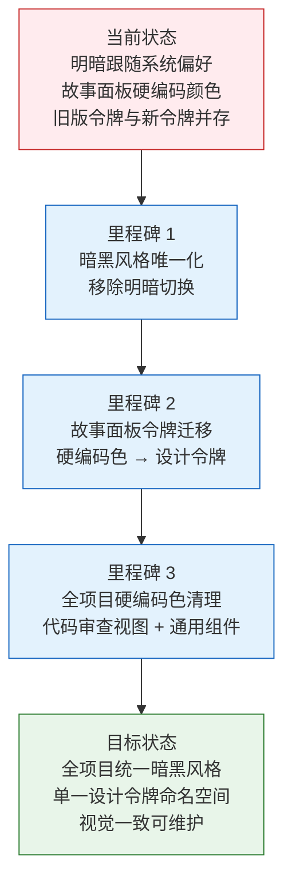
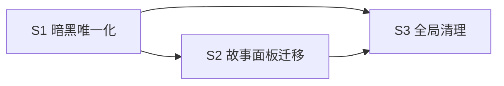

> | v1.0 | 2026-05-18 | deepseek-v4-pro | 🌿 main | 📎 [CLAUDE.md](../../../CLAUDE.md) |

> **导航**: [02-用户使用场景 →](./YiWeb-02-用户使用场景.md) | [04-前端技术评审 →](./YiWeb-04-前端技术评审.md)

> **来源引用**: 由用户需求 `参考 ui-ux-pro-max-skill，统一整个项目的主题色风格，默认都使用暗黑风格` 驱动生成。外部参考吸收自 ui-ux-pro-max（Dark Mode OLED 风格 · 设计令牌系统 · 可访问性检查表）。证据等级 B（可推导，附外部参考路径）。

### 主要价值

- 🎨 设计系统一致性 — 所有视图和组件使用统一的暗黑主题令牌，消除视觉割裂
- 🌙 暗黑风格默认 — 移除跟随系统偏好的明暗切换，强制暗黑模式为唯一视觉风格
- 🧩 令牌迁移 — 将硬编码颜色值替换为 `--yi-*` 设计令牌，确保可维护性
- ♿ 可访问性保持 — 保留高对比度模式和减少动画偏好的媒体查询

---

## §0 基线声明

> **问题空间基线 (Problem Space Baseline)**: 本文档是 `YiWeb` 项目的**第一基线文档**，与 02-用户使用场景 构成双基线。本文档定义主题色统一的"做什么(WHAT)"和"为什么(WHY)"——所有下游文档（04-前端技术评审、05-测试用例评审）的设计、验证、改进决策均必须可追溯至本文档的具体章节。

| 约束 | 规则 |
|------|------|
| 语言边界 | 仅使用业务语言与用户语言。**禁止**包含：代码文件路径、API 路由、组件名称、数据库表名、技术栈选型、框架名称 |
| 下游可追溯 | 04 和 05 必须引用本文档的 §1 Story# 或 §2 FP# 或 §3 SC# 或 §5 AC# |
| 版本优先 | 需求变更时本文档先于所有其他文档更新；下游文档偏差必须同步回本文档 |
| 评审门禁 | 文档审查时检查禁止内容：含代码路径/API路由/组件名/技术栈名 = P0 阻断 |
| 基线贯穿 | 本文档 §1–§7 是下游文档的单一真相源 |

---

### 需求概述

YiWeb 当前拥有基础的设计令牌系统，但存在三个核心问题：(1) 主题样式支持跟随操作系统明暗偏好自动切换，用户在暗色系统中看到暗色、在亮色系统中看到亮色，体验不统一；(2) 新增的故事面板视图大量使用硬编码颜色值，未接入设计令牌；(3) 部分旧组件仍使用已弃用的旧版变量名。本次统一将暗黑风格设为唯一默认视觉风格，移除系统明暗跟随，并将所有硬编码颜色迁移至统一的设计令牌。

### 效果示意

---

## §1 故事拆分

| ID | 故事 | 范围 | 优先级 |
|----|------|------|:------:|
| S1 | 暗黑风格唯一化 — 移除系统明暗跟随 | 全局主题 | P0 |
| S2 | 故事面板设计令牌迁移 | 故事面板视图 | P0 |
| S3 | 全项目硬编码颜色清理 | 代码审查视图 + 通用组件 | P1 |

### S1 — 暗黑风格唯一化

**目标**: 移除 `@media (prefers-color-scheme: light)` 规则，暗黑风格成为唯一默认视觉风格。保留高对比度模式和减少动画偏好的媒体查询。

**范围**: 全局主题样式文件。

**成功判定**: 无论在何种系统明暗偏好下，应用始终显示暗黑风格。

### S2 — 故事面板设计令牌迁移

**目标**: 将故事面板视图中所有硬编码颜色值替换为 `--yi-*` 命名空间的设计令牌，确保与全局暗黑主题一致。

**范围**: 故事面板的全部组件样式：状态标签、详情卡片、看板页面、列表表格。

**成功判定**: 故事面板所有颜色引用均通过 `var(--yi-*)` 令牌，无硬编码十六进制颜色值（除透明外）。

### S3 — 全项目硬编码颜色清理

**目标**: 清理代码审查视图和通用组件中残留的硬编码颜色值。文件类型图标色（语法语义色）因具有独立语义可保留。

**范围**: 代码审查视图的样式文件、CDN 通用组件样式。

**成功判定**: 非语义硬编码颜色全部替换为设计令牌引用。

---

## §2 功能点

| ID | 功能点 | 关联故事 | 优先级 |
|----|--------|:--------:|:------:|
| FP1 | 暗黑主题作为唯一视觉风格，不跟随系统偏好 | S1 | P0 |
| FP2 | 设计令牌完整覆盖：背景、文字、边框、阴影、状态色 | S2, S3 | P0 |
| FP3 | 故事面板六列状态色使用令牌引用 | S2 | P0 |
| FP4 | 故事面板类型标签（前后端/全栈）使用令牌引用 | S2 | P0 |
| FP5 | 文件类型图标色保留独立语义色值 | S3 | P1 |
| FP6 | 高对比度模式与减少动画偏好保持可用 | S1 | P1 |

---

## §3 成功标准

| ID | 标准 | 衡量方式 |
|----|------|---------|
| SC1 | 系统设置为亮色模式时，应用仍显示暗黑风格 | 手动验证：切换 OS 明暗偏好后刷新页面 |
| SC2 | 故事面板所有颜色值可追溯至设计令牌定义 | 审计：搜索故事面板样式目录中无硬编码 `#XXXXXX` |
| SC3 | 代码审查视图功能正常，无视觉回归 | 手动验证：对话、文件树、代码查看等核心交互 |
| SC4 | 高对比度模式下文字与边框清晰可辨 | 手动验证：启用 OS 高对比度后检查可读性 |
| SC5 | 现有功能不受影响 — 按钮、标签、输入框、模态框等交互组件外观一致 | 手动验证：遍历所有视图的交互组件 |

---

## §4 范围边界

| 维度 | 包含 | 不包含 |
|------|------|--------|
| 主题模式 | 暗黑风格唯一化 | 明暗主题切换功能、用户偏好存储 |
| 颜色令牌 | `--yi-*` 命名空间扩展与统一 | 新增颜色类别、设计令牌重构 |
| 迁移范围 | 现有硬编码色 → 令牌 | 新增UI功能、布局变更 |
| 浏览器兼容 | 现代浏览器 ESM 原生支持 | IE11、旧版浏览器 |
| 可访问性 | 高对比度、减少动画 | WCAG 完整合规审计 |

---

## §5 验收标准

| ID | 验收标准 | 关联 SC |
|----|---------|:------:|
| AC1 | 移除 `@media (prefers-color-scheme: light)` 及其内所有规则 | SC1 |
| AC2 | 暗黑主题的 `--yi-*` 令牌在 `:root` 中唯一声明，无覆盖 | SC1 |
| AC3 | 故事面板样式目录中无硬编码 `#XXXXXX` 颜色值 | SC2 |
| AC4 | 故事面板六列状态色（未开始/文档中/文档完成/编码中/编码完成/阻塞）引用 `--yi-*` 令牌 | SC2 |
| AC5 | 故事面板类型标签（后端/前端/全栈/元）引用 `--yi-*` 令牌 | SC2 |
| AC6 | 代码审查视图无功能回归 | SC3 |
| AC7 | 高对比度媒体查询保留并正确覆盖 | SC4 |
| AC8 | 减少动画媒体查询保留 | SC4 |

---

## §6 风险与缓解

| 风险 | 影响 | 概率 | 缓解措施 |
|------|------|:----:|---------|
| 移除明暗切换后亮色偏好用户不适应 | 低 | 低 | YiWeb 为内部开发工具，用户群体固定 |
| 令牌映射错误导致颜色差异 | 中 | 低 | 逐组件对比迁移前后视觉效果 |
| 遗漏硬编码颜色导致局部不一致 | 低 | 中 | 自动化搜索 + 手动审查双保险 |

---

## §7 依赖与顺序

S1 必须先完成，因为 S2 和 S3 的令牌迁移需要基于最终的主题基线。S2 和 S3 可并行。
