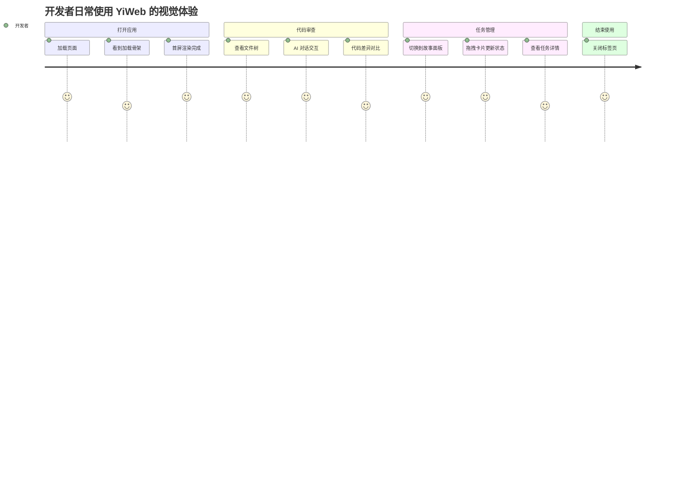

> | v1.0 | 2026-05-18 | deepseek-v4-pro | 🌿 main | 📎 [01-故事任务 ←](./YiWeb-01-故事任务.md) |

> **导航**: [← 01-故事任务](./YiWeb-01-故事任务.md) | [04-前端技术评审 →](./YiWeb-04-前端技术评审.md)

> **来源引用**: 由 [YiWeb-01-故事任务](./YiWeb-01-故事任务.md) §1 Story S1–S3 驱动。外部参考吸收自 ui-ux-pro-max（Dark Mode OLED 交互状态覆盖 · 可访问性检查表）。证据等级 B。

---

## §0 用户画像

| 画像 | 角色 | 使用场景 | 痛点 |
|------|------|---------|------|
| 开发者 | 日常使用者 | 在 IDE 旁打开 YiWeb 进行代码审查和任务管理 | 系统明暗切换导致界面闪烁；组件颜色不一致影响操作效率 |
| 项目管理者 | 进度跟踪者 | 在故事面板中查看任务状态、拖动卡片更新进度 | 硬编码颜色在不同屏幕上显示不一致；状态色区分度不足 |

---

## §1 场景覆盖

### 场景 1：开发者打开代码审查视图

**前置条件**: 开发者已登录 YiWeb，系统设置为亮色模式。

**操作流程**:
1. 打开 YiWeb 首页
2. 系统自动加载代码审查视图
3. 查看 AI 对话区域和文件树

**预期结果**: 界面始终显示暗黑风格——深色背景、浅色文字、统一的蓝色主色调，不受操作系统明暗偏好影响。

**关联**: S1 / FP1 / AC1, AC2

### 场景 2：项目管理者操作故事面板

**前置条件**: 项目管理者已登录，故事面板中有多条不同状态的任务。

**操作流程**:
1. 切换到故事面板视图
2. 查看六列看板（未开始/文档制作中/文档完成/编码中/编码完成/阻塞）
3. 点击任务卡片查看详情
4. 筛选不同类型（前端/后端/全栈）的任务

**预期结果**: 所有列标题、卡片边框、状态标签、类型标签均使用统一的暗黑主题色，颜色对比度充足，状态区分清晰。

**关联**: S2 / FP3, FP4 / AC3, AC4, AC5

### 场景 3：开发者在高对比度模式下使用

**前置条件**: 开发者系统启用了高对比度模式。

**操作流程**:
1. 在 OS 设置中启用高对比度
2. 打开 YiWeb
3. 浏览各视图和组件

**预期结果**: 文字与背景对比度增强，边框更清晰，所有交互元素可辨识。

**关联**: S1 / FP6 / AC7

### 场景 4：开发者使用减少动画偏好

**前置条件**: 开发者系统启用了减少动画偏好。

**操作流程**:
1. 在 OS 设置中启用减少动画
2. 打开 YiWeb
3. 交互操作（悬停、点击、展开）

**预期结果**: 所有过渡动画即时完成（duration: 0ms），无闪烁或动画延迟。

**关联**: S1 / FP6 / AC8

---

## §2 用户旅程图

所有阶段均使用暗黑风格，视觉一致性贯穿整个使用流程。

---

## §3 可访问性需求

| 需求 | 目标用户 | 实现方式 |
|------|---------|---------|
| 文字对比度 ≥ 4.5:1（正文） | 低视力用户 | `--yi-text` (#F8FAFC) vs `--yi-bg` (#0F172A) = 15.4:1 |
| 文字对比度 ≥ 3:1（大文本） | 低视力用户 | `--yi-text-secondary` (#CBD5E1) vs `--yi-bg` = 9.6:1 |
| 焦点指示器可见 | 键盘用户 | `--yi-shadow-focus` 蓝色光环 |
| 高对比度模式 | 所有用户 | `@media (prefers-contrast: high)` 增强边框和文字 |
| 减少动画 | 前庭障碍用户 | `@media (prefers-reduced-motion: reduce)` 禁用过渡 |
