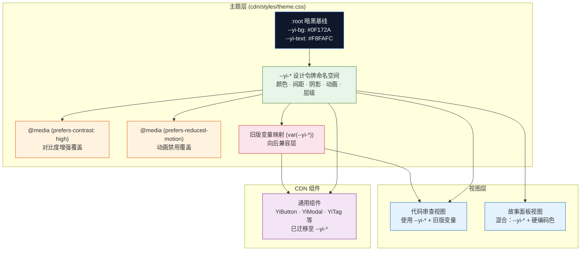
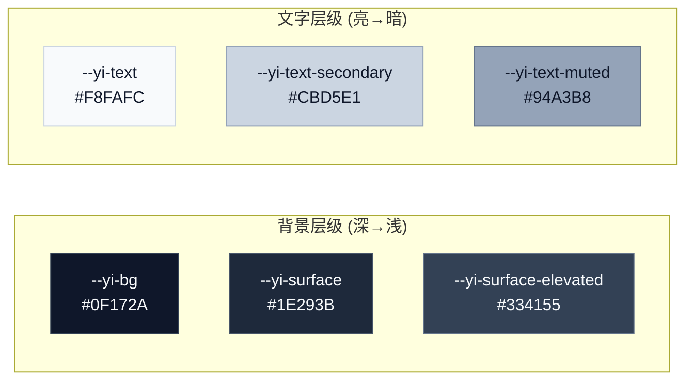
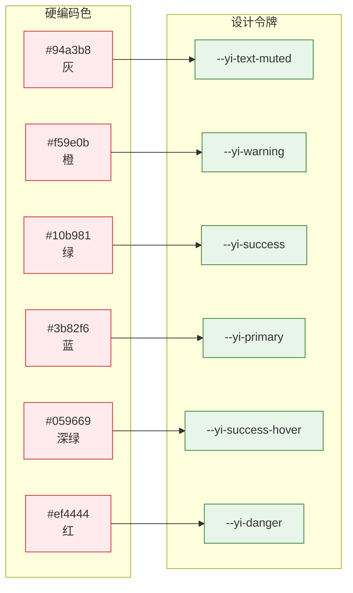

> | v1.0 | 2026-05-18 | deepseek-v4-pro | 🌿 main | 📎 [01-故事任务 ←](./YiWeb-01-故事任务.md) |

> **导航**: [← 01-故事任务](./YiWeb-01-故事任务.md) | [← 02-用户使用场景](./YiWeb-02-用户使用场景.md) | [05-测试用例评审 →](./YiWeb-05-测试用例评审.md)

> **来源引用**: 由 [YiWeb-01-故事任务](./YiWeb-01-故事任务.md) §1 Story S1–S3 驱动。外部参考吸收自 ui-ux-pro-max（Dark Mode OLED · 设计令牌系统 · 可访问性预交付检查表）。证据等级 A（源码可验证）。

---

## §0 架构全景



---

## §1 设计令牌体系

### 1.1 令牌命名空间

YiWeb 使用 `--yi-` 前缀作为规范令牌命名空间，覆盖以下类别：

| 类别 | 前缀 | 示例 | 数量 |
|------|------|------|:----:|
| 主色 | `--yi-primary` | `--yi-primary: #2563EB` | 4 |
| 语义色 | `--yi-success / warning / danger / info` | `--yi-success: #10B981` | 12 |
| 表面 | `--yi-bg / surface / surface-elevated` | `--yi-bg: #0F172A` | 5 |
| 边框 | `--yi-border / border-subtle / border-focus` | `--yi-border: rgba(255,255,255,0.1)` | 3 |
| 文字 | `--yi-text / text-secondary / text-muted` | `--yi-text: #F8FAFC` | 5 |
| 排版 | `--yi-font-ui / font-code / text-*` | `--yi-font-ui: "Inter", ...` | 14 |
| 间距 | `--yi-space-*` | `--yi-space-4: 16px` | 9 |
| 阴影 | `--yi-shadow-*` | `--yi-shadow-md: 0 4px 6px ...` | 7 |
| 圆角 | `--yi-radius-*` | `--yi-radius-md: 6px` | 5 |
| 动画 | `--yi-duration-* / easing-*` | `--yi-duration-normal: 200ms` | 5 |
| 层级 | `--yi-z-*` | `--yi-z-modal: 1050` | 7 |

### 1.2 暗黑基线色板



---

## §2 变更方案

### 2.1 S1 — 暗黑唯一化

**变更文件**: `cdn/styles/theme.css`

**方案**:
- 删除 `@media (prefers-color-scheme: light)` 规则块（行 334–362）
- `:root` 中暗黑基线保持不变
- 保留 `@media (prefers-contrast: high)` 和 `@media (prefers-reduced-motion: reduce)`

```css
/* 删除前 */
@media (prefers-color-scheme: light) {
  :root {
    --yi-bg: #F8FAFC;
    --yi-surface: #FFFFFF;
    /* ... 共 28 行 ... */
  }
}

/* 删除后 — 仅保留暗黑基线和高对比度/减少动画覆盖 */
```

### 2.2 S2 — 故事面板迁移

**涉及文件及变更**:

| 文件 | 硬编码色 | 替换为 |
|------|---------|--------|
| `storyStatusBadge/index.css` | `#fff3e0` bg + `#e65100` color | `--yi-warning-subtle` + `--yi-warning-hover` |
| `storyStatusBadge/index.css` | `#e8f5e9` bg + `#2e7d32` color | `--yi-success-subtle` + `--yi-success-hover` |
| `storyStatusBadge/index.css` | `#e3f2fd` bg + `#1565c0` color | `--yi-primary-subtle` + `--yi-primary-hover` |
| `storyStatusBadge/index.css` | `#c8e6c9` bg + `#1b5e20` color | `--yi-success-subtle` + `--yi-success-hover` |
| `storyStatusBadge/index.css` | `#ffebee` bg + `#c62828` color | `--yi-danger-subtle` + `--yi-danger-hover` |
| `storyPanelPage/index.css` | `#94a3b8` / `#f59e0b` / `#10b981` / `#3b82f6` / `#059669` / `#ef4444` 列头边框 | `--yi-text-muted` / `--yi-warning` / `--yi-success` / `--yi-primary` / `--yi-success-hover` / `--yi-danger` |
| `storyPanelPage/index.css` | 同样六色卡片左边框 | 同上 |
| `storyPanelPage/index.css` | `rgba(0,0,0,0.04)` / `rgba(0,0,0,0.08)` / `rgba(0,0,0,0.12)` 阴影 | `--yi-shadow-sm` / `--yi-shadow-md` / `--yi-shadow-lg` |
| `storyPanelPage/index.css` | `rgba(0, 0, 0, 0.3)` 遮罩 | `rgba(0, 0, 0, 0.6)` 暗黑适配 |
| `storyPanelPage/index.css` | `rgba(59,130,246,0.12)` 焦点环 | `--yi-shadow-focus` |
| `storyListTable/index.css` | `#e3f2fd` bg + `#1565c0` color (后端) | `--yi-primary-subtle` + `--yi-primary` |
| `storyListTable/index.css` | `#f3e5f5` bg + `#7b1fa2` color (前端) | `--yi-info-subtle` + `--yi-info` (调整为信息色) |
| `storyListTable/index.css` | `#fff3e0` bg + `#e65100` color (全栈) | `--yi-warning-subtle` + `--yi-warning-hover` |
| `storyListTable/index.css` | `#f1f3f5` bg + `#6b7280` color (元) | `--yi-surface` + `--yi-text-muted` |

### 2.3 S3 — 全局清理

**涉及文件**:

| 文件 | 变更 |
|------|------|
| `aicr/styles/index.css:350` | `color: white` → `color: var(--yi-text)` |
| `aicr/components/fileTree/fileTreeTreeBase.css:239-248` | 文件类型图标色保留（语义色，非主题色） |
| `aicr/components/sessionListTags/index.css:218` | `box-shadow` 统一为令牌 |
| `aicr/styles/codePage.contextModals.css` | `box-shadow` 引用统一检查 |

---

## §3 令牌迁移映射

### 3.1 状态色映射



### 3.2 类型标签映射

| 标签 | 原色 | 令牌 | 语义 |
|------|------|------|------|
| 后端 | `#1565c0` | `--yi-primary` | 蓝色代表后端服务 |
| 前端 | `#7b1fa2` | `--yi-info` | 青色代表前端界面 |
| 全栈 | `#e65100` | `--yi-warning-hover` | 橙色代表全栈广度 |
| 元 | `#6b7280` | `--yi-text-muted` | 灰色代表元信息 |

---

## §4 可访问性保持

| 媒体查询 | 状态 | 说明 |
|---------|:----:|------|
| `prefers-color-scheme: light` | 删除 | 暗黑唯一化 |
| `prefers-color-scheme: dark` | 不存在 | 无需添加，暗黑已是基线 |
| `prefers-contrast: high` | 保留 | 增强边框和文字对比度 |
| `prefers-reduced-motion: reduce` | 保留 | 禁用所有过渡动画 |
