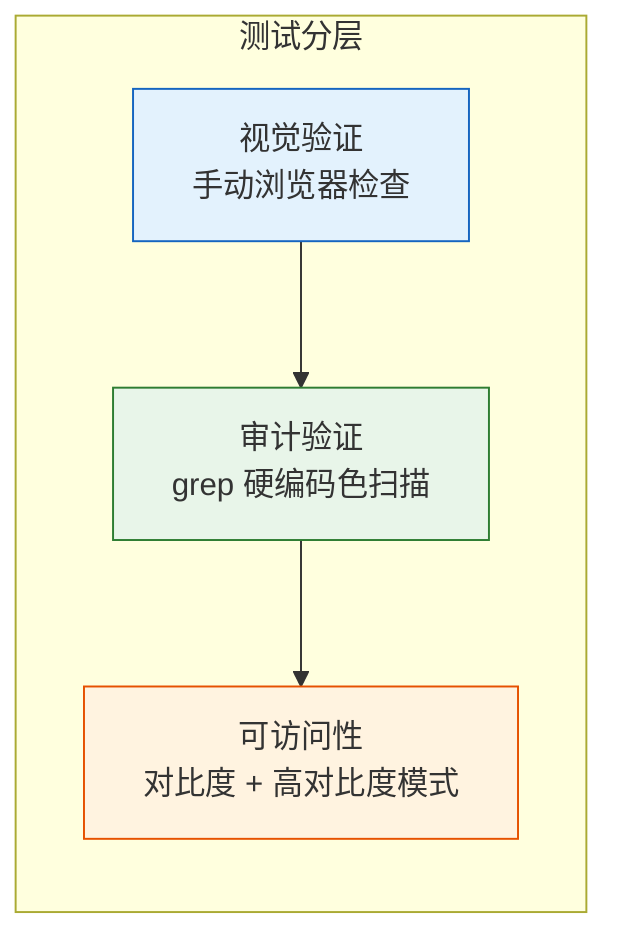

> | v1.0 | 2026-05-18 | deepseek-v4-pro | 🌿 main | 📎 [01-故事任务 ←](./YiWeb-01-故事任务.md) |

> **导航**: [← 01-故事任务](./YiWeb-01-故事任务.md) | [← 04-前端技术评审](./YiWeb-04-前端技术评审.md)

> **来源引用**: 由 [YiWeb-01-故事任务](./YiWeb-01-故事任务.md) §5 AC1–AC8 驱动。外部参考吸收自 ui-ux-pro-max（可访问性预交付检查表 · 交互状态覆盖 ≥3 状态）。证据等级 A（源码可验证）。

---

## §0 测试策略

---

## §1 测试用例

### TC1 — 暗黑唯一化

| 属性 | 值 |
|------|-----|
| **关联** | S1 / AC1, AC2 |
| **前置** | 系统设置为亮色模式 |
| **步骤** | 1. 打开 YiWeb 2. 检查页面背景色 3. 检查文字颜色 |
| **预期** | 背景为深色 `#0F172A` (--yi-bg)，文字为浅色 `#F8FAFC` (--yi-text) |
| **验证方法** | DevTools 检查 computed style |

### TC2 — 故事面板列头状态色

| 属性 | 值 |
|------|-----|
| **关联** | S2 / AC4 |
| **前置** | 故事面板有各状态的任务 |
| **步骤** | 1. 切换到故事面板视图 2. 检查六列的列头底部边框色 |
| **预期** | 未开始=灰色、文档中=橙色、文档完成=绿色、编码中=蓝色、编码完成=深绿、阻塞=红色，全部通过 `var(--yi-*)` 引用 |
| **验证方法** | DevTools → Elements → Styles 面板 |

### TC3 — 故事面板卡片状态色

| 属性 | 值 |
|------|-----|
| **关联** | S2 / AC4 |
| **前置** | 各状态的卡片存在于对应列 |
| **步骤** | 检查每个卡片左侧边框色 |
| **预期** | 颜色与列头一致，通过 `var(--yi-*)` 引用 |

### TC4 — 故事面板类型标签

| 属性 | 值 |
|------|-----|
| **关联** | S2 / AC5 |
| **前置** | 列表视图中有不同类型的任务 |
| **步骤** | 检查类型标签（后端/前端/全栈/元）的背景和文字色 |
| **预期** | 所有颜色通过 `var(--yi-*)` 引用，无硬编码值 |

### TC5 — 状态徽章

| 属性 | 值 |
|------|-----|
| **关联** | S2 / AC3 |
| **前置** | 任务详情卡片中的状态徽章 |
| **步骤** | 检查各状态的徽章背景色和文字色 |
| **预期** | 全部通过 `var(--yi-*)` 引用 |

### TC6 — 代码审查视图功能

| 属性 | 值 |
|------|-----|
| **关联** | S3 / AC6 |
| **前置** | 已登录，有会话数据 |
| **步骤** | 1. 展开文件树 2. 发送 AI 对话 3. 查看代码差异 4. 使用搜索 5. 切换模型 |
| **预期** | 所有功能正常，界面为暗黑风格 |

### TC7 — 高对比度模式

| 属性 | 值 |
|------|-----|
| **关联** | S1 / AC7 |
| **前置** | OS 启用高对比度 |
| **步骤** | 1. 打开 YiWeb 2. 检查边框可见性 3. 检查文字与背景对比度 |
| **预期** | 边框更亮，文字对比度增强 |

### TC8 — 减少动画

| 属性 | 值 |
|------|-----|
| **关联** | S1 / AC8 |
| **前置** | OS 启用减少动画 |
| **步骤** | 1. 打开 YiWeb 2. 悬停按钮和链接 3. 打开/关闭模态框 |
| **预期** | 所有过渡即时完成，无动画延迟 |

### TC9 — 硬编码色审计

| 属性 | 值 |
|------|-----|
| **关联** | S2, S3 / AC3 |
| **前置** | 所有迁移完成 |
| **步骤** | `grep -rn '#[0-9a-fA-F]\{3,6\}' src/views/storyPanel/ --include='*.css'` |
| **预期** | 无匹配结果（或仅含注释中的引用） |

### TC10 — 通用组件一致性

| 属性 | 值 |
|------|-----|
| **关联** | S3 / AC6 |
| **前置** | 各视图可正常访问 |
| **步骤** | 检查 YiButton、YiModal、YiTag、YiSelect、YiInput、YiTextarea 在各视图中的视觉一致性 |
| **预期** | 所有组件在暗黑主题下显示一致 |

---

## §2 验证检查表

| # | 检查项 | 方法 | 关联 TC |
|:--:|--------|------|:------:|
| 1 | `theme.css` 中无 `prefers-color-scheme: light` | grep | TC1 |
| 2 | `:root` 暗黑令牌唯一声明 | 读文件 | TC1 |
| 3 | `prefers-contrast: high` 保留 | 读文件 | TC7 |
| 4 | `prefers-reduced-motion: reduce` 保留 | 读文件 | TC8 |
| 5 | storyPanel CSS 无硬编码 `#XXXXXX` | grep | TC9 |
| 6 | storyPanel 六列状态色使用令牌 | grep `var(--yi-` | TC2, TC3 |
| 7 | storyPanel 类型标签使用令牌 | grep `var(--yi-` | TC4 |
| 8 | aicr `color: white` 已迁移 | grep | TC6 |
| 9 | 高对比度模式可用 | 手动验证 | TC7 |
| 10 | 减少动画可用 | 手动验证 | TC8 |

---

## §3 门禁规则

| 等级 | 条件 | 行为 |
|:----:|------|------|
| P0 | `prefers-color-scheme: light` 未删除 | 阻断交付 |
| P0 | storyPanel CSS 存在硬编码 `#XXXXXX` | 阻断交付 |
| P0 | 令牌引用错误导致颜色明显异常 | 阻断交付 |
| P1 | aicr 存在非语义硬编码色 | 修复后放行 |
| P2 | 遗留变量映射未清理 | 记录不阻断 |
