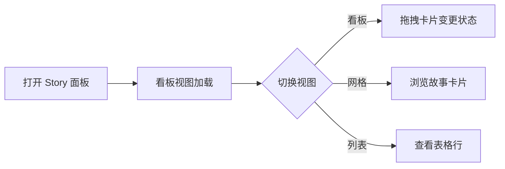

# YiWeb 使用场景

> 统一项目主题样式 — 用户空间基线

## 场景覆盖矩阵

| 场景# | 描述 | 关联 FP# | 参与者 |
|-------|------|---------|--------|
| UC1 | 前端开发者在 AICR 视图中进行代码审查 | Story 2 | 前端开发者 |
| UC2 | 前端开发者在 Claude 面板查看配置 | Story 2 | 前端开发者 |
| UC3 | 前端开发者在 Story 面板管理故事任务 | Story 2 | 前端开发者 |
| UC4 | 前端开发者新增视图或组件 | Story 3, 4 | 前端开发者 |
| UC5 | 设计系统维护者调整主题令牌 | Story 1, 4 | 设计系统维护者 |

---

## UC1: 在 AICR 视图中进行代码审查

### 正常路径

### 空状态
- 无项目加载时，侧边栏显示空状态提示
- 无文件选中时，代码区域显示欢迎引导

### 错误恢复
- API 请求失败时，显示错误提示并允许重试
- 文件加载失败时，代码区域显示错误状态

### 视觉期望
- 暗色主题一致，无颜色跳变
- 滚动条样式统一
- 按钮、输入框、标签等交互元素视觉一致
- 统计栏、筛选栏布局统一

---

## UC2: 在 Claude 面板查看配置

### 正常路径

### 空状态
- 无项目时显示空状态图标和提示文字
- 搜索无结果时显示清除筛选按钮

### 错误恢复
- 数据加载失败显示错误提示

### 视觉期望
- 与 AICR 视图一致的头部、统计栏、筛选栏样式
- 卡片网格布局与间距统一
- 侧边面板动画和遮罩一致

---

## UC3: 在 Story 面板管理故事任务

### 正常路径

### 空状态
- 看板列无卡片时显示空状态图标
- 筛选无结果时显示空状态

### 视觉期望
- 看板列颜色标识与语义色一致
- 项目标签、视图分段控件与 Claude 面板的筛选标签一致
- 紫色（`#A855F7`）替换为语义化变量

---

## UC4: 新增视图或组件

### 正常路径

### 视觉期望
- 新组件仅使用 `--yi-*` 变量，不引入新的硬编码颜色
- 新视图自动继承全局滚动条样式
- 不再需要为每个视图重复定义滚动条

---

## UC5: 调整主题令牌

### 正常路径

### 视觉期望
- 修改一个变量即可影响全部视图
- 不再需要在多个文件中同步修改相同值
- 不再担心加载顺序影响最终值

---

## 边界约束

| 约束 | 说明 |
|------|------|
| 暗色主题唯一 | 仅支持暗色主题，不引入亮色模式 |
| 视觉效果零退化 | 所有修改不得改变现有视觉效果 |
| 不改变类名 | HTML 中引用的 CSS 类名保持不变 |
| 不改变 HTML | 不修改任何 HTML 模板结构 |

### 主要价值

- 🎨 全项目视觉一致性：三个视图 + 共享组件使用同一套设计令牌
- 🔧 维护性提升：变量定义有唯一权威来源，修改一处即可影响全局
- 🚀 开发效率：新增视图/组件时无需重新定义颜色、间距、圆角变量
- 📐 设计规范落地：`--yi-*` 命名空间成为全项目唯一标准
- 🔍 可预测性：消除因 CSS 加载顺序导致的值覆盖不确定性
- ♻️ 减少重复代码：移除视图间重复的滚动条样式和 fallback 值

### 来源引用

- 需求来源：用户指令 `/rui 统一整个项目的主题样式`
- 源码分析：`cdn/styles/theme.css`、`cdn/styles/base/spacing.css`、`cdn/styles/base/animations.css`、`src/views/*/` CSS 文件
- 故事任务：`YiWeb-故事任务.md` §1–§4

### 变更记录

| 日期 | 变更 | 作者 |
|------|------|------|
| 2026-05-22 | 初始生成 | Claude |
